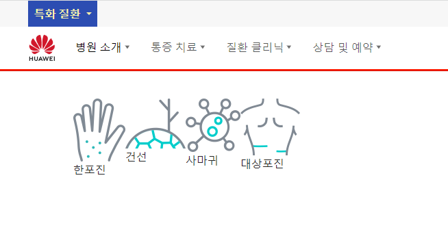

### 초기세팅

1. 프로젝트 폴더에 fonts, images 폴더, index.html 생성
2. css/index.css를 생성한 뒤, index.html의 head태그에 드래그
3. index.css에 body + a태그 설정들어가기
    - 클론사이트의 body클릭후 폰트관련 설정을 body에 설정해주고, a태그는 text-decoration만 추가한다

```css
@import url('https://fonts.googleapis.com/css2?family=Noto+Sans+KR:wght@500&family=Noto+Serif+KR:wght@500&display=swap');
@import url(https://cdn.jsdelivr.net/gh/moonspam/NanumSquare@2.0/nanumsquare.css);

:root {
    --primary-font-family: 'Noto Sans KR', sans-serif;
    --secondary-font-family: 'Noto Serif KR', sans-serif;
    --third-font-family: 'NanumSquare', sans-serif;
}

body {
    font-family: 'Noto Sans Korean', 'Apple SD Gothic Neo', 'Malgun Gothic', 'Nanum Gothic', 'Noto Sans', 'sans-serif';
    color: #252525;
    font-size: 18px;
    line-height: 1.6;
    font-weight: normal;
    font-style: normal;
}

a {
    /*font-family:  'Noto Sans Korean', 'Apple SD Gothic Neo', 'Malgun Gothic', 'Nanum Gothic', 'Noto Sans', 'sans-serif';*/
    font-family: var(--primary-font-family);
    color: #252525;
    font-size: 18px;
    line-height: 1.6;
    font-weight: normal;
    font-style: normal;

    text-decoration: none !important;
}
```

4. jquery를 bootstrap.js보다 위쪽에 넣고, js/index.js를 만들고, , jquery 자동시작 함수를 작성한 뒤, body끝 jquery보다 젤 뒤에 넣기

```html
<!--jquery: boostrap js 전에 추가-->
<script src="https://ajax.aspnetcdn.com/ajax/jquery/jquery-1.9.0.js"></script>
<script src="js/bootstrap.bundle.js"></script>

<script src="js/index.js"></script>
```

```js
$(function () {

})
```

5. title 수정 및 페이지 소스보기 > 메타태그(description, keywords, shorttcut icon) 복사
    - icon의 href는 주소를 떼고, favicon.ico만 남겨놓고
    - favicon.ico 생성(images폴더에 넣음. index.html에 주면 인식안됨.)

```html
<title>판교 우아한의원</title>
<meta name='description' content='판교역 위치, 이명, 난청, 비염, 축농증, 턱통증, 삼킴장애, 구안와사, 척추관절치료, 감각신경체계 교통사고 치료'/>
<meta name='keywords' content='이명·난청,비염∙축농증,턱관절 장애,삼킴장애,구안와사,디스크∙협착증,교통사고'/>
<link rel="shortcut icon" href="images/favicon.ico" type="image/x-icon">
```

### header-top

1. .header.container-fluid 안에 header-top, -middle, -bottom 을 모두 div로 만든다.

```html

<div class="header container-fluid">
    <div class="header-top"></div>
    <div class="header-middle"></div>
    <div class="header-bottom"></div>
</div>
```

```css
.header .header-top {
    height: 38px;
    background: #efefef;
}

.header .header-middle {
    height: 100px;
}

.header .header-bottom {
    height: 75px;
}
```

2. container-fluid를 쓸거면 애초에 padding을 0으로 잡아준다.

```css
.container-fluid {
    padding: 0;
}
```

3. 이제 a태그로 글자를 만들고, **css에 a태그에 height + lh를 지정한 뒤, 부모div의 height를 삭제한다**

```css
.header .header-top {
    /*height: 38px;*/
    background: #efefef;
}

.header a {
    font-size: 18px;
    color: black;

    height: 38px;
    line-height: 38px;
}
```

4. 컨테이너fluid는 padding이 0이므로 **.heder내부 각 div에 패딩을 %로 준다.**

```css
.header div {
    padding: 0 5%;
}
```


2. 해당 a태그에 `dropdown-toggle`을 클래스로 주면 선택버튼icon이 생긴다

- dropdown에서 a태그 검색

```html

<div class="header-top">
    <a href="#" class="dropdown-toggle">특화질환</a>
</div>
```

3. 해당a태그에 `data-bs-toggle="collapse" href="#id"`를 주고, 밑에 `<div class="collapse" id="id">`를 정의해주면, 내림이 완성된다.

- collapse에서 a태그 검색

```html

<div class="header-top">
    <a class="dropdown-toggle"
       data-bs-toggle="collapse" href="#collapseHeaderTop">
        특화질환
    </a>
    <div class="collapse" id="collapseHeaderTop">
        <div class="card card-body">
            Some placeholder content for the collapse component. This panel is hidden by default but revealed when the
            user activates the relevant trigger.
        </div>
    </div>
</div>
```

4. 이제 collapse부분은 패딩이 아닌 전체로 처리되기 위해
    - a태그를 div에 집어넣어서, `div>a` + `div.collapse`구조를 만들어놓고
    - padding 0 5%를 header속 전체div들이 아닌, `div>a`의 `.header-top속 첫번째 div` + `2번째div(collapse)`만 적용 1번재 div에만 적용되도록 변경한다
    - header 속 a태그가 아닌 header

```css
/*.header div {
  padding: 0 5%;
}*/
.header .header-top div:nth-child(1),
.header .header-top div:nth-child(2) {
    padding: 0 5%;
}

/*.header a {*/
.header .header-top div:nth-child(1) a {
    font-size: 18px;
    color: black;

    height: 38px;
    line-height: 38px;
}
```


5. 이제 collapse되는 곳에 내용을 작성한다
    - 예제 card를 삭제하고, ul>li>a 로 1개씩 작성한다. a내부는 h6, p태그로 작성한다

```html

<div class="collapse" id="collapseHeaderTop">
    <ul>
        <li><a href="#">
            <h6></h6>
            <p></p>
        </a></li>
    </ul>
</div>
```

6. 이제 ul태그를 `list-unstyle` + `d-flex` + `m-0`로 만들어서 가로배열한다.

```html

<ul class="list-unstyled d-flex m-0">
```

7. 내부 ul속 li태그에 margin-top, margin-light를 줘서, 길어진 p태그는 flex-item으로서 내부에서 알아서 조절되게 한다
    - **mt와 mr만 주면 알아서 아이템들의 간격이 안삐져나오고 내부에서 처리된다.**

```css
.header .header-top div:nth-child(2) ul li {
    margin-top: 32px;
    margin-right: 6%;
}
```

8. p태그의 글자크기는 class로 주되 공통 스타일인 `style.css`을 만들어서 지정한다

```css
.fs-13 {
    font-size: 13px;
}
```

```html

<li><a href="#">
    <h6>이명·난청</h6>
    <p class="fs-13">이명 치료의 핵심은 청신경 전달체계 재생화!</p>
</a></li>
```

9. 집중질환 a태그(inline)만 감싸는 공간div를 inline-block으로 만든 뒤, 배경을 만들어주고, collapse도 동일한 배경을 가져간다.
    - 글자색도 white, yellow를 정의해서 지정해준다.

```html

<div class="header-top">
    <div>
        <div class="d-inline-block bg-blue m-0 px-3">
            <a class="dropdown-toggle text-yellow fw-bold" data-bs-toggle="collapse" href="#collapseHeaderTop">
                집중 질환
            </a>
        </div>
    </div>
    <div class="collapse bg-blue" id="collapseHeaderTop">
        <ul class="list-unstyled d-flex m-0">
            <li><a href="#">
                <h6 class="text-white fw-bold">이명·난청</h6>
                <p class="fs-13 text-yellow">이명 치료의 핵심은 청신경 전달체계 재생화!</p>
            </a></li>
```


10. 이제 bootstrap icon으로 가서 svg로 가져온 icon들을 h6 내부에 두고 애니메이션을 준다

```html

<h6 class="text-white fw-bold">
    이명·난청
    <svg xmlns="http://www.w3.org/2000/svg" width="16" height="16" fill="currentColor" class="bi bi-arrow-right-short"
         viewBox="0 0 16 16">
        <path fill-rule="evenodd"
              d="M4 8a.5.5 0 0 1 .5-.5h5.793L8.146 5.354a.5.5 0 1 1 .708-.708l3 3a.5.5 0 0 1 0 .708l-3 3a.5.5 0 0 1-.708-.708L10.293 8.5H4.5A.5.5 0 0 1 4 8z"/>
    </svg>
</h6>
```

11. li태그 hover시 자식중에 svg태그에 margin-left를 줘서 우측으로 이동시킨다.

- 추가로 transition으로 linear로 시간을 주면, 애니메이션처럼 작동한다.

```css
.header .header-top div:nth-child(2) ul li:hover svg {
    margin-left: 15px;
    transition: all 0.3s linear;
}
```


12. 이제 header-middle이 흰색인 것에 대비하여 collapse에 배경을 회색으로 준다

```css
/* collapse 공간 */
.header .header-top div:nth-child(2) {
    border-bottom: 1px solid #ccc;
}
```

13. header-top은 lg에서만 나타나도록 수정한다

```html

<div class="header-top bg-gray d-none d-lg-block">
```

### header-middle - 1 반응형으로 navbar메뉴 만들기

1. top은 전체 bg + 각 div에서 padding 0 5%를 줬지만, middle과 bottom은 배경없이 시작부터 padding 0 5%다

```css
/* middle with navbar*/
.header .header-middle {
    height: 100px;
    padding: 0 5%;
    /* 임시 */
    /*background: red;*/
}

.header .header-bottom {
    height: 75px;
    padding: 0 5%;
}

```

2. bootstrap navbar 예제를 통채로 복사해서 가져온 뒤,
    - 검색form 부분을 삭제한다
    - li.nav-item에서 첫번째 Home .active만 남기고 다 삭제한다

```html

<div class="header-middle">
    <nav class="navbar navbar-expand-lg bg-body-tertiary">
        <div class="container-fluid">
            <a class="navbar-brand" href="#">Navbar</a>
            <button class="navbar-toggler" type="button" data-bs-toggle="collapse"
                    data-bs-target="#navbarSupportedContent" aria-controls="navbarSupportedContent"
                    aria-expanded="false" aria-label="Toggle navigation">
                <span class="navbar-toggler-icon"></span>
            </button>
            <div class="collapse navbar-collapse" id="navbarSupportedContent">
                <ul class="navbar-nav me-auto mb-2 mb-lg-0">
                    <li class="nav-item">
                        <a class="nav-link active" aria-current="page" href="#">Home</a>
                    </li>

                </ul>
            </div>
        </div>
    </nav>
</div>
```

3. button.navbar-toggler의 type="button"과, aria관련 설정을 다 삭제한다
    - bg- 도 삭제한다
4. `a.navbar-brand`의 content글자는 삭제하고, css로 **background로 고정된 크기에 logo svg를 배치**한다.
    - svg 적용이 안되서, **a태그에 `max-width`를 반응형으로 만들어놓고 -> 내부 img.img-fluid를 사용했다.**
    - a태그뒤에 더 오게 하기 위해서 inline-block으로 만들었다?!

```html
<a class="navbar-brand" href="#">
    
</a>
```

```css
.header .header-middle .navbar-brand {
    display: inline-block;
    max-width: 215px; /* 215x40px */
}

@media screen and (max-width: 991px) {
    .header .header-middle .navbar-brand {
        max-width: 172px; /*172x32px*/
    }
}
```

- css/index.css에서 불러와서 문제였음. -> 경로를 한단계 위로 주면 된다.
    - a태그를 비우고 w/h를 가진 배경으로 처리하게 한다.

```css
.header .header-middle .navbar-brand {
    display: inline-block;

    background: url("../images/v3-icon.svg") no-repeat;
    background-position: -29px -26px;

    width: 153px;
    height: 34px;
}


@media screen and (max-width: 991px) {
    .header .header-middle .navbar-brand {
        background-position: -208px -19px;

        width: 40px;
        height: 40px;
    }
}
```

5. 1개의 li태그들을 복사해서 만든다.

6. **메뉴마다 화살표는 `after`를 이용해서 만들 것이다.**
    1. ul의 class인 `navbar-nav` > li class인 `.nav-link`를 선택자로 잡아서 처리한다.
    2. svg파일을 이용할 것이며, w7h6으로 잡아놓고 배경으로 처리되게 한다.
    3. inline-block으로 만들어서 뒤로 이어지게 해야한다
    4. drpodown에 대비하여 postition relative로 미리 만들어놓는다.

```css
/* 각 메뉴별 화살표 */
.header .header-middle .navbar-nav .nav-item .nav-link:after {
    display: inline-block;
    content: "";
    width: 7px;
    height: 6px;
    background: url("../images/v4-icon.svg") no-repeat;
    background-position: -21px -96px;
    top: -3px;

    position: relative;
}
```

5. 이제 반응형으로 a태그 `.nav-link`margin을 조정해준다.
    - font-size를 결정하고, 기본margin-right를 결정해주고
    - 어차피 lg 전(991px)까지는 없으니 **기본(992~) + 1200~(xl) + 1400(xxl)~ 까지 조정해준다.**

```css
/* 992(lg)부터 등장 +  xl(1200)~  + xxl(1400) 시의 font + mr 정의해주기 */
/* - lg ~ */
.header .header-middle .navbar-nav .nav-item .nav-link {
    font-size: 15px;
    margin-right: 10px;
}

/* - xl ~ */
@media screen  and (min-width: 1200px) {
    .header .header-middle .navbar-nav .nav-item .nav-link {
        font-size: 16px;
        margin-right: 15px;
    }
}

/* - xxl ~ */
@media screen  and (min-width: 1400px) {
    .header .header-middle .navbar-nav .nav-item .nav-link {
        font-size: 18px;
        margin-right: 20px;
    }
}
```

6. ul 우측에 추가요소를 넣기 위해 **li.nav-item의 마지막 요소는 mr-0을 준다**
    - 이 때. 각 .nav-item에 대해 .nav-link는 1개 밖이므로 `li.nav-item`의 마지막 자식에 대한 a.nav-link의 mr을 처리해줘야한다

```css
/* 마지막 nav-item은 mr-0 */
.header .header-middle .navbar-nav .nav-item:last-child .nav-link {
    margin-right: 0;
}
```

7. brand와 ul사이 간격을 ul에서 ms로 준다

```css
.header .header-middle .navbar-nav {
    margin-left: 20px;
}
```

8. 이제 메뉴들 오른쪽에 로그인 등을 넣기 위해  <div class="collapse navbar-collapse> 안에 `ul.navbar-nav`과 같은 레벨의 `div.navbar-other`을 만든다
    - ul.navbar-nav에는 `me-auto`가 있어서 밀어준다.
    - `빈 div안에 a태그`로 검색/로그인 아이콘을 달아준다
    - svg를 복사해와서 바로 사용한다
    - https://github.com/xsjcTony/Frontend-Learning/tree/b207203d709d324f28f34613b0ac935a3fa83b63/Projects/Bootstrap/huawei
    - https://github.com/AzrDream/JS-new-features-popular-frameworks/blob/f10e43155d7d227ab0869c9d8aa68c6c6bd76ac5/05-%E6%B5%81%E8%A1%8C%E6%A1%86%E6%9E%B6%E9%9B%86/05-Bootstrap/huawei/index.html
    - 검색svg 넣기

```html

<div class="navbar-other">
    <div>
        <a href="#">
            <svg width="24" height="24">
                <g fill="none" fill-rule="evenodd" stroke="#1E1E1E">
                    <circle cx="11" cy="10" r="6.5"></circle>
                    <path d="M16 15l4.5 4.5" stroke-linecap="round" stroke-linejoin="round"></path>
                </g>
            </svg>
        </a>
    </div>
</div>
```

- 로그인 svg 넣기

```html

<div>
    <a href="#">
        <svg width="20" height="20" viewBox="0 0 24 24">
            <rect y="0" fill="#FFFFFF" width="24" height="24"></rect>
            <g>
                <path d="M14.7,13.2c3.3-1.3,4.9-4.9,3.6-8.1s-5-4.8-8.2-3.5S5.2,6.5,6.5,9.7c0.7,1.6,2,2.9,3.7,3.6l-0.1,0 M6.8,7.4   c0-3,2.5-5.4,5.6-5.4S18,4.4,18,7.4s-2.5,5.4-5.6,5.4S6.8,10.4,6.8,7.4z"></path>
                <g>
                    <path d="M22.9,23.2c-0.2,0-0.4-0.2-0.4-0.4c0-5.1-4.6-9.2-10.2-9.2S2.1,17.8,2.1,22.8c0,0.2-0.2,0.4-0.4,0.4S1.3,23,1.3,22.8    c0-1.3,0.3-2.6,0.9-3.9c0.6-1.2,1.3-2.2,2.4-3.1c1-0.9,2.2-1.6,3.5-2.1c1.4-0.5,2.8-0.8,4.3-0.8s2.9,0.3,4.3,0.8    c1.3,0.5,2.5,1.2,3.5,2.1c1,0.9,1.8,2,2.4,3.1c0.6,1.2,0.9,2.5,0.9,3.9C23.3,23,23.1,23.2,22.9,23.2L22.9,23.2z"></path>
                </g>
            </g>
        </svg>
    </a>
</div>
```

- 쌩으로 만든 div.navbar-other는 `d-flex`를 달아줘야한다

```html

<div class="navbar-other d-flex">
```

9. 가로선은 span + `|`를 활용한다

```html
<span>|</span>
```

10. 추가로 예약하기 버튼도 만들어준다

- iconmoon에서 svg로 추출해서 씀
- https://icomoon.io/app/#/select/image

```html

```


11. **각 svg를 담는 div+ span에는 첫번째를 제외하고 ms-3을 줘서 간격을 벌린다**

```html

<div class="ms-0">

    <div class="ms-3">

        <span class="ms-3">|</span>

        <div class="ms-3">
```

12. 예약하기 버튼의 글자크기를, ul의 메뉴글자체와 동일하게 반응형으로 맞춰준다.

- 복사해와서 폰트사이즈만 로그인쪽 a태그에 똑같이 적용해준다.(div에 걸면 안걸림)

```css
/* 메뉴 글자크기 */
/* 992(lg)부터 등장 +  xl(1200)~  + xxl(1400) 시의 font + mr 정의해주기 */
/* - lg ~ */
.header .header-middle .navbar-nav .nav-item .nav-link {
    font-size: 15px;
    margin-right: 10px;
}

/* + 로그인 관련 글자 크기 */
.header .header-middle .navbar-other a {
    font-size: 15px;
}

/* - xl ~ */
@media screen  and (min-width: 1200px) {
    /* 메뉴 글자크기 */
    .header .header-middle .navbar-nav .nav-item .nav-link {
        font-size: 16px;
        margin-right: 15px;
    }

    /* 로그인 a태그 글자크기 */
    .header .header-middle .navbar-other a {
        font-size: 16px;
    }
}

/* - xxl ~ */
@media screen  and (min-width: 1400px) {
    /* 메뉴 글자크기 */
    .header .header-middle .navbar-nav .nav-item .nav-link {
        font-size: 18px;
        margin-right: 20px;
    }

    /* 로그인 쪽 글자크기 */
    .header .header-middle .navbar-other a {
        font-size: 18px;
    }
}
```

13. 이제 `a.navbar-brand`를 `button.navbar-toggler`의 아래쪽에 놓아서 위치를 바꾼다.

- 부모인 nav.navbar에서 이미 `justify-content space-between` 설정이 되어있어 양옆으로 벌어진다.
  

14. **이 때, 벌어진 `a.navbar-brand`에 `m-auto`를 추가하면, 왼족의 `button.navbar-toggler`영역을 제외한 공간을 `양옆공간을 나눠쓴 가운데 정렬`이 된다.**

```html
<a class="navbar-brand m-auto" href="#">
```


15. **그렇다면 navbar가 펼처지는 lg전까지(~991) `작은 logo`를 나타냈던 css를 수정해서**
    - ~ lg(991)까지는 큰 logo
    - xl(991) ~ xxl(1399)까지는 작은 logo
    - xxl(1400)부터 큰 logo 복귀

```css
/*
- ~ lg(991)까지는 큰 logo
- xl(991) ~ xxl(1399)까지는 작은 logo **
- xxl(1400)부터 큰 logo 복귀
*/
.header .header-middle .navbar-brand {
    display: inline-block;

    background: url("../images/v3-icon.svg") no-repeat;
    background-position: -29px -26px;

    width: 153px;
    height: 34px;
}

@media screen and (min-width: 992px) and (max-width: 1399px) {
    .header .header-middle .navbar-brand {
        background-position: -208px -19px;

        width: 40px;
        height: 40px;
    }
}
```


16. **이제 햄버거 > 큰logo > 아이콘**형태로 오른족에 icon을 추가하고 싶다.

- 부모는 flex로서 space-between을 띄워놓고
- 가운데 큰logo는 m-auto이므로
- **우측에 flex-item 하나만 추가하면 알아서 오른쪽 끝으로 모일 것이다.**
- **역시 svg 로그인 버튼을 만들때처럼 `div>a>svg`로 일단 추가한다**
    - svg태그에 w24 h24를 넣고, 내부에 path등을 iconmoon에서 가져온다

```html
<!-- 우측 버튼 1개 (전화) -->
<div>
    <a href="tel:010-4600-6243">
        <svg width="24" height="24">
            <path d="M19.502 3.672l-1.795-1.793c-0.566-0.567-1.32-0.879-2.121-0.879s-1.555 0.312-2.121 0.879l-1.586 1.586c-1.17 1.17-1.17 3.072 0 4.242l1.379 1.379-4.172 4.172-1.379-1.379c-0.566-0.567-1.32-0.879-2.121-0.879s-1.555 0.312-2.121 0.879l-1.586 1.586c-1.17 1.17-1.17 3.072 0 4.242l1.794 1.793c0.465 0.465 1.796 1.545 4.116 1.545 2.764 0 5.694-1.529 8.711-4.545 6.245-6.246 4.825-11.002 3.002-12.828zM13.293 4.879l1.586-1.586c0.195-0.195 0.451-0.293 0.707-0.293s0.512 0.098 0.707 0.293l1.083 1.082-3.001 3-1.082-1.082c-0.391-0.391-0.391-1.023 0-1.414zM3.293 16.293c-0.391-0.391-0.391-1.023 0-1.414l1.586-1.586c0.195-0.195 0.451-0.293 0.707-0.293s0.512 0.098 0.707 0.293l1.082 1.082-2.999 3-1.083-1.082zM15.086 15.086c-3.083 3.082-5.551 3.959-7.297 3.959-1.349 0-2.267-0.523-2.702-0.959-0.004-0.004 2.995-3.004 2.995-3.004l0.297 0.297c0.195 0.195 0.451 0.293 0.707 0.293s0.512-0.098 0.707-0.293l5.586-5.586c0.391-0.391 0.391-1.023 0-1.414l-0.297-0.297 3.001-3c1.003 1.004 2.467 4.539-2.997 10.004z"></path>
        </svg>
    </a>
</div>
```


17. svg아이콘이 outline을 가지게하려면 css로 처리한다.

- 일단 .navbar-call 을 빈div에 주고, div를 css처리한다
- 24px의 아이콘에 대해 32px의 border를 만들고, lh도 32px로 잡아서 svg를 가운데 위치시킨다
- 가로정렬은 text-align:center로 하고, border는 검은색으로 한다.

```html

<div class="navbar-call">
```

```css
/* 모바일 아이콘 1개(예약전화) */
.header .header-middle .navbar-call {
    width: 32px;
    height: 32px;
    line-height: 32px;
    text-align: center;

    border: 2px solid #000;
    border-radius: 5px;
}
```


18. 이제 모바일화면(lg)를 벗어나면, 나오면 안되므로 d-옵션을 준다

```html

<div class="navbar-call d-inline-block d-lg-none">
```

### header-middle - 2 햄버거 버튼 디자인

1. 햄버거버튼의 디자인은 `button.navbar-toggler` 내부의 `span.navbar-toggler-icon`로 처리되고 있다.
    - border는 `button.navbar-toggler`에서 담당하나보다. span 클래스를 지우고 텍스트만 넣어도 회색테투리 + 회색 글자가 적용됨

```html
<!-- 햄버거 버튼 -->
<button class="navbar-toggler" type="button" data-bs-toggle="collapse"
        data-bs-target="#navbarSupportedContent">
    <!--<span class="navbar-toggler-icon"></span>-->
    <span>ㅇㅇ</span>
</button>
```


2. 내부 span태그를 빈span태그 3개를 만들어 햄버거 줄을 그을 준비를 한다

```html
<!-- 햄버거 버튼 -->
<button class="navbar-toggler" type="button" data-bs-toggle="collapse"
        data-bs-target="#navbarSupportedContent">
    <span></span>
    <span></span>
    <span></span>
</button>
```

3. css로 부모인 `.navbar-toggler` **`w/l/lh 32px/text-align:center` + `border:none;outline:none;`** 로 만들고, 자식 span3개를 잡아서
   처리한다
    - lh는 주석처리해야 아이콘이 더 수직가운데 정렬되더라.. 아니면 24px?

```css
.header .header-middle .navbar-toggler {
    width: 32px;
    height: 32px;
    /*line-height: 32px;*/
    text-align: center;

    border: none;
    outline: none;
}
```

4. 3개의 span은 block으로 만들어서 w/h를 매긴다
    - w24/h2 + 배경색으로 span을 채워 만듦
    - **이 때, margin 5px 0 으로 줘야 `위아래 간격`은 줘야한다**

```css
.header .header-middle .navbar-toggler span {
    display: block;

    width: 24px;
    height: 2px;
    background: rgb(60, 60, 60);

    margin: 5px 0;
}
```

5. 이제 `button.navbar-toggler`에 `.on`을 미리 설정해놓고 **jquery로 토글할 수 있게 한다**
    - css로 **on이 적용될시 span에 애니메이션**을 준다

```html
<!-- 햄버거 버튼 -->
<button class="navbar-toggler on" type="button" data-bs-toggle="collapse" data-bs-target="#navbarSupportedContent">
    <span></span>
    <span></span>
    <span></span>
</button>
```

- `.navbar-toggler.on`시 span:nth-child(1)(2)(3)에 변화를 css로 작성한다

```css
.header .header-middle .navbar-toggler.on span:nth-child(1) {
}

.header .header-middle .navbar-toggler.on span:nth-child(2) {
}

.header .header-middle .navbar-toggler.on span:nth-child(3) {
}
```

- 가운데 span은 transform에 scale(0)으로 사라지게 한다.

```css
.header .header-middle .navbar-toggler.on span:nth-child(2) {
    transform: scale(0);
}
```

- 위쪽은 45도 회전 이 때, x축으로->5, y축으로 5만큼 아래로 이동추가이동시킨다
- 아래쪽은 -45도 회전 이 때, x축으로->5, y축으로 5만큼 위로 이동추가이동시킨다

```css
.header .header-middle .navbar-toggler.on span:nth-child(1) {
    transform: rotate(45deg) translate(5px, 5px);
}

.header .header-middle .navbar-toggler.on span:nth-child(3) {
    transform: rotate(-45deg) translate(5px, -5px);
}
```


6. 개별span마다 걸어준 transform을, span전체에 transition으로 애니메이션을 걸어준다

```css
.header .header-middle .navbar-toggler span {
    display: block;

    width: 24px;
    height: 2px;
    background: rgb(60, 60, 60);

    margin: 5px 0;

    /* 애니메이션 */
    transition: all .5s linear;
}
```

7. 이제 jquery로 클릭시, `on` class를 토글할 수 있게 한다
    - 원래 토글은 if .hasClass("on") -> .removeClass / else .addClass 로 처리하지만

- **.toggleClass("on")으로 한번에 해결할 수 있다.**

```js
$(function () {
    $(".navbar-toggler").click(function () {
        $(this).toggleClass("on")
    });
})
```

- 이제 미리 넣어둔 on클래스를 삭제해준다.
  

### header-middle - 3 모바일 메뉴 디자인

1. 이제 햄버거에서는 로그인|예약하기 버튼들을 가진 `div.navbar-other`은 안나오도록 d-옵션을 준다
    - 기존 d-flex -> d-none d-lg-flex

```html

<div class="navbar-other d-none d-lg-flex">
```


2. 이제 각 메뉴에는 margin이 없었는데, 햄버거안에서는 mt-x를 가지게 `mt-3 mt-lg-0`을 준다
    - 기존의 가진 각 active는 삭제하고 첫번째것만 active로 둔다

```html

<li class="nav-item">
    <a class="nav-link mt-3 mt-lg-0 active" aria-current="page" href="#">
        병원 소개
    </a>
</li>
<li class="nav-item">
    <a class="nav-link mt-3 mt-lg-0" aria-current="page" href="#">
        통증 치료
    </a>
</li>
```

3. 이제 로그인|예약하기를 모바일전용으로 추가하기 위해 ul.navbar-nav의 `li.nav-item`으로 똑같이 추가하지만, `d-lg-none`이 추가된다.
    - 또한 li가 1줄을 차지할 수 있게 d-block으로 시작해준다

```html

<li class="nav-item">
    <a class="nav-link mt-3 mt-lg-0" aria-current="page" href="#">
        상담 및 예약
    </a>
</li>
<!-- 모바일 전용 로그인 관련 메뉴 -->
<li class="nav-item d-block d-lg-none">
</li>
</ul>
```

4. 내부에는 a.nav-link가 아닌 class없는 a태그(화살표 공통 적용 걸림) 와 svg + span태그로 글을 적고, li태그에 mt-3 도 같이 준다.

```html
<!-- 모바일 전용 로그인 관련 메뉴 -->
<li class="nav-item mt-3 d-block d-lg-none">
    <a href="#">
        <svg width="24" height="24">
            <g fill="none" fill-rule="evenodd" stroke="#1E1E1E">
                <circle cx="11" cy="10" r="6.5"></circle>
                <path d="M16 15l4.5 4.5" stroke-linecap="round" stroke-linejoin="round"></path>
            </g>
        </svg>
        <span>로그인/회원가입</span>
    </a>
</li>
```


5. 이제 글자크기를 navbar메뉴들, 로그인버튼들에 반응형 줬던 것과 동일하게 걸리게 하기 위해
    - **기존에는 a`.nav-link`로 걸어줬던 것에 대해 `a`태그로 글자크기를 css적용해준다**

```css
/* 메뉴 글자크기 */
/*.header .header-middle .navbar-nav .nav-item .nav-link {*/
.header .header-middle .navbar-nav .nav-item a {
    font-size: 15px;
    margin-right: 10px;
}

/* - xl ~ */
@media screen  and (min-width: 1200px) {
    /* 메뉴 글자크기 */
    /*.header .header-middle .navbar-nav .nav-item .nav-link {*/
    .header .header-middle .navbar-nav .nav-item a {
        font-size: 16px;
        margin-right: 15px;
    }
}
```

6. 이제 로그인 span을 꾸며주기 위해, `login-item` 클래스를 심고, `span`에다가 css를 준다

```html

<li class="login-item nav-item mt-3 d-block d-lg-none">
```

- **span을 left 50%로 이동시키기 위해 relative를 만든다.**
- 이동시 기준을 부모의 50%로 정확하게 이동시키려면 transform: translateX(-50%);을 추가한다(변화는 안보임)
- 글자색을 회색으로 준다

```css
/* 모바일전용 로그인 메뉴 */
.header .header-middle .navbar-nav .login-item span {
    position: relative;
    left: 50%;
    transform: translateX(-50%);

    color: #ccc;
}
```


7. 이제 글자색 및 다른 옵션들을 span + svg와 같이 주기 위해 li.login-item 에 css를 회색 등의 옵션을 준다
    - border과 요소들간의 거리를 위해 padding을 양옆 1% + bottom에만 10px을 추가한다
    - border-bottom을 회색으로 준다

```css
.header .header-middle .navbar-nav .login-item {
    padding: 0 1% 10px 1%;
    border-bottom: 1px solid #ccc;
}
```


8. 이제 모바일 로그인li를 복사해서 검색li를 만든다.
    - svg교체
    - css 변경 `search-item`

```html

<li class="search-item nav-item mt-3 d-block d-lg-none">
    <a href="#">
        <svg width="24" height="24">
            <g fill="none" fill-rule="evenodd" stroke="#1E1E1E">
                <circle cx="11" cy="10" r="6.5"></circle>
                <path d="M16 15l4.5 4.5" stroke-linecap="round" stroke-linejoin="round"></path>
            </g>
        </svg>
        <span>의료진/질환/이벤트 검색</span>
    </a>
</li>
```

9. 검색란은 padding을 주지 않고 글자와 border를 붙이고 검은색으로 준다

```css
/* 모바일전용 검색 메뉴 */
.header .header-middle .navbar-nav .search-item {
    border-bottom: 1px solid #000;
}
```


10. **로그인 부분은 좌우 padding 대신 좌우margin을 줘서, border의 간격을 줄인다**

```css
/* 모바일전용 로그인 메뉴 */
.header .header-middle .navbar-nav .login-item {
    /*padding: 0 2% 10px 2%;*/
    padding-bottom: 10px;
    margin-left: 5%;
    margin-right: 5%;

    border-bottom: 1px solid #ccc;
}
```


11. 이제 .header-middel에 줬던 padding을 한쪽 navbar로 넘겨서, navbar가 header-middle 전체를 채우도록 변경한다

- 변경전
  

```css
/* middle with navbar*/
.header .header-middle {
    height: 100px;
    /*padding: 0 5%;*/ /* 안쪽 navbar의 패딩으로 변경*/
    /* 임시 */
    background: red;
}

.header .header-middle .navbar {
    padding: 0 5%;
}
```


- 추가로 navbar의 상하여백도 padding으로 준다

```css
.header .header-middle .navbar {
    padding: 10px 5%;
}
```


12. navbar 자체의 배경을 `bg-white`로 준다

```html

<nav class="navbar navbar-expand-lg bg-white">
```

13. **이제 각 메뉴에 붙어있는 화살표를, 모바일화면에선 끝으로 보내기 위해 `반응형 d-flex justify-content-between -> d-lg-inline-block`을 이용한다 한다**

- 현재 화살표는 `.nav-link:after`에 `inline-block으`로 들어가있는 상태며, **부모가 flex일 때 하나의 flex-item으로 작동**하나보다
- **각 `a.nav-link`의 a태그마다 반응형 d-옵션을 `d-flex justify-content-between d-lg-inline-block`로 적용해준다.**
- 잘못붙혀줬던 a태그의 mt-x 옵션을 li태그로 옮겨준다

```html

<li class="nav-item mt-3 mt-lg-0 ">
    <a class="nav-link d-flex justify-content-between d-lg-inline-block active" aria-current="page" href="#">
        병원 소개
    </a>
</li>
<li class="nav-item mt-3 mt-lg-0 ">
    <a class="nav-link d-flex justify-content-between d-lg-inline-block" aria-current="page" href="#">
        통증 치료
    </a>
</li>
<li class="nav-item mt-3 mt-lg-0 ">
    <a class="nav-link d-flex justify-content-between d-lg-inline-block" aria-current="page" href="#">
        질환 클리닉
    </a>
</li>
<li class="nav-item mt-3 mt-lg-0 ">
    <a class="nav-link d-flex justify-content-between d-lg-inline-block" aria-current="page" href="#">
        상담 및 예약
    </a>
</li>
```

- 화살표가 벌어지긴 했지만, 정렬이 제대로 안되, 위로 올라가있다.
  

14. 모바일에서도 `.nav-link:after`에 top-3px이 남아있게 되서 생기는 문제다

- 모바일에선 flex-item으로서 after가 관리되므로 **align-items-center**를 a태그에 추가하고
- lg에서만 top: -3px이 적용되도록 반응형media로 변경하자.

```html

<li class="nav-item mt-3 mt-lg-0 ">
    <a class="nav-link d-flex justify-content-between align-items-center d-lg-inline-block" aria-current="page"
       href="#">
        상담 및 예약
    </a>
</li>
```

```css
/* 각 메뉴별 화살표 */
.header .header-middle .navbar-nav .nav-item .nav-link:after {

    /*...*/

    position: relative;
    /*top: -3px;*/
}

@media screen and (min-width: 992px) {
    /* 화살표를 lg이후부터 inline-block으로서 약간 내림*/
    .header .header-middle .navbar-nav .nav-item .nav-link:after {
        top: -3px;
    }
}
```

### header-middle - 3 각 메뉴 dropdown 적용하기

1. ul.navbar-nav의 자식들 li 속 **`a태그에 data-bs-toggle="dropdown"`을 추가한다**

```html

<li class="nav-item active mt-3 mt-lg-0 ">
    <a class="nav-link d-flex justify-content-between align-items-center d-lg-inline-block active" aria-current="page"
       href="#"
       data-bs-toggle="dropdown"
    >
        병원 소개
    </a>
</li>
```

2. bootstrap5 dropdown에서 ul.dropdown-menu가 아닌 `div.dropdown-menu`를 `<div class="dropdown-menu`로 검색해서 가장 간단한 예제를 붙혀넣는다
    - **a태그 바로 밑에 같은 레벨로 넣어준다**
    - **dropdown은 id로 연결안되고 같은 레벨것을 열어주는 자동 시스템인가보다.**

```html

<li class="nav-item active mt-3 mt-lg-0 ">
    <a class="nav-link d-flex justify-content-between align-items-center d-lg-inline-block active"
       aria-current="page"
       href="#"
       data-bs-toggle="dropdown"
    >
        병원 소개
    </a>
    <!-- dropdown menu -->
    <div class="dropdown-menu">
        <p>
            Some example text that's free-flowing within the dropdown menu.
        </p>
        <p class="mb-0">
            And this is more example text.
        </p>
    </div>
</li>
```


3. 이제 w-100을 바로 주고 싶지만, padding등의 설정도 함께, 여러곳에 줄것이기 때문에 css로 잡아서 width: 100% 등의 옵션을 준다
    - **패딩은 위아래는 px로, 좌우는 %로 주는 버릇을 들이자**

```css
/* dropdown 메뉴 */
.header .header-middle .navbar-nav .nav-item .dropdown-menu {
    width: 100%;
    padding: 40px 10%;
}
```

4. **이제 div.dropdown-menu 에는 `div.dropdown-body`를 `d-flex`로 가지고 내부에 `ul.body-left`와 `div.body-right`구역으로 나눌 것이다.**
    - ul도 div와 동급으로 구역으로 취급해보자.

```html
<!-- dropdown menu -->
<div class="dropdown-menu">
    <div class="dropdown-body d-flex">
        <!-- left ul -->
        <ul class="body-left">

        </ul>
        <!-- right div -->
        <div class="body-right">

        </div>
    </div>
</div>
```

5. ul에는 `.list-unstyled.d-flex`를 달아 가로로 나열하고 li내부에는 a태그로 만들고,
    - img태그와 p태그를 그냥 나열한다

```html
<!-- left ul -->
<ul class="body-left list-unstyled d-flex">
    <li><a href="#">
        
        <p>한포진</p>
    </a></li>
    <li><a href="#">
        
        <p>건선</p>
    </a></li>
    <li><a href="#">
        
        <p>사마귀</p>
    </a></li>
    <li><a href="#">
        
        <p>대상포진</p>
    </a></li>
</ul>
```



6. **img를 `.img-fluid`로 쓰기 위해, 부모인 `li`태그의 `width를 고정`시켜야한다.**
    - 또한 각 img의 크기가 서로 같은 상태여야 height도 자동 정렬된다.
    - **이미지를 ppt에서 140x140으로 맞췄고, 비율이 안맞으면 자르기로 투명공간을 늘려서 맞췄다.**
    - **추가로, li 내부 자식 요소들이 가운데 정렬되도록 text-align:center;도 추가한다**

```css
/* dropdown 이미지의 부모li width */
.header .header-middle .navbar-nav .nav-item .dropdown-menu .dropdown-body .body-left li {
    width: 80px;
    text-align: center;
}
```

```html

<p>사마귀</p>
```


7. 이제 이미지 크기를 위해 li의 width를 반응형으로 만들어준다
    - 모바일에선 더 작게 80-> 50px로 줄여준다

```css
@media screen  and (max-width: 991px) {
    .header .header-middle .navbar-nav .nav-item .dropdown-menu .dropdown-body .body-left li {
        width: 50px;
    }
}
```

- 추가로 글자들을 가운데 정렬시키면서 각각의 간격을 mr로 조절해준다.

```css
/* dropdown 이미지의 부모li */
.header .header-middle .navbar-nav .nav-item .dropdown-menu .dropdown-body .body-left li {
    width: 80px;
    text-align: center;

    margin-right: 25px;
}
```

8. 이미지와 글자사의 간격은 위쪽 img태그에서 mb-3을 준다

```html

```

9. my) li:hover시 내부요소들을 감싸는 a태그에 글자색/진하기 변경을 해준다.

```css
/* dropdown 부모li hover시  a태그(img, p)의 글자색 변경 */
.header .header-middle .navbar-nav .nav-item .dropdown-menu .dropdown-body .body-left li:hover a {
    color: #222;
    font-weight: bold;
}
```

10. dropdown-right에는 h4와 a태그로 큰 제목을 결정한다

```html
<!-- right div -->
<div class="body-right">
    <h4>병원 소개</h4>
    <a href="#">우아한 한의원을 소개합니다</a>
</div>
```

11. 이제 body-right를 red로 칠해놓고 상황을 판단한다

```css
/* dropdown body-right div */
.header .header-middle .navbar-nav .nav-item .dropdown-menu .dropdown-body .body-right {
    background: red;
}
```


12. right도 flex-row의 item으로서 `.flex-grow-1` 또는 css로 `flex:1;`을 줘서 나머지 공간을 다 차지하게 한다

```css
.header .header-middle .navbar-nav .nav-item .dropdown-menu .dropdown-body .body-right {
    background: red;
    flex: 1;
}
```

13. 일단 left구역은 ul이므로 **right의 div에서 `.border-start` 줘서 구역을 가른다**

- **그것과 별개로 모바일에서 없어질 div-right에 같이 border도 없어져야하므로 여기서 준다**

```html

<div class="body-right border-start">
```

- 배경을 이제 지우고 확인한다
  


14. 위쪽에서 쌓인 h4에서 먼저 margin으로 위쪽각 + 왼쪽으로 각을 벌리고, 확인한 뒤 아래깔린 a태그에서 마진을 준다

- 위30 `오른쪽0` 아래20(p태그) `왼쪽60`
- **a태그는 왼쪽60만 주고, 글자색만 회색으로 바꾼다**

```css
.header .header-middle .navbar-nav .nav-item .dropdown-menu .dropdown-body .body-right h4 {
    margin: 30px 0 20px 60px;
}

.header .header-middle .navbar-nav .nav-item .dropdown-menu .dropdown-body .body-right a {
    margin-left: 60px;
    color: #6f6f6f;
}
```


15. 이제 dropdown-menu의 배경색을 밝은 회색으로 바꿔준다

```css
/* dropdown 메뉴 */
.header .header-middle .navbar-nav .nav-item .dropdown-menu {
    width: 100%;
    padding: 40px 10%;

    background: #f9f9f9;
}
```


### header-middle - 4 모바일에서 dropdown 적용하기

1. 현재 flex로 나열해놓은 dropdown body-left는 모바일에서 flex가 넘친다
   

- **`ul.d-flex`아래 `width 80px씩 가지는 li flex-item`을 모바일에서 2개씩 보기위해서는 `width를 반응형으로 모바일에서 50%`를 차지하도록
  하면서 + `flex-wrap:wrap;`을 넣어주면 된다.**

2. 일단 부모인 `ul.body-left`에 flex-wrap을 주고

```css
.header .header-middle .navbar-nav .nav-item .dropdown-menu .dropdown-body .body-left {
    flex-wrap: wrap;
}
```

3. 자식들인 `li`에서 반응형으로 80px에 대한 -> 50% width를 준다

```css
@media screen  and (max-width: 991px) {
    /* dropdown body-left 이미지의 부모li(flex-item) */
    .header .header-middle .navbar-nav .nav-item .dropdown-menu .dropdown-body .body-left li {
        width: 50%;
    }
}
```

- 그래도 2개가 안차고 넘치는 이유는 **flex-item인데, lg화면에서 mr를 줘놨기 때문이다.**
  

- mr도 반응형으로서 width %일 땐 0으로 만들어준다

```css
@media screen  and (max-width: 991px) {
    /* dropdown body-left 이미지의 부모li(flex-item) */
    .header .header-middle .navbar-nav .nav-item .dropdown-menu .dropdown-body .body-left li {
        width: 50%;
        margin-right: 0px;
    }
}
```


4. 이제 div.body-right는 모바일에서 안보이게 한다

```html
 <!-- right div -->
<div class="body-right border-start d-none d-lg-inline-block">
    <h4>병원 소개</h4>
    <a href="#">우아한 한의원을 소개합니다</a>
</div>
```


5. my) 모바일에서 img를 표기안한다면? img태그에 d-none d-lg-inline을 넣어준다.
    - 일케되면 w50%씩 flex-item이 전체를 차지하지 않게 된다. 부모의 ul자체가 좁아지기 때문

```html

<li><a href="#">
    
    <p>한포진</p>
</a></li>
```


- 모바일에서는 w50%를 차지하는 부모공간ul태그의 d-flex를, w-100%로 바깥공간을 채우도록 만들어준다.
- **lg화면에서도 w-100%을 채우게 되면, body-right가 쏠리게 되서 안된다.**

```css
/* ul태그 - 모바일에서 2개씩 보이게 하기 위한 wrap */
.header .header-middle .navbar-nav .nav-item .dropdown-menu .dropdown-body .body-left {
    flex-wrap: wrap;
}

/* 모바일에서는 .body-left(ul flex)가 부모의 100%를 차지하고, 거기서 flex-item(li)들이 50%씩 차지하게 둔다*/
@media screen  and (max-width: 991px) {
    .header .header-middle .navbar-nav .nav-item .dropdown-menu .dropdown-body .body-left {
        width: 100%;
    }
}
```


6. 이제 다시 img태그를 항상보이게 d-옵션을 삭제해서 본다

```html

<li><a href="#">
    
    <p>한포진</p>
</a></li>
```

7. **css로 img를 단 li메뉴를 4개만 볼 수 있게, 5번째부턴 안보이게 하고, 더알아보기 버튼을 추가할 것이다.**

```css
@media screen  and (max-width: 991px) {
    /* dropdown body-left 이미지의 부모li(flex-item) */
    .header .header-middle .navbar-nav .nav-item .dropdown-menu .dropdown-body .body-left li {
        width: 50%;
        margin-right: 0px;
    }

    /* dropdown의 5번째 메뉴부터는 숨김 (더알아보기 버튼 내올거임) */
    .header .header-middle .navbar-nav .nav-item .dropdown-menu .dropdown-body .body-left li:nth-child(n+5) {
        display: none;
    }
}
```

- 이미지가 fluid로 너무 크니까, 좌우 패딩을 15%씩 추가함

```css
/* dropdown body-left li>img태그에 padding 추가 */
.header .header-middle .navbar-nav .nav-item .dropdown-menu .dropdown-body .body-left li img {
    padding: 0 15%;
}
```

8. 더 알아보기 버튼은 **ul의 마지막 li로 추가하며, 모바일 전용이라 d-block d-lg-none으로 만든다.**

```html
<!-- 더 알아보기 버튼 -->
<li class="d-block d-lg-none">
    <a href="#">
        더 알아보기
    </a>
</li>
```

- 현재 5번째 li부터 안보이는데 `:not(last-child)`를 추가한다

```css
 .header .header-middle .navbar-nav .nav-item .dropdown-menu .dropdown-body .body-left li:nth-child(n+5):not(last-child) {
    display: none;
}
```


9. 더 알아보기 버튼을 css로 꾸민다
    - 마지막 자식이 아니라 마지막 요소자신은 `li:last-of-type`으로 선택자를 잡는다.
    - w100, 버튼으로서 border에 대한 padding, text-align:center
    - border 옵션, mt

```css
/* dropdown body-left 마지막 li 더 알아보기 버튼 */
.header .header-middle .navbar-nav .nav-item .dropdown-menu .dropdown-body .body-left li:last-of-type {
    width: 100%;
    text-align: center;

    padding: 10px 5%;
    border: 1px solid #000;
    border-radius: 5px;
    margin-top: 10px;
}
```


10. 이제 dropdown-menu의 기본설정을 변경해서 붙인다
    - 기존에는 top:100%로 설정되어있는데 조금 떴다. 95%로 좀 올린다
    - border와 border-radius를 제거하고 배경색을준다.

```css
/* dropdown 메뉴 */
.header .header-middle .navbar-nav .nav-item .dropdown-menu {
    width: 100%;
    padding: 40px 10%;

    /*background: #f9f9f9;*/

    /* 기존에는 100%로 되어있으며, 약간 간격이 생김*/
    top: 95%;
    border: none;
    border-radius: 0;
    background: rgba(9, 32, 75, 0.9);
    /*background: #1ececb;*/
}
```

11. 각 글자색을 흰색으로 따로 줬다

```html

<li><a href="#">
    
    <p class="text-white">여드름</p>
</a></li>

<!-- 더 알아보기 버튼 -->
<li class="d-block d-lg-none">
    <a href="#" class="text-white">
        더 알아보기
    </a>
</li>
```


### header-middle - 5 로그인버튼 화살표 가진 dropdown hover with on 적용하기

1. 로그인svg의 a태그를 감싸는 `부모div에 .login`을 걸어주고, `a태그 hover시 뜰 div`를 a태그 형제레벨로 `div.login-box`를 만들어준다.

```html
<!-- 로그인 버튼 -->
<div class="ms-3 login">
    <a href="#">
        <svg width="20" height="20" viewBox="0 0 24 24">
            <rect y="0" fill="#FFFFFF" width="24" height="24"></rect>
            <g>
                <path d="M14.7,13.2c3.3-1.3,4.9-4.9,3.6-8.1s-5-4.8-8.2-3.5S5.2,6.5,6.5,9.7c0.7,1.6,2,2.9,3.7,3.6l-0.1,0 M6.8,7.4   c0-3,2.5-5.4,5.6-5.4S18,4.4,18,7.4s-2.5,5.4-5.6,5.4S6.8,10.4,6.8,7.4z"></path>
                <g>
                    <path d="M22.9,23.2c-0.2,0-0.4-0.2-0.4-0.4c0-5.1-4.6-9.2-10.2-9.2S2.1,17.8,2.1,22.8c0,0.2-0.2,0.4-0.4,0.4S1.3,23,1.3,22.8    c0-1.3,0.3-2.6,0.9-3.9c0.6-1.2,1.3-2.2,2.4-3.1c1-0.9,2.2-1.6,3.5-2.1c1.4-0.5,2.8-0.8,4.3-0.8s2.9,0.3,4.3,0.8    c1.3,0.5,2.5,1.2,3.5,2.1c1,0.9,1.8,2,2.4,3.1c0.6,1.2,0.9,2.5,0.9,3.9C23.3,23,23.1,23.2,22.9,23.2L22.9,23.2z"></path>
                </g>
            </g>
        </svg>
    </a>
    <div class="login-box">

    </div>
</div>
```

2. .login-box에는 화살표를 만들어줄 `span>i+b`태그를 넣고, 각 줄만큼 `p>a`태그를 만든다.

```html

<div class="login-box">
    <span>
        <i></i>
        <b></b>
    </span>
    <p><a href="#"></a></p>
    <p><a href="#"></a></p>
</div>
```

3. 각 p>a태그 내부에는 svg태그 + span태그글자를 넣는다.
    - 카톡/구글 svg를 가져와서 로그인에 넣어줬다.

```html

<p><a href="#">
    <svg>
    </svg>
    <span> 카톡 로그인</span>
</a></p>
<p><a href="#">
    <svg>
    </svg>
    <span> 구글 로그인</span>
</a></p>
```


4. 이제 부모인 .login은 relative로, .login-box는 absolute로 설정하고, 조정해준다.
    - .login-box의 색을 흰색으로 주고
    - 이 때, width가 없는 상태이므로 **.login-box가 아닌,각 line의 p태그에 width를 지정해주고 시작한다**

```css
/* lg 로그인 버튼 */
.header .header-middle .navbar-other .login {
    position: relative;
}

.header .header-middle .navbar-other .login .login-box {
    position: absolute;
    background: #fff;
}

.header .header-middle .navbar-other .login .login-box p {
    width: 170px;
}
```


5. .login-box를 **부모에 대해 50% left로 떨어지되 `자신에 중점을 부모50%로 이동`시키기 위해 `transform:translateX(-50%)`도 같이 준다.
    - 화살표모양의 간격만큼 top에서는 40px정도 멀어지게 한다.**

```css
/* lg 로그인 hover box */
.header .header-middle .navbar-other .login .login-box {
    position: absolute;
    background: #fff;

    left: 50%;
    transform: translateX(-50%);
    top: 40px;
}
```


6. 이제 각 줄p태그에 요소들이 가운데로 오도록 수직/수평 가운데 정렬해준다.

```css
.header .header-middle .navbar-other .login .login-box p {
    width: 170px;

    line-height: 30px;
    text-align: center;
}
```

7. 이제 각 p태그마다 마지막을 제외(`p:not(:last-of-type)`)하곤 border-bottom을 준다

```css
/* - 마지막을 제외한 각 p태그에 border-bottom*/
.header .header-middle .navbar-other .login .login-box p:not(:last-of-type) {
    border-bottom: 1px solid #c9c9c9;
}
```


8. 이제 login-box자체에 배경 + border+ radius를 같이 준다.

```css
/* lg 로그인 hover box */
.header .header-middle .navbar-other .login .login-box {
    position: absolute;
    background: #fff;

    left: 50%;
    transform: translateX(-50%);
    top: 40px;

    background: #fff;
    border: 1px solid #ccc;
    border-radius: 10px;
}
```


9. 위와같이 border가 쏠린 것 같은 것은 `margin`때문이다. border는 margin-bottom전에 그어지기 때문
    - p태그에 margin:0을 주고 padding을 10px 정도 준다.

```css
.header .header-middle .navbar-other .login .login-box p {
    width: 170px;

    line-height: 30px;
    text-align: center;

    margin: 0;
    padding: 10px;
}
```


10. **이제 각 svg에 `.float-start`를 줘서, p태그의 padding과 별개로 왼쪽으로 쏠리게 한다**

- **이 때, lh를 안먹은 float요소는 부모d-flex 후 정렬을 주지않는 이상 정렬이 잘 안되는데, 그렇게 되면 float도 깨져버린다**
- `mt-1`을 추가로 같이준다

```html

<svg class="float-start mt-1"
```


11. 이제 만들어놓은 span>b+i 태그로 화살표를 그린다

- .login-box처럼 absolute + left 50% + transform -50% 는 동일한데
- 부모가 .login이 아닌 .login-box로서, 박스에서 top이 -20px;로서, 약간 올라간다
- **span이 하위자식들에선 여러개가 있으니 .login-box>span 지속 자식을 찾아야한다.**

```css
.header .header-middle .navbar-other .login .login-box > span {
    position: absolute;
    left: 50%;
    transform: translateX(-50%);
    top: -20px;
}
```

12. 이제 i태그와 b태그도 absolute로 만들고,

- i태그는 left0 top0
- b태그는 left0 top1px로 **테두리영역을 만들 i태그보다 1px아래에 위치시킨다**

```css
.header .header-middle .navbar-other .login .login-box > span i {
    position: absolute;
    left: 0;
    top: 0;
}

.header .header-middle .navbar-other .login .login-box > span b {
    position: absolute;
    left: 0;
    top: 1px;
}
```

13. i태그에는 테투리를 solid + dashed로 10px의 아주 두껍게 한 뒤

- **테두리색을 `bottom에만 회색`을 준다 (top-blue, 좌우-red는 transparent로 대체)**

```css
.header .header-middle .navbar-other .login .login-box > span i {
    position: absolute;
    left: 0;
    top: 0;

    border-width: 10px;
    border-style: solid dashed dashed;
    border-color: blue red #e2e2e2;
}
```


14. b태그에서는 1px아래에서 흰색으로 bottom에만 흰색의 테투리색을 준다

- i태그의 위쪽 1px을 제외하고 덮어쓰게 된다.

```css
.header .header-middle .navbar-other .login .login-box > span b {
    position: absolute;
    left: 0;
    top: 1px;

    border-width: 10px;
    border-style: solid dashed dashed;
    border-color: transparent transparent #fff;
}
```


15. 이제 부모span을 w20 h20으로 box에서 올라간만큼 너비를 가지게 주면, 가운데로 정렬된다

```css
/* - hover box안에서 span태그로 화살표 */
.header .header-middle .navbar-other .login .login-box > span {
    position: absolute;
    left: 50%;
    transform: translateX(-50%);
    top: -20px;

    height: 20px;
    width: 20px;
}
```

16. **이제 trigger인 `.login`에 hover시 `.on`을 가져서 보이게 만들려면**
    1. `.loginbox`의 css에 `display:none;`을 기본적으로 넣고
    2. trigger인 `.loin.on`일 때의 `.login-box`에 대한 css를  `display:block;`을 작성한 뒤
    3. test로서 태그에서 on을 넣어보고
    4. jquery로 **trigger대상인 `.login`에 hover시** `.login-box`에 `.on`을 addClass/removeClass한다

```css
/* lg 로그인 hover box */
.header .header-middle .navbar-other .login .login-box {
    position: absolute;
    background: #fff;

    left: 50%;
    transform: translateX(-50%);
    top: 40px;

    border: 1px solid #ccc;
    border-radius: 10px;

    display: none; /* hover를 위해 기본 none */
}
``` 

```css
/* .login hover시 얻는 .on -> .login-box 보이도록 */
.header .header-middle .navbar-other .login.on .login-box {
    display: block;
}
```

```html

<div class="ms-3 login on">
```

- 확인 후 on 다시 삭제

```html

<div class="ms-3 login">
```

- jquery로 .login에 .on 토글

```js
$(function () {

    /* 로그인 버튼 hover */
    $(".login").hover(function () {
        $(this).addClass("on")
    }, function () {
        $(this).removeClass("on")
    });
})
```

### header-middle - 6 로그인버튼 hover 클릭시 모달 띄우기

1. **bootstrap 모달예제 중 button에 적힌 `data-bs-toggle="modal" data-bs-target="#loginModal"`부분을 hover시 나오는 로그인버튼 `a태그`에 적용한다**

```html
<!-- login hover -->
<div class="login-box">
    <span>
        <i></i>
        <b></b>
    </span>
    <p><a href="#" data-bs-toggle="modal" data-bs-target="#loginModal">
        <svg class="float-start mt-1" width="20" height="20" viewBox="0 0 24 24 ">
            <path d="M11.016 6.984l-1.406 1.406 2.578 2.625h-10.172v1.969h10.172l-2.578 2.625 1.406 1.406 4.969-5.016zM20.016 18.984h-8.016v2.016h8.016q0.797 0 1.383-0.586t0.586-1.43v-13.969q0-0.844-0.586-1.43t-1.383-0.586h-8.016v2.016h8.016v13.969z"></path>
        </svg>
        <span class="fs-13"> 우아한 로그인</span>
    </a></p>
```

2. bootstrap의 모달기본 중 **`trigger버튼 제외`하고** body js가져오는 바로위의 body끝부분에 복사한다
    - id를 `id="loginModal"`로 변경한다

```html
<!-- login modal -->
<div class="modal fade" id="loginModal" tabindex="-1" aria-labelledby="exampleModalLabel" aria-hidden="true">
    <div class="modal-dialog">
        <div class="modal-content">
            <div class="modal-header">
                <h1 class="modal-title fs-5" id="exampleModalLabel">Modal title</h1>
                <button type="button" class="btn-close" data-bs-dismiss="modal" aria-label="Close"></button>
            </div>
            <div class="modal-body">
                ...
            </div>
            <div class="modal-footer">
                <button type="button" class="btn btn-secondary" data-bs-dismiss="modal">Close</button>
                <button type="button" class="btn btn-primary">Save changes</button>
            </div>
        </div>
    </div>
</div>
```


3. modal 예제중 `Vertically centered`를 찾아보면 `div.modal-dialog`에 **`.modal-dialog-centered` 클래스를 추가하라고 나온다**

```html
<!-- login modal -->
<div class="modal fade" id="loginModal" tabindex="-1" aria-labelledby="exampleModalLabel" aria-hidden="true">
    <div class="modal-dialog modal-dialog-centered">
```

- aria-labelledby, aria-hidden 등은 삭제해준다
- modal-header, -body, -footer의 내용은 삭제한다


4. **닫기버튼을 구현하기 위해 `빈i`태그를 `modal-header의 위쪽`에 css로 `svg + background`조합으로 absolute 위치에 넣는다**

```html

<div class="modal-header">
    <i></i>
</div>
``` 

5. css의 선택자로 잡을 땐, .modal .modal-content(부모rel) i(자식 abs)로 잡아서 처리한다
    - absolute로서 위쪽/오른쪽에서 15px 떨어져서 시작하고(**시작이 아니라 자신의 오른쪽 끝이 붙을 곳인 것 같다.**)
    - inline-block으로 잡아 w/h를 15px로 지정한다
    - 그림은 support-icon2.svg에서 x표를 따온다

```css
/* modal */
.modal .modal-content {
    position: relative;
}

.modal .modal-content i {
    position: absolute;
    top: 15px;
    right: 15px;

    display: inline-block;
    width: 15px;
    height: 15px;

    cursor: pointer;

    background: url("../images/support-icon2.svg") -1145px -454px;
}
```


6. **hover시 `background-position만 변경`하여 빨간색 x로 바꿔주도록 한다**

```css
.modal .modal-content i:hover {
    background-position: -1176px -454px;
}
```


- **그리고 나서 i태그에 `data-bs-dismiss="modal"`를 넣어주면, 모달이 닫히게 된다.**

```html
<i data-bs-dismiss="modal"></i>
```

7. header에는 span 2개를 넣어서 탭 제목을 넣는다

- **.modal-header에는 `flex`이자 `space-between`이 적용되어있다.**

```html

<div class="modal-header">
    <span>계정 로그인</span>
    <span>QR코드 로그인</span>
</div>
```


- absolute X닫기버튼과 겹치므로 **부모 rel에서 padding을 준다**
    - 좌우100, 상20 하50

```css
.modal .modal-content {
    position: relative;
    /* modal 패딩 for abs 닫기버튼 등 피하기 위함 */
    padding: 20px 100px 50px 100px;
}
```


8. 이제 .modal-header 속 2개의 span에 width를 배정해서, 우측에는 border-start를 넣을 준비를 한다
    - **이 때, modal의 width는 500px고정인 듯하고**
    - **좌우패딩100을 줫으니 남은 300px 중에서**
    - modal-header의 패딩을 무시하고 2개의 span을 150보다 이상준다면
    - **2개의 span이 겹치게 되며, `span영역이 겹칠, 우측span의 border-left가 중간부터 시작`하는 것을 이용하여, `border-start`가 가운데 그이게 한다**

```css
.modal .modal-content .modal-header span {
    width: 169px; /* 남은공간 300  /2 =  150px보다 크게 줘서, 2번째 span이 영역 가운데서 시작하게 됨*/
    text-align: center;
    font-size: 15px;
}
```

- 그리고 나서 겹침으로 인해 가운데서 시작하는 span에 `.border-start`를 준다

```html

<div class="modal-header">
    <span>계정 로그인</span>
    <span class="border-start">QR코드 로그인</span>
</div>
```


9. 첫번째 span에 active를 줘야하는데, 일단은 임시로 1번째요소에 빨간색으로 active를 글자색으로 준다

```css
/* modal-header 첫번째 span에 빨간색 */
.modal .modal-content .modal-header span:nth-of-type(1) {
    color: #be0000;
}
```

10. 이제 modal-header와 자동으로 들어가있는 `border-bottom`을 `-0`으로 덮어서 삭제해준다.

```html

<div class="modal-header border-bottom-0">
    <span>계정 로그인</span>
    <span class="border-start">QR코드 로그인</span>
</div>
```

11. header는 아래에 mb를 20px을 가지도록 한다

```css
.modal .modal-content .modal-header {
    margin-bottom: 20px;
}
```

12. modal-body에는 input태그를 2개 가지도록 한다
    - 안에 넣고싶은말은 placeholder로 넣는다

```html

<div class="modal-body">
    <input type="text" placeholder="Email 입력">
    <input type="text" placeholder="비밀번호">
</div>
```

13. input을 css로 꾸민다
    - **input을 꾸밀땐, `input[type=text]`의 속성을 잡아서 특정한다( type="text" 도 됨)**
    - border제거후 bottom만 준다. outline:none;도 같이주면 클릭이 네모가 안잡힌다
    - **lh를 통해 높이를 바로 만든다.(font-size보다 크게 줘서 넓힌다)**
    - w100% 도 같이준다.

```css
/* modal-body의 input */
.modal .modal-content .modal-body input[type=text] {
    display: block;
    width: 100%;

    border: none;
    outline: none;
    border-bottom: 1px solid #ccc;

    font-size: 15px;
    line-height: 48px;
}
```


14. SMS인증코드 로그인은 p>a안에 b + 글자를 쓴다

```html

<div class="modal-body">
    <input type="text" placeholder="Email 입력">
    <input type="text" placeholder="비밀번호">
    <p><a href="#">
        <b></b> SNS 로그인
    </a></p>
</div>
```

15. p태그는 w-100%에 padding을 상하만 주고 글자색을 정의해준다
    - a태그에는 따로 color글자색을 정의해주고
    - a태그 안에 b태그에는 icon을 넣는데, w11h15에 배경으로 png파일을 넣고,inline-block을 만들어서 글자와 같이 나오게 한다

```css
/* 회원가입 line */
.modal .modal-content .modal-body p {
    width: 100%;
    padding: 20px 0;
    color: #007dff;
}

.modal .modal-content .modal-body p a {
    color: #007dff;
    font-size: 13px;
}

.modal .modal-content .modal-body p b {
    display: inline-block;
    width: 11px;
    height: 15px;

    background-image: url("../images/ic_smsLogin.png");
    background-position: -2px 0;
    background-repeat: no-repeat;

    margin-bottom: -3px;
}
```


16. 실행버튼도 input type="button"으로 만들어주는데 **bootstrap class로 모양을 준다**

```html
<input type="button" class="btn border rounded-pill w-100" value="로그인">
```

- 하지만 hover는 css로 줘야한다 input[type=button]으로 잡아서 준다

```css
.modal .modal-content .modal-body input[type=button]:hover {
    background: #be0000;
    color: #fff;
}
```

17. 체크박스도 p태그 안에서 구현하는데, `label`태그안에 > `input type="checkbox"` + 글자를 넣는다
    - **label태그안에 checkbox + 글자를 같이 넣으면 알아서 묶어서 행동한다**

```html

<div class="modal-body">
    <input type="text" placeholder="Email 입력">
    <input type="text" placeholder="비밀번호">
    <p><a href="#">
        <b></b> SNS 로그인
    </a></p>
    <input type="button" class="btn border rounded-pill w-100" value="로그인">
    <p>
        <label>
            <input type="checkbox">
            아이디 기억하기
        </label>
    </p>
</div>
```

- **이미 .modal-body p {} css로 w100% padding color fz를 지정해놓은 상태라 p태그 안의 글자들이 색 등이 적용된 상태다**
  

- .modal-body p안에 글자색 color를 삭제하고, a태그(sns로그인)에만 따로 적용한다
- 글자크기는 13px을 그대로 가져가게 한다

```css
/* 회원가입 line */
.modal .modal-content .modal-body p {
    width: 100%;
    padding: 10px 0;
    /*color: #007dff;*/
    font-size: 13px;
}

.modal .modal-content .modal-body p a {
    color: #007dff;
    font-size: 13px;
}
```

18. **p태그 안에 checkbox와 같은 line에 `양끝배치`를 위해서 p태그를 d-flex justify-content-between을 준다**
    - 이 후 label와 같은레벨로 a태그로 자세히보기 버튼을 만든다

```html
  <p class="d-flex justify-content-between">
    <label>
        <input type="checkbox">
        아이디 기억하기
    </label>
    <a href="#">자세히</a>
</p>
```


19. `회원가입 | 비번찾기`는 p태그안에 d-flex지만 center로 모아준 뒤
    - **각 a태그에 `왼쪽에선 pe-3`, `오른쪽에선 ps-3을 주고 가운데 border-start`를 줘서 가운데 선을 긎는다**

```html
<p class="d-flex justify-content-center">
    <a href="#" class="pe-3">회원가입</a>
    <a href="#" class="ps-3 border-start">비번찾기</a>
</p>
```


20. modal-body에서도 footer쪽으로 내린 bb를 0으로 덮어써서 제거한다

```html

<div class="modal-body border-bottom-0
```

21. 그래도 남아있는데 **footer에서 bt을 넣어놨기 때문이다. 추가로 0으로 덮어서 제거해준다.**

```html

<div class="modal-footer border-top-0">

</div>
```

22. **footer에서는 양쪽 가름선을 가진 글자(`SNS 3초 로그인`)를 커스텀으로 만들 예정이다.**
    - p태그안에 span2개를 위아래로 만들고, 가운데 글자를 적는다

```html

<div class="modal-footer border-top-0">
    <p>
        <span></span>
        SNS 3초 로그인
        <span></span>
    </p>
</div>
```

23. css로 footer에서 mt를 30px넣고, 각 span을 `inline-block`으로 만들어 크기를 가지게 한 뒤, h1+배경색으로 줄을 긋는다.
    - **p는 w-100% 기본에다가 `span에 대한 위치부모로서 relative`를 준다. 또한 글자는 가운데정렬시킨다**
    - **이 때, 각 span은 `absolute`로 만든 뒤, 시작점에서 top 50% + transform을 통해 가운데로 위치시킨다**
    - **또한 1번째놈은 left0, 2번째놈은 right0을 줘서 양끝에 위치시킨다**

```css
.modal .modal-content .modal-footer p {
    width: 100%;
    position: relative;

    text-align: center;
    font-size: 13px;
}

/* 글자 양끝의 line */
.modal .modal-content .modal-footer p span {
    display: inline-block;
    width: 50px;
    height: 1px;
    background: #ccc;

    position: absolute;
    top: 50%;
    transform: translateY(-50%);
}

.modal .modal-content .modal-footer p span:nth-of-type(1) {
    left: 0;
}

.modal .modal-content .modal-footer p span:nth-of-type(2) {
    right: 0;
}
```


24. 이제 footer 아래쪽에 SNS 이미지들을 ul>li>a로 나열한다
    - 가로 나열 + 가운데 정렬이므로 ul.d-flex.justify-content-conter를 만들어준다

```html

<div class="modal-footer border-top-0">
    <p>
        <span></span>
        SNS 3초 로그인
        <span></span>
    </p>
    <ul class="list-unstyled d-flex justify-content-center">
        <li><a href="#"></a></li>
        <li><a href="#"></a></li>
    </ul>
</div>
```

25. 이미지들은 a태그의 image background로 css로 적용한다
    - a태그를 inline-block으로 만들고, w42 h42 px을 만들어준다
    - **이미지는 share.png 파일에 position으로빼서 쓸 예정이다.**
      

```css
/* modal-footer sns 로그인 */
.modal .modal-content .modal-footer ul li a {
    display: inline-block;
    width: 42px;
    height: 42px;

    background: url("../images/share.png") no-repeat;
}

/* - 12px부터 -60px씩 움직이면 다른 그림이 나옴 */
/* - (1) 카톡로그인 */
.modal .modal-content .modal-footer ul li:nth-of-type(1) a {
    background-position: -12px -9px;
}

/* - (2) 구글로그인 */
.modal .modal-content .modal-footer ul li:nth-of-type(2) a {
    background-position: -252px -9px;
}
```


26. **하지만 각 아이템들이 쏠려있는데, 그 이유는 `.modal-footer`에 자동으로 `justify-content: flex-end;`가 지정되어있기 때문이다.**

- .modal-footer에 `.justify-content-center`를 추가하자. ul은 씹히더라.

```html

<div class="modal-footer justify-content-center border-top-0">
    <p>
        <span></span>
        SNS 3초 로그인
        <span></span>
    </p>
    <ul class="list-unstyled d-flex">
        <li><a href="#"></a></li>
        <li><a href="#"></a></li>
    </ul>
</div>
```

- li태그는 상하마진은 0, 좌우마진을 5px씩 주자

```css
.modal .modal-content .modal-footer ul li {
    margin: 0 5px;
}
```

27. 이제 hover시 position을 변경해준다.
    - 기존 y좌표가 -9px인데 -55px로 바꿔주면 된다.

```css
/* - x: -12px부터 -60px씩 움직이면 다른 그림이 나옴 */
/* - y: -9px에서 -55px로 움직이면 hover시 그림이 나옴 */
/* - (1) 카톡로그인 */
.modal .modal-content .modal-footer ul li:nth-of-type(1) a {
    background-position: -12px -9px;
}

.modal .modal-content .modal-footer ul li:nth-of-type(1):hover a {
    background-position: -12px -55px;
}

/* - (2) 구글로그인 */
.modal .modal-content .modal-footer ul li:nth-of-type(2) a {
    background-position: -252px -9px;
}

.modal .modal-content .modal-footer ul li:nth-of-type(2):hover a {
    background-position: -252px -55px;
}
```

### header-middle - 7  dropdown을 megamenu hover로 만들기

- 참고: https://www.youtube.com/watch?v=8XrO4znypIk
- 참고: 2022_sqlalchemy

1. hover위치 dropdown까지 유지를 위해 부모 navbar의 상하패딩 10을 없애고, a태그 상하padding으로 준다

```css
.header .header-middle .navbar {
    /*padding: 10px 5%;*/
    padding: 0 5%;
}
```

```css
.header .header-middle .navbar-nav .nav-item a {
    font-size: 15px;
    margin-right: 10px;
    padding-top: 10px;
    padding-bottom: 10px;
}
```

2. 각 `div.dropdown-menu`에는 **`mt-0`**을 필수로 추가한다

```html
<!-- dropdown menu -->
<div class="dropdown-menu mt-0">
```

3. `.dropdown-menu` css에서 top:xx%를  **mt-0에 의해 trigger의 높이만 만큼내려오는 `top:100%`으로 변경할 수 있다.**
    - `mt-0`을 css에 통합한다

```css
.header .header-middle .navbar-nav .nav-item .dropdown-menu {
    /* dropdown trigger인 a의 높이만큼 내려와서 생기도록 */
    margin-top: 0;
    top: 100%;
}
```

4. jquery로 hover를 만들돼, toggle에서 필요한 아래 속성들을 넣어주고, **추가로 slide 애니메이션을 추가한다**
    - `data-bs-popper= 'static'` : **없으면 다른데서 토글되어 실수옵션**
    - aria-expanded", "true
    - `.show`: 오픈시키는 class
    - **그러기 전에 먼저, toggle a태그 + div.dropdown-menu를 `포함하는 부모 li태그`에 `.mega-dropdown` 선택자를 추가해준다.**

```html
  <!-- navbar 메뉴 -->
<div class="collapse navbar-collapse" id="navbarSupportedContent">
    <ul class="navbar-nav me-auto mb-2 mb-lg-0">
        <li class="nav-item active mt-3 mt-lg-0 mega-dropdown">
```

- 이제 `.mega-dropdown`에 `hover를 jquery로` 줘서 `.attr() 로 a태그에 data-bs-popper= 'static'를 집어`넣는 hover를 만든다.
    - **이 때, data-bs-toggle="dropdown"을 가진 `a태그 data-bs-toggle` 속성을 removeAttr로 제거해서 토글안되게 해야한다.**
    - 만약 토글된다면, 설정이 중간에 꼬이게 된다.

```js
// mega-dropdown hover 이벤트
$(".mega-dropdown").hover(
    function () {
        if ($(window).width() >= 992) {
            var toggleElement = $('a[data-bs-toggle="dropdown"]', this);
            var dropdownMenu = $('.dropdown-menu', this);

            toggleElement.attr('data-bs-toggle', '');

            // dropdownMenu.addClass('show');
            dropdownMenu.stop(true, true).slideDown(500);
            dropdownMenu.attr('data-bs-popper', 'static');
            dropdownMenu.attr("aria-expanded", "true");
        }
    },
    function () {
        if ($(window).width() >= 992) {
            var toggleElement = $('a[data-bs-toggle="dropdown"]', this);
            var dropdownMenu = $('.dropdown-menu', this);

            // dropdownMenu.removeClass('show');
            dropdownMenu.stop(true, true).slideUp(150);
            dropdownMenu.attr('data-bs-popper', '');
            dropdownMenu.attr("aria-expanded", "false");

            toggleElement.attr('data-bs-toggle', 'dropdown');
        }
    }
);
```

5. **또한 중요한 것은 mobile 복귀시, dropdown-menu의 style 속성을 전부 제거해야, slide로 처리된 설정이 사라져서, dropdown toggle이 제대로 작동한다**

```js
// 모바일로 크기변경시, dropdown-menu의 style을 제거해야 제대로 작동한다.
// - 추가로 hover 마침작동이 안돼, data-bs-toggle이 사라진 상태라면, 다시 넣어준다.
$(window).on('resize', function () {
    if ($(window).width() < 992) {
        // $(".mega-dropdown").removeClass('show');
        // 필수.. 이게 없어야 mobile 복귀시 작동한다
        $(".mega-dropdown .dropdown-menu").removeAttr('style');
        $(".mega-dropdown a").attr('data-bs-toggle', 'dropdown');
    }
});
```

6. **이제 모바일에서 dropdown toggle시 애니메이션 + 각 메뉴 border bottom을 css로 추가한다**

```css
/* mobile 시 dropdown 애니메이션 + border bottom */
@keyframes fade-in {
    from {
        opacity: 0;
        /*transform: translateY(-10px);*/
    }
    to {
        opacity: 1;
        /*transform: translateY(0);*/
    }
}

@media screen and (max-width: 991px) {
    .nav-item.mega-dropdown > a {
        border-bottom: 1px solid #c9c9c9;
    }

    .nav-item.mega-dropdown .dropdown-menu {
        animation: fade-in 0.6s ease-in-out forwards;
    }
}
```

7. 추가로 .mega-dropdown만 화살표 표시

```css
/* mega-menu만 화살표 가지도록 설정*/
/*.header .header-middle .navbar-nav .nav-item .nav-link:after {*/
.header .header-middle .navbar-nav .nav-item.mega-dropdown .nav-link:after {
    display: inline-block;
    content: "";
    width: 7px;
    height: 6px;
    background: url("../images/v4-icon.svg") no-repeat;
    background-position: -21px -96px;

    /* top위치 이동용 + dropdown 부모용 */
    position: relative;
    /*top: -3px;*/
}
```

- border-bottom은 모든 메뉴 가지도록

```css
@media screen and (max-width: 991px) {
    /*.nav-item.mega-dropdown > a {*/
    .nav-item > a {
        border-bottom: 1px solid #c9c9c9;
    }

    .nav-item.mega-dropdown .dropdown-menu {
        animation: fade-in 0.6s ease-in-out forwards;
    }
}
```

### header-middle - 7  header 자체에 hover(.on) 줘서 스타일 바꾸기

1. .header-middle 내부 배경색들을 다 빼고, hover시 `on`을 add class한다

```js
// header-middle hover시 
$(".header-middle").hover(function () {
    $(this).addClass("on");
}, function () {
    $(this).removeClass("on");
});
```

2. 이제 .header-middle.on {} css를 정의하고 내부요소들도 색을 바꿔준다?
    - **.on의 css는 동적으로 주어질 것이기 때문에 transition을 같이 주면 애니매이션 효과가 난다.**

```css
/* 투명색 header-middle 에 hover시  배경색 + 각 메뉴 ``글자색 및 hover색 변화 */
.header .header-middle.on {
    background: #fff;

    transition: .3s all ease-in-out;
}

.header .header-middle.on .navbar-nav .nav-item a {
    color: #333;
}

.header .header-middle.on .navbar-nav .nav-item a:hover {
    color: #00b5b2;
}
```

### header-bottom

1. 왼쪽의 title을 a태그로 만들며, .second-title로 css를 준다
    - **lh를 header-bottom과 똑같이 주고, 글자크기는 따로 정한다**

```css
.header .header-bottom .second-title {
    line-height: 40px;
    font-size: 18px;
    font-weight: bold;
    color: #000 !important;
}
```

2. second-title의 글자크기가 줄어들어야하니, @media쿼리도 같이 작성해준다.

```css
.header .header-bottom .second-title {
    font-weight: bold;
    color: #000 !important;

    line-height: 40px;
    font-size: 16px;
}

@media screen and (max-width: 991px) {
    .header .header-bottom .second-title {
        line-height: 25px;
        font-size: 13px;
    }
}
```

- **내부lh만 줄면 안되고 bottom height 자체도 반응형으로 줄여준다.**

```css
/* header bottom */
.header .header-bottom {
    height: 40px;
    padding: 0 5%;

    /*background: #ccc;*/
}

@media screen and (max-width: 991px) {
    .header .header-bottom {
        height: 25px;
    }
}
```


2. 이제 우측에 붙은 가로나열 글자버튼들을 우측으로 몰기 위해
    - header-bottom에 `d-flex between`을 추가하고
    - 버튼들 가로나열은 `ul.list-unstyled.d-flex`>li>a로 만든다

```html

<div class="header-bottom d-flex justify-content-between bg-gray">
    <a href="#" class="second-title">우아한 한의원</a>
    <ul class="list-unstyled d-flex">
        <li><a href="#">치료후기</a></li>
        <li><a href="#">온라인상담</a></li>
        <li><a href="#">예약하기</a></li>
        <li><a href="#">010)4600-6243</a></li>
    </ul>
</div>
```


3. 각 li들도 lh를 bottom 높이(second-title 높이)에 맞춰준다

```css
.header .header-bottom ul li {
    line-height: 40px;
}

@media screen and (max-width: 991px) {
    .header .header-bottom ul li {
        line-height: 25px;
    }
}
```

4. a태그의 글자태그는 li가 아니라 a태그에 직접 줘야한다

```css
.header .header-bottom ul li a {
    font-size: 13px;
}
```


5. 각 글자간의 간격을 li에 margin-left로 준다(**between으로 오른쪽에 붙었으므로 첫번째 ms도 걍 달아준다**)
    - 반응형으로 맞춰준다.

```css
.header .header-bottom ul li {
    line-height: 40px;
    margin-left: 20px;
}

@media screen and (max-width: 991px) {
    .header .header-bottom ul li {
        line-height: 25px !important;
        margin-left: 15px;
    }
}
```


6. **나열된 것 중 1개만 버튼모양일 땐 `a태그에 class로 btn`을 달아줘서 변형시킨다**

- bootstrap bg-danger를 참고해서 style.css에 `bg-main`을 정의한다

```html

<li><a href="#" class=" btn btn-sm btn-main text-white fw-bold fs-6" style="letter-spacing: -.5px;">
    010) 4600-6243
</a></li>
```

```css
/* 버튼 */
.btn-main {
    --bs-btn-color: #fff;
    --bs-btn-bg: rgb(45, 82, 181);
    --bs-btn-border-color: rgb(45, 82, 181);
    --bs-btn-hover-color: #fff;
    --bs-btn-hover-bg: rgb(22, 68, 183);
    --bs-btn-hover-border-color: rgb(22, 68, 183);
    --bs-btn-focus-shadow-rgb: 225, 83, 97;
    --bs-btn-active-color: #fff;
    --bs-btn-active-bg: rgb(22, 68, 183);
    --bs-btn-active-border-color: rgb(22, 68, 183);
    --bs-btn-active-shadow: inset 0 3px 5px rgba(0, 0, 0, 0.125);
    --bs-btn-disabled-color: #fff;
    --bs-btn-disabled-bg: rgb(45, 82, 181);
    --bs-btn-disabled-border-color: rgb(45, 82, 181);
}
```

- 버튼때문에 기본height를 60으로, 작아지면 50px로 수정한다
    - .second-title, .li 도 다 수정한다

```css
/* header bottom */
.header .header-bottom {
    height: 60px;
    padding: 0 5%;
}

@media screen and (max-width: 991px) {
    .header .header-bottom {
        height: 50px;
    }
}
```


7. 이제 마지막 li(버튼)빼고는 모바일에선 안나타나도록 `d-none d-lg-inline-block`을 준다

```html

<div class="header-bottom d-flex justify-content-between bg-gray">
    <a href="#" class="second-title">우아한 한의원</a>
    <ul class="list-unstyled d-flex">
        <li><a href="#" class="d-none d-lg-inline-block">치료후기</a></li>
        <li><a href="#" class="d-none d-lg-inline-block">온라인상담</a></li>
        <li><a href="#" class="d-none d-lg-inline-block">예약하기</a></li>
        <li><a href="#" class=" btn btn-sm btn-main text-white fw-bold fs-6" style="letter-spacing: -.5px;">
            010) 4600-6243
        </a></li>
    </ul>
</div>
```


8. **이제 모바일에서 li들 가리면서 나올 `가운데 화살표`를 second-title과 ul 사이에 `a태그`에 `arrow` class를 통해 css로 작성한다**
    - **클릭을 해야하므로 span대신 a태그. 고정된 위치는 부모에 대한 이동용 absolute로**

```html

<div class="header-bottom d-flex justify-content-between bg-gray">
    <!-- 2nd title -->
    <a href="#" class="second-title">우아한 한의원</a>
    <!-- 가운데 화살표 -->
    <a href="#" class="arrow"></a>
    <!-- 우측 버튼들 -->
    <ul class="list-unstyled d-flex">
        <li><a href="#" class="d-none d-lg-inline-block">치료후기</a></li>
        <li><a href="#" class="d-none d-lg-inline-block">온라인상담</a></li>
        <li><a href="#" class="d-none d-lg-inline-block">예약하기</a></li>
        <li><a href="#" class=" btn btn-sm btn-main text-white fw-bold fs-6" style="letter-spacing: -.5px;">
            010) 4600-6243
        </a></li>
    </ul>
</div>
```

9. `.arrow` css로 화살표를 그린다.
    - 너비를 가져야하므로 inline-block + w + h
    - 너비를 가진 공간에 background로 이미지 입력
    - 주위요소와 상관없이 부모에 대한 고정위치로서 absolute + top + left + transform
    - 부모(.header-bottom)는 relative

```css
/* header-bottom 가운데 화살표 */
.arrow {
    display: inline-block;
    width: 21px;
    height: 11px;

    background: url("../images/v4-icon.svg") no-repeat;
    background-position: -347px -488px;

    position: absolute;
    top: 50%;
    left: 50%;
    transform: translate(-50%, -50%);
}
```

```css
/* header bottom */
.header .header-bottom {
    height: 60px;
    padding: 0 5%;

    /*background: #ccc;*/

    position: relative;
}
```


10. 이제 화살표는 lg부터는 안나타나고 모바일에서만 나타나게 한다

```html
<a href="#" class="arrow d-inline-block d-lg-none"></a>
```

11. **my) 화살표를 dropdown-toggler로 만들기 위해 `a태그`에 `data-bs-toggle="collapse"     href="#collapseHeaderBottom"`를 추가한다**

```html
<!-- 가운데 화살표 -->
<a class="arrow d-inline-block d-lg-none"
   data-bs-toggle="collapse"
   href="#collapseHeaderBottom"
></a>
```

12. `div.collapse`공간은 a태그와 동급이 아니라 **`header자체와 동급`위치에 `padding: 0 5%`를 같이 줘야한다**
    - 필수적으로 toggler의 href="#"에 적힌 id를 가지고 있어야한다.
    - 임시라서 style로 padding을 직접줬다.

```html

<div class="collapse bg-gray " id="collapseHeaderBottom"
     style="padding: 0 5%;"
>
    <ul class="list-unstyled d-flex justify-content-between m-0 py-3">
        <li><a href="#">
            <h6 class="fw-bold fs-13">
                길찾기
            </h6>
        </a></li>
        <li><a href="#">
            <h6 class="fw-bold fs-13">
                온라인 상담
            </h6>
        </a></li>
        <li><a href="#">
            <h6 class="fw-bold fs-13">
                예약하기
            </h6>
        </a></li>
        <li><a href="#">
            <h6 class="fw-bold fs-13">
                안면마비
            </h6>
        </a></li>
    </ul>
</div>
```


13. 모바일에서 화살표에 의해 열렸어도, lg로 키울 때 유지되면 안되니, mobile에서만 보이게 해야한다
    - div.collapse는 기본적으로 block으로 뜨지만 조건부 block인지라 `d-block`으로 시작하게 하면 에러걸린다. 그냥 `d-lg-none`만 추가하자

```html

<div class="collapse d-lg-none bg-gray " id="collapseHeaderBottom"
     style="padding: 0 5%;"
>
```

### scroll에 따른 header fix

1. 화면에 억지로 스크롤을 만들기 위해 modal <-> script 사이에 p태그를 엄청 만든다.

```html
p{테스트}*100
```

2. `.fixed-top` class를 div.header 전체에 주면, 3개의 header가 고정이 바로 되지만, **일부 header에만 absolute화 되서 넣으면 깨진다.**
    - 맨 위의 top에 넣으면, middle과 별개로 떨어진 체 이미 fixed되어있다.
    - middle, bottom에 넣으면 top이 묻혀서 이미 fixed되어있다.
    - top에 넣어도 이미 fixed되어있어서, body 위쪽이 묻히게 된다.

3. **그렇다면, 일단은 `header`전체에 `position-fixed`를 만들어놓고, body와의 간격을 미리 header높이만큼 만들어놔야한다.**

```html

<div class="header container-fluid position-fixed">
```

- 나는 일단 position-fixed만 달면 조금 줄어서 `fixed-top`을 header에 걸어둔다

```html

<div class="header container-fluid fixed-top">
```

4. **jquery로 $(window).scroll로, scroll작동시 함수를 작성한다.**
    - 현재 fixed된 header를 제외한 html요소들이 스크롤된 높이를 `offsetY`로 구한다

```js
/* header fixed만큼 offsetY scroll */
$(window).scroll(function () {
    /* 1. (body태그 스크롤 내려간 높이 + ) html전체태그의 스크롤 내려간 높이(top에서부터 얼마) */
    /* - 현재 body는 html에 붙어있으므로 스크롤이 없어서, 항상 0이고 */
    /* - html의 scrollTop은 fixed된 header를 제외하고 스크롤 움직일시 내릴시, top에서부터의 높이가 나온다*/
    let offsetY = $("body").scrollTop() + $("html").scrollTop();
    console.log(offsetY)

})
```


5. **이제 header-top, middle의 높이를 구한 뒤, offsetY가 그것보다 내려가면 top과 middel을 숨겨 bottom만 fixed된 것이 보이도록 한다**
    - 각각을 찾고, top + middle의 높이보다 스크롤이 더 내려간 경우, top, middel을 안보이게 하여 bottom만 fixed를 유지하게한다

```js
/* header fixed만큼 offsetY scroll */
/* 2. 숨길 top, middle의 높이를 구함 */
let $headerTop = $(".header-top");
let $headerMiddle = $(".header-middle");
let headerHeight = $headerTop.height() + $headerMiddle.height()

$(window).scroll(function () {
    /* 1. (body태그 스크롤 내려간 높이 + ) html전체태그의 스크롤 내려간 높이(top에서부터 얼마) */
    /* - 현재 body는 html에 붙어있으므로 스크롤이 없어서, 항상 0이고 */
    /* - html의 scrollTop은 fixed된 header를 제외하고 스크롤 움직일시 내릴시, top에서부터의 높이가 나온다*/
    let offsetY = $("body").scrollTop() + $("html").scrollTop();
    // console.log(offsetY)

    /* 3. offsetY이 숨겨야할 2 header의 높이보다 더 내려가면, 진짜 숨김*/
    /* - 그게 아니라면 계속 보여야함(내려갔다 올 떄 )*/
    if (offsetY >= headerHeight) {
        $headerTop.hide();
        $headerMiddle.hide();
    } else {
        $headerTop.show();
        $headerMiddle.show();
    }
})
```


6. 하지만 top은 hide가 안된 상태다.
    - **d-none, d-lg-block으로 반응형을 지정해놓은 경우, .hide()로 안지워진다.**
    - **이럴 땐, `d-lg-block`을 removeClass -> addClass하는 형태로 .hide() -> .show()를 대신한다**

```js
if (offsetY >= headerHeight) {
    // $headerTop.hide();
    $headerTop.removeClass("d-lg-block");
    $headerMiddle.hide();
} else {
    // $headerTop.show();
    $headerTop.addClass("d-lg-block");
    $headerMiddle.show();
}
```

- 모바일에서도 잘 적용된다.
  


7. **position-fixed의 문제로서 hover가 안보이게 된다.**
   

- hover되는 .login-box 자체에 z-index를 999로 준다

```css
/* lg 로그인 hover box */
.header .header-middle .navbar-other .login .login-box {
    /* fixed된 이후 hover 등이 안가려지도록 */
    z-index: 999;
}
```

8. 이번엔 navbar를 가진 middle을 아래로 보내고, top/bottom을 숨길려했는데
    - **headerBottom은 `d-flex`를 가지고 있어서 removeClass후 `.hide()`로 display:none까지 같이 줘야한다.**

```js
if (offsetY >= headerHeight) {
    // $headerTop.hide();
    $headerTop.removeClass("d-lg-block");
    // $headerBottom.hide();
    $headerBottom.removeClass("d-flex");
    $headerBottom.hide();
} else {
    $headerTop.addClass("d-lg-block");
    // $headerBottom.show();
    $headerBottom.addClass("d-flex");
    $headerBottom.show();
}
```

9. **이제 navbar(headerMiddle)만 남은 상태에서, `hover시 .on`을 붙여줬던 것처럼 `.on`을 동적으로 줘서, 배경흰색 + 글자색을 변경시킨다.**

```js
let $headerMiddle = $(".header-middle");
//...
if (offsetY >= headerHeight) {
    // $headerTop.hide();
    $headerTop.removeClass("d-lg-block");
    // $headerBottom.hide();
    $headerBottom.removeClass("d-flex");
    $headerBottom.hide();

    // hover 효과 주기(배경색 변경 + 글자색)
    $headerMiddle.addClass("on")
} else {
    $headerTop.addClass("d-lg-block");
    // $headerBottom.show();
    $headerBottom.addClass("d-flex");
    $headerBottom.show();

    $headerMiddle.removeClass("on")
}
```

10. 이 때, 2번째 줄인 header-bottom도 hover를 같이 적용되게 하기 위해
    - **`.on`을 hover로 가진 `.header-middle` 내부로 `.header-bottom`을 편입시킨다.**
```html
<div class="header-middle ">
        <div class="header-bottom d-flex justify-content-between ">
```
- .header-middle.on 의 호버설정시 .navitem > a말고, header-bottom의 a도 다 색이 바뀌도록 css를 바꾼다
```css
/*.header .header-middle.on .navbar-nav .nav-item a {*/
.header .header-middle.on a {
    color: #333!important;
}
/*.header .header-middle.on .navbar-nav .nav-item a:hover {*/
.header .header-middle.on a:hover {
    color: #00b5b2!important;
}
```


12. **가운데 로고를 .header-middle.on 시 그림을 바꿀려면, css의 background로 정의해야한다.**
- a태그안에 span으로 공간을 만들어 logo 이미지를 넣는다.
- **a태그는 absolute로 화면의 정가운데로 항상 모아둔다(다른요소들은 flex - between으로 양옆 배치)**
```html
<!-- absolute logo -->
<a href="#" class="logo">
    <span class="logo-image"></span>
</a>
```

- a태그를 absolute로 정가운데로 만들어준다
```css
.header .header-middle .logo{
    position: absolute;
    top: 50%;
    left: 50%;
    transform: translate(-50%, -50%);
}
```
13. span.logo-image는 inline-block으로 만든 뒤, w/h를 배정한다
    - 이미지가 230x50 px이므로 여기에 일단 맞춰놓고
    - background 이미지의 `-size`를 height를 100%로 준다.
    - **hover시 `.on`이 맞춰지므로 추가 css로 logo를 바꿔준다.**
```css
.header .header-middle .logo-image {
    display: inline-block;

    width: 230px;
    height: 30px;
    background: url("../images/logo_white.png") no-repeat;
    background-size: auto 100%;
}

.header .header-middle.on .logo-image {
    background: url("../images/logo.png") no-repeat;
    background-size: auto 100%;
}
```

14. 반응형으로 logo 이미지를 줄여준다.
    - 비율에 맞게 width도 같이 줄여준다.
```css
@media screen and (max-width: 991px) {
    .header .header-middle .logo-image {
        width: 120px;
        height: 18px;
    }
}
```
