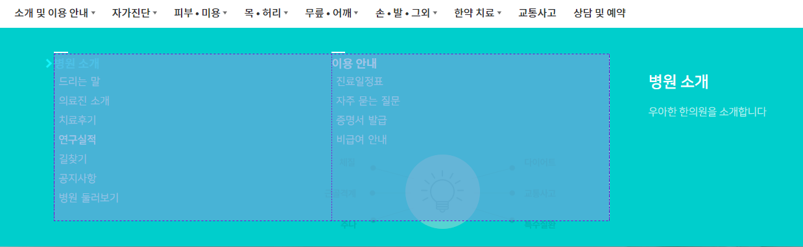
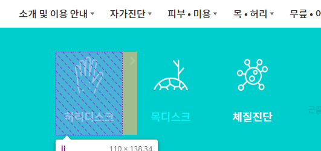
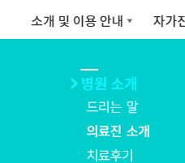
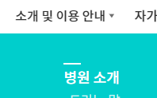
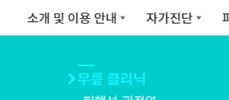
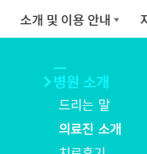
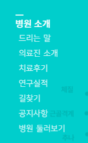
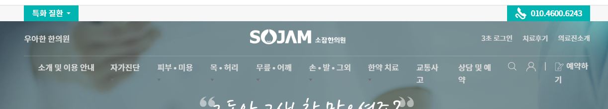

1. 메뉴는 `일반클릭` vs  `2단계 이미지 메뉴`or `3단계 메뉴`  로 구분한다
   - 일반클릭은 `li.nav-item`에 `.mega-dropdown`이 없다
2. 2단계 이미지 메뉴는 `.dropdown-menu` 내부의 `ul.body-left`에 `.menu-img`가 추가되어 각 2단계메뉴들이 영향을 받는다.
   - **이 때, 내부 img태그에서 mb-3을 두어 간격을 직접 벌려준다.**
```html
<ul class="body-left list-unstyled d-flex menu-img">
   <li><a href="#">
      
      <p class="text-white">허리디스크</p>
   </a></li>
```
3. 3단계 메뉴는 `ul.body-left`에 `.menu-2nd`가 추가되고, 내부에 `ul.menu-3rd`가 추가되어 각 li들을 갖는다.
```html
<ul class="body-left list-unstyled d-flex menu-2nd">
   <li>
      <a href="#"><p class=" text-white mb-0">병원 소개</p></a>
      <ul class="list-unstyled menu-3rd">
         <li><a href="#">드리는 말</a></li>
```

4. 공통설정1 - .menu-2nd 든 .menu-img든, 둘다 ul.body-left를 비율 60%로 맞추고, 모바일에선 100%가 되게 한다.
```css
/* ul.body-left (메뉴공간) - 공통 설정1 */
.header .header-middle .navbar-nav .nav-item .dropdown-menu .dropdown-body .body-left {
    /* 넘치면 다음줄로 */
    flex-wrap: wrap;

    /* 60% 유지 -> 모바일에선 100% */
    width: 60%;
    /*padding: 0 5%;*/
}

@media screen  and (max-width: 991px) {
    .header .header-middle .navbar-nav .nav-item .dropdown-menu .dropdown-body .body-left {
        width: 100%;
    }
}
```

5. 개별설정 1 - 차지공간 설정 
   - 3차메뉴는 50%씩 차지 vs 이미지 메뉴는 110px씩 차지 + 모바일에선 50%씩 차지
```css
/*
    ul.body-left (메뉴공간) 개별설정 1
    1) .body-left.menu-2nd -> 50% 씩 차지
    2) .body-left.menu-img -> 110px씩 차지 + mr로 간격
        + 모바일에선 50%
*/
/* 1) menu-2nd는 개별 메뉴가 50%씩 차지 */
.header .header-middle .navbar-nav .nav-item .dropdown-menu .dropdown-body .body-left.menu-2nd > li {
    width: 50%;

    margin-bottom: 20px;
}

/* 2) menu-img는 개별 메뉴가 110px 이미지와 함께 차지 + 가운데 정렬하여 img+p태그 모으기 + 오른쪽과 거리 두기*/
.header .header-middle .navbar-nav .nav-item .dropdown-menu .dropdown-body .body-left.menu-img > li {
    width:110px;
    text-align: center;

    margin-right: 25px;
}

@media screen  and (max-width: 991px) {
    .header .header-middle .navbar-nav .nav-item .dropdown-menu .dropdown-body .body-left.menu-img > li {
        width: 50% !important;
        margin-right: 0!important;
    }
}
```




6. 공통설정 2 - hover시 화살표가 뜨기 위해 ul.body-left의 > li 들에 relative 설정 -> hover시 a태그에 화살표  + 글자색
```css
/* 공통설정2) 2nd + img  [li의  hover시 > a태그 화살표:after]  + [2nd의 위쪽하얀선:before를 위한 설정] */
.header .header-middle .navbar-nav .nav-item .dropdown-menu .dropdown-body .body-left > li {
    position: relative;
}

/* 2nd, img 메뉴 공통) hover시 왼쪽에 대각화살표 */
.header .header-middle .navbar-nav .nav-item .dropdown-menu .dropdown-body .body-left > li:hover > a:after {
    content: "";
    position: absolute;
    top: 10px;
    left: -15px;
    width: 10px;
    height: 10px;
    border-left: 3px solid #2cf5fb;
    border-bottom: 3px solid #2cf5fb;
    transform: rotate(-135deg);
}
```


7. 개별설정 2 - 3차메뉴의 2nd에 글자 위쪽 하얀선 :before + hover시 색 변경
```css
/* 개별설정2) 2nd 메뉴 위쪽 하얀선:before */
.header .header-middle .navbar-nav .nav-item .dropdown-menu .dropdown-body .body-left.menu-2nd > li:before {
    content: "";
    position: absolute;
    left: 0;
    top: -3px;
    width: 5%;
    height: 2px;
    background: #ffffff;
}

.header .header-middle .navbar-nav .nav-item .dropdown-menu .dropdown-body .body-left > li:hover:before {
   background: #2cf5fb;
}
```



8. 공통설정 3 - **`각 메뉴의 글자 p태그`(이미지-p, 3차메뉴-p 둘다 p)를 찾아서, hover시 글자색 변경**
   - **a태그 내부에 p태그가 있으므로 a태그 전체 hover설정을 피하기 위해  !important로 덮어야한다.**
```css
/* 공통설정3) 각 메뉴 글자태그 찾아서 li:hover시, 글자태그 글자색 변경 by !important */
/* - img 메뉴의 글자 p태그 -  hover시  p태그(제목) 글자색 변경 */
.header .header-middle .navbar-nav .nav-item .dropdown-menu .dropdown-body .body-left > li:hover p {
   font-weight: normal!important;
   color: #2cf5fb!important;
}
```


9. 개별설정 3 - img 메뉴인 경우, img태그를 찾아서 패딩을 추가하여, 이미지를 좀 줄인다.
   - 모바일에서는 패딩을 더 준다.
```css
/* 개별설정3) - 이미지 메뉴는 img태그의 크기를 padding으로 줄인다.추가 */
.header .header-middle .navbar-nav .nav-item .dropdown-menu .dropdown-body .menu-img > li img {
    padding: 15%;
}
```
10. 개별설정 4 - 2nd 메뉴의 `3rd메뉴 글자크기와 hover시 설정`을 해준다.
- **3차 메뉴의 글자크기와 lh는 root 변수로 따로 빼놓는다.**
- 3차 메뉴의 글자크기는 a태그내부라도 3번째 글자체로 넣는다.
```css
:root {
    --primary-font-family: 'Noto Sans KR', sans-serif;
    --secondary-font-family: 'Noto Serif KR', sans-serif;
    --third-font-family: 'NanumSquare', sans-serif;

    --3rd-menu-font-size: 16px;
    --3rd-menu-font-lh: 30px
}
```
```css
/* 개별설정4) 2nd 메뉴 - 3rd메뉴 글자크기와 hover시 글자설정*/
.header .header-middle .navbar-nav .nav-item .dropdown-menu .dropdown-body .menu-3rd > li > a {
    font-size: var(--3rd-menu-font-size);
    line-height: var(--3rd-menu-font-lh);

    color: rgba(255, 255, 255, .85) !important;
    font-family: var(--third-font-family) !important;
}

.header .header-middle .navbar-nav .nav-item .dropdown-menu .dropdown-body .menu-3rd > li:hover > a {
    color: white!important;
    font-weight: bold!important;
}
```


11. 개별설정5) 2nd메뉴- 3차메뉴를 padding-left로 벌려준다.
```css
/* 개별설정5) 2nd메뉴 - 3차메뉴를 pl를 줘서 벌려지도록 */
.header .header-middle .navbar-nav .nav-item .dropdown-menu .dropdown-body .menu-3rd > li {
    padding-left: 7px;
}
```



### 메뉴들 정리
1. 특화질환 부모를 d-flex로 만들고 between으로 만들어서, **전화번호를 우측에 붙인다.**
```html
<div class="d-flex justify-content-between align-items-center">
    <div class="d-inline-block bg-main px-3">
        <a class="dropdown-toggle text-white fs-6" data-bs-toggle="collapse"
           href="#collapseHeaderTop">
            특화 질환
        </a>

    </div>
    <div class="d-inline-block bg-main px-3">
        <a href="#" class="text-white fs-6" style="letter-spacing: -.5px">
            <svg width="28" height="28">
                <path fill="white"
                      d="M12.039 22.46c2.050 2.055 5.37 2.055 7.42 0 1.276-1.275 1.76-3.040 1.445-4.69 0.54-0.275 1.024-0.595 1.43-0.895 0.045-0.035 0.245-0.175 0.295-0.215 0.226-0.185 0.37-0.465 0.37-0.781 0-0.3-0.13-0.57-0.34-0.75l-4.125-3.4c-0.17-0.14-0.389-0.225-0.63-0.225-0.271 0-0.515 0.105-0.695 0.275-0.070 0.070-0.689 0.705-0.689 0.705-0.431 0.43-1.125 0.43-1.555 0l-4.21-4.215c-0.43-0.43-0.43-1.13 0-1.56l0.685-0.685c0.18-0.18 0.285-0.43 0.285-0.7s-0.105-0.511-0.275-0.69l-3.535-4.27c-0.185-0.22-0.465-0.365-0.775-0.365-0.33 0-0.62 0.16-0.805 0.405l-0.060 0.080c-0.77 1.040-1.775 2.69-1.775 4.24 0 4.27 9.52 13.775 13.75 13.775 0.080 0 0.16-0.005 0.235-0.005 0.075 0.785-0.191 1.595-0.79 2.2-1.075 1.075-2.816 1.075-3.89 0l-6.904-7.095c-1.465-1.465-3.835-1.465-5.3 0s-1.465 3.835 0 5.3l2.265 2.235c0.49 0.485 1.28 0.485 1.77 0 0.485-0.49 0.485-1.28 0-1.769l-2.27-2.23c-0.485-0.49-0.485-1.28 0-1.769 0.49-0.485 1.28-0.485 1.77 0l6.905 7.094z"></path>

            </svg>
            010.4600.6243
        </a>
    </div>
</div>
```

2. navabar라인의 .navbar-other안의 검색버튼은 주석처리하고, 로그인 | 예약하기는 버튼만 남긴다
3. 메뉴 `.header-middle` 호버시 붙는 `.on` 내부에서 svg의 stroke도 변경시켜준다
```css
/* - hover시 .navbar-other 안의 svg stroke색 변경 */
.header .header-middle.on .navbar-other svg {
    stroke: #000;
    stroke-width: .5px; /* 선의 두께를 좀 더 연하게 설정 */
}
```

4. 로그인(hover) + 예약버튼을 모바일에서 사라지지 않도록, div.collapse navbar-collapse의 바깥으로 빼준다

5. 모바일에선 로그인hover가 아니라 클릭이므로, 클릭시에도 뜨도록 jquery로 click을 추가해준다.
```js
// 로그인 버튼 - 모바일용 click 이벤트
$(".login").on("click", function () {
    $(this).toggleClass("on");
});
```
6. 이제 메뉴의 글자크기를 반응형 조절할 때, 많아진 메뉴에 대비해서 설정할 수 있게 변수로 처리한다.
- 메뉴크기 + navbar-other의 글자크기
- 
```css
.header .header-bottom ul li a {
    font-size: var(--header-bottom-font-size)
}
```


### 추가 작업
1. hover시 setTimeout으로 .2초이후 발생하도록 수정하기
   - 전역변수를 만들고, hover내용을 setTimeout(function()) { , hoverTimeInterval} 로 가져오며, hover작동내용 직전에 clearTimeout( 전역변수 )로 초기화한 뒤, 실행해준다.
   - 떼는 작업은 작동 직전 clearTimeout()을 시켜준다.
```js
    // mega-dropdown hover 이벤트
    var hoverTimeout;
    const hoverTimeInterval = 200;
    $(".mega-dropdown").hover(
        function () {
            if ($(window).width() >= 992) {
                var toggleElement = $('a[data-bs-toggle="dropdown"]', this);
                var dropdownMenu = $('.dropdown-menu', this);

                toggleElement.attr('data-bs-toggle', '');
                // dropdownMenu.addClass('show');

                // hoverTimeout)
                clearTimeout(hoverTimeout);

                hoverTimeout = setTimeout(function () {
                    // dropdownMenu.addClass('show');
                    dropdownMenu.stop(true, true).slideDown(222);
                    dropdownMenu.attr('data-bs-popper', 'static');
                    dropdownMenu.attr("aria-expanded", "true");
                }, hoverTimeInterval);
            }
        },
        function () {
            if ($(window).width() >= 992) {
                var toggleElement = $('a[data-bs-toggle="dropdown"]', this);
                var dropdownMenu = $('.dropdown-menu', this);

                // hoverTimeout)
                clearTimeout(hoverTimeout);

                // dropdownMenu.removeClass('show');
                dropdownMenu.stop(true, true).slideUp(150);
                dropdownMenu.attr('data-bs-popper', '');
                dropdownMenu.attr("aria-expanded", "false");

                toggleElement.attr('data-bs-toggle', 'dropdown');
            }
        }
    );
```
