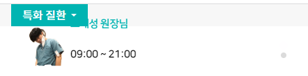

1. header-bottom 가운데 좌측(between)에 들어갈 row형 카드를 가져온다

```html

<div class="card border-0 flex-row ">
    
    <div class="card-body d-flex flex-column justify-content-center text-truncate p-0 ps-2" style="max-width: 75%;">
        <h5 class="card-title  text-truncate mb-1">Card title</h5>
        <p class="card-text  text-truncate my-0">Some quick example text to build on the
            card title and make up the bulk of the card's content.</p>
    </div>
</div>
```

2. 바깥에 `div.bottom-left-banner`로 한번 씌워줘서, flex-item으로서, width: %로 너비를 정해준다.
    - **flex는 반응형으로서 `max-width`를 줄 것 같지만, 내부요소들이 이미지|글의 max-width를 써야하므로, 부모는 `width`로 정해줘야한다.**

```html
<!-- left banner by splide-->
<div class="bottom-left-banner">
    <div class="card border-0 flex-row ">
```

```css
/* left banner */
.header .header-bottom .bottom-left-banner {
    width: 33.3%;
}
```

3. **이제 이미지부분과 글부분의 공간을 정해준다.**
    - **이미지는 height를 `max-height == 메뉴높이(70px)가 아닌 글자공간 높이(60px)`로 맞춰주고, `width를 auto`로 하되, `max-width를 글자공간(75%)대비 25%`
      로 정해준다.**

```css
/* left banner - img태그 높이 -> 타 글자높이에 맞춰준다 */
.header .header-bottom .bottom-left-banner .card > img {
    max-height: var(--header-bottom-font-lh);
    width: auto;

    max-width: 25%;
}
```

- 글자공간은 width를 `max-width: 75%`로 맞춰준다

```css
/* left banner - 글 부분 너비 75% */
.header .header-bottom .bottom-left-banner .card > .card-body {
    max-width: 75%;
}
```

4. card-title, card-text에 `.left-banner-title` ,`-subtitle`의 class를 배정하여 글자크기를 반응형으로 css 조정한다
    - 반응형 글자체는 추후 준다

```html
<h5 class="card-title left-banner-title text-truncate mb-1">Card title</h5>
<p class="card-text left-banner-subtitle text-truncate my-0">Some quick example text to build on the
    card title and make up the bulk of the card's content.</p>
```

```css
/* left banner font*/
.header .header-bottom .bottom-left-banner .left-banner-title {
    font-size: .9rem;
    font-weight: bold;
}

.header .header-bottom .bottom-left-banner .left-banner-subtitle {
    font-size: .9rem;
}
```


5. 예시 글자와 이미지가 갖쳐줬따면, .card 배경을 투명색으로, 글자는 회색(#ddd)로 준다.
    - .card 에서 한꺼번에 준다

```html

<div class="card border-0 flex-row bg-transparent text-gray">
```


6. 이제 .header-middle hover시(.on)  글자색을 바꿔준다.

```css
/* .header-middle hover시(.on) font색 변경 */
.header .header-middle.on .header-bottom .bottom-left-banner .left-banner-title {
    color: #00b5b2;
}

.header .header-middle.on .header-bottom .bottom-left-banner .left-banner-subtitle {
    color: #000;
}
```


7. **이제 해당 header가 작아지는 만큼 반응형으로 img태그의 max-height를, 각 글자크기들을 줄여야한다.**

```css
@media screen and (max-width: 991px) {
    .header .header-bottom .bottom-left-banner .card > img {
        max-height: var(--header-bottom-mobile-font-lh);
    }
}
```

- 글자를 줄일 때, my-1 준 것을 2px로 직접 줄여준다. 그리고 글자들을 ls로 모아준다

```css
/* - 모바일에서 글자크기+자간+간격 줄이기 */
@media screen and (max-width: 991px) {
    .header .header-bottom .bottom-left-banner .left-banner-title,
    .header .header-bottom .bottom-left-banner .left-banner-subtitle {
        font-size: .7rem;
        font-weight: bold;
        letter-spacing: -.7px;
        margin: 2px;
    }
}
```


### splide js 적용

8. header에 splide css와 js를 건다.

```html

<link rel="stylesheet" href="https://cdn.jsdelivr.net/npm/@splidejs/splide@4.1.4/dist/css/splide.min.css">
```

```js
<script src="https://cdn.jsdelivr.net/npm/@splidejs/splide@4.1.4/dist/js/splide.min.js"></script>

<script>
    var splide;

    window.document.addEventListener('DOMContentLoaded', () => {
    splide = new Splide('.splide', {
        // vertical
        arrows: false,
        direction: 'ttb', // 슬라이드방향 -> height or heightRatio필수
        heightRatio: 0.25, // direction 바뀔 때 height or heightRatio필수
        paginationDirection: 'ttb', // 페지네이션 방향
        // 기본설정 'loop' 무한반복, 'slide' 1회석
        type: 'loop',
        perPage: 1,
        perMove: 1,
        start: 0,
        wheel: true,
        autoplay: true,
        interval: 4000,
        // speed: 100,
    }).mount();

});
</script>
```

9. card를 감싸는 부모 `div.bottom-left-banner` <-> `div.card`사이에 아래와 같은 splide태그를 적용한다
    - splide의 첫번째 div는 `.splide`와 `id`가 주어져야한다.

```html

<div class="bottom-left-banner">
    <!-- splide-->
    <div class="splide" id="leftBanner">
        <div class="splide__slider position-relative">
            <div class="splide__track">
                <ul class="splide__list ">
                    <!-- slide 1 -->
                    <li class="splide__slide">


                        <div class="card border-0 flex-row bg-transparent text-gray">
                            
                            <div class="card-body d-flex flex-column justify-content-center text-truncate p-0 ps-2">
                                <h5 class="card-title left-banner-title text-truncate my-1">
                                    조재성 원장님
                                </h5>
                                <p class="card-text left-banner-subtitle text-truncate my-0">
                                    09:00 ~ 21:00
                                </p>
                            </div>
                        </div>


                    </li>
                </ul>
            </div>
        </div>
    </div>

</div>
```



10. splide를 여러곳에서 적용할 수도 있으니, 객체 생성시 .splide를 #id로 변경한다.


11. 이 때, .card-body 속 p태그가 갑자기 붕뜨게 된다. **p태그를 h6태그로 바꿔준다.**
    

```html

<div class="card-body d-flex flex-column justify-content-center text-truncate ps-2">
    <h5 class="card-title left-banner-title text-truncate my-1 ">
        조재성 원장님
    </h5>
    <h6 class="card-text left-banner-subtitle text-truncate my-0 ">
        09:00 ~ 21:00
    </h6>
</div>
```


12. **이제 js로 설정 중에서 height를 직접 content 높이로 지정해준다.**

- 현재 heightRatio: .25;로 지정된 것을 **`height: 60px`로 바꿔준다.**
- **이 height를 결정해주면, pagination의 위치도 결정된다.**

```js
window.document.addEventListener('DOMContentLoaded', () => {
    splide = new Splide('#leftBanner', {
        // vertical
        arrows: false,
        direction: 'ttb', // 슬라이드방향 -> height or heightRatio필수
        // heightRatio: .25, // direction 바뀔 때 height or heightRatio필수
        height: 60, // header content 높이 + pagination 위치도 결정됨.
```


13. 원래 card의 위치로 돌리기 위해(왼쪽에 생긴 마진), **`li.splide__slide`의 마진을 `m-0`을 줘서 삭제해준다**

```html

<div class="splide" id="leftBanner">
    <div class="splide__slider">
        <div class="splide__track">
            <ul class="splide__list ">
                <li class="splide__slide m-0">
```


14. **모바일 화면에서 이미지<->글부분의 간격을 주면 글자가 안보이므로 `ps-2`를 lg에서부터보이게 한다.**
    

```html

<div class="card-body d-flex flex-column justify-content-center text-truncate
    p-0 ps-0 ps-lg-2">
    <!--p-0 ps-2">-->
```


15. 이제 모바일 화면에서의 content 높이(lh) `60px` in 70px -> `45px` in 50px 변화시키는데, splide height도 그에 맞춰 변경해준다.

- breakpoints 옵션을 사용한다.

```js
 splide = new Splide('#leftBanner', {
    height: 60, // header content 높이 + pagination 위치도 결정됨.
    breakpoints: {
        // 992(lg) 미만
        991: {
            height: 45,
        },
    },
}).mount();
```


16. lh를 줄여도 너무 위에 붙어있으므로 **splide 가장 부모div에서 바깥쪽(70px)로 `mt-1`을 추가한다.**

```html

<div class="bottom-left-banner my-auto">
    <!-- splide 적용 -->
    <div class="splide mt-1" id="leftBanner">
```


- **이제 slide를 몇개 더 늘인다**

17. 이제 pagination을 조절해준다.

- button태그들로 구성되어있어서, w/h로 크기를 조절하고, `.is-active`는 불들어온 버튼이며, 배경색+투명도로 조절할 수 있다.
- **크기를 8->4로 변경해주고, is-active의경우, main color로 배경색을 칠해준다.**

```css
/*left banner pagination 크기 + 색 */
#leftBanner button.splide__pagination__page {
    /* 각 점들은 button 태그의 background + opacity로 색으로 설정*/
    /*background: var(--color-main);*/
    /*opacity: 0.3;*/

    /* button 점 크기: 8px 기본*/
    width: 4px;
    height: 4px;
}

#leftBanner button.splide__pagination__page.is-active {
    background: var(--color-main);
    /*opacity: 1;*/
}
```

18. 버튼을 세로로 나열하기 전에, 우측버튼들 (ul li)에 걸린 lh를 확실하게 지정해준다.

- 바로 직 자식관계로 화살표를 기입한다.

```css
/* header-bottom - 우측 버튼들 */
/*.header .header-bottom ul li {*/
.header .header-bottom > ul > li {
    line-height: var(--header-bottom-font-lh);
    margin-left: var(--header-bottom-ms);
}

@media screen and (max-width: 991px) {
    .header .header-bottom > ul > li {
        line-height: var(--header-bottom-mobile-font-lh) !important;
        margin-left: var(--header-bottom-mobile-ms);
    }
}

.header .header-bottom > ul > li a {
    font-size: var(--header-bottom-font-size)
}
```

19. 세로로 나열되어야하는데, 가로로 배열되는 것을 확인해보니, **padding이 있어서 옆으로 붙는 모양세가 나왔다.**
    

- **기본적으로 명시된 상하패딩을 제거해줘야, 좁은공간에서 세로 pagination이 가능해진다.**

```css
/* 세로나열을 위해, button<li의 부모인 ul의 기본 상하 패딩을 제거해야, 좁은 공간에서 자동flex-column의 버튼들이 가로로 안 눕는다.*/
#leftBanner ul.splide__pagination {
    padding: 0;
}
```


20. 추가로 li간의 lh행간을 0으로 완전히 좁혀서, 세어나가지 못하게 한다

```css
/* 세로나열을 위해, li들간의 간격을 0으로 */
#leftBanner .splide__pagination li {
    /*  기존 행간 1  */
    line-height: 0;
}
```

21. 이제 pagination의 위치를 조절한다.

- 세로나열인데, 전체부모인 33.3%의 끝에 배치되므로 **left를 기준으로 본문보다 왼쪽으로 옮기되, `width:fit-content`로 페이지네이션 종특 시작~끝까지 차지하는 버릇을 없앤다**

```css
/* pagination 위치 조절 */
#leftBanner ul.splide__pagination {
    /* 기존 left:auto; right:0.5em */
    /*right: 35%;*/
    left: -3%;
    width: fit-content;
}
```


22. mobile에선 점의 크기가 크고, left: -4%는 너무 가까워서 조금 더 벌려준다.
    

```css
/* 모바일에서 점크기 작게 + 왼쪽으로 조금 더 벌리기 */
@media screen and (max-width: 991px) {
    #leftBanner button.splide__pagination__page {
        width: 3px;
        height: 3px;
    }

    #leftBanner ul.splide__pagination {
        left: -7%;
    }
}
```


23. **이제 왼쪽으로 pagination을 밀었으니, `lg`에서만 보이는 글자를, span태그로 추가하자**

```html
<h5 class="card-title left-banner-title text-truncate my-1 ">
    조재성 원장님<span class="d-none d-lg-inline-block ms-2">추나 / 근골격계 / 교통사고</span>
</h5>
<h6 class="card-text left-banner-subtitle text-truncate my-0 ">
    09:00 ~ 21:00
</h6>
```

- hover시 색도 변경해주자

```css
.header .header-middle.on .header-bottom .bottom-left-banner .left-banner-title > span {
    color: var(--color-submain);
}
```


24. live 수정

- mobile 글자크기 줄이기

```css
/* - 모바일에서 left-banner 글자크기+자간+간격 줄이기 */
@media screen and (max-width: 991px) {
    .header .header-bottom .bottom-left-banner .left-banner-title,
    .header .header-bottom .bottom-left-banner .left-banner-subtitle {
        font-size: .5rem;
```

- 모바일 글자 준것에 대해 글자부분 ps-2 추가하기

```html

<div class="card-body d-flex flex-column justify-content-center text-truncate
                                            p-0 ps-2 ps-lg-3">
```

- mobile에서 pagination대비 card mt-1주기

```html
<li class="splide__slide m-0 mt-1 mt-lg-0 ">
```
