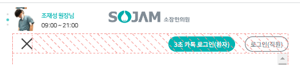

1. `div.collapse` <-> `ul.navbar-nav` 사이에 햄버거(lg미만) 전용으로 보이도록 div를 일단 먼저 짠다

```html

<div class="collapse navbar-collapse" id="navbarSupportedContent">
    <!-- 모바일 전용 로그인 메뉴 -->
    <div class="d-block d-lg-none">
        ddd
    </div>
    <!-- navbar 메뉴 -->
    <ul class="navbar-nav me-auto mb-2 mb-lg-0 mx-0">
```

2. 내부에 2개의 div를 나열하여 div-`로그인 + 회원가입` + div-`퀵메뉴` 2개를 새로로 배열한다

```html

<nav class="navbar navbar-expand-lg">
    <div class="container-fluid position-relative">
```

- 이렇게 주면, **PC에서 드랍다운메뉴가 내려올 때 (w-100%), container내부까지만 내려오게 됨**

```html

<nav class="navbar navbar-expand-lg position-relative">
    <div class="container-fluid ">
```

- 대신 완전히 붙어서 오른쪽 여백을 pe-4로 준다.

```html
<!-- 모바일 전용 로그인 메뉴 -->
<div class="d-block d-lg-none text-center">
    <!-- 로그인 (absolute) -->
    <div class="quick-login d-flex justify-content-end  position-absolute w-75 pe-4"
         style="top:0;right:0;">
        <a href="#">
            <button class="btn btn-sm btn-main rounded-pill fs-8">3초 로그인</button>
        </a>
        <a href="#">
            <button class="ms-3 btn btn-sm btn-outline-dark rounded-pill fs-8">회원 가입</button>
        </a>
    </div>
    <!-- 퀵메뉴 -->
    <ul class="m-0 quick-menu d-flex list-unstyled">
        <li><a href="#">
            <span>카카오 상담</span>
        </a></li>
        <li><a href="#">
            <span>실시간 예약</span>
        </a></li>
        <li><a href="#">
            <span>네이버 후기</span>
        </a></li>
        <li><a href="#">
            <span>자가진단</span>
        </a></li>
        <li><a href="#">
            <span>길찾기</span>
        </a></li>
    </ul>
</div>
```

- .collapse를 선택자에 넣으면 늦게 작동한다.

```css
/* 모바일 퀵메뉴 */
.quick-menu {
    padding: 15px 0;
}

.quick-menu li {
    flex: 1 0;

    border-left: 1px solid rgba(221, 221, 221, 0.3);
}

.quick-menu li:first-of-type {
    border-left: none;
}

.quick-menu li a {
    /*width: 100%;*/
    /*height: 100%;*/

    padding: 10px 0;

    text-align: center;
}

.quick-menu li a:before {
    content: '';
    display: block;
    vertical-align: top;
    width: 100%;
    height: 23px;
    background: url(../images/quick/kakao.png) no-repeat 50% 50%;
    background-size: 23px;
}

.quick-menu li:nth-of-type(2) a:before {
    background: url(../images/quick/booking.png) no-repeat 50% 50%;
    background-size: 17px; /* height(23) 보다 좀 작아야 다 나옴 */
}

.quick-menu li:nth-of-type(3) a:before {
    background: url(../images/quick/naver.png) no-repeat 50% 50%;
    background-size: 20px; /* height(23) 보다 좀 작아야 다 나옴 */
}

.quick-menu li:nth-of-type(4) a:before {
    background: url(../images/quick/dx.png) no-repeat 50% 50%;
    background-size: 20px; /* height(23) 보다 좀 작아야 다 나옴 */
}

.quick-menu li:nth-of-type(5) a:before {
    background: url(../images/quick/path.png) no-repeat 50% 50%;
    background-size: 20px; /* height(23) 보다 좀 작아야 다 나옴 */
}

.quick-menu li a span {
    /*color: #a7c5d1;*/
    color: var(--color-main);
    font-size: 10px !important;
    line-height: 25px;

    display: block; /* 필수*/
}

```

#### 아래쪽 온라인 상담 -> figure의 qrcode로 바꾸기

```css
/* 모바일 진료시간 (토, 일은 글자색 자동으로 다르게) */
.quick-schedule li > span {
    margin-right: 5px;
}

.quick-schedule li:nth-of-type(6) > span {
    background-color: rgb(86, 128, 245) !important;
}

.quick-schedule li:nth-of-type(6) {
    color: rgb(45, 82, 181) !important;
}

.quick-schedule li:nth-of-type(7) > span {
    background-color: rgb(255, 85, 85);
}

.quick-schedule li:nth-of-type(7) {
    color: rgb(245, 41, 41) !important;
}

```

```html
 <!-- 모바일 진료시간-->
<div class="d-block d-lg-none">
    <div class="quick-schedule ">
        <p class="fs-11 font-serif mb-2 fw-bold ">진료시간 <span class="text-submain-light fs-8">*실시간 반영 중.</span></p>
        <ul class="list-unstyled d-flex flex-wrap row-gap-1 rounded fs-11 text-main-dark fw-bold">
            <li class="w-50">
                                    <span class="d-inline-block rounded-circle bg-main-light text-white text-center"
                                          style="width: 22px;height: 22px;line-height: 22px;">
                                        월
                                    </span>
                10:00~20:00
            </li>
            <li class="w-50">
                                    <span class="d-inline-block rounded-circle bg-main-light text-white text-center"
                                          style="width: 22px;height: 22px;line-height: 22px;">
                                        화
                                    </span>
                10:00~21:00
            </li>
            <li class="w-50">
                                    <span class="d-inline-block rounded-circle bg-main-light text-white text-center"
                                          style="width: 22px;height: 22px;line-height: 22px;">
                                        수
                                    </span>
                10:00~20:00
            </li>
            <li class="w-50">
                                    <span class="d-inline-block rounded-circle bg-main-light text-white text-center"
                                          style="width: 22px;height: 22px;line-height: 22px;">
                                        목
                                    </span>
                10:00~21:00
            </li>
            <li class="w-50">
                                    <span class="d-inline-block rounded-circle bg-main-light text-white text-center"
                                          style="width: 22px;height: 22px;line-height: 22px;">
                                        금
                                    </span>
                10:00~20:00
            </li>
            <li class="w-50">
                                    <span class="d-inline-block rounded-circle bg-main-light text-white text-center"
                                          style="width: 22px;height: 22px;line-height: 22px;">
                                        토
                                    </span>
                10:00~13:00
            </li>
            <li class="w-50">
                                    <span class="d-inline-block rounded-circle bg-main-light text-white text-center"
                                          style="width: 22px;height: 22px;line-height: 22px;">
                                        일
                                    </span>
                휴진
            </li>
        </ul>
    </div>
</div>
```

### 토글시 동적 설정(jquery) 및 scroll 설정, body scroll 고정

1. 고정 height가 없는 상황에서 `.navbar-collapse`에 **`max-height` + `overflow-y:auto`가 반드시 필요하다.**
    - **max-height는 `.header-top`과 `토글버튼 height`를 `제외시킨 vh`를 계산해서 넣어줄 예정이다.**
      

```css
/* 모바일) navbar 토글시 동적 height에 대한, scroll 설정 */
@media screen and (max-width: 991px) {
    .header .header-middle .navbar .navbar-collapse {
        overflow-y: auto;
    }
}
```

2. jquery를 통해 100vh 중에, `.header-top` + `.navbar-toggler`의 높이를 전체 높이에서 뺀 것을 동적으로 collapse의 높이로 지정한다.
    - **이 때, 모바일에서만 적용되고, resize + 초기화되는 함수 `adjustToResize` 함수에 적용한다.**

```js
function adjustToResize() {
   if ($(window).width() <= 991) {
      // ...
   
      // 토글시 navbar-collapse 높이 동적 계산( 전체 - top헤더(.header-bottom) - 토글버튼 높이 )
      var navbarCollapse = document.getElementById('navbarSupportedContent');

      var windowHeight = window.innerHeight;
      var headerBottomHeight = $('.header .header-bottom').offsetHeight;
      var navbarTogglerHeight = $('.header .navbar-toggler').offsetHeight;

      navbarCollapse.style.maxHeight = windowHeight - headerBottomHeight - navbarTogglerHeight + 'px';

   } else {
```
