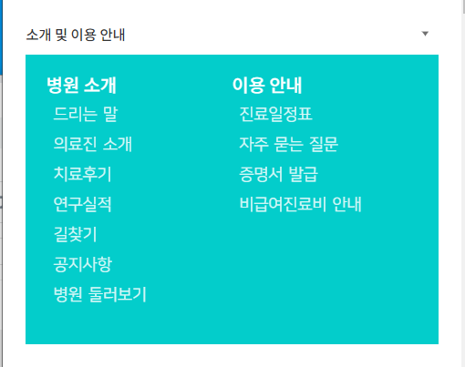
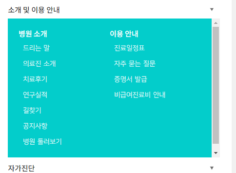
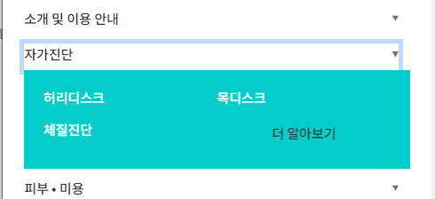
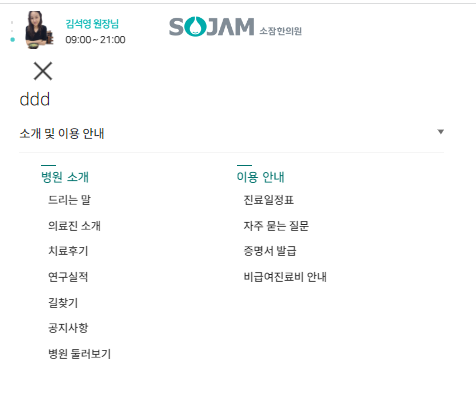
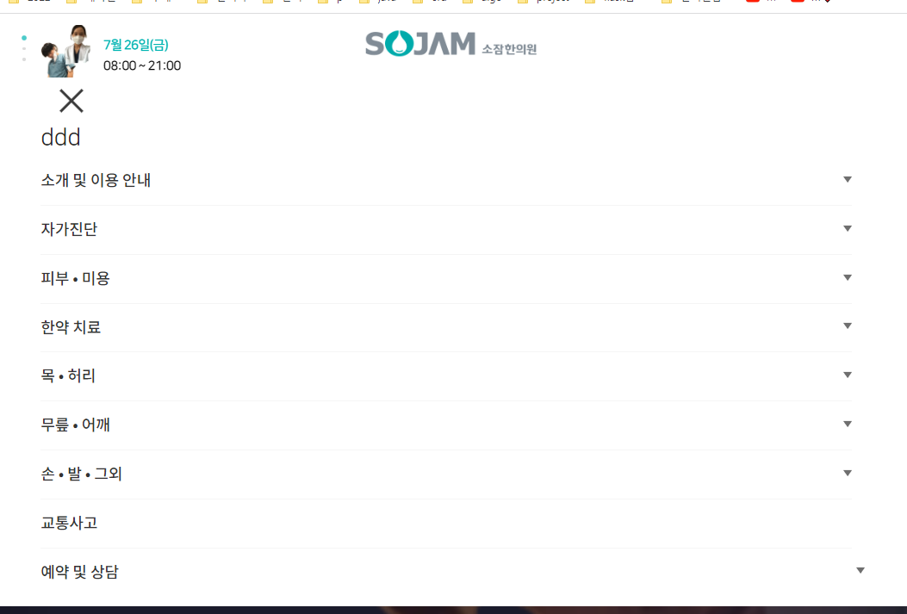
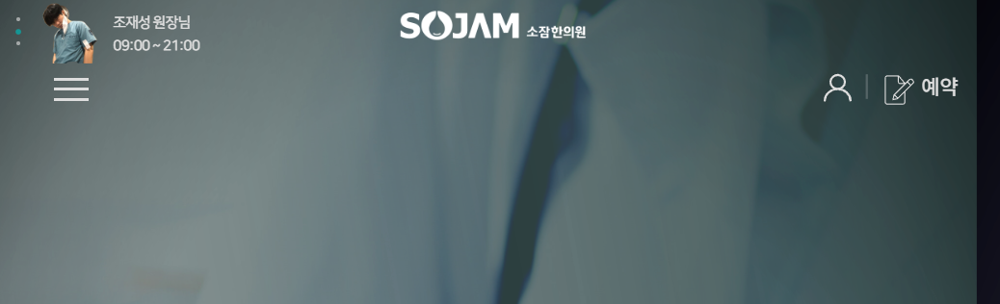

### 작동 문제 해결 
1. scroll시 기존, 특정 높이 이하에서, headerTop제거, logo(bottom)제거, megamenu만 `.on` 걸어주던 작업을, **mobile에선 안하도록**
- 기존
```js
    $(window).scroll(function () {
    let offsetY = $("body").scrollTop() + $("html").scrollTop();

```

- 992 이상에서만 작동하도록 제한을 건다

```js
    $(window).scroll(function () {
    if ($(window).width() >= 992) {
```

2. 모바일시 나오는 .header-middel 전체에 대해서도, `모바일시 hover를 막아` "on"이 안뜨게 한다.
```js
    // header-middle hover시
    $(".header-middle").hover(function () {
        if ($(window).width() >= 992) {
            $(this).addClass("on");
        }
    }, function () {
        if ($(window).width() >= 992) {
            $(this).removeClass("on");
        }
    }
```

3. 이제 모바일 햄버거 토글버튼 누를시, 같이 .navbar-toggler에 on시키는 메뉴에서, **`.header-middle` hover시 on됬던 것을, 여기서 on을 토글한다.**
```js
/* 햄버거 버튼 토글 */
$(".navbar-toggler").click(function () {
    $(this).toggleClass("on");
    // 모바일시 클릭하면, lg의 hover처럼 on
    $(".header-middle").toggleClass("on");
});
```
- **토글 대신 on여부를 판단하고, header-middle도, .navbar-toggle가 "on"가진 여부에 따라 토글**
```js
/* 햄버거 버튼 on 토글 + .header-middle (lg hover작동) on 토글 */
$(".navbar-toggler").click(function () {
    // 토글버튼에 "on" 토글
    // $(this).toggleClass("on");
    if (!$(this).hasClass("on")) {
        $(this).addClass("on");
    } else {
        $(this).removeClass("on");
    }
    // 토글버튼에 "on" 여부에 따라 -> lg의 hover처럼, header-middle을 "on"
    $(".header-middle").toggleClass("on");
    let $headerMiddle = $(".header-middle");
    if ($(this).hasClass("on") && !$headerMiddle.hasClass("on")) {
        $(".header-middle").addClass("on");
    } else if (!$(this).hasClass("on") && $headerMiddle.hasClass("on")) {
        $(".header-middle").removeClass("on")
    }
});
```
4. 잘못 주어졌던, navbar의 모바일 기본 padding을 다시 살린다.
```css
/* 모바일에선 좌우패딩 없애서 전체화면을 만들어야 body 스크롤이 안된다? */
/* -> 틀린 말. body 스크롤은 이루어짐. */
@media screen and (max-width: 991px) {
    .header .header-middle .navbar {
        /*padding: 0 0;*/
    }
}
```

5. **header 전체를 boostrap `.fixed-top`으로 줬었는데, 모바일에선 풀방법이 boostrap으로 없으니 직접 css로 정의해준다.**
    - **모바일에선 `absolute`로 떠있게 만들어버려서 fixed처럼 보이게 한다.**
- 기존
```html
<body>
<!-- 헤더 -->
<div class="header container-fluid fixed-top">
    <div class="header-top bg-gray d-none d-lg-block ">
```
- 변경후
```html
<!-- 헤더 -->
<div class="header container-fluid fixed-lg-top">
```
```css
.fixed-lg-top{
    z-index: 1030;
    position: absolute;
}

@media screen and (min-width: 992px){
    .fixed-lg-top{
        position: fixed;
        top: 0;
        right: 0;
        left: 0;
    }
}
```

### 1차메뉴 디자인
1. 메뉴단 간격이 모바일 세로간격 mt-3 / PC  mt-0 + padding상하10으로 주어져있는데
   - 모바일시 mt-2 + padding-bottom 5(드랍다운메뉴간격)으로 유지하게 한다.
```html
<!-- 소개 및 이용안내-->
<li class="nav-item active mt-2 mt-lg-0 mega-dropdown">
```
```css
/* - 모바일에선 상하패딩 제거(html mt-3으로만 세로간격 유지) */
@media screen and (max-width: 991px) {
    .header .header-middle .navbar-nav .nav-item > a {
        padding-top: 0;
        padding-bottom: 5px;
    }
}
```

### 2차,img메뉴 디자인
1. 더알아보기 html 및 css 삭제
```css
/* dropdown body-left 마지막 li 더 알아보기 버튼 */
/*.header .header-middle .navbar-nav .nav-item .dropdown-menu .dropdown-body .body-left > li:last-of-type {*/
/*    width: 100%;*/
/*    text-align: center;*/

/*    !*padding: 10px 5%;*!*/
/*    padding: 0 5%;*/
/*    border: 1px solid white;*/
/*    border-radius: 5px;*/
/*    margin-top: 10px;*/
/*}*/
```

2. boostrap .dropdown-menu의 모바일시 `배경그림 삭제 + padding 줄이기` + 부모인 상위메뉴 a태그의 border-bottom도 삭제
   - bootstrap관련이라 다 !important로 변경
```css
@media screen and (max-width: 991px) {
    /*.nav-item.mega-dropdown > a {*/
    .nav-item > a {
        /* 모바일 시 밑줄 */
        /*border-bottom: 1px solid #c9c9c9;*/
    }

    .nav-item.mega-dropdown .dropdown-menu {
        animation: fade-in 0.6s ease-in-out forwards;
        /* 배경그림 삭제 */
        background: #1ececb !important;
        padding: 15px 5% !important;
    }
}
```

3. 모바일에선, 2차메뉴의 왼쪽하얀선 가리기
```css
/* - 모바일에선 왼위하얀석 가리기 */
@media screen and (max-width: 991px) {
    .header .header-middle .navbar-nav .nav-item .dropdown-menu .dropdown-body .body-left.menu-2nd > li:before {
        display: none;
    }
}
```


4. 모바일에서, img메뉴의 img는 가리기
```css
@media screen and (max-width: 991px){
    .header .header-middle .navbar-nav .nav-item .dropdown-menu .dropdown-body .menu-img > li img {
        display: none;
    }
}
```


5. 1차메뉴 모바일 글자크기 정의 및, 1-2차 동일하게 주고, 3차는 정의해서 따로 주기
```css
:root {
    /* header-middle(navbar + 로그인|예약버튼) 설정 */
    --header-middle-nav-font-size: 14px;
    --header-middle-nav-1200-font-size: 15px;
    --header-middle-nav-1400-font-size: 18px;

    --header-middle-nav-mobile-font-size: 12px;
}
```
```css
@media screen and (max-width: 991px){
    .header .header-middle .navbar-nav .nav-item > a {
        padding-top: 0;
       padding-bottom: 10px;
        /* 1차 메뉴 글자크기*/
        font-size: var(--header-middle-nav-mobile-font-size);
    }
}
```
```css
/* 2nd + img 메뉴 공통) 모바일 글자크기 = 1차 모바일과 동일 */
@media screen and (max-width: 991px) {
   .header .header-middle .navbar-nav .nav-item .dropdown-menu .dropdown-body .body-left > li > a > p{
      font-size: var(--header-middle-nav-mobile-font-size);
   }
}
```


- 3차 메뉴 글자 크기
```css
:root {
   --3rd-menu-font-size: 16px;
   --3rd-menu-font-lh: 30px;

   --3rd-menu-mobile-font-size: 11px;
   --3rd-menu-mobile-font-lh: 15px;
}
```
```css
/* - 3차메뉴 모바일 글자 크기 */
@media screen and (max-width: 991px){
    .header .header-middle .navbar-nav .nav-item .dropdown-menu .dropdown-body .menu-3rd > li > a {
        font-size: var(--3rd-menu-mobile-font-size);
        line-height: var(--3rd-menu-mobile-font-lh);
}
```

6. PC에서 2차메뉴용 li마다, mb를 20px 깔아두었던 것을 모바일에선, 10px로 수정
```css
/* - 2차메뉴 상하간격mb을 모바일에선 작게 */
@media screen and (max-width: 991px) {
    .header .header-middle .navbar-nav .nav-item .dropdown-menu .dropdown-body .body-left.menu-2nd > li {
        margin-bottom: 10px;
    }
}
```

7. img메뉴는 상하간격mb 대신 내부 p태그의 기본mb가 있었는데, 15px로 수정 + **text 정렬을 center -> left로 수정**
```css
/* img메뉴의 p기본 mb을 모바일에선, 2차메뉴처럼 mb-10px로 주고 + text는 좌측 정렬 */
@media screen and (max-width: 991px) {
   .header .header-middle .navbar-nav .nav-item .dropdown-menu .dropdown-body .menu-img > li > a > p {
      margin-bottom: 15px;

      text-align: left;
   }
}
```




8. 이제 dropdown 배경을 흰색으로 글자는 검은색으로 바꿔본다.
```css
@media screen and (max-width: 991px) {
    .nav-item.mega-dropdown .dropdown-menu {
        animation: fade-in 0.6s ease-in-out forwards;
        /* 배경그림 삭제 */
        background: #fff !important;
        padding: 15px 5% !important;
    }
}
```
9. 2차메뉴 + img메뉴는 **1차메뉴의 모바일크기와 동일하게 주되, 글자체+bold 및 글자색을, 새로운 더 진한 main색으로 준다.**
```css
:root {
    --color-main-darker: #05736d; /* for 모바일 2차메뉴 */
}
```
```css
/* 2nd + img 메뉴 공통) 모바일 글자크기 = 1차 모바일과 동일 */
@media screen and (max-width: 991px) {
   .header .header-middle .navbar-nav .nav-item .dropdown-menu .dropdown-body .body-left > li > a > p{
      font-size: var(--header-middle-nav-mobile-font-size);
      font-family: var(--third-font-family);
      font-weight: bold;
      color: var(--color-main-darker) !important;
   }
}
```

10. 이 때, **왼위쪽 모바일에서 감췄던 하얀선을, 보이게 + img메뉴에도 적용되게 한다.**
```css
/* - 모바일에선 왼위 하얀선 가리기 */
@media screen and (max-width: 991px) {
    .header .header-middle .navbar-nav .nav-item .dropdown-menu .dropdown-body .body-left.menu-2nd > li:before,
    .header .header-middle .navbar-nav .nav-item .dropdown-menu .dropdown-body .body-left > li:before
    {
        /*display: none;*/
        content: "";
        position: absolute;
        left: 0;
        top: -3px;
        width: 15px;
        height: 1.3px;
        background: #05736d;
    }
}
```

11. 3차메뉴는 글자색을 검은색으로 준다. + hover시에는 default 흰색이었던 것을, main색으로 준다.
```css
/* - 3차메뉴 모바일 글자 크기 */
@media screen and (max-width: 991px) {
   .header .header-middle .navbar-nav .nav-item .dropdown-menu .dropdown-body .menu-3rd > li > a {
      font-size: var(--3rd-menu-mobile-font-size);
      line-height: var(--3rd-menu-mobile-font-lh);
      font-family: var(--primary-font-family)!important;
      color: #222 !important;
   }

   .header .header-middle .navbar-nav .nav-item .dropdown-menu .dropdown-body .menu-3rd > li:hover > a {
      color: var(--color-main) !important;
   }
}
```

12. 숨겻던 1차메뉴 border-bottom을 회색으로 투명도를 줘서 만든다.
```css
@media screen and (max-width: 991px) {
    /*.nav-item.mega-dropdown > a {*/
    .nav-item > a {
        /* 모바일 시 밑줄 */
        border-bottom: 1px solid rgba(221, 221, 221, 0.3);
    }
}
```
- 마지막 .nav-item을 제외하고 들어가게 수정한다.
```css
@media screen and (max-width: 991px) {
    .nav-item:not(:last-child) > a {
        /* 모바일 시 밑줄 */
        border-bottom: 1px solid rgba(221, 221, 221, 0.3);
    }
}
```



13. **toggle시, 로그인 / 예약버튼은 맨밑에 안나오게 숨기도록 jquery처리한다.**
   - **이 때, d-flex가 !important로 작용하고 있고, jquery로는 important적용이 안되기 때문에 `.blind` 클래스를 toggle해서 처리한다.**

```js
$(".navbar-toggler").click(function () {
    // 토글버튼에 "on" 토글
    // $(this).toggleClass("on");
    if (!$(this).hasClass("on")) {
        $(this).addClass("on");
        // 추가) 햄버거 우측의 로그인|예약버튼을 감싸는 .navbar-other toggle시 감추기
        $('.navbar-other').addClass('blind');
    } else {
        $(this).removeClass("on");
        // 추가) 햄버거 우측의 로그인|예약버튼을 감싸는 .navbar-other toggle시 감추기
        $('.navbar-other').removeClass('blind');
    }
}
```




14. mr을 마지막 제외하고 1차메뉴에 줫었는데, 모바일에서는 마지막도 mr이 유지되어야, 각 row간격이 맞아진다.
```css
/* 마지막 nav-item은 mr-0 */
.header .header-middle .navbar-nav .nav-item:last-child .nav-link {
   margin-right: 0;
}
/* - 모바일에서는 margin-right 유지되야 좌우여백이 맞음 */
@media screen and (max-width: 991px){
   .header .header-middle .navbar-nav .nav-item:last-child .nav-link {
      margin-right: 10px;
   }
}
```


### login에 hover 섞인 것 버그 처리
1. 초기화 + resize마다 호출되는 `adjustToResize`를 만들고, 내부에서 사이즈에 따라
   - 모바일 click, focus(모바일에서 클릭 바로 안될 시 해결) + blur(focus반대)를 event로 지정하고
   - PC에서는 hover로만 작동하도록 지정해준다.
```js
// 초기 로드 시
/* 로그인 버튼 - PC용 hover / 모바일 click + focus/blur */
let $login = $(".login");

function adjustToResize() {
  if ($(window).width() <= 991) {
      // 모바일 화면 크기일 때는 로그인 요소에 click 이벤트 적용 (hover 삭제)
      $login.off("mouseenter mouseleave").on("click focus", function() {
          $(this).toggleClass("on");
      }).on("blur", function () {
          $(this).removeClass("on");
      })
  } else {
      // PC 화면 크기일 때는 로그인 요소에  hover 이벤트 적용 (click + focus/blur 이벤트 삭제)
      $login.off("click focus blur").hover(
          function() {
              $(this).addClass("on");
          },
          function() {
              $(this).removeClass("on");
          }
      );
  }
}
```
