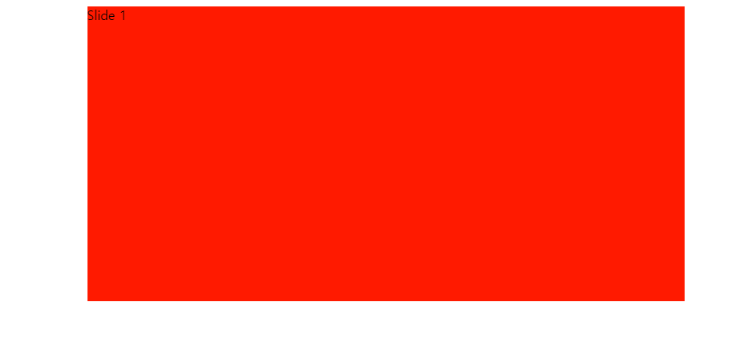
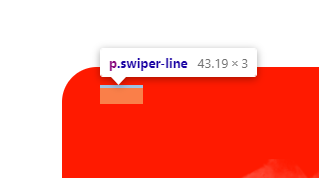

### section1: main hero + body의 padding-top for fixed되지 않는 메뉴 높이

1. 헤더 div 밑에 `div.section1`을 만들고 부트스트랩의 picture 예제를 가져온다.
    - 이미지를 모바일과 감별하기 위해서 **bootstrap picture > source + `img.img-fluid` 조합을 이용한다.**
    - 부트스트랩의 picture를 검색해서 복붙한다.

```html
<!-- 섹션1 -->
<div class="section1">
    <picture>
        <source srcset="..." type="image/svg+xml">
        
    </picture>
</div>
```

2. **source태그에 `media="(max-width: 991px)"` 속성을 줘서 lg보다 작을 때(모바일)에서, source의 그림이 나타나도록 한다.**

```html

<source media="(max-width: 991px) srcset=" ...">
```

3. main hero는 모바일의 경우, 명옥헌 모바일버전의 2배인 1280x1720px을, PC의 경우, 소잠의 1920x920px을 가져온다
    - 명: http://m.myungokhun.co.kr/renew4/index.asp
    - 소: https://www.sojam.co.kr/index.asp


4. img태그의 경우, style로 `filter: brightness( 0 ~ n )` css로 img의 밝기를 조절할 수 있는데 0.9로 일단 줘놓자
    - img태그의 경우 `max-width: 100%`가 깔려있는데, 이미지보다 width가 더 클 수 있으므로, `w-100`을 추가로 줘서, 꽉 채우도록 한다

```html
<!-- 섹션1 -->
<div class="section1">
    <picture>
        <source media="(max-width: 991px)" srcset="images/main_carousel/carouse_main_mobile.png">
        
    </picture>
</div>
```

5. header-top의 높이를 담당하는 특화질환의 font-size 및 lh를 변수로 잡아 저장하고, 그 높이만큼 **`body태그에 padding-top`을 준다.**
    - 참고: https://www.youtube.com/watch?v=5zDYchk3C5k&list=WL&index=8

```css
:root {
    /* header-bottom(가운데) 설정 */
    --header-top-height: 30px;
}
```

```css
/* - dropdown 버튼 (특화질환) */
.header .header-top div:nth-child(1) a {
    /*height: 30px;*/
    /*line-height: 30px;*/
    height: var(--header-top-height);
    line-height: var(--header-top-height);
}
```

6. **특화질환(header-top)은 lg일때만 적용되므로, body의 padding-top도 lg일때만 적용되도록 준다.**

```css
/* lg일 때, fixed되지 않은 header-top의 높이만큼 body 위를 띄워준다. */
@media screen and (min-width: 992px) {
    body {
        padding-top: var(--header-top-height);
    }
}
```

### section2(글 + 애니메이션그림 + carouse) 작성하기

#### section2 top(글)

1. div.section2에는 top middle bottom div를 3개 만든다.

```html
<!-- 섹션2: main -->
<div class="section2">
    <div class="section2-top"></div>
    <div class="section2-middle"></div>
    <div class="section2-bottom"></div>
</div>
```

2. .section는 container를 쓰는 대신 w70%로 css로 section을 설정한다
    - `width 70%`에 **`margin: 0 auto`를 줘서 공간을 가운데 정렬한다** height는 300px로 고정한다.
    - 배경은 임시 red로 준다

```css
/* 섹션2 */
.section2 {
    width: 70%;
    margin: 0 auto;
    height: 300px;

    background: red;
}
```


3. **가장 부모에 적용을 확인했으면, `> div`를 붙여서, top/middle/bottom `최상위 자식들에게 일괄적용`시키도록 변경한다**
    - 자식들도 개별 300px의 높이를 가지게 된다.

```css
/* 섹션2 */
.section2 > div {
    width: 70%;
    margin: 0 auto;
    height: 300px;

    background: red;
}
```


4. top에 들어갈 글자들은 `빈div안에 p태그들` + `빈div에 장문`로 일단 나열한다

- 예상
  

```html

<div class="section2-top">
    <div>
        <p>우아 한의원 소개</p>
        <p>조재성 원장,</p>
        <p>김석영 원장</p>
    </div>
    <div>
        저희는 부부 한의사입니다. 익힌 의술들은, 가장 먼저 서로에게, 그 이후로는 가족 및 지인들에게 베풀면서 검증된 치료만 시행합니다.
        이제는 환자분들을 저희 가족들처럼 보살피겠습니다.
        조재성 원장은, 통계와 프로그래밍을 추가 전공하여 환자 친화적인 홈페이지를 직접 구현하였습니다.
        김석영 원장은, 따듯한 마음씨와 공감능력으로, 개원 전부터 많은 사람들이 치료 요청하였습니다.
        자세한 이야기는 여기를 통해 확인해보시면 좋겠습니다.
    </div>
</div>
```

5. 양옆으로 갈라지는 섹션은 `d-flex between`으로 구현하고, **각 빈div를 `div:nth-of-type()`으로 css를 각각 지정한다**

```html

<div class="section2-top d-flex justify-content-between">
```

```css
/* 섹션2-top 왼쪽div*/
.section2 .section2-top div:nth-of-type(1) {

}

/* 섹션2-top 오른쪽div*/
.section2 .section2-top div:nth-of-type(1) {

}
```

6. 자리를 잡기 전에 각 태그들의 `글자크기+색+lh`을 지정한 뒤, **`white-space: nowrap`으로 텍스트를 한줄표시하여** `왼쪽요소들부터 수평으로 먼저 자리를 차지`하게 한다

- **p 3개 중에 첫번째것만 다르므로, p태그로 1,2,3을 설정하고, p:nth-of-type(1)로 다른 것을 추가처리 한다.**

```css
.section2 .section2-top div:nth-of-type(1) p {
    font-size: 40px;
    line-height: 45px;
    font-weight: bold;
    color: #222222;

    white-space: nowrap; /* 텍스트 한 줄 표시*/
}

.section2 .section2-top div:nth-of-type(1) p:nth-of-type(1) {
    font-size: 20px;
    line-height: 25px;
    color: var(--color-main);
    white-space: nowrap; /* 텍스트 한 줄 표시*/
}
```


7. 오른쪽div는 어차피 between으로 벌어져있는 상태이므로 fz+lh+색등을 정한 뒤, `margin-left로 왼쪽div와 간격`을 벌리면, 내부 content의 공간이 줄어서 오른쪽으로 붙는다.
    - 왼쪽div에 대한 오른쪽div의 `위쪽 간격`은 margin이 아닌 `padding-top`으로 벌려준다.

```css
/* 섹션2-top 오른쪽div*/
.section2 .section2-top div:nth-of-type(2) {
    font-size: 25px;
    line-height: 35px;
    color: #222222;

    margin-left: 100px;
    padding-top: 50px;
}
```


8. **이제 왼+오른div전체 row에 대한 `위쪽간격`은 `div.section2-top`에서 padding 상하를 준다.**

```css
/* 섹션2-top */
.section2 .section2-top {
    padding: 50px 0;
}
```


9. **이제 section2의 자식div들에게 주어진 300px + red배경을 제거한다.**

```css
.section2 > div {
    width: 70%;
    margin: 0 auto;

    /*height: 300px;*/
    /*background: red;*/
}
```

#### section2 middel(애니메이션)

1. 예상
   

2. 일단 section2-middel에 2개의 투명한png를 img태그에 넣는다.
    - `img태그` 2개를 감싼 `부모 div`에는 `text-center`를 넣어줘서, 가운데 정렬 시킨다

```html

<div class="section2-middle text-center">
    
    
</div>
```   


3. 누 img사이의 같격을 `me-5`, `ms-5`로 각각 줘서 벌려본다.

```html


```

4. 모바일화면에서는, 화면축소시 가운데 그대로 있는게 아니라, top의 우측div 밑에 내려오게 할 예정이다.?
   

- **2개의 이미지가 갈라져서 새로운 이미지가 나올 예정이므로 `각 이미지의 크기를 직부모 .section2-middle의 width의 20%`로 고정시킨다.**
  
    - 아.. 그래서 img태그들을 빈div로 감싸지 않았구나.?!
- **일단, 각 이미지마다 설정을 달리 해줄 수 있으므로, 1번 2번 이미지로 각각 설정해준다**

```css
/* 첫번째 left 이미지*/
.section2 .section2-middle img:nth-of-type(1) {
    width: 20%;
}

/* 첫번째 right 이미지*/
.section2 .section2-middle img:nth-of-type(2) {
    width: 20%;
}
```


5. 이제 다음에 나타날 img들(text , center)를 추가해준다.

```html

<div class="section2-middle text-center">
    
    
    
    
</div>
```

6. 일단은 마지막 img는 주석처리하고, 3번째 text img를 css로 조절한다
    - **2개 이미지가 벌어지면 나타날 가로형 3번째 text img를 `width:80%`로 주고**
    - **이미 떠있는 이미지에 대해 겹쳐서 나타날 것이므로 `.section2-middel`을 `relative`로, 자신은 `absolute`로 준다**
    - 부모에 대해 top, left 50%로 준다

```html

<div class="section2-middle text-center">
    
    
    
    <!--        -->
</div>
```

```css
/* 섹션2-middle */
.section2 .section2-middle {
    /* 겹쳐서 중간에 나올 text img를 absolute로 */
    position: relative;
}
```

```css
/* 섹션2-middle 두번째 이미지*/
.section2 .section2-middle img:nth-of-type(3) {
    width: 80%;

    position: absolute;
    top: 50%;
    left: 50%;
    transform: translate(-50%, -50%);
}
```


7. center에 마지막으로 나올 img는, text img의 css를 복사해서 `width를 수정`하여 나타낸다

```css
/* 섹션2-middle 세번째 center 이미지*/
.section2 .section2-middle img:nth-of-type(4) {
    width: 25%;

    position: absolute;
    top: 50%;
    left: 50%;
    transform: translate(-50%, -50%);
}
```


8. 이제 2,3번째 이미지들을 `opacity: 0으`로 숨겨둔다

```css
/* 섹션2-middle 두번째 text 이미지*/
.section2 .section2-middle img:nth-of-type(3) {
    width: 80%;

    position: absolute;
    top: 50%;
    left: 50%;
    transform: translate(-50%, -50%);

    opacity: 0;
}

/* 섹션2-middle 세번째 center 이미지*/
.section2 .section2-middle img:nth-of-type(4) {
    width: 25%;

    position: absolute;
    top: 50%;
    left: 50%;
    transform: translate(-50%, -50%);
    opacity: 0;
}
```

- 애니메이션 효과는 나중에 줄 것이다.

### section3: carouse

#### test.html에서 swiper 미리 작성하기

- 기본적으로 bootstrpa css+js/jquery를 넣어준다.

```html

<link rel="stylesheet" href="css/bootstrap.css">

<script src="js/jquery.js"></script>
<script src="js/bootstrap.bundle.js"></script>
```

1. test.html 생성후 .section2-bottom에 적용된 css를 style태그로 옮겨주고 div.section2-bottom만 body로 옮겨준다

```html

<style>
    /* 원래는 .section2 > div {} 옵션인데, 직접 지정 */
    .section2-bottom {
        width: 70%;
    }
</style>
```

```html

<body>
<div class="section2-bottom">
</div>
</body>
```

2. `swiper css/js` + `swiper.animate.css` + `swier.animate1.0.3.js`도 미리 추가하기
    - 다운로드
    -
    css: https://github.com/AzrDream/JS-new-features-popular-frameworks/tree/f10e43155d7d227ab0869c9d8aa68c6c6bd76ac5/05-%E6%B5%81%E8%A1%8C%E6%A1%86%E6%9E%B6%E9%9B%86/05-Bootstrap/huawei/css
    -
    js: https://github.com/AzrDream/JS-new-features-popular-frameworks/tree/f10e43155d7d227ab0869c9d8aa68c6c6bd76ac5/05-%E6%B5%81%E8%A1%8C%E6%A1%86%E6%9E%B6%E9%9B%86/05-Bootstrap/huawei/js

    - `test.js`도 만들어서 작성후 나중에 index.js로 옮겨줄 것이다.

```html

<style>
    /* 원래는 .section2 > div {} 옵션인데, 직접 지정 */
    .section2-bottom {
        width: 70%;
        margin: 0 auto;
    }
</style>
<link rel="stylesheet" href="css/swiper.css">
<link rel="stylesheet" href="css/swiper.animate.min.css">
<script src="js/test.js"></script>
<script src="js/swiper.js"></script>
<script src="js/swiper.animate1.0.3.min.js"></script>
```

3. 중국어 swiper.js 3의 사용법의 예제를 가져온다
    - https://3.swiper.com.cn/usage/index.html
    - **7이후로는 사용법 바뀜.**
    - 기본예제에서 prev/next와 scrollbar는 삭제한다.

```html

<div class="section2-bottom">
    <div class="swiper-container">
        <div class="swiper-wrapper">
            <div class="swiper-slide">Slide 1</div>
            <div class="swiper-slide">Slide 2</div>
            <div class="swiper-slide">Slide 3</div>
        </div>
        <!-- 페이지네이션 -->
        <div class="swiper-pagination"></div>
    </div>
</div>
```

4. 이제 css로 각종 설정을 해준다. 먼저 `.swiper-container` 설정
    - **container는 이미 바깥에서 width를 맞춰놨을테니, `w100%`를 준다.**
    - **이 때, height는 `34vw`로 화면 width에 비례해서 잡히게 준다.**

```css
        /* swiper 설정 */
.section2-bottom .swiper-container {
    width: 100%;
    height: 34vw;
    /* 임시 */
    background: red;
}
```



- 추가로 border-radius를 container에 줘서 둥근모서리를 갖는다.

```css
.section2-bottom .swiper-container {
    width: 100%;
    height: 34vw;
    border-radius: 35px;
    /* 임시 */
    background: red;
}
```


5. 위아래 padding을 .section2-bottom {}에 준다.
    - `.section2 > div {}`에는 주어지지 않는 옵션이니 이것은 가져가야한다.

```css
/* 원래는 .section2 > div {} 옵션인데, 직접 지정 */
.section2-bottom {
    width: 70%;
    margin: 0 auto;
}

/* 새 옵션은 직접 가져가야함. */
.section2-bottom {
    padding: 100px 0;
}
```

6. 이제 slide를 작성할 건데, **같이 움직일 `앞면/뒷면 제품사진 2개`를 예상**하여 작성할 것이다.

- 예상
  
  

- 일단 이미지2개 씩을 slide내부에 넣어준다.

```html

<div class="swiper-slide">
    
    
</div>
<div class="swiper-slide">
    
    
</div>
<div class="swiper-slide">
    
    
</div>
```


7. **이제 `.swiper-slide` 속의 img태그들의 위치를 css로 relative -> absolute로 만든 뒤,조정해줘야한다.**
    - div.swiper-slide는 relative로 만든 뒤, **img태그들은 모두 absolute로 만든다.**

```css
.section2-bottom .swiper-container .swiper-slide {
    position: relative;
}

.section2-bottom .swiper-container .swiper-slide img {
    position: absolute;
}
```

8. 4개의 slide를 `.swiper-slide:nth-child(1~4)`로 찾아놓고, 내부img태그 2개를 `img:nth-child(1~2)`로 설정해준다

```css
        /* 3) 개별 slide의 img 설정 */
/* - slide 1 */
.section2-bottom .swiper-container .swiper-slide:nth-child(1) img:nth-child(1) {
}

.section2-bottom .swiper-container .swiper-slide:nth-child(1) img:nth-child(2) {
}

/* - slide 2 */
.section2-bottom .swiper-container .swiper-slide:nth-child(2) img:nth-child(1) {
}

.section2-bottom .swiper-container .swiper-slide:nth-child(2) img:nth-child(2) {
}

/* - slide 3 */
.section2-bottom .swiper-container .swiper-slide:nth-child(3) img:nth-child(1) {
}

.section2-bottom .swiper-container .swiper-slide:nth-child(3) img:nth-child(2) {
}

/* - slide 4 */
.section2-bottom .swiper-container .swiper-slide:nth-child(4) img:nth-child(1) {
}

.section2-bottom .swiper-container .swiper-slide:nth-child(4) img:nth-child(2) {
}
```

9. **각 이미지의 위치는 `left: x%` + `bottom: x%`로 처음 위치를 잡아주되 `이동할 것을 예상한 초기위치`로서 bottom이나 top은 `-`로 줘서 약간 숨겨지는 것으로 시작되게 한다**

- 일단 개별이미지들의 `size`가 이미 적립된 상태가 아니면 사이즈부터 정해줘야하는데
- **그 전에 `swiper객체를 만들어 돌아가는 상태`로 만드러야한다.**

10. 이제 js로 swiper생성 코드를 `.swiper-container`를 선택자로하는 객체생성을 `body아래 쪽 sript태그`에 작성해준다.
- 요소를 잡아 초기화만 해줘도 돌아가진다
```html
<script>
    let section2 = new Swiper(".section2-bottom > .swiper-container");
</script>
```


11. 이제 각 img설정 css에서 크기를 정해준다.
- **이미지마다 사이즈가 달라지기 때문에, `class="w-xx"`로 img태그에 달아서 설정해주자.**
- **일단 더 상세한 설정은 index.html에서 `.w-xx`를 커스텀으로 정해줘서 하고, 지금은 `상품은 w-50`, `사람은 w-25`로 대충**
- **개별 w-xx 를 주는 대신, img태그의 width를 36%로 통일시킬 수 있다.**
```html
<div class="swiper-slide">
    
    
</div>
<div class="swiper-slide">
    
    
</div>
<div class="swiper-slide">
    
    
</div>
<div class="swiper-slide">
    
    
</div>
```
- 아니면 **대신,`이미지 파일의 크기를 통일`해놓은 상태라면,  `img태그의 크기를 w36%`로 고정시켜놓고 확인하면 된다.**
```css
/* 2) slide 설정*/
.section2-bottom .swiper-container .swiper-slide {
    position: relative;
}

.section2-bottom .swiper-container .swiper-slide img {
    position: absolute;

    width: 36%;
}
```


12. 이제 absolute상태인 img태그를 css로 `left bottom을 %로 줘서` 위치를 잡아준다.
- **공통 w36%가 안어울리는 것은 직접 width를 줘야한다.**
- 겹친다면, 위에 있어야할 이미지에는 `z-index:1`을 준다
```css
/* - slide 1 */
.section2-bottom .swiper-container .swiper-slide:nth-child(1) img:nth-child(1){
   left: 15%;
   bottom: 0%;

   width: 55%;
   z-index: 1;
}
.section2-bottom .swiper-container .swiper-slide:nth-child(1) img:nth-child(2){
   left: 55%;
   bottom: -20%;

   width: 50%;
}
```


```css
/* - slide 2 */
.section2-bottom .swiper-container .swiper-slide:nth-child(2) img:nth-child(1) {
    left: 10%;
    top: 22%;

    width: 53%;
    z-index: 1;
}

.section2-bottom .swiper-container .swiper-slide:nth-child(2) img:nth-child(2) {
    left: 65%;
    top: 25%;
}
```

```css
        /* - slide 3 */
.section2-bottom .swiper-container .swiper-slide:nth-child(3) img:nth-child(1) {
    left: 45%;
    bottom: 0;
    width: 45%;
}

.section2-bottom .swiper-container .swiper-slide:nth-child(3) img:nth-child(2) {
    left: 15%;
    bottom: -10%;

    width: 25%;
}
```

```css
/* - slide 4 */
.section2-bottom .swiper-container .swiper-slide:nth-child(4) img:nth-child(1) {
    left: 25%;
    bottom: 0;

    width: 50%;
    z-index: 1;
}

.section2-bottom .swiper-container .swiper-slide:nth-child(4) img:nth-child(2) {
    right: 0;
    bottom: 0;

    width: 30%;
}
```


13. **이제 `.swiper-slide` 내부에 있는 img태그들에 animation을 걸어야한다.**
   - https://3.swiper.com.cn/usage/animate/index.html 로 들어가서 필요한 파일들을 확인한다.
   - Swiper Animate를 사용하려면 먼저 `swiper.animate.min.js` 및 `animate.min.css`를 로드해야 합니다 .
     - 이미 추가한 상태다.
   - 아래 사용법 예제를 참고한다.
```html
<div class="swiper-slide">
<p class="ani" swiper-animate-effect="fadeInUp" swiper-animate-duration="0.5s" swiper-animate-delay="0.3s">内容</p>
</div>
```

- 각 img태그에 `.ani` 클래스와 swiper-animate-xxx 효과를 준다
- 기본 예시인 fadeInUp을 `slideInUp`으로 변경해준다 사용법의 4번을 참고해서 확인한다.
```html

<div class="swiper-slide">
    
    
</div>
```


14. 그래도 아직 작동안하는데 **사용법의 js에서도 설정**도 세팅해줘야한다.
    - `5`버전의 것을 사용해야지 정상작동한다.
    - https://www.swiper.com.cn/usage/animate/index.html

```html
<script>
    // let section2 = new Swiper(".section2-bottom > .swiper-container");
    let section2 = new Swiper(".section2-bottom > .swiper-container", {
        on: {
            init: function () { //Swiper2.x的初始化是onFirstInit
                swiperAnimateCache(this); //隐藏动画元素
                swiperAnimate(this); //初始化完成开始动画
            },
            slideChangeTransitionEnd: function () {
                swiperAnimate(this); //每个slide切换结束时也运行当前slide动画
            }
        }
    });
</script>
```

15. **`slideInUp`을 커스텀하기 위해 `animate.css`에서 해당 부분만 style태그로 복사한 뒤, `my`를 붙이고 수정한다**
    - web-kit부분은 삭제한다
    - @keyframe에 my를 붙이고, 선택자도my를 붙여서 animate-name을 지정한다
```css
@keyframes mySlideInUp {
    0% {
        transform: translateY(100%);
        visibility: visible
    }

    100% {
        transform: translateY(0)
    }
}

.mySlideInUp {
    animation-name: mySlideInUp
}
```

- 0%에서의 translatY를 100% -> 50%로 수정하여 빨리 올라오게 한다.
```css
@keyframes mySlideInUp {
    0% {
        transform: translateY(50%);
        visibility: visible
    }
```

16. **img태그의 `swiper-animate-effect="slideInUp"` 옵션에서 css를 `"mySlideInUp"`으로 변경한다**
```html
<div class="swiper-slide">
    
    
</div>
```

17. 사용법에서 delay 시간을 default 0.3s -> 0.1s로 변경해준다
    - 사람은 ani를 없애고, 상품에만 ani를 0.1s로 주자
    - **예시에서는, 높이가 다른 것 중에, 낮은 것을 0.1s로 delay를 줄여 같이 올라오는 것 처럼 보이게 함.**
```html
<div class="swiper-slide">
    
    
</div>
```


18. 사람에 대해서는 slideIn`Down`을 적용하기 위해 animate.css에서 복사해온 뒤, 수정해주자.
```css
@keyframes mySlideInDown {
    0% {
        transform: translateY(-50%);
        visibility: visible
    }

    100% {
        transform: translateY(0)
    }
}

.mySlideInDown {
    animation-name: mySlideInDown
}
```

19. 좀더 빨리 도착하기 위해 `@keyframe의 50% -> 20%`로 수정한다.
```css
@keyframes mySlideInUp {
    0% {
        transform: translateY(20%);
        visibility: visible
    }
}

@keyframes mySlideInDown {
    0% {
        transform: translateY(-20%);
        visibility: visible
    }
}
```


20. **이제 `0%에서는 투명도를 0`으로 줘서 안보이게하고, `100%에서는 투명도 1`로 줘서, `도착시 완전히 보이게` 한다.**
```css
/* - swiper animation */
@keyframes mySlideInUp {
    0% {
        transform: translateY(20%);
        visibility: visible;
        opacity: 0;
    }

    100% {
        transform: translateY(0);
        opacity: 1;
    }
}

@keyframes mySlideInDown {
    0% {
        transform: translateY(-20%);
        visibility: visible;
        opacity: 0;
    }

    100% {
        transform: translateY(0);
        opacity: 1;
    }
}
```


21. 혹시모르니, container에는 `overflow:hidden`을 추가해준다.
```css
/* 1) 컨테이너 설정 */
.section2-bottom .swiper-container {
    width: 100%;
    height: 34vw;
    border-radius: 35px;

    overflow: hidden;

    /* 임시 */
    background: red;
}
```


22. `.swiper-pagination` 을 수정한다.
- 일반사용법에서 Swiper 객체 초기화부분으로 가서 js를 추가한다.
    - https://www.swiper.com.cn/usage/index.html
```js
let section2 = new Swiper(".section2-bottom > .swiper-container", {
    /* 페이지 네이션 */
    pagination: {
        el: '.section2-bottom .swiper-pagination',
    },
});
```
- api문서 > pagination( 쪽수매기기 ) >` bulletClass(총알 클래스)` 과 `bulletActiveClass` 부분에서의 css class옵션주는 것을 추가한다
    - https://www.swiper.com.cn/api/pagination/79.html
    - https://www.swiper.com.cn/api/pagination/80.html
```js
/* 페이지 네이션 */
pagination: {
    el: '.section2-bottom .swiper-pagination',
    bulletClass : 'my-bullet',// custom pagination bullet css
    bulletActiveClass: 'my-bullet-active',
},
```


23. 이제 해당 css를 직접 정의해준다. 일단 기본 bulletClass인 `.my-bullet`부터
```css
/* bullet css */
.section2-bottom .swiper-container .my-bullet {
    display: inline-block;
    width: 1.3vw;
    height: 1.3vw;
    border-radius: 50%;

    background: #000; /* 기본 배경색*/
    margin: 0 5px; /* 좌우 간격*/
}

/* - 1번째 bullet */
.section2-bottom .swiper-container .my-bullet:nth-child(1) {
    color: #ff6b29; /* 글자색(표기안됨) */
    background: #ff6b29; /* 배경색 */
}

/* - 2번째 bullet */
.section2-bottom .swiper-container .my-bullet:nth-child(2) {
    color: #16c196; /* 글자색(표기안됨) */
    background: #16c196; /* 배경색 */
}

/* - 3번째 bullet */
.section2-bottom .swiper-container .my-bullet:nth-child(3) {
    color: #9676ff; /* 글자색(표기안됨) */
    background: #9676ff; /* 배경색 */
}

/* - 4번째 bullet */
.section2-bottom .swiper-container .my-bullet:nth-child(4) {
    color: #434040; /* 글자색(표기안됨) */
    background: #434040; /* 배경색 */
}
```


24. **active bullet은 border를 두껍게줘서, 흰색배경이 잇는 것처럼 설정해준다.**
    - 예제에서는 3px고정으로 줬는데 모바일고려하면 너무 크다 -> 이것역시 `vw`로 준다.
    - **추가로 `box-sizing`을 border-box까지 포함시킨 뒤, `box-shadow`를 준다.**
      - box-shadow는 표기안되는 글자색 color의 색으로 나오게 된다.
```css
/* - active bullet (border) */
.section2-bottom .swiper-container .my-bullet-active {
    border: .27vw solid #fff;

    box-sizing: border-box;
    box-shadow: 0 0 10px;
}
```


25. css 작동은, div.swiper-pagination 내에서 발현되므로, 확인후, css의 경로를 수정해준다.

```css
.section2-bottom .swiper-container .swiper-pagination .my-bullet {
}

.section2-bottom .swiper-container .swiper-pagination .my-bullet:nth-child(1) {
    
}

.section2-bottom .swiper-container .swiper-pagination .my-bullet-active {
}
```


26. **`.swiper-pagination`의 위치를 잡기 위해 `absolute`로 만든다. 부모인 .swiper-container는 이미 relative이다.**
- `width:auto;`를 주면, 100%가 해제되고, 자식들만큼 차지하며, 왼쪽으로 붙는다.

- **`이미 left:0이 배정된 상태`이므로 right:10%만 주면, left0 + right10%가 되어 제대로 적용안되니**
- **`left:auto; right:10%`를 동시에 준다.**
```css
.section2-bottom .swiper-container .swiper-pagination {
    position: absolute;

    width: auto; /* 자식들bullets의 크기만큼 차지 */

    left: auto;
    right: 10%;

    bottom: 5%;
}
```


27. **이제 `제목`을 custom으로 만들어야한다. `container안 > wapper와 형제`단위로 `p.swiper-line`을 추가한다.**
```html
<div class="swiper-container">
        <p class="swiper-line"></p>
        <div class="swiper-wrapper">
            <div class="swiper-slide">
```
- absolute로 만들기 전이라, wrapper <-> container사이의 p태그 공간이 생겨버린 상태임

- p태그로 만든 흰색 라인을 absolute로 만들고 width/height를 줘서 선을 긋는다.
```css
/* 4) swiper title(line + name) 설정 */
.section2-bottom .swiper-container .swiper-line {
    position: absolute;

    width: 4vw;
    height: 3px;
    background: #fff;

    left: 5%;
    top: 5%;
}
```



28. line밑에 넣을 name을 `p.swiper-name`으로 만든다.
```html

<div class="swiper-container">
    <p class="swiper-line"></p>
    <p class="swiper-name"></p>
    <div class="swiper-wrapper">
```

29. p.swiper-name 내부에는 `span`태그를 하나 만들고, **`<br>`로 4개의 제목을 다 적어놓는다.**
```html
<p class="swiper-name">
    <span>
        비워탕/비워환<br>
        짜먹는 경옥고<br>
        초집중 공진단<br>
        통증고/통증환
    </span>
</p>
```
30. span글자들의 부모인 `.swiper-name`의 css로 absolute + line(5%)보다 top을 좀더 준다(10%)
- **`height과 lh를 동일`하게 맞춰놓고, `<br>로 넘어간 글자들이 안보이도록 `overflow:hidden;`을 맞춰준다.**

```css
.section2-bottom .swiper-container .swiper-name {
    position: absolute;
    left: 5%;
    top: 10%;

    line-height: 40px;
    height: 40px;
    /*overflow: hidden;*/

    font-size: 35px;
    color: #fff;
}
```


```css
.section2-bottom .swiper-container .swiper-name {
    /* ... */
    line-height: 40px;
    height: 40px;
    overflow: hidden;
    color: #fff;
    /* ... */
}
```


31. 부모에게 overflow:hidden된 `span태그`는 **부모는 absolute지만, 내부에선 `relative + block`으로 바꿔서, 부모안에서는 위치가 잡히도록 변경해준다.**
```css
.section2-bottom .swiper-container .swiper-name span {
    position: relative;
    display: block;
    top: 0;
}
```

32. 이제 name과 비슷한 `.swiper-number`도 따로 만들어준다.
```html
<p class="swiper-number">
    <span>
        01<br>
        02<br>
        03<br>
        04
    </span>
</p>
```
- css는 name과 동일하게, 공통적용 시켜준다.
```css
.section2-bottom .swiper-container .swiper-name,
.section2-bottom .swiper-container .swiper-number
{
}

.section2-bottom .swiper-container .swiper-name span,
.section2-bottom .swiper-container .swiper-number span
{
}
```


33. number는 우측에 띄워주기 위해, 추가옵션으로 left, top, right를 덮어쓴다.
- 이미지(z-index:1)과 겹치는 것을 방지하기 위해 , 앞으로 `z-index:2;`로 만든다.
```css
.section2-bottom .swiper-container .swiper-number {
    left: auto;
    right: 5%;
    top: 5%;

    z-index: 2;
}
```


34. **이제 js에서 event로, 현재 active 페이지를 log로 잡아보자.**
    - api문서 > event(이벤트) > slideChangeTransitionEnd(스와이퍼)에서 예시를 보면
      - https://www.swiper.com.cn/api/event/92.html
    - `on`내부 `slideChangeTransitionEnd` 에서 `this.activeIndex`를 `해당slide끝날 때,숫자로 1`부터 찍어줄 수 있다.
```js
on: {
    init: function () { //Swiper2.x的初始化是onFirstInit
        swiperAnimateCache(this); //隐藏动画元素
        swiperAnimate(this); //初始化完成开始动画
    },
    slideChangeTransitionEnd: function () {
        swiperAnimate(this); //每个slide切换结束时也运行当前slide动画
        /* */
        console.log(this.activeIndex)
    }
},
```

35. **이제 `각 슬라이드가 끝날 때`, `activeIndex * hegiht(lh)`를 jquery `Element.animate({top: - }, 500)`로 offsetY로서 .5초 duration으로 넘긴다.**
    - 대상은 .swiper-name 및 .swiper-number 속 `span태그`들이다.
- 일단 jquery부터 제대로 넣는다.
```js
<script src="https://ajax.aspnetcdn.com/ajax/jquery/jquery-1.9.0.js"></script>
<script src="js/bootstrap.bundle.js"></script>
```
- swiper 초기화부분에서 0번째는 offsetY가 0으로 될 것이니 생각하지말고 작성한다
```js
on: {
    init: function () { //Swiper2.x的初始化是onFirstInit
        swiperAnimateCache(this); //隐藏动画元素
        swiperAnimate(this); //初始化完成开始动画
    },
    slideChangeTransitionEnd: function () {
        swiperAnimate(this); //每个slide切换结束时也运行当前slide动画
        // console.log(this.activeIndex)
        let offsetY = this.activeIndex * 35;
        $(".section2-bottom .swiper-name > span").animate({top: -offsetY}, 500);
        $(".section2-bottom .swiper-number > span").animate({top: -offsetY}, 500);
    }
},
```


36. 이제 각 slide별로 배경색을 지정해준다.
    - `ffdbc6`, `ace3e5`, `e0daf5`, `dbdbdb`
```css
 .section2-bottom .swiper-container .swiper-slide:nth-child(1) {
    background: #ffdbc6;
}
```


- 기존 임시배경 빨간색을 제거해준다.


37. **z-index가 없는 상황인데, 배경에 의해 `먼저 html선언된 line, name, number`가 안보이는데, `pagination보다 아래로 옮겨준다`**

```html
<!-- 페이지네이션 -->
<div class="swiper-pagination"></div>
<!-- line + name + number-->
<p class="swiper-line"></p>
<p class="swiper-name">
```
- **그래도 안나오니.. swiper자체의 `swiper-wrapper 속 z-index`때문에 안보이니, `직접 z-index:666;`을 지정 해준다**
```css
.section2-bottom .swiper-container .swiper-line {
    z-index: 666; /* slide에 배경 넣으면 wrapper형제들은 안보이게 됨.*/
}

.section2-bottom .swiper-container .swiper-name,
.section2-bottom .swiper-container .swiper-number {
    z-index: 666;
}
```


38. 이제 autoplay 옵션을 넣어준다.
```js
let section2 = new Swiper(".section2-bottom > .swiper-container", {
    /* 실행옵션 */
    autoplay: {
        delay: 3000,
    },
```

39. 반응형이 되기 위해선 img태그들 전부 `width: %`로 되어있어야한다.
    - 기본 width 36%으로 입력되어있으니, 수정할 것만 직접 수정해준다


#### test.html -> index.html 로 옮기기
1. 둘다 똑같은 div.section2-bottom의, 자식인 `div.swiper-container`만 전체복사해서, 옮긴다

2. swiper.css + swiper.animate.min.css를 header로 옮긴다
3. 
```html
    <link rel="stylesheet" href="css/bootstrap.css">
<link rel="stylesheet" href="css/index.css">
<link rel="stylesheet" href="css/style.css">
<link rel="stylesheet" href="css/animate.css">
<!-- splide js for left-banner -->
<link rel="stylesheet" href="https://cdn.jsdelivr.net/npm/@splidejs/splide@4.1.4/dist/css/splide.min.css">
<!-- swiper js css for section2-bottom -->
<link rel="stylesheet" href="css/swiper.css">
<link rel="stylesheet" href="css/swiper.animate.min.css">
```

4. style태그안의 내용을 `index.css`의 .section2-bottom부분으로 옮긴다.
- 기존 설정을 대체한 css는 빼고 옮긴다.

5. `swiper.js` 및 `swiper.animate1.0.3.min.js`를 body 끝으로 옮긴다.
6. script태그를 body끝에 이어서 그대로 옮긴다.
    - **splide js에줬던 `window.document.addEventListener('DOMContentLoaded', () => {})`는 주석처리 한다.**

7. swiper의 z-index에 의해 가려질 수 있으므로 header의 z-index를 만땅으로 준다.
```css
.header {
    z-index: 999;
}
```


8. **모든 script태그를 index.js의 `jquery 실행함수`에 넣어주고, library는 `index.js 앞`에 넣어준다.**
```html
<!-- swiper js for section2-bottom -->
<script src="js/swiper.js"></script>
<script src="js/swiper.animate1.0.3.min.js"></script>

<script src="js/index.js"></script>
```

### section1에 scroll magic + tweenmax 적용하기
1. js를 `index.js` 앞에 넣어준다.
    - ScrollMagic.js
    - TweenMax.js
    - animation.gsap.js

```html
<!-- section animation: index.js 앞에 추가 -->
<script src="js/ScrollMagic.js"></script>
<script src="js/TweenMax.js"></script>
<script src="js/animation.gsap.js"></script>

<script src="js/index.js"></script>
```


2. `div.section1`에 대해 `div.trigger-section1`을 **빈 div로 조금이라도 내려가면 section1에 발동**하도록 trick을 만든다.
```html
<!-- 섹션1: hero -->
<div class="trigger-section1"></div>
<div class="section1">
```


3. index.js에 scrollmagic을 건다
    - Controller + Scence 객체 생성 by `.tigger-section1`
    - 이 때, duration은 `"100%"`로 지정해준다.
```js
// scroll magic for sections
let controller = new ScrollMagic.Controller();
let scene = new ScrollMagic.Scene({
    triggerElement: ".trigger-section1",
    triggerHook: "onLeave",
    duration: "100%",
});

scene.setPin(".section1");

controller.addScene(scene);
```
- 이렇게 작성하면, 100%가 화면전체 duration을 생기게 하는 듯하다
    - 작은화면에선 전체, 큰화면에선 조금만 작동한다?!


4. setPin에서 ` {pushFollowers: false}` 옵션을 추가하면, duration공간없이, `.section1`은 그대로 있고, 아래 `.section2`가 덮어서 올라간다.
    - 현재 배경을 안줘서 뒤로 먹히는 것 같지만, section2가 section1을 덮어서 올라간다
```js
// scene.setPin(".section1");
scene.setPin(".section1", {pushFollowers: false});
```


- **section2에 `흰색배경` + `z-index:666`외 `position: relative`를 줘야 section1을 덮고 올라간다.**
    - default는 `static`인데, `relative`를 줘야 scrollmagic에서 씹고 올라가는 행위가 가능해진다.
    - 만약, 안주면 z-index를 줘도 뒤로 올라간다
```css
.section2 {
    position: relative; /* section1을 덮고 올라가려면, relative로 바꿔야한다.*/
    z-index: 666;
    background: #fff;
}
```


5. 이제 section1이 먹힐 때, 투명도를 주기 위해 bg + opacity를 미리 줘본다
```css
/* 섹션1 */
.section1 {
    background: #fff;
    opacity: .5;
}
```


6. **scroll 내릴 때, css를 동작시키기 위해선, `scene.setTween( 대상select, {})`로 주면 된다.**
- 일단 미리 준 투명도를 제거하고
```css
/* 섹션1 */
.section1 {
    /*background: #fff;*/
    /*opacity: .5;*/
}
```
- js에서 setTween()을 수행한다
```js
// section1이 section2에 먹히도록
scene.setPin(".section1", {pushFollowers: false});
// section1에 투명도 부여
scene.setTween(".section1", 1, {opacity: .2})
```


### section2-top에 velocity 적용하기(이전위치 top 박고 -> 원래위치로 top 0 이동 + opacity )
1. index.js 앞에 `velocity.js`, `animation.velocity.js` 추가하기
```html
<!-- section2 middle velocity -->
<script src="js/velocity.js"></script>
<script src="js/animation.velocity.js"></script>

<script src="js/index.js"></script>
```

2. .section2앞에 trigger div 만들어주기
```html
<!-- 섹션2: main -->
<div class="trigger-section2"></div>
<div class="section2">
```

3. `index.js`의 scroll magic에서, `scene2객체` 및 설정해주기
    - controller는 공통으로 쓴다.
    - **onLeave가 아니라 onEneter에서 수행되게 한다.**
    - **scroll magic + velocity에서는 `duration`설정을 Scene에서 빼줘야한다.**
```js
// section2
let scene2 = new ScrollMagic.Scene({
    triggerElement: ".trigger-section2",
    triggerHook: "onEnter",
});

// velocity 설정
scene2.setVelocity();

controller.addScene(scene2);
```


4. section2의 p태그 2,3번째 2줄을 br을 넣어 1줄로 바꿔서 움직이기 용이하게 한다.
```html
<div>
    <p>우아 한의원 소개</p>
    <p>조재성 원장,<br>
        김석영 원장</p>
</div>
```

5. **tweenMax+css의 원래위치로의 이동/변화와 달리, `velocity`는 원래위치 -> 최종위치로 변경해야한다**
    - `위치변경`을 위해서 default static -> `relative`로 2개의 p태그 속성을 바꿔놓고, `원래위치보다 이전 위치`로 바꿔놔야한다.
- 왼쪽div의 p태그를 150px 위로 간격을 주고, 첫번째 p태그는 50px만 위에 간격을 준다.
```css
.section2 .section2-top div:nth-of-type(1) p {
    /* velocity [이전 위치] 잡기 */
    position: relative;
    top: 150px;
    
    /*...*/
}
.section2 .section2-top div:nth-of-type(1) p:nth-of-type(1) {
    /* velocity [이전 위치] 잡기 */
    top: 50px;
    /*...*/
}
```


- 오른쪽div는 div자체에 top:150px 이전위치를 만들어둔다.
```css
.section2 .section2-top div:nth-of-type(2) {
    /* velocity [이전 위치] 잡기 */
    position: relative;
    top: 150px;
    /*...*/
}
```


6. 이전위치뿐만 아니라 `이전 상태:투명도0`도 맞춰놓는다.

```css
.section2 .section2-top div:nth-of-type(1) p {
    /* velocity [이전 위치] 잡기 */
    position: relative;
    top: 150px;
    opacity: 0;
    /*...*/
}
```

```css
.section2 .section2-top div:nth-of-type(2) {
    /* velocity [이전 위치] 잡기 */
    position: relative;
    top: 150px;
    opacity: 0;
    /*...*/
}
```


7. 현재 움직일 것은 `왼쪽div의 p태그들` + `오른쪽div자체`이므로 **velocity에서 선택자를 `div들` + `div>p태그들`로 잡으면 2개의 div와 p태그들이 잡힌다.**
```js
// velocity 설정
scene2.setVelocity([".section2-top>div", ".section2-top>div>p"], {
    top: "0px",
    opacity: "1"
});
```

- 속도가 너무 빠른데 duration옵션은 css옵션 다음으로 {}로 준다
```js
    // velocity 설정
    scene2.setVelocity([".section2-top>div", ".section2-top>div>p"], {
        top: "0px",
        opacity: "1"
    }, {
        duration: "2000",
    });
```
- **스크롤을 올렸다가 다시 내려갈 때, 아직 다 안접혔으면 버그가 나서 `duration을 0.5초`로 줄인다.**
```js
// velocity 설정
scene2.setVelocity([".section2-top>div", ".section2-top>div>p"], {
    top: "0px",
    opacity: "1"
}, {
    duration: "500",
});
```
8. onEnter로 지정할 시, 내리는 타이밍 vs 화면을 올려서 닫히는타이밍이 겹치게 되어 `onCenter`로 변경
```js
let scene2 = new ScrollMagic.Scene({
    triggerElement: ".trigger-section2",
    // triggerHook: "onEnter",
    triggerHook: "onCenter",
});
```


9. 글자크기를 반응형으로 만들기 위해 `px -> vw`단위로 바꾸기
    - px에서 나누기 15 정도로 해서 vw를 맞춰준다.

```css
.section2 .section2-top div:nth-of-type(1) p {
    /*top: 150px;*/
    top: 10vw;
    /*font-size: 40px;*/
    font-size: 2.6vw;
    /*line-height: 45px;*/
    line-height: 3.5vw;
.section2 .section2-top div:nth-of-type(1) p:nth-of-type(1) {
    /*top:50px;*/
    top:3.3vw;
    /*font-size: 20px;*/
    font-size: 1.66vw;
    /*line-height: 25px;*/
    line-height: 2.2vw;
}
.section2 .section2-top div:nth-of-type(2) {
    /*top: 150px;*/
    top: 12vw;
    /*font-size: 25px;*/
    font-size: 2vw;
    /*line-height: 35px;*/
    line-height: 3.2vw;
    /*margin-left: 100px;*/
    margin-left: 6.6vw;
    /*padding-top: 50px;*/
    padding-top: 3.3vw;
}
```
10. 모바일을 고려해서 section2 전체의 패딩을 반응형으로 준다
    - lg 70% -> 모바일 85%
```css
.section2 > div {
    width: 70%;
    margin: 0 auto;

}
@media screen and (max-width: 991px){
    .section2 > div {
        width: 85%;
    }
}
```

11. scroll이 section1을 덮치고 많이 남아서, duration을 줄여준다.
    - 모바일을 고려해서 100% -> 45%로 수정한다.

```js
    // section1
    let scene = new ScrollMagic.Scene({
        triggerElement: ".trigger-section1",
        triggerHook: "onLeave",
        // duration: "100%",
        duration: "45%", // 모바일 고려해서 section1 duration
    });
```


### section2-middle TimelineMax 적용하기
1. middel을 수행하려면, **`trigger-section2`가 `onLeave`로 화면에서 사라지고 + `.section2-top`의 `높이+100`정도를 offset으로 준 뒤, duration 100%을 준다**
- offset을 만들 땐, jquery로 `.section2-top`을 잡고, .height()로 높이를 구한 뒤 + 100을 더 해준다.
- **setPin은 `.section2` 전체에 pushFollowers: false로 걸어준다.**
- 해당 scene객체(3)에 setTween해야, 적용된다.

```js
// section2 - middle with TimelineMax
let scene3 = new ScrollMagic.Scene({
    triggerElement: ".trigger-section2",
    triggerHook: "onLeave",
    offset: $(".section2-top").height() + 100,
    duration: "100%"
});
scene3.setPin(".section2", {pushFollowers: false})

let tm = new TimelineMax();
tm.add();
scene3.setTween(tm);

controller.addScene(scene3);
```
- **body가 따라 올라와서, `pushFollowers:false를 취소`**
```js
// scene3.setPin(".section2", {pushFollowers: false})
scene3.setPin(".section2") // 아래section(body)가 안올라가도록 pushFollowers 취소
```

2. **TweenMax용 middle의 4개의 img를 선택하기 위해, class 선택자를 추가한다.**
    - 각 `.middle-xxx` 선택자를 달아준다.
```html

<div class="section2-middle text-center">
    
    
    
    
</div>
```

3. **tweenmax를 적용해서 이동할 위치를, 미리 잡아본다.**
    - 1, 2번째 img태그(left, right)를 각각 transform -100%, 100%를 넣어서 위치를 확인한다.

```css
/* 섹션2-middle 첫번째 left 이미지*/
.section2 .section2-middle img:nth-of-type(1){
    width: 30%;
    transform: translateX(-100%);
}
/* 섹션2-middle 첫번째 right 이미지*/
.section2 .section2-middle img:nth-of-type(2){
    width: 30%;
    transform: translateX(100%);
}
```


4. 다시 지우고 Timlinemax객체 안에 add할 array [] 속, tweenMax로 설정한다.
```js
let tm = new TimelineMax();
tm.add([
    new TweenMax(".middle-left", 1, {
        transform: "translateX(-100%)",
        opacity:0
    }),
    new TweenMax(".middle-right", 1, {
        transform: "translateX(100%)",
        opacity:0
    }),
]);
scene3.setTween(tm);
```


5. 모바일을 고려하여 offset을 높이 + 20으로 줄인다.
```js
offset: $(".section2-top").height() + 20,
```

6. **이제 줌겨져있던 middle-text를 delay를 주고 opacity 1로 만든다.**
    - delay안주면 left, right와 같이 드러나기 시작하는데, 조금의 딜레이를 주어, `약간 벌어질 때 나오기 시작`하게 한다.
```js
tm.add([
    new TweenMax(".middle-left", 1, {
        transform: "translateX(-100%)",
        opacity:0
    }),
    new TweenMax(".middle-right", 1, {
        transform: "translateX(100%)",
        opacity:0
    }),
    new TweenMax(".middle-text", 1, {
        opacity:1,
        delay:.4,
    }),
]);
```


 


7. **다끝나고, 덮어써서 연결되는 이미지는 `tm.add()`에 새롭게 추가하여, 자동으로 연결되는 timeline을 활용한다.**
```js
tm.add(
    new TweenMax(".middle-center", 1, {
        opacity:1,
    }),
)
```


8. 모바일 화면을 고려하여 약간 수정해준다.
    - 소개글 크기 수정
```css
.section2 .section2-top div:nth-of-type(2) {
    /*font-size: 25px;*/
    font-size: 1.6vw;
    /*line-height: 35px;*/
    line-height: 2.2vw;
}
```

- carousel있는 section2-bottom의 상하패딩도 vw로 변경
```css
/* 섹션2-bottom */
.section2-bottom {
    /*padding: 100px 0;*/
    padding: 10vw 0;
}
```
- 모바일에서 div의 너비 확장 70%-> 85%
```css
@media screen and (max-width: 991px){
    .section2 > div {
        width: 85%;
    }
}
```
- **모바일에서는 확장된 너비에 따라 swiper-container의 높이를 확장**
```css
@media screen and (max-width: 991px){
    .section2-bottom .swiper-container {
        height: 42vw;
    }
}
```


- 모바일에선 어차피 middle 이미지들이 아래 bottom carousel과 같이 보여야하며, **top끝나고 바로 시작시, img가 짤리기 때문에, `모바일에서만 자체 magrin을 줘서 머리 안짤리고, 아래 caousel과 간격 좀 주기`**
    - `my-5 my-lg-0```
```html
<div class="section2-middle text-center my-5 my-lg-0">
```


### section2-bottom carousel에 scrollmagic으로 화면에 넘어왔을 때, autoplay 시작하기
1. 5버전 swiper api문서에서 autoplay > `mySwiper.autoplay.stop()`을 참고한다.
    - https://www.swiper.com.cn/api/autoplay/112.html

- 일단 예시에서 보이는 `over시 멈춤, 떼면 재시작`을 적용해준다. **나중에 클릭 가능하게 하기 위해**
```js
    // - 자동재생 추가옵션: 마우스 올릴 때 일시중지 / 떼면 시작
    section2Swiper.el.onmouseover = function(){
        section2Swiper.autoplay.stop();
    }
    section2Swiper.el.onmouseout = function(){
        section2Swiper.autoplay.start();
    }
```

- **추가로 swiper carousel을 `객체 생성과 동시에 일시중지`를 시켜놓는다.**
```js
// - 일단 정지(scrollmagic에서 화면에 오면 시작 처리)
section2Swiper.autoplay.stop();
```


2. carousel을 품고 있는 `.sectino-bottom`이 `onCenter`에 있을 때 시작하게 한다.
    - scene3 내용을 복사해서 scene4를 만들어서 수정해서 작성한다.
```js
// section2 - middle with TimelineMax
let scene4 = new ScrollMagic.Scene({
    triggerElement: ".section2-bottom",
    triggerHook: "onCenter",
});

controller.addScene(scene4);
```
3. 이제 화면중간에 .section2-bottom이 왔을 때 `start` event를 잡아서, swiper의 autoplay를 start해줘야한다.
```js
// scene4가 시작되면, 일시중지된 swiper 시작
scene4.on("start", function (event) {
    console.log("swiper 시작")
    section2Swiper.autoplay.start();
})
```
4. **이렇게만 하면, 다시 스크롤 올려도 중지가 안된다.**
    - **onCenter의 start시점에 `scrollmagic event의 function 인자 event`에서 `event.scrollDirection =="FORWARD"`여부를 통해, 내리는 상황인지 올리는 상황인지 판단할 수있다.**
    - 내리는 상황이 아니라면(else), 올리는 상황이므로 autoplay.stop() 해준다.
```js
scene4.on("start", function (event) {
    // console.log("swiper 시작")
    // section2Swiper.autoplay.start();
    // 추가) 내리는 스크롤("FORWARD")인지 아닌지 판단해서 play/stop
    if( event.scrollDirection === "FORWARD") {
        console.log("내림")
    } else {
        console.log("올림")
    }
})
```

- 시작/중지 코드만 추가해준다.
```js
scene4.on("start", function (event) {
    // console.log("swiper 시작")
    // section2Swiper.autoplay.start();
    // 추가) 내리는 스크롤("FORWARD")인지 아닌지 판단해서 play/stop
    if( event.scrollDirection === "FORWARD") {
        // console.log("내림")
        section2Swiper.autoplay.start();
    } else {
        // console.log("올림")
        section2Swiper.autoplay.stop();
    }
})
```


5. 모바일을 위해 글자크기를 vw로 수정하기
    - border-radius는 직접적으로 8px로 줄여주기?
```css
/* - 모바일에선 꽉채우는 부모 width가 더 넓어져서 height 좀 더 늘리기 + border-radius 낮추기*/
@media screen and (max-width: 991px){
    .section2-bottom .swiper-container {
        height: 42vw;
        border-radius: 8px;
    }
}
```
```css
.section2-bottom .swiper-container .swiper-line {
    position: absolute;

    width: 4vw;
    /*height: 3px;*/
    height: 0.5vw;
}
```
```css
.section2-bottom .swiper-container .swiper-name,
.section2-bottom .swiper-container .swiper-number
{
    /*line-height: 30px;*/
    /*height: 30px;*/
    /*font-size: 25px;*/
    line-height: 3vw;
    height: 3vw;
    font-size: 2vw;

}
```


### 아래하단의 쿠키 허용여부 물어보기

