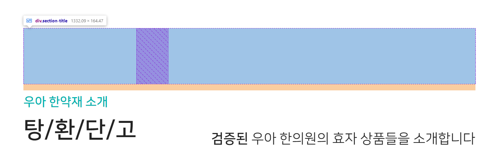

1. carousel이 있는 `.section2-bottom`에도 title을 만들어주기 위해
    - 기존 div.section2-top에 d-flex + justify-content-between를 `부모`로 가지고, 자식 div2개를 순서로 파별했는데
    - `자식`인 2개의 div 안에  `왼div > p(1), p(2)` + `오른div` 조합의 **`새로운 부모 div.section-title`을 추가**해서 모든 section에서 공통으로 사용할 수 있게 한다.

```html

<div class="section7">
    <div class="section-title">
        <div>
            <p>우아 한약재 소개</p>
            <p>탕/환/단/고</p>
        </div>
        <div>
            <strong>검증된</strong> 우아 한의원의 효자 상품들을 소개합니다
        </div>
    </div>
```

2. 부모인 `.section-title`에는 between flex설정 + 기본 mb를 준다.
```css
/* 섹션 title 설정 */
.section-title {
    display: flex;
    justify-content: space-between;
    margin-bottom: 1vw;
}
```

3. 왼쪽 div(1) 속 p(1)과 p(2)의 설정을 해준다.
```css
/* - 섹션 title 왼쪽 div 속 p 2개 설정 */
.section-title > div:nth-of-type(1) p:nth-of-type(1) {
    font-size: 1.9vw;
    line-height: 2.8vw;
    color: var(--color-main);
    font-weight: bold;

    white-space: nowrap; /* 텍스트 한 줄 표시*/
}

.section-title > div:nth-of-type(1) p:nth-of-type(2) {
    font-size: 3.5vw;
    line-height: 4.1vw;
    font-weight: bold;
    color: #222222;
    
    white-space: nowrap; /* 텍스트 한 줄 표시*/
}
```

4. 오른쪽 div(2) 설정을 해준다.
```css
/* - 섹션 title 오른쪽 div 설정 */
.section-title > div:nth-of-type(2)  {
    font-size: 2.1vw;
    line-height: 3.5vw;
    color: #222222;

    margin-left: 6.6vw;
    padding-top: 3.3vw;
}
```


5. **velocity로 이동시키기 위해서, 2개의 div를 `relative` + `top: vw`로 이전 위치를 잡아준다.**
    - `이전 위치`가 확인되면 opacity를 0으로 바꿔줄 준비도 한다.
```css
.section-title > div:nth-of-type(1) {
    position: relative;
    top: 10vw;
    /*opacity: 0;*/
}

.section-title > div:nth-of-type(2) {
    position: relative;
    top: 12vw;
    /*opacity: 0;*/
}
```


- 이전 위치 확인 후 opacity를 0으로 잡아준다
```css
.section-title > div:nth-of-type(1) {
    position: relative;
    top: 10vw;
    opacity: 0;
}

.section-title > div:nth-of-type(2) {
    position: relative;
    top: 12vw;
    opacity: 0;
}
```

6. scrollmagic scene객체를 생성하고, `.현재section-영역 > .section-title > 자식div2개`를 한꺼번에 velocity를 건다
   - triggerEl은 `.현재section-영역`을 `onStart`시 나타나게 한다.
   - velocity의 css옵션을 이전위치를 잡아둔 top을 0px로 opacity를 1로 .3 duration동안 나타나게 해준다.
```js
 // section2 - bottom  title with Velocity
 let scene5 = new ScrollMagic.Scene({
     triggerElement: ".section2-bottom",
     triggerHook: "onStart",
     //duration: "100%", // velocity조합에서는 뺀다.
 });
 scene5.setVelocity([".section2-bottom > .section-title > div"], {
     top: "0px",
     opacity: "1"
 }, {
     duration: "300",
 });
 controller.addScene(scene5);
```
