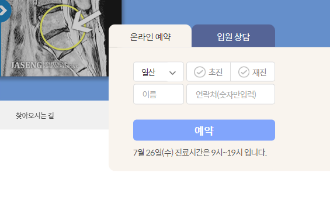
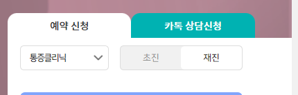

### 모양 잡기




1. .section1를 relative로 만들고, 내부 swiper-container 아래형제로 예약tab `div.booking-service`를 `lg`일때만 보이게, `absolute`로 만든다.
    - swiper의 스크롤바 등이 60% + left 5% -> 총 70%를 먹는다고 치고 `right: 5% + width 20% (총 30%)`로 지정해준다.

```css
/* 예약 */
.section1 {
    position: relative;
}
```

```html

<div class="section1 ">
    <div class="swiper-container">
    </div>
    <!-- 예약 tab -->
    <div class="booking-service d-none d-lg-block">
    </div>
</div>
```

```css
.booking-service {
    position: absolute;
    width: 20%;
    right: 5%;
}
```

2. .section1을 `모바일에서만 h-100vh`로 맞추고, lg일때는 content만큼만 차지하게 두어, `bottom:5%`로 위치를 잡는다

```css
@media screen and (max-width: 991px) {
    .section1 {
        height: 100vh;
    }
}
```

- bottom5%, right5%시작하는 `전체 height`를 `280px`로 변수로 따로 빼서 지정한다.
- 이제 `:before`로 뒤에 깔릴 `content ~ 끝`까지의 높이 = 전체 - tab높이를 `230px`로 잡되 **더 판하게 `tab높이`를 `50px`로 변수로 뺀다**
- 그렇다면 content높이는 `전체높이(280px)` - `tab높이(50px)` = 230px로 계산하게 되어 `:before`를 block으로 잡아준다.
- before는 absolute로 만들고 bottom0으로 잡아준다.

```css
:root {
    /* 예약 tab 탭 */
    --booking-service-height: 280px;
    --booking-service-tab-height: 50px;
}
```

```css
/* 예약 투명색 전체 박스 box 280 */
.booking-service {
    position: absolute;
    width: 20%;
    right: 5%;

    bottom: 5%;
    height: var(--booking-service-height);
    z-index: 9999;

    /* 임시 */
    background: #ddd;
    opacity: .6;
}
```

```css
/* 예약 전체-tab 높이만큼, 뒤에 깔린 배경 */
.booking-service:before {
    content: '';

    position: absolute;
    bottom: 0;
    left: 0; /* 만약, content의 left여백이 있다면 그만큼 주기?! */

    display: block;
    width: 300%; /* block이어도 화면 끝까지 안감. 직접 크게 줘야한다.*/
    height: calc(var(--booking-service-height) - var(--booking-service-tab-height));

    /* 임시 */
    background: red;
}
```


- right와 bottom을 수시로 조정할 수 있게 변수로 빼준다.

```css
:root {
    --booking-service-right: 3%;
    --booking-service-bottom: 5%;
}
```

3. **이제 전체에서 `tab` + `content`를 flex-column으로 나열할 div `booking-service-box`를 만든다.**

```html

<div class="booking-service d-none d-lg-block">
    <div class="booking-service-box">
```

```css
.booking-service-box {
    position: absolute;
    top: 0;
    left: 0;

    display: flex;
    flex-direction: column;

    width: 100%;
    height: var(--booking-service-height);
}
```

4. `ul.tab`과 `div.content`를 나눠서 div를 만든다.

```html    <div class="booking-service d-none d-lg-block">

<div class="booking-service-box">
    <!-- tab (50px)-->
    <ul class="booking-service-tab">
    </ul>
    <!-- content (230px)-->
    <div class="booking-service-content">
```

5. ul태그인 tab은 스타일제거 + 가로나열을 위한 `w-100 + flex ul`로 만들어주고, `m-0,p-0의 h50px`로 고정해준다.

```css
.booking-service-tab {
    list-style: none !important;
    display: flex;
    align-items: center;
    width: 100%;

    margin: 0;
    padding: 0;
    height: var(--booking-service-tab-height);
}
```

- li태그는 아직 없지만, **w-100을 각 영역마다 채울 `flex:1` + 텍스트 가운데정렬을 해준다.**

```css
.booking-service-tab > li {
    flex: 1;
    text-align: center;
}
```

6. content도 w-100에 height는 before처럼 전체높이-tab높이로 계산해준다.
    - 아래쪽에만 radius를 15px로 잡아준다.

```css
.booking-service-content {
    width: 100%;
    height: calc(var(--booking-service-height) - var(--booking-service-tab-height));
    border-radius: 0 0 15px 15px;
    /* 임시 */
    background-color: blue;
}
```


- 전체:before가 radius만든 것을 덮어쓰므로 left 20%정도만 밀어준다.

```css
.booking-service:before {
    /*left: 0;*/ /* content의 border radius를 뒤에서 삐져나와서 약간 이동*/
    left: 20%;
}
```


7. content 높이도 root에서 미리 계산해놓는다.

```css
:root {
    --booking-service-content-height: calc(var(--booking-service-height) - var(--booking-service-tab-height));
}
```

8. **이제 ul.tab에 li들을 정의해놓는다.**
    - `tab용 li`는 `on`을 **첫번쨰 요소에 미리 줘놓고, content가 처리**되게 한다.
    - li안에 `a태그`로 스타일을 결정되게 하고, a태그에는 `href="#추후 구현될 content box id"`를 미리 지정해놓는다.
    - `a태그`의 스타일은 `.tab1` `.tab2`로 일단 처리해놓는다.
    - **즉, `li.on`는 tab-content 전체 처리, `a#content_id.tab`으로 tab스타일**

```html
<!-- tab (50px)-->
<ul class="booking-service-tab">
    <li class="on">
        <a href="#booking-service1" class="tab1">예약 신청</a>
    </li>
    <li>
        <a href="#booking-service2" class="tab2">SNS 상담</a>
    </li>
</ul>
```

9. tab의 li속 a태그는 `기본적으로`, `block`으로 가로나열flex-item의 내부를 꽉 채우고, fz/colo를 정해준다.
    - radius를 위쪽에만 주고, **`lh를 tab높이로`줘서, a태그가 tab높이 전체를 차지하게 한다.**
    - 배경을 줘야 radius가 보이게 되는데 `.on`여부에 달라지도록 해야한다. **일단 임시로 red로 줘서 확인한다.**

```css
.booking-service-tab > li > a {
    display: block; /* a태그를 flex-item 내 가득 채우기 */

    line-height: var(--booking-service-tab-height);
    font-size: 20px;
    color: #fff;

    border-radius: 15px 15px 0 0;

    /* 임시 */
    background: red;
}
```

- 변수로 뺄 건 빼준다.

```css
.booking-service-tab > li > a {
    display: block; /* a태그를 flex-item 내 가득 채우기 */

    line-height: var(--booking-service-tab-height);
    font-size: var(--booking-service-tab-font-size);
    color: #fff;

    border-radius: 15px 15px 0 0;
}
```


10. li>a의 임시배경을 지우고, `.on`여부에 따라 `배경 + 글자색`이 달라지게 작성한다.

- **`.on`일때의 색은 `content 배경` + `:before 여분`과 같아야하므로 변수로 따로 빼야한다.**
- 전체 회색 + 투명도를 제거해준다.

```css
:root {
    /* 예약 tab 탭 */
    --booking-service-width: 20%;

    --booking-service-tab-font-size: 16px;

    --booking-service-color: #ddd;
    --booking-service-opacity: .8;
}
```

```css
.booking-service {
    /* 임시 */
    /*background: #ddd;*/
    /*opacity: .6;*/
    opacity: var(--booking-service-opacity);
}
```

- 사실상의 배경은 전체의 before + content

```css
.booking-service:before {
    background: var(--booking-service-color);
}
```

```css
.booking-service-content {
    background: var(--booking-service-color);
}
```

- **이제 li의 .`on`여부에 따라서 a의 스타일을 바꿔준다.**

```css
/* 예약  tab 글자 - .on일 때 */
.booking-service-tab > li.on > a {
    background-color: var(--booking-service-color);
    color: #333;
}

/* 예약  tab 글자 - .on이 아닐 때 */
.booking-service-tab > li:not(.on) > a {
    background-color: #00b3b2;
    color: #fff;
}
```


### tab 갯수에 따라 content 속 `div#service` 잡기

1. content 내부에` #service1,2 div`를 만든다. 이 때 `좌우 padding을 %`로 주기위해 `.content-box` 클래스를 추가한다.
    - 내부에 h3로 생략되는 `.blind` 태그를 제목으로 준다.
    - 2번째 content는 display:none으로 준다.
    - h3 형제로 form을 감쌀 `빈div`를 만들어준다.

```html
<!-- content (230px)-->
<div class="booking-service-content">
    <div id="booking-service1" class="content-box">
        <h3 class="blind">온라인 예약</h3>
        <div></div>
    </div>
    <!-- content 2 -->
    <div id="booking-service2" class="content-box" style="display: none;">
        <h3 class="blind">SNS 상담</h3>
        <div></div>
    </div>
``` 

- content 전체는 w-100을 css로 + height는 content높이로 준다. 아래쪽만 raidus를 준다.

```css
.booking-service-content {
    width: 100%;
    height: var(--booking-service-content-height);
    border-radius: 0 0 15px 15px;
    background: var(--booking-service-color);
}
```

- 제목은 안보이도록 visible hidden + abosolute+left -5000px w0h0 fz0lh0 으로 아예 안보이게 만든다.

```css
.blind {
    visibility: hidden;
    position: absolute;
    left: -5000px;
    width: 0;
    height: 0;
    font-size: 0;
    line-height: 0;
    overflow: hidden;
}
```

- content-box는 `좌우 padding` 각 `5%`씩 + `상하패딩은 좀 더 작게` 준다.

```css
.booking-service-content .content-box {
    /*display: none;*/
    padding: 2% 5%;
}
```

### content 내부 구성요소 자리잡기

1. 빈div에 `div.bs-form-wrapper` + (`div.bs-validate`>`p.validate` + `button.btn-bs`) + `p.bs-time`으로 4가지 구성을 해준다.

```html

<div id="booking-service1" class="content-box">
    <h3 class="blind">온라인 예약</h3>
    <div>
        <div class="bs-form-wrapper">
        </div>
        <div class="bs-validate">
            <!-- show/hide -->
            <p class="validate"></p>
        </div>
        <button type="button" class="btn-rev">예약</button>
        <p class="bs-time">7월 26일(수) 진료시간은 9시~19시 입니다.</p>
    </div>
</div>
```

2. `div.bs-validate`는 **`height` + `중간요소로서 pt`**를 입력해준다.

```css
.bs-validate {
    height: 35px;
    padding-top: 5px;
    box-sizing: border-box;
}
```

3. **내부 p.validate에는 `임시 예시텍스트`를 넣어주고, color+fz+lh를 지정해준다.이 때, div.bs-validate보다 작게 lh를 지정하고 그것보다 작게 fz를 지정해준다.**

```html

<div class="bs-validate">
    <!-- show/hide -->
    <p class="validate">예시입니다.</p>
</div>
```

```css
/* validate 자리 */
.bs-validate {
    height: 35px;
    padding-top: 5px;
}

.bs-validate .validate {
    color: #fd4d4d;
    line-height: 20px;
    font-size: 13px;
}
```


- **이제 p태그에 padding-left + background `가로0% 세로x%`조합으로 아이콘을 입력한다.**

```css
.bs-validate .validate {
    color: #fd4d4d;
    line-height: 20px;
    font-size: 13px;

    background: url("../images/main_section/ico-i.png") no-repeat 0 2%;
    padding-left: 7%;
}
```


- 이제 임시텍스트를 뺀다. **p태그에 글자가 빠지면 w0이 되어버려서, background icon도 안나오게 된다.**

```html

<div class="bs-validate">
    <!-- show/hide -->
    <p class="validate"></p>
</div>
```

4. 이제 `button.btn-bs`의 스타일을 정해준다.
    - w100% + h + bg조합으로 크기와 색을 정하고, border 0 + radius + cursor:pointer를 넣어준다.
    - 이후 fz설정을 해준다.

```css
/* 예약 버튼 */
.booking-service-box .btn-bs {
    width: 100%;
    height: var(--booking-service-tab-height);
    background: #82a8ff;

    border: 0;
    border-radius: 8px;
    cursor: pointer;

    font-size: var(--booking-service-tab-font-size);
    font-weight: 700;
    color: #fff;
}
```


5. 맨 아래 p태그는, 중간요소로서 `mt`를 넣어주면서 글자크기를 조절해준다.

```css
/* 예약 진료시간 p태그  */
.bs-time {
    font-size: calc(var(--booking-service-tab-font-size) * .8);
    margin-top: 5px;
    letter-spacing: -0.04rem;
}
```


### content form wrapper내부 각 row별 bs-form 작성하기

1. .bs-form-wrapper속에 `flex between`으로 `2개의 input`을 배치할 수 있도록 `div.d-flex.between`을 만든다
    - **2개씩 flex-item을 배치하는 부모 flex+between이 반복되기 때문에`.bs-form`에 css로 정의한다.**
    - **추가로 각 row별로 .bs-form을 구성할 것이므로 mt도 5px씩 준다**

```html

<div class="bs-form-wrapper">
    <div class="bs-form">
    </div>
</div>
```

```css
.booking-service-content .bs-form {
    display: flex;
    justify-content: space-between;

    margin-top: 5px;
}
```

2. 이제 .bs-form안에 flex-item(button-select + radio)을 `width %`로 주는데, 양쪽벌려지는 상태니, **`사이여백은 2개를 100% 안채워서, 벌어지게` 한다.**
    - 이때 **select태그 대신, `div.select-clinic-wrapper` > `button.btn-select` + `div.select-clinic`의 드롭다운 형태를 가져가며**
    - **wrapper `.open`시 자식의 `div`가 보이도록 설정한다.**

```html

<div class="bs-form">
    <!-- 클리닉 선택-->
    <!-- 자식 button click -> 부모 wrapper  .open시 -> 화살표회전 + select-clinic display:block-->
    <div class="select-clinic-wrapper">
        <button type="button" class="btn-select">
            통증 클리닉
        </button>
        <div class="select-clinic">
        </div>
    </div>
</div>
```

3. 드랍다운 button, div를 포함하는 wrapper는 bs-form의 1row에 2개 요소를 배정할 것인데, 40:60정도로 주기 위해 `40%`로 씌워둔다.

```css
.select-clinic-wrapper {
    /*position: relative;*/
    z-index: 13;
    width: 40%;
}
```

4. bs-form의 우측 form요소도 미리 넣어놓고 width %를 정해준다. 여기선 radio버튼을 넣을 것이다.
    - **이 때, `span태그`로 `60%보다 조금 모자란 55%`로 만들어준다.**
    - **between에 의해 알아서 가운데 5%가 차지할 것이다.**

```html

<div class="bs-form-wrapper">
    <div class="bs-form">
        <div class="select-clinic-wrapper open">
        </div>

        <span class="radio-switch">
           
        </span>
    </div>
</div>
```


#### button으로 select 구현

1. button은 wrappr가 40%를 차지하고 있으니, 자식으로 100%를 차지하게 둔다
    - select button으로서 absolute bg icon을 넣기 위해 `relative`로 준다.
    - height는 tab크기로 일괄준다
    - border설정을 주고
    - text는 left로 정렬해주고, padding-left로 간격을 준다.
    - bg를 흰색으로 주고, cursor를 pointer로 준다.

```css
/* 예약 between 1 드랍다운 버튼 */
.select-clinic-wrapper .btn-select {
    /*display: inline-block;*/
    position: relative;
    width: 100%;
    height: var(--booking-service-tab-height);

    border: 1px solid #ddd;
    border-radius: 6px;

    padding-left: 5%;
    text-align: left;
    font-size: calc(var(--booking-service-tab-font-size) * .8);
    color: #333;
    letter-spacing: -0.09rem;

    background: #fff;
    cursor: pointer;
}
```

2. 버튼의 dropdown icon을 `:after` + `top 0 right0`으로 지정한 후, `block` + `w/h`를 지정한 뒤, bg의 위치를 조정한다

- w/h는 높이(tab높이)의 .8을 calc()한다
- bg의 position를 `50% 50%`로 줘서,**가로는 50%시작, 세로도 50% 다써서 중앙에잇는 화살표로 시작하게 한다**

```css
/* 드랍다운 화살표 */
.select-clinic-wrapper .btn-select:after {
    content: '';
    position: absolute;
    top: 0;
    right: 0;

    display: block;
    width: calc(var(--booking-service-tab-height) * .8);
    height: calc(var(--booking-service-tab-height) * .8);
    border-radius: 6px;

    background: url(../images/main_section/sel-arrb.png) no-repeat 50% 50%;
}
```

3. 이제 부모 wrapper가 `.open`을 획득시, :after에 달린 icon bg img를 180도 회전시켜준다.
    - **이 때, 50% 100%의 bg position을 지정해줘야한다**

```css
/* 예약 부모 wrapper .open시 자식button의 :after bg icon는 180도 뒤집어서 */
.select-clinic-wrapper.open .btn-select:after {
    transform: rotate(180deg);
    background-position: 50% 100%;
}
```

- 부모 wrapper를 open시킨 뒤 확인해본다.

```html

<div class="select-clinic-wrapper open">
```


4. **부모 wrapper에 `open`을 열어둔 체로, dropdown ㅕㅇ역인 `div.select-clinic`에 `ul>li>a`태그를 만든다.**
    - 이 때, active `li`를 지정해서 `.active`class로 따로 배정해주고, **`a`태그마다 `clinic_code` class를 배정해준다.**

```html

<div class="select-clinic-wrapper open">
    <button type="button" class="btn-select">
        통증클리닉
    </button>
    <div class="select-clinic">
        <ul>
            <li class="active" value="10001"><a class="clinic_code" href="javascript:;">
                통증 클리닉
            </a></li>
            <li value="10002"><a class="clinic_code" href="javascript:;">
                피부 클리닉
            </a></li>
            <li value="10003"><a class="clinic_code" href="javascript:;">
                미용 클리닉
            </a></li>
            <li value="10004"><a class="clinic_code" href="javascript:;">
                교통사고 클리닉
            </a></li>
            <li value="10004"><a class="clinic_code" href="javascript:;">
                한약 클리닉
            </a></li>
            <li value="10004"><a class="clinic_code" href="javascript:;">
                수험생 클리닉
            </a></li>
            <li value="10004"><a class="clinic_code" href="javascript:;">
                소아 클리닉
            </a></li>
        </ul>
    </div>
</div>
```

5. dropdown에 css처리를 일단 `부모 open`이 없을 때는 `display:none`이어야한다.

```css
/* 예약 select버튼 dropdown 부모 wrapper에 .open시 보이게 됨. */
.select-clinic-wrapper .select-clinic {
    display: none;
}

.select-clinic-wrapper.open .select-clinic {
    display: block;
}
```

- **dropdown은 absolute로 띄우기 위해 `wrapper`를 `relative`로 만들고, `top:탭높이` `right:0`으로 시작하게 한다.**

```css
.select-clinic-wrapper {
    z-index: 13;
    width: 100%;

    position: relative;
}
```

- dropdown은 현재 form요소들의 높이인 tab-height만큼 top에서 내려준다.
- 이 때, width를 직접 지정해줘야한다.

```css
.select-clinic-wrapper .select-clinic {
    position: absolute;
    top: 50px;
    right: 0;

    width: 300px;
    background: #fff;
    border-radius: 6px;
    box-shadow: 0 0 9px rgba(0, 0, 0, 0.14);
    z-index: 999999;
}
```


6. 이제 ul 및 li태그에 css설정을 해준다.
    - ul에는 list-style설정 + overflow:hidden을 해주고, li들이 나열될 padding을 설정해준다.
    - **이 때, li들을 flex로 관리하며, 수직정렬+wrap 설정도 같이해준다.**
    - ul태그의 기본마진을 삭제하고 padding을 5%로줘서 아이템들과 바깥영역 사이 간격을 준다.

```css
.select-clinic ul {
    list-style: none;

    display: flex;
    flex-wrap: wrap;
    align-items: center;

    padding: 5%;
    margin: 0;
}
```

7. li태그들 `w25%` 나열시키며, a태그를 가운데 정렬시키고, **`pb`를 줘서, 위아래 간격을 직접준다.**

```css
.select-clinic li {
    width: 25%;

    text-align: center;

    padding-bottom: 10px;
}
```

8. **최종 a태그에서는 `inline-block`으로 줘서, 글자가 넘어가도 자연스럽게 나타나게 한다. fz 및 w25%를 꽉채우고 있어 내부 padding을 결정한다.**

```css
.select-clinic li a {
    display: inline-block;
    font-size: calc(var(--booking-service-tab-font-size) * .9);
    padding: 2%;
}
```


9. **글자a태그의 `부모인 li태그에 hover`시나 `.active`상태일 때는 `굵기 + bb`를 준다.**

```css
.select-clinic li:hover a,
.select-clinic li.active a {
    font-weight: 700;
    border-bottom: 1px solid #333;
}
```


10. 이제 `.open`을 제거하고 **jquery에서 `.btn-select` 오픈시 부모인 `wrapper`에 `.open` class를 toggle해준다.**

```js
// booking service tab
// 1) clinic btn -> wrapper .open toggle
$('.select-clinic-wrapper .btn-select').on('click', function () {
    $(this).parent().toggleClass('open');
})
```

11. 이제 dropdown 내부 li>a태그의 클래스인 `a.clinic_code`를 클릭하면

- `.btn-select`의 텍스트를, 현재text로 변경하고
- **`hidden된 input태그`를 `name=""`으로 찾아서 ->  클릭된a의 부모 `li에 있는 value=""값을 입력`해준다.**
- 또한, 기존 active들을 전체 삭제 후, 클릭된 a태그의 부모 li에 `.active`를 넣어주게 한다.
- 클릭된 순간, wrapper의 `.open`을 제거해준다.

```html
<!-- dropdown -->
<div class="select-clinic">
    <ul>
        <li class="active" value="10001"><a class="clinic_code" href="javascript:;">
            통증클리닉
        </a></li>
    </ul>
    <!-- 선택된 a태그의 값을 받아주는 hidden input 태그 -->
    <input type="hidden" name="GET_ClinicCode" value="10001">
</div>
```

```js
    // 2) 클리닉 select dropdown ul > li.active > a태그.clinic_code 클릭 -> 5가지 동작
$('.select-clinic-wrapper .clinic_code').on('click', function () {
    console.log("click")
    let currentParent = $(this).parent(); /* li.active[value=] */
    let currentClinicText = $(this).text(); /* a.clinic_code*/
    // 1. 셀렉트 버튼의 텍스트변경
    $('.btn-select').text(currentClinicText);

    // 2. li태그의 value="" -> hidden input으로 입력
    $('input[name=GET_ClinicCode]').val(currentParent.val()); // tab 1 hidden input
    $('input[name=GET_ClinicCode_CS]').val(currentParent.val()); // 2번재 tab도 동일한 값을 받음.

    // 3. 모든 a태그의부모인 li태그에 .active 삭제 후, 현재 li에만 active 추가
    $('.select-clinic-wrapper .clinic_code').parent().removeClass('active');  // 모든 li에 .active 삭제
    currentParent.toggleClass('active');            // 현재 li에만 .active 추가

    // 4. 마지막으로 wrapper의 .open 삭제하여 닫기
    $('.select-clinic-wrapper').removeClass('open');
});
```


12. 부모인 li에 .active추가 -> 나머지는 .active 삭제를 한줄로 만들 수 있다.

```js
currentParent.addClass('active').siblings().removeClass('active');
```

#### radio버튼을 이미지로 구현

1. `span.radio-switch`를 flex를 만들고, 부모에 대한 width % + h를 기입한다.
    - 추가로 배경 + padding, border+border-radius를 준다.
    - **2개의 자식span태그들이 `가로나열을 위해 flex`로 만든다.**

```css
.radio-switch {
    display: flex;
    width: 55%;
    height: var(--booking-service-tab-height);
    background: #f1f1f1;

    padding: 1%;
    border: 1px solid #ddd;
    border-radius: 6px;
}
```


2. 원하는 radio의 갯수만큼 자식 `span.radioCheck`를 추가한 뒤, **내부에는 input + label태그를 각각 준다.**
    - input에는 type="radio" 외에 `id`로 label과 연결을 준비하고
    - label에는 for="id"로 연결한다.
    - **`name=""`은 모두 동일해야한다.**

```html

<div class="bs-form">
    <!-- 클리닉 선택-->
    <div class="select-clinic-wrapper ">
        <button type="button" class="btn-select">
            통증
        </button>
        <div class="select-clinic">
        </div>
    </div>

    <!-- 초진/재진 선택 -->
    <span class="radio-switch">
         <span class="radioCheck">
             <input type="radio"
                    name="GET_FirstYN"
                    id="GET_FirstY"
                    value="Y">
             <label for="GET_FirstY">초진</label>
         </span>
         <span class="radioCheck">
             <input type="radio"
                    name="GET_FirstYN"
                    id="GET_FirstN"
                    value="N">
             <label for="GET_FirstN">재진</label>
         </span>
     </span>
</div>
```


3. 각 span.radioCheck 들이 자기영역만큼 꽉 채우도록 `flex:1`을 설정해주고, `h100%`로 세로도 꽉 차게 만든다.

```css
.radio-switch .radioCheck {
    flex: 1;
    height: 100%;
}
```

4. **input은 숨기고, for로 연결된 label을 디자인**하는 전략으로 간다.

- `input을 숨길`땐, absolute + 투명도0 + h0 p0을 지정해준다.

```css
.radio-switch .radioCheck input {
    position: absolute;
    opacity: 0;
    height: 0;
    padding: 0;
}
```


- label은 안에 텍스트를 `수직 정렬`하기 위해 `flex`로 만든다. input대신 전체를 w100 h100으로 잡아준다.
    - 클릭형태가 되므로 pointer를 넣어준다.
    - checked되기 전 기본형태로서 글자는 회색으로 넣어준다.

```css
.radio-switch .radioCheck label {
    display: flex;
    justify-content: center;
    align-items: center;

    width: 100%;
    height: 100%;

    font-size: calc(var(--booking-service-tab-font-size) * .9);
    color: #888;

    cursor: pointer;
}
```


5. **input:chcked시 label의 변화를 주는 방법은 `input:checked + label`으로 형제 and조건을 주는 것이다.**
    - 진하게 + 글자색 검은색으로 변경해준다.

```css
.radioCheck input:checked + label {
    color: #333;
    font-weight: 700;
}
```

- 추가로 부모의 회색배경에, w100h100이지만, 부모의 배경이 border로서 조금보이게 되는데 **check된 label은 흰색배경 + `부모radius`로 준다.**

```css
.radioCheck input:checked + label {
    color: #333;
    font-weight: 700;

    background: #fff;
    border-radius: 6px;
}
```



6. 이제 label에 no absolute `:before`로 바로 앞에 `bg icon`을 입력해준다.
    - 아이콘의 너비는 높이의 .5만 가지도록 정사각형을 만들고
    - 우측text와의 거리를 me로 벌린다.
    - 이제 배경을 해당공간에 집어넣고, background-size:cover를 넣어서 꽉 채워준다.

```css
.radioCheck label::before {
    content: '';
    width: calc(var(--booking-service-tab-height) * .5);
    height: calc(var(--booking-service-tab-height) * .5);;

    margin-right: 7px;

    background: url("../images/main_section/rev-chk-off.png") no-repeat 50% 50%;
    background-size: cover;
}
```


7. **이제 `input:checked 된상태에서의 형제label`을` 클릭된 label처리로서, 배경을 바꿔준다`**
    - 배경을 바꿀 때, cover도 따로 입력해줘야한다.

```css
.radioCheck input:checked + label::before {
    background: url("../images/main_section/rev-chk-on.png") no-repeat 50% 50%;
    background-size: cover;
}
```


#### 2번째 row만들면서 너비비율 통합하기

1. 이제 form의 추가 row를 `div.bs-form`으로 추가하고, 안에 input태그들을 집어넣는다.
    - 이름과 전화번호에서, `.input-xxx` 클래스이름을 주고, maxlength도 정해준다.

```html

<div class="bs-form-wrapper">
    <!-- row 1 -->
    <div class="bs-form">
        <!-- 클리닉 선택-->
        <div class="select-clinic-wrapper">
        </div>
        <!-- 초진/재진 선택 -->
        <span class="radio-switch">
        </span>
    </div>
    <!-- row 2 -->
    <div class="bs-form">
        <input type="text" class="input-name" name="GET_Name" placeholder="이름" maxlength="10">
        <input type="tel" class="input-tel" name="GET_Tel" placeholder="연락처(숫자만입력)"
               maxlength="11">
    </div>
</div>
</div>
```


2. 윗줄의 bs-form과 width비율을 맞추기 위해 root에 css변수로 뺀다

```css
:root {
    --booking-service-form-row-width-percent-of-left: 38%;
    --booking-service-form-row-width-percent-of-right: 57%;
}
```

```css
.select-clinic-wrapper {
    z-index: 13;
    /*width: 40%;*/
    width: var(--booking-service-form-row-width-percent-of-left);

    position: relative; /* for dropdown 영역 div.select-clicic*/
}
```

```css
.radio-switch {
    display: flex;
    width: var(--booking-service-form-row-width-percent-of-right);
    height: var(--booking-service-tab-height);
}
```

3. 새로운 input들에게도 `.input-xxx`로 찾아서 width를 비율을 각각 적용한다.

```css
.booking-service-content .bs-form .input-name {
    width: var(--booking-service-form-row-width-percent-of-left);
}

.booking-service-content .bs-form .input-tel {
    width: var(--booking-service-form-row-width-percent-of-right);
}
```


4. 이제 일반적인 글자적은 input태그들의 기본 스타일을 정해준다.

```css
.booking-service-content .bs-form input {
    height: var(--booking-service-tab-height);
    border: 1px solid #ddd;
    border-radius: 6px;

    text-align: left;
    padding-left: 5%;

    font-size: calc(var(--booking-service-tab-font-size) * .9);
    font-weight: bold;
    color: #333;
    letter-spacing: -0.09rem;

    /*outline: none;*/
}
```

5. bs-form-wrapper 내부 각 row를 담당하는 `.bs-form`에, **첫번재를 제외한 친구들에게 mt를 더 준다.**

```css
.booking-service-content .bs-form {
    margin-top: 5px;
}

.booking-service-content .bs-form:not(:first-of-type) {
    margin-top: 10px;
}
```


6. **input태그에 `oninput`으로 js함수를 걸어, 하이픈을 자동입력한다.**
    - 참고사이트: https://stickode.tistory.com/495
    - maxlength를 14로 수정해준다.

```html
<!-- row 2 -->
<div class="bs-form">
    <input type="text" class="input-name" name="GET_Name" placeholder="이름" maxlength="10">
    <input type="tel" class="input-tel" name="GET_Tel" placeholder="연락처 (숫자만 입력)"
           oninput="oninputPhone(this)"
           maxlength="14">
</div>
<script>
    function oninputPhone(target) {
        target.value = target.value
                .replace(/[^0-9]/g, '')
                .replace(/(^02.{0}|^01.{1}|[0-9]{3,4})([0-9]{3,4})([0-9]{4})/g, "$1-$2-$3");
    }
</script>
```


#### 전반적인 위치 수정

1. height를 내용물이 꽉찼으면, 맞게 줄여준다.

```css
 --booking-service-height:

260
px

; /* 300px */
```

```css
/* validate 자리 */
.bs-validate {
    height: 30px;
    padding-top: 5px;
}
```

```css
.bs-time {
    font-size: calc(var(--booking-service-tab-font-size) * .9);
}
```


### validate 처리하기

### 메인버튼 클릭시 validate

1. 이제 예약하기 버튼을 누르면, 검증이 시행되도록 `.reserve` 클래스 추가 및 jquery 짜놓기

```html

<button type="button" class="btn-bs reserve">예약 신청하기</button>
```

```js
// 예약 버튼 with valdiate
$('.reserve').on('click', function () {

});
```

#### dropdown 선택 검증 by hidden input

1. clinic의 `기본text를 클리닉선택 `+ `hidden input의  value="10000"` 으로 변경해놓고 **default value면 검증에 걸리도록 jquery**를 만든다.

```html

<div class="select-clinic-wrapper">
    <button type="button" class="btn-select">
        클리닉 선택
    </button>
    <!-- 선택된 a태그의 값을 받아주는 hidden input 태그 with 검증에 걸리는 default value-->
    <div class="select-clinic">
        <input type="hidden" name="GET_ClinicCode" value="10000">
    </div>
</div>
```

```js
// 예약 버튼 with valdiate
$('.reserve').on('click', function () {
    // 클리닉 선택 검증 by hidden input
    if ($('input[name="GET_ClinicCode"]').val() === '10000') {
        $(".validate").text("클리닉을 선택해주세요.");
        return false;
    }
});
```


#### radio checked 검증 by 가려진 input.is(":checked")로 확인

1. radio의 input을 name으로 잡아서, `.is(':checked')`가 false이면 검증탈락이다.

```js
// 2) 초/재진 radio checked 검증
if ($('input[name="GET_FirstYN"]').is(':checked') == false) {
    $(".validate").text("초진, 재진여부를 체크해주세요.");
    return false;
}
```


#### 이름 / 전화번호에 검증

```js
// 3) 이름 검증
if ($('input[name="GET_Name"]').val().length < 2) {
    $(".validate").text("이름을 입력해주세요.");
    return false;
}
// 4) 전화번호 검증 ( 번호최소 9글자 + 하이픈 1~3개)
if ($('input[name="GET_Tel"]').val().length < 10) {
    $(".validate").text("연락처를 입력해주세요.");
    return false;
}
```

### 상담가능시간 select 구현 후, validate 추가

-

참고: https://jin2rang.tistory.com/entry/select-%EA%B2%80%EC%83%89%ED%95%98%EA%B8%B0-Select2-JQuery-Select2-%EC%82%AC%EC%9A%A9%ED%95%98%EA%B8%B0

- **select2가 잘 적용이 안됨. 클릭이 안됨.**


1. 이름 - 연락처의 .bs-form의 맨앞에 `상담가능시간 wrapper > select`를 추가한다.
    - **wrapper는 3개요소의 비율을 가져갈 것이므로 `select는 .w-100`을 줘서 전체를 차지하게 한다.**
    - **placeholder로 작동할 첫번째 옵션에는 `value=""`를 빈값으로 줘서, 검증에 활용할 것이다.**

```html
<!-- row 2 -->
<div class="bs-form">
    <div class="select-consultTime-wrapper">
        <select name="GET_ConsultTime" id="consultTime" class="w-100">
            <option value="">상담 시간 선택</option>
            <option value="09:00~11:00">09:00~11:00</option>
            <option value="11:00~13:00">11:00~13:00</option>
            <option value="13:00~15:00">13:00~15:00</option>
            <option value="15:00~17:00">15:00~17:00</option>
            <option value="17:00~19:00">17:00~19:00</option>
        </select>
    </div>
</div>
<input type="text" class="input-name" name="GET_Name" placeholder="이름" maxlength="10">
<input type="tel" class="input-tel" name="GET_Tel" placeholder="연락처 (숫자만 입력)"
       oninput="oninputPhone(this)"
       maxlength="14">
</div>
```

2. css로 비율을 조절한다.

```css
.booking-service-content .bs-form .select-consultTime-wrapper {
    width: 29%;
}

.booking-service-content .bs-form .input-name {
    /*width: var(--booking-service-form-row-width-percent-of-left);*/
    width: 24%;
}

.booking-service-content .bs-form .input-tel {
    /*width: var(--booking-service-form-row-width-percent-of-right);*/
    width: 43%;
}
```

3. 일단은 wrapper안의 select를 input과 동일한 css를 준다.

```css
.booking-service-content .bs-form input,
.booking-service-content .bs-form select {

}
```


4. validate시, `.val()`의 값이 `==""`이면 선택해야한다고 띄운다.

```js
// 5) 상담시간 검증
if ($('select[name="GET_ConsultTime"]').val() === "") {
    $(".validate").text("상담 시간을 선택해주세요.");
    return false;
}
```


### tab 만들기

1. content-box로 형제를 잡아 index로 처리할 것이므로 `부모 booking-service-contnet`아래, content 1을 복사하여, 아래 형제로 content
   2를 `div.content-box`의 동일한 class로 만든다.
    - id가 겹치는데, js(jquery)에서는 input의 name으로 검증 등에서 구분을 많이 햇으므로, label을 위한 id등은 _1의 `0부터 다음 index 1`로 표기해준다.
    - name의 변경은 input[name=]으로 검증을 많이 하니, 신중해야하니 일단 보류한다.

```html
<!-- content (230px)-->
<div class="booking-service-content">
    <!-- content 1 -->
    <div id="booking-service1" class="content-box">
    </div>
    <!-- content 2 -->
    <div id="booking-service2" class="content-box">
    </div>
```

```html
<input type="radio"
       name="GET_FirstYN"
       id="GET_FirstY_1"
       value="Y">
<label for="GET_FirstY_1">초진</label>
```

2. jquery로 `클릭된 a`의 부모`.parent()`인 `li`로 index를 추출한다. **a는 형제가 없으니 index가 안잡힌다.**
    - **li에 `.on`을 추가해서 tab 디자인을 변경하고, 나머지는 `.on`을 삭제한다.**
    - li에서 `.index()`를 추출한 뒤
    - `content > div`를 `.show()`하고 나머지들은 `.hide()`한다.

```js
// 예약 tab 설정
$(".booking-service-tab > li > a").on('click', function () {
    // 1) a의 index는 무조건 0이다. 형제 없음. -> parent인 li의 index를 파악해야한다.
    let currentTabLi = $(this).parent();
    let currentIndex = currentTabLi.index();
    let currentContentDiv = $(".booking-service-content > div").eq(currentIndex);

    // 2) li에 ".on" 추가, 나머지 삭제
    currentTabLi.addClass("on").siblings().removeClass("on");

    // 3) li의 index로, .eq(index)에 해당하는 content의 div를 show시킨다.
    currentContentDiv.show().siblings().hide();
})
```


3. a태그에서 `href=#id`로 content div를 선택하려고 했었으나, **index로 처리되서 필요없게 된다.**

```html

<ul class="booking-service-tab">
    <li class="on">
        <!--<a href="#booking-service1" class="tab1">예약 신청</a>-->
        <a>예약 신청</a>
    </li>
    <li>
        <a>빠른 상담</a>
    </li>
</ul>
```

```html
<!-- content (230px)-->
<div class="booking-service-content">
    <!-- content 1 -->
    <!--<div id="booking-service1" class="content-box">-->
    <div class="content-box">
```

4. 첫번째 content>div만 남겨두고, 나머지는 `display:none`으로 설정해두면 되는데 **jquery로 `.eq(0)`으로 설정해주자**

```html
<!-- content 2 -->
<div class="content-box" style="display: none;">
```

```js
 // 예약 tab 설정
 // 첫번째 tab을 제외하고 hide
$(".booking-service-content > div").eq(0).show().siblings().hide();

$(".booking-service-tab > li > a").on('click', function () {
    //...
}
```

5. 이제 2번째 form요소들의 name에는 `_index`를 `_1`부터 붙여넣고, `검증할 때 추가` + `초기화시 활용`해야한다.
    - **여러곳에서 사용되므로 `전역 변수 let`으로 `tabIndex`를 모아둬야한다.**

```js
// booking service tab
let tabIndex = 0;
// 첫번째 tab을 제외하고 hide
$(".booking-service-content > div").eq(tabIndex).show().siblings().hide();
```

```js
 $(".booking-service-tab > li > a").on('click', function () {
    // let currentIndex = currentTabLi.index();
    tabIndex = currentTabLi.index();
    // let currentContentDiv = $(".booking-service-content > div").eq(currentIndex);
    let currentContentDiv = $(".booking-service-content > div").eq(tabIndex);
}
```

6. tabIndex가 0일 땐, 그냥 name그대로 쓰고, `0보다 클 때부터는 _tabIndex`를 namePostFix로 사용되는 가변수로 만든다.

```js
// booking service tab
let tabIndex = 0;
let namePostFix = '';
```

```js
$(".booking-service-tab > li > a").on('click', function () {
    // 1) a의 index는 무조건 0이다. 형제 없음. -> parent인 li의 index를 파악해야한다.
    let currentTabLi = $(this).parent();
    // let currentIndex = currentTabLi.index();
    tabIndex = currentTabLi.index();
    namePostFix = tabIndex > 0 ? '_' + tabIndex : '';
```

7. 2번째 탭부터는 name에 `_1`을 붙여주고 검증시에는 `_namePostFix`를 추가해준다.
   - 검증은 `p.validate`를 공동으로 쓰자.
```html
<input type="hidden" name="GET_ClinicCode_1" value="10000">
```

```js
$('input[name=GET_ClinicCode' + namePostFix + ']').val(currentParent.val());
```

```js
if ($('input[name="GET_ClinicCode' + namePostFix + '"]').val() === '10000') {
    $(".validate").text("클리닉을 선택해주세요.");
    return false;
}
```

```html
<input type="radio"
       name="GET_FirstYN_1"
       id="GET_FirstY_1"
       value="Y">
<label for="GET_FirstY_1">초진</label>
```

```js
// 2) 초/재진 radio checked 검증
if ($('input[name="GET_FirstYN' + namePostFix + '"]').is(':checked') == false) {
    $(".validate").text("초진, 재진여부를 체크해주세요.");
    return false;
}
```

```html

<div class="select-consultTime-wrapper">
    <select name="GET_ConsultTime_1" class="w-100">
        <option value="">상담 시간 선택</option>
```

```js
// 5) 상담시간 검증
if ($('select[name="GET_ConsultTime' + namePostFix +'"]').val() === "") {
   $(".validate").text("상담 시간을 선택해주세요.");
   return false;
}
```

```html
<input type="text" class="input-name" name="GET_Name_1" placeholder="이름" maxlength="10">
<input type="tel" class="input-tel" name="GET_Tel_1" placeholder="연락처 (숫자만 입력)"
       oninput="oninputPhone(this)"
       maxlength="14">
```

```js
// 3) 이름 검증
if ($('input[name="GET_Name' + namePostFix + '"]').val().length < 2) {
   $(".validate").text("이름을 입력해주세요.");
   return false;
}
// 4) 전화번호 검증 ( 번호최소 9글자 + 하이픈 1~3개)
if ($('input[name="GET_Tel' + namePostFix + '"]').val().length < 10) {
   $(".validate").text("연락처를 입력해주세요.");
   return false;
}
```


8. 이제 tab을  누를 때마다, form요소들의 value들을 초기화해주자.
   - `클리닉선택`은 `커스텀btn-select`를 기본텍스트로 + `dropdown의 hidden input`은 .val('')로 초기화한다(검증도 ''로 초기화)
   - radio(초진/재진 선택)는 input을 `.prop('checked', false)`로 초기화한다
   - select(상담시간 선택)은 select를 `.prop('selectedIndex', 0)`으로 option 0번째(첫번째)를 선택하게 한다
   - 일반input은 `.val('')`로 값을 비운다
   - 검증은 `.text('')`로 텍스트를 비운다.
```js    
// 예약 tab 설정
$(".booking-service-tab > li > a").on('click', function () {
    // 1) a의 index는 무조건 0이다. 형제 없음. -> parent인 li의 index를 파악해야한다.
    let currentTabLi = $(this).parent();
    // let currentIndex = currentTabLi.index();
    tabIndex = currentTabLi.index();
    namePostFix = tabIndex > 0 ? '_' + tabIndex : '';
    // let currentContentDiv = $(".booking-service-content > div").eq(currentIndex);
    let currentContentDiv = $(".booking-service-content > div").eq(tabIndex);

    // 탭 클릭시 form요소들 초기화
    $('.btn-select').text('클리닉 선택'); // custom select btn의 텍스트 초기화
    $('input[name=GET_ClinicCode' + namePostFix + ']').val(""); // custom select hidden input value 초기화

    $('input[name="GET_FirstYN' + namePostFix + '"]').prop('checked', false); // radio checked 제거

    $('select[name="GET_ConsultTime' + namePostFix + '"]').prop('selectedIndex', 0); // select태그 0번째요소로 초기화

    $('input[name="GET_Name' + namePostFix + '"]').val('');
    $('input[name="GET_Tel' + namePostFix + '"]').val('');

    $('.validate').text(''); // 검증 텍스트 초기화
```

9. 전반적인 크기를 lg이후부터 35% -> xl(1200) 이상 30%-> xxl(1400)이상이면 25%로 유지하도록 수정
```css
:root {
    --booking-service-width: 35%;
    --booking-service-xl-width: 30%;
    --booking-service-xxl-width: 25%;
}
```
```css
@media screen and (min-width: 1200px){
   .booking-service {
      width: var(--booking-service-xl-width);
   }
}
@media screen and (min-width: 1400px){
   .booking-service {
      width: var(--booking-service-xxl-width);
   }
}
```
