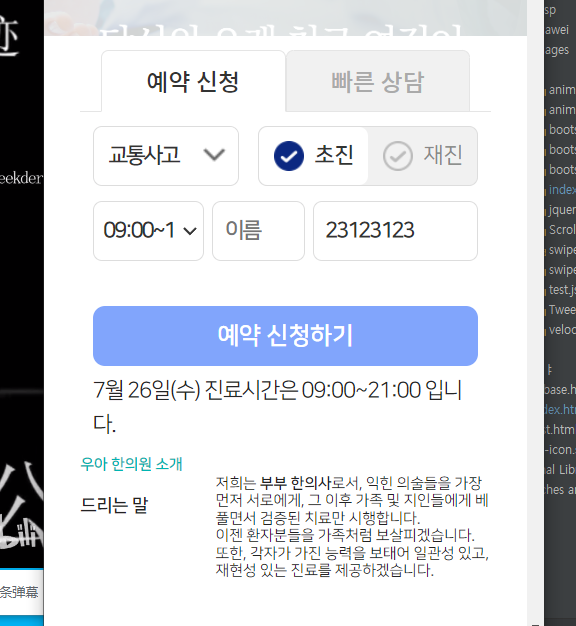

1. section2의 맨 앞에 붙여넣고, d-lg-none으로 모바일에서만 보이게 하기
```html
<!-- 섹션2: main -->
<div class="trigger-section2"></div>
<div class="section2">
    <!-- 예약 tab -->
    <div class="booking-service d-lg-none">
        <div class="booking-service-box">
```


2. `-mobile`의 css 만들기
```css
.booking-service-mobile {
    position: static;
    padding-top:10px; /* 모바일 추가*/
}
```
```css
.booking-service-box-mobile {
    display: flex;
    flex-direction: column;
    width: 100%;
    height: var(--booking-service-height);
}
```

```css
.booking-service-tab-mobile {
    list-style: none !important;
    display: flex;
    align-items: center;
    width: 100%;

    margin: 0;
    padding: 0 5%; /* 모바일은 tab에 패딩 추가*/
    height: var(--booking-service-tab-height);
}
```
```css
.booking-service-tab > li,
.booking-service-tab-mobile > li {
    
}
```

3. tab의 `.on이 없을 때`의 a디자인은 mobile에서 완전히 달라짐 등 tab디자인 설정
```css
.booking-service-tab-mobile > li > a {
    display: block; /* a태그를 flex-item 내 가득 채우기 */

    line-height: var(--booking-service-tab-height);
    font-size: var(--booking-service-tab-font-size);
    color: #333;

    border-radius: 5px 5px 0 0; /* 모바일 radius 약하게*/
    border: 1px solid #e5e5e5; /* 모바일 보더 추가*/

    cursor: pointer;
}
```
```css
.booking-service-tab-mobile > li.on > a {
    background-color: var(--booking-service-color);
    color: #333;
    border-bottom: 1px solid #fff; /* 모바일에서는 bottom border를 넣어서, content의 top을 넢는다*/
}
```
- mobile에서는 tab에 ::before로 border-bottom을 회색선을 넣어주되, before의 원본에는 relative / before에는 absolute를 넣어줘야한다.
```css
.booking-service-tab-mobile {
    position: relative;
}
```
```css
.booking-service-tab-mobile:before {
    content: '';
    display: block;
    width: 100%;

    height: 1px;
    background-color: #e5e5e5;

    position: absolute;
    left: 0;
    bottom: -1px; /* 원본의 border 1px과 겹치게 하기 위해 1px 내림*/
}
```
```css
.booking-service-tab-mobile > li.on > a {
    background-color: var(--booking-service-color);
    color: #333;
    
    border-bottom: 1px solid #fff; /* 모바일에서는 흰색 bottom border를 넣어서, tab의 :before 선을 덮는다*/
    position: relative; /* absolute의 before 선을 덮어쓰려면 relative로 바꿔줘야한다. */
}

.booking-service-tab-mobile > li:not(.on) > a {
    background-color: #f1f1f1;
    color: #aaaaaa;
}
```
```css
/* 예약 버튼 */
.booking-service-box .btn-bs,
.booking-service-box-mobile .btn-bs {
    
}
```


3. content 디자인 설정
    - 동적인 부분은 최대한 바꾸지말고, 디자인부분만 `-mobile`을 달아서 css class를 추가해준다.
4. radio는 id가 똑같은게 생기면 클릭이 안되니 id-label연결 id에 `_M`을 붙여준다
```html
  <input type="radio"
         name="GET_FirstYN"
         id="GET_FirstY_M"
         value="Y">
<label for="GET_FirstY_M">초진</label>
```

5. 예약도 scroll + velocity를 적용해준다.
```css
/* 이전위치 잡아주기 */
.booking-service-mobile {
   /* velocity [이전 위치] 잡기 */
   top: 10vw;
   opacity: 0;
}
```
```js
    // 예약하기
    let scene6 = new ScrollMagic.Scene({
        triggerElement: ".booking-service-mobile",
        triggerHook: "onEnter",
        offset: 50,
    });
    scene6.setVelocity([".booking-service-mobile"], {
        top: "0px",
        opacity: "1"
    }, {
        duration: "300",
    });
    controller.addScene(scene6);
```
