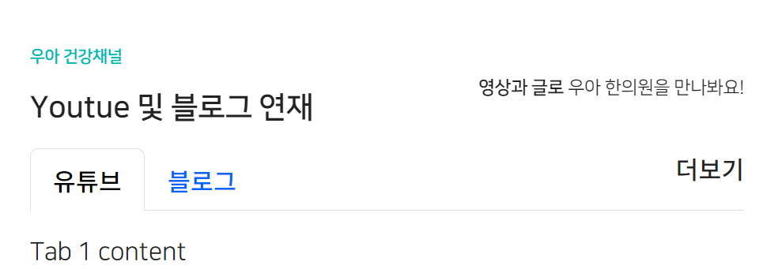
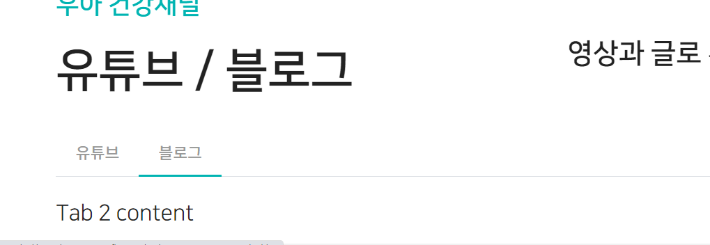
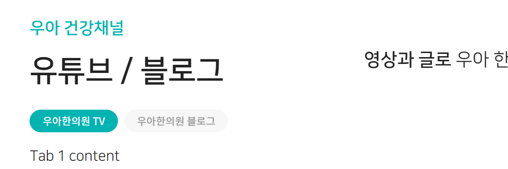
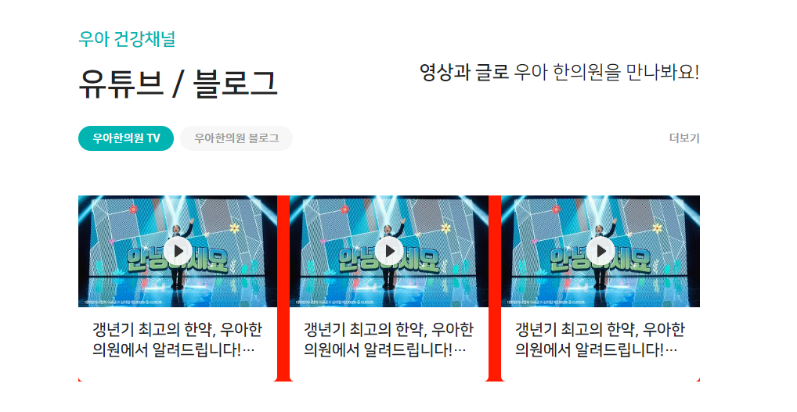
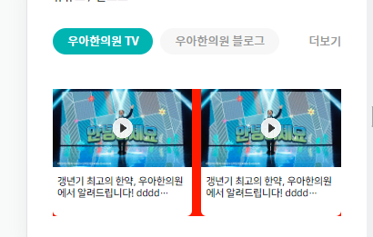
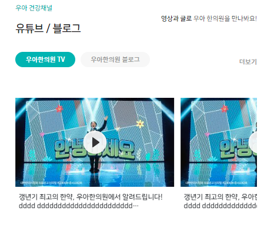
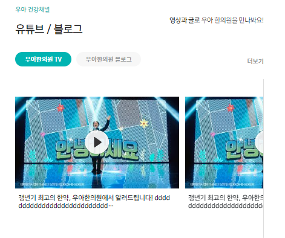
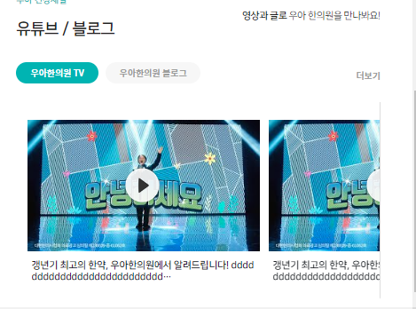
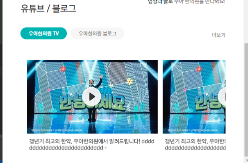
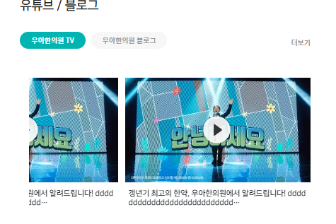

### section 추가 
1. .section3를 만들고, `.section-title`의 정해진 틀을 복붙한다.
```html
<div class="section3">
    <div class="section-title">
        <div>
            <p>우아 건강채널</p>
            <p>Youtue 및 블로그 연재</p>
        </div>
        <div>
            <strong>영상과 글로</strong> 우아 한의원을 만나봐요!
        </div>
    </div>
    <div class="media-box">
        
    </div>
</div>
```

2. 이미 `.section-title`은 opacity 0  밑, 위치가 잡혀있으니, scrollmagic으로 처리되게 한다
- **맨아래 컨텐츠이므로 onCenter가 안보이면 탭도 작동X -> onEnter로 수정해놓고 나중에 수정한다.**
```js
// section3 - title with Velocity
let scene6 = new ScrollMagic.Scene({
    triggerElement: ".section3",
    triggerHook: "onCenter",
});
scene6.setVelocity([".section3 > .section-title > div"], {
    top: "0px",
    opacity: "1"
}, {
    duration: "300",
});
controller.addScene(scene6);
```

3. `.media-box`에는 boostrap으로 tab예제를 붙혀넣는다.
    - https://www.devwares.com/docs/contrast/javascript/navigation/tabs/
    - 위 사이트에서 제일기본 예시를 가져온다.
    - **`ul.nav-tabs` 속 `a.href="#"`과  `div.tab-content` 속 `div.tab-pane[id=""]`를 일치시켜준다.**
```html
<div class="media-box">
    <ul class="nav nav-tabs mb-3" id="media-tabs" role="tablist">
        <li class="nav-item" role="presentation">
            <a class="nav-link active"
               id="ex1-tab-1"
               data-bs-toggle="tab"
               href="#tabs-youtube"
               role="tab"
            >
                유튜브
            </a>
        </li>
        <li class="nav-item" role="presentation">
            <a class="nav-link"
               id="ex1-tab-2"
               data-bs-toggle="tab"
               href="#tabs-blog"
               role="tab"
            >
                블로그
            </a>
        </li>
    </ul>
    <div class="tab-content" id="media-content">
        <div class="tab-pane fade show active"
             id="tabs-youtube"
             role="tabpanel"
        >
            Tab 1 content
        </div>
        <div class="tab-pane fade"
             id="tabs-blog"
             role="tabpanel"
        >
            Tab 2 content
        </div>
    </div>
</div>
```


4. 마지막 tab만 복사해서 추가 한 뒤,
   - li의 role="" 을 삭제, li.nav-item 클래스 삭제, a.nav-link 클래스 삭제를 해주고
   - **ms-auto를 통해 우측으로 더보기 버튼을 붙인다.**
```html
<li class="ms-auto">
    <a class=""
       href="#"
    >
        더보기
    </a>
</li>
```



5. 먼저 tab을 싸고 있는 `div.media-box`부터 css로 조절한다. 상하패딩만 일단 준다.
```css
/* sectino3 media tab */
.section3 .media-box {
    padding: 10px 0;
}
```

6. `ul.nav-tabs > li > a`로 글자크기를 조정해준다.
   - **활성화되기 전 기본 상태를 처리한다고 생각한다.**
   - **`border:none`을 해줘야 둘러싼 border가 active/hover시에 안나타난다.**
```css
.section3 .media-box .nav {
    font-size: 13px;
}

/* 활성화되기 전, tab 글자 */
.section3 .media-box .nav-tabs > li > a {
   font-size: 13px;
   color: #999;

   border: none;
}
```


7. `ul.nav-tabs`의 아래border를 제거해주고, **각 `a태그`에 `rounded-pill` + `bg-gray`를 걸어준다.**
   - 추가로 `me-2`로 간격을 벌려주고, `py-1, px-3`로 padding을 좁혀준다.
```css
/* 탭 기본border 삭제 */
.section3 .media-box .nav-tabs {
    border: none;
}
```
```html
<!--<a class="nav-link active"-->
<a class="nav-link active rounded-pill bg-gray me-2 py-1 px-3"
   id="ex1-tab-1"
   data-bs-toggle="tab"
   href="#tabs-youtube"
   role="tab"
>
```
```css
/* 활성화(a.active) tab 글자 */
.section3 .media-box .nav-tabs > li > a.active {
    /*border-bottom: 2px solid var(--color-main)!important;*/
    background-color: var(--color-main);

    color: #fff;
}
```



### 카드
8. tab content에 병원두러보기 세로 카드를 집어넣는다.
```html
<div class="card border-dark-subtle border-1 rounded-5 h-100">
    
    <div class="card-body  text-start">
        <h5 class=" card-title fw-bold">접수실</h5>
        <p class=" card-text text-truncate" style="color: darkgray">접수와 대기를 하는 공간</p>
    </div>
</div>
```
```html
<div class="card border-0">
```
- card-img-top의 radius를 제거한다
```html
<a href="#" class="position-relative">
    
</a>
```
- relative a태그안에 span.play태그를 만들어놓고, absolute로 만들어서 플레이버튼이 들어가게 한다.
- 이 때, w/h를 20%로 두고. bg-size를 w는 auto, h를 100%로 준다
```html
<a href="#" class="position-relative">
    
    <span class="play"></span>
</a>
```
```css
/* 유튜브 */
span.play {
    position: absolute;
    display: block;
    top: 50%;
    left: 50%;
    transform: translate(-50%,-50%);
    width: 20%;
    height: 20%;
    font-size: 0;
    background: url('../images/main_section/btn-play.png') no-repeat 50% 50%;
    background-size: auto 100%;
}
```


9. 이제 밑에 글자는 2줄로 뜨고, 점점점 처리하기 위해, `글자태그h6.ellipsis-2`을 추가하고
   - w100%를 준 다음
   - height를 lh의 절반을 이용해 2줄이 되게 하고, fz도 같이 정해준다.
   - **display를 `-webkit-box`로 필수로 주고, `-webkit-line-clamp: 2;-webkit-box-orient: vertical;`을 필수로 줘야 2줄 ellipsis가 된다.**
   - `text-overflow: ellipsis;`는 단독으로 안되고 `overflow: hidden;`도 같이 줘야한다.
   - 반응형으로서 부모의 padding조절 및 h/lh/fz를 조절한다.

```html

<div class="card-body  text-start">
    <div class="card-body  text-start">
        <h6 class="card-title fw-bold ellipsis-2">
            갱년기 최고의 한약, 우아한의원에서 알려드립니다! dddd ddddddddddddddddddddddd ddddddddddddddddddddddddd
        </h6>
    </div>
</div>
```
```css
.media-box .ellipsis-2 {
    width: 100%;
    display: -webkit-box;
    -webkit-line-clamp: 2;
    -webkit-box-orient: vertical;

    overflow: hidden;
    text-overflow: ellipsis;

    height: 2.6em;
    line-height: 1.3em;
    font-size: 1em;
}

@media screen and (max-width: 991px){
    .media-box .card-body {
        padding: 10px 0;
    }

    .media-box .ellipsis-2 {
        height: 2.4em;
        line-height: 1.2em;
        font-size: .6em;
    }
}
```

### swiper 달아주기
1. .col <-> .card 사이에 swiper-container / wrapper / slide를 추가한다.
2. container 설정
```css
/* 건강채널 tab content swiper */
.tab-content .tab-pane .swiper-container {
   width: 100%;

   /* 임시 */
   background: red;
}
```
3. container의 부모에 상하 padding 설정 ( pagination 등 놓을 자리 마련?)
```css
/* 건강채널 tab content swiper */
.tab-content .tab-pane {
   padding: 5% 0;
}
```

4. slide를 relative로 만들어서, 내부요소를 absolute로 추가가능하게 만들기
```css
.tab-content .tab-pane .swiper-container .swiper-slide {
    position: relative;
}
```

5. 이제 slide복사해서 여러개 만들어놓기
6. js로 swiper 돌아가게 만들기
   - container를 찝어서 객체로 만든다(7버전 이하)
   - 참고: https://www.swiper.com.cn/api/carousel/198.html
   - 이 때, **3개씩 보이게 하고, 넘어갈 때도 3개씩 넘어가게 만든다. 3개가 빠짝 붙어있으니 간격을 직접 줄 수 있다.**
```js
 /* 건강채널 swiper */
 var section3Swiper = new Swiper('.section3  .swiper-container', {
     slidesPerView: 3,
     slidesPerGroup : 3,
     spaceBetween : '2%',
 });
```

- **breakpoints를 활용해서, 모바일에선 2개씩 보이게 할 수 있다.**
```js
 /* 건강채널 swiper */
 var section3Swiper = new Swiper('.section3  .swiper-container', {
     slidesPerView: 3,
     slidesPerGroup : 3,
     spaceBetween : '2%',
     breakpoints: {

         991: {
             slidesPerView: 2,
             slidesPerGroup: 2,
             spaceBetween: '10%'
         },
     }
 });
```



7. 이제 tab의 글자를 모바일에선 작게 수정해준다.
```css
@media screen and (max-width: 991px){
    .section3 .media-box .nav-tabs > li > a {
        font-size: 9px;
    }
}
```

8. **3개를 2.5, 2개를 1.5씩 보이고 + 넘겨주면, 극적인 효과를 줄 수 있다.**
```js
    var section3Swiper = new Swiper('.section3  .swiper-container', {
        slidesPerView: 2.5,
        slidesPerGroup : 2.5,
        spaceBetween : '2%',
        breakpoints: {

            991: {
                slidesPerView: 1.5,
                slidesPerGroup: 1.5,
                spaceBetween: '10%'
            },
        }
    });
```


9. 1.5, 2.5에 대해 잘린 세로선을 넣어주기 위해 `container바깥에서 상하패딩을 줬던 부모`인 `.tab-pane`에 `:before`로 선을 넣어준다.
   - top0right0에서 1.1px로 width를 주고 cover로 채워준다.
   - 이 떄, swiper-container보다 앞쪽으로 나오도록 `z-index:2;`를 준다.
```css
/* slide 2.5, 1.5 slide에 따라, 상하패딩을 가진 .tab-pane에 before로 [자린 세로선] 주기 */
.section3 .tab-pane:before {
   content: '';
   position: absolute;
   top: 0;
   right: 0;

   display: block;
   width: 1.1px;
   height: 100%;

   background: url("../images/main_section/sd-line.png") no-repeat 0 50%;
   background-size: cover;

   z-index: 2;
}
```



- tab-pane에서는 `px-0`을 줘서 넓힌다.
```html
<div class="tab-pane fade show active position-relative px-0"
```

10. swiper가 끝이면 사라지도록 js에서 처리해주기
   - nextEl관련 문서에서 조건문을 확인한다
   - https://www.swiper.com.cn/api/navigation/304.html

- **:before의 가상요소는 jquery로 .css()를 투입못하여, display none을 동적으로 못한다**
- **그러므로 `요소.hide-before:before`를 새롭게 정의해준 뒤, 해당요소에 `.hide-before`를 add/remove class한다**

```css
.section3 .tab-pane.hide-before:before {
    display: none;
}
```
- **이 때, 1.5개를 1.5씩 넘어갈 때, 4개 중에 2에서 더이상 activeIndex가안넘어가므로, 수식을 if조건절에 추가한다**
```js
    /* 건강채널 swiper */
var section3Swiper = new Swiper('.section3  .swiper-container', {
    on: {
        slideChangeTransitionStart: function () {
            console.log(this.slides.length);
            console.log(this.activeIndex);
            console.log(this.params.slidesPerView);
            if (this.isEnd || this.slides.length - .5 === this.activeIndex + this.params.slidesPerView) {
                $('.section3 .tab-pane').addClass('hide-before');
                // this.navigation.$nextEl.css('display', 'none');
            } else {
                $('.section3 .tab-pane').removeClass('hide-before');
                // this.navigation.$nextEl.css('display', 'block');
            }
        },
    }
});
```




11. **boostrap tab클릭시마다, swiper를 새롭게 초기화해줘야한다.**
    1. .section3안의 tab의 클릭요소인 `a[data-bs-toggle="tab"]`요소에 .on() 이벤트리스너를 다는데
    2. **boostrap5에서 탭이 보일때 작동하는 `shown.bs.tab`를 .on()에 달고, e를 받는다.**
    3. `e.target`으로 걸리는 a태그에서 **tab의 id가 달린 `href` attr**값을 가져온다.
    4. 이제, .section3안의 .tab-pane들을 .find()를 찾은 뒤, **`.index()`의 값으로 `$` + `tabHref == #tab-panel-id` == `targetTab element`가 나오므로 index를 찾아낼 수 있다.**
```js
 $('.section3 a[data-bs-toggle="tab"]').on('shown.bs.tab', function (e) {
     var targetTabHref = $(e.target).attr('href');
     var targetPanel = $(targetTabHref)
     var AllPanels = $('.section3 .tab-content').find('.tab-pane');

     var index = AllPanels.index(targetPanel);
     console.log(index)
 });
```

12. **이제 swiper들도 여러개 찾아 낸 뒤, index를 입력받아 초기화할 수 있게 한다.**
   - 이 때, 사라지게 하는 `.tab-panel:before`도 특정index를 지정해줘야할 것이다.
