### section 하위로서 영역 추가

1. .section2안에 `.section2-middle2`를 만들고, `.section-subtitle`을 새롭게 만들어, 첫번째 p가 없는 새로운 영역을 만든다.
    - .section-title의 구성에서 첫번째 div의 첫번째 p만 사라지고, css설정도 .section-title의 p(2)를 p(1)에 대입해준다.
    - **subtitle만 오른쪽div의 padding-top을 줄이고, `이전위치 + velocity를 적용안한다`**
        - 애니메이션때문에, 스크롤이 내려갈때 계속 작동하는 버그 발생함.

```html
<!-- 치료후기 -->
<div class="section2-middle2 mt-5">
    <div class="section-subtitle">
        <div>
            <p>치료 후기</p>
        </div>
        <div>
            <strong>자필/ 웹/ 네이버후기 등</strong> 다양한 루트의 후기를 살펴봐요!
        </div>
    </div>
    <div class="review-box">
    </div>
</div>
```

```css
/* 섹션 title 설정 */
.section-title,
.section-subtitle {
}

/* - 섹션 title 왼쪽 div 속 p 2개 설정 */
.section-title > div:nth-of-type(1) p:nth-of-type(1) {
}

.section-title > div:nth-of-type(1) p:nth-of-type(2),
.section-subtitle > div:nth-of-type(1) p:nth-of-type(1) {
}

/* - 섹션 title 오른쪽 div 설정 */
.section-title > div:nth-of-type(2),
.section-subtitle > div:nth-of-type(2) {
}

/* - 섹션 subtitle은 오른쪽의 위쪽공간을 조금 줄인다. */
.section-subtitle > div:nth-of-type(2) {
    padding-top: 2vw;
}
```

2. div.review-box에 건강채널처럼 boostrap5 tab예시를 가져온다. 일단 `tab영역`
    - ul #id | 각 tab의 a속 id + href + 텍스트 를 각각 변경해준다

```html

<ul class="nav nav-tabs mb-3" id="review-tabs" role="tablist">
    <li class="nav-item" role="presentation">
        <!--<a class="nav-link active"-->
        <a class="nav-link active rounded-pill bg-gray me-2 py-1 px-3"
           id="review-tab-1"
           data-bs-toggle="tab"
           href="#tabs-review-1"
           role="tab"
        >
            전체
        </a>
    </li>
    <li class="nav-item" role="presentation">
        <a class="nav-link rounded-pill bg-gray me-2 py-1 px-3"
           id="review-tab-2"
           data-bs-toggle="tab"
           href="#tabs-review-2"
           role="tab"
        >
            조재성 원장님
        </a>
    </li>
    <li class="nav-item" role="presentation">
        <a class="nav-link rounded-pill bg-gray me-2 py-1 px-3"
           id="review-tab-3"
           data-bs-toggle="tab"
           href="#tabs-review-3"
           role="tab"
        >
            김석영 원장님
        </a>
    </li>
    <li class="ms-auto">
        <a class=""
           href="#"
        >
            더보기
        </a>
    </li>
</ul>
```

3. content 영역은 div#id | 각각의 div.tab-pane#id (a[href]와 일치)를 변경해준다.
    - div.tab-pane 내부에는 .row>.col만 일단 남겨둔다.
    - **tab-content 2,3번째는 div.tab-pane에 `.show` 와 `.active`가 안들어가게 해준다.**

```html

<div class="tab-content" id="review-content">
    <!-- tab 1 전체 -->
    <div class="tab-pane fade show active position-relative px-0"
         id="tabs-review-1"
         role="tabpanel"
    >
        <div class="row">
            <div class="col ">
                Tab1
            </div>
        </div>
    </div>
    <!-- tab 2 원장1 -->
    <div class="tab-pane fade position-relative px-0"
         id="tabs-review-2"
         role="tabpanel"
    >
        <div class="row">
            <div class="col ">
                Tab2
            </div>
        </div>
    </div>
    <!-- tab 3 원장2 -->
    <div class="tab-pane fade position-relative px-0"
         id="tabs-review-3"
         role="tabpanel"
    >
        <div class="row">
            <div class="col ">
                Tab3
            </div>
        </div>
    </div>
</div>
```

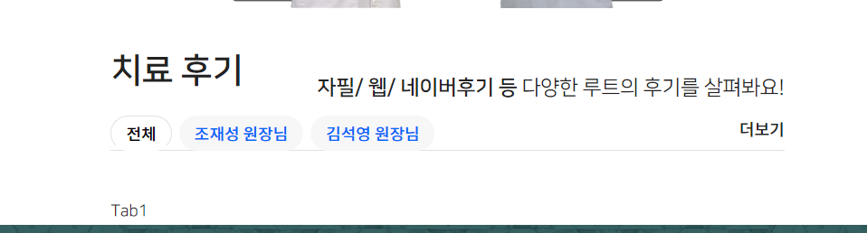

4. 건강채널 tab에 설정된 css를 같이 적용되도록 해준다.

```css
/* sectino3 media tab */
.section3 .media-box,
.section2-middle2 .review-box {
    padding: 10px 0;
}

/* 탭 기본border 삭제 */
.section3 .media-box .nav-tabs,
.section2-middle2 .review-box .nav-tabs {
    border: none;
}

/* 활성화되기 전, tab 글자 */
.section3 .media-box .nav-tabs > li > a,
.section2-middle2 .review-box .nav-tabs > li > a {
    font-size: 13px;
    color: #999;

    border: none;
}

@media screen and (max-width: 991px) {
    .section3 .media-box .nav-tabs > li > a,
    .section2-middle2 .review-box .nav-tabs > li > a {
        font-size: 9px;
    }
}

/* 활성화(a.active) tab 글자 */
.section3 .media-box .nav-tabs > li > a.active,
.section2-middle2 .review-box .nav-tabs > li > a.active {
    /*border-bottom: 2px solid var(--color-main)!important;*/
    background-color: var(--color-main);

    color: #fff;
}
```

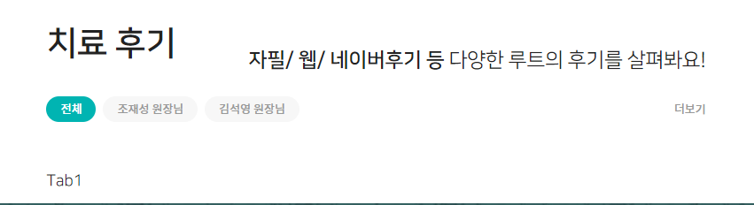

5. 의료진명 tab들은 많아질 수 있으니 **me(마진right) + 더보기존재여부 + '원장님'텍스트 여부는 `-md-`이상부터 나타나게 해준다.**

```html

<li class="nav-item" role="presentation">
    <a class="nav-link rounded-pill bg-gray me-lg-2 py-1 px-3"
       id="review-tab-3"
       data-bs-toggle="tab"
       href="#tabs-review-3"
       role="tab"
    >
        김석영 <span class="d-none d-md-inline-block">원장님</span>
    </a>
</li>
<li class="ms-auto d-none d-md-block">
    <a class=""
       href="#"
    >
        더보기
    </a>
</li>
```

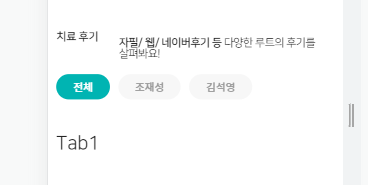

6. content의 첫번째로, card + card-img(img태그) + card-img-overlay를 사용한다
    - w-25, w-75를 줘놓고, 25%는 d-none으로 작은화면에서 안보이게 하고, 75%는 flex-grow-1로 25%가 사라지면 다차도록 만들어준다.
    - 안쪽 `.card-img-overlay`에는 `p-0`을 줘서, img.card-img와 동일한 크기로 준다.

```html
<!-- tab 1 전체 -->
<div class="tab-pane fade show active position-relative px-0"
     id="tabs-review-1"
     role="tabpanel"
>
    <div class="row">
        <div class="col">
            <div class="card border-0 w-100">
                
                <div class="card-img-overlay d-flex flex-row p-0">
                    <div class="w-25 d-none d-lg-block">의료진img</div>
                    <div class="w-75 flex-grow-1 ">후기</div>
                </div>
            </div>
        </div>
    </div>
</div>
```

7. 이제 w-25안에 width를 꽉채우는 `img.img-fluid`를 줘서, height는 `배경그림보다 더 높은 원장이미지`로 넘치게 만든다.

```html

<div class="w-25 d-none d-lg-block">
    
</div>
```

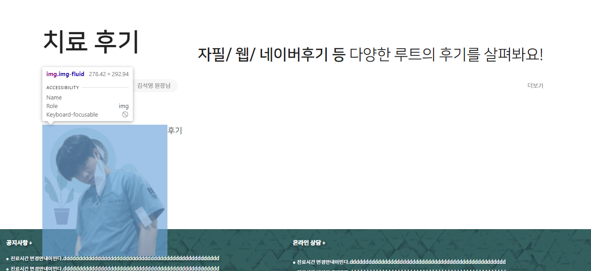

8. 이제 `.w-25`만 mt을 -로 만들어서, 넘친 height에 대한 높이를 맞춘다.
    - **이 떄, 이미지가 약간 내려가게 만들어놓는다.**

```html

<div class="w-25 d-none d-lg-block" style="margin-top: -60px;">
    
</div>
```

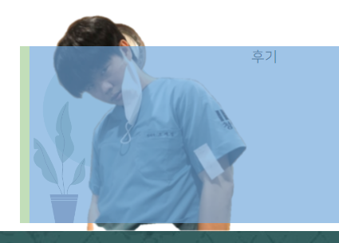

9. 이제 넘치는 부분을 `.w-25`에서 `.overflow-hidden`을 통해 자리게 만든다.

```html

<div class="w-25 d-none d-lg-block overflow-hidden" style="margin-top: -60px;">
    
</div>
```

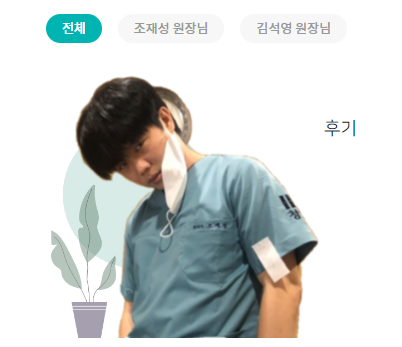

- 이제 위쪽으로 넘치게 될 것이다.
  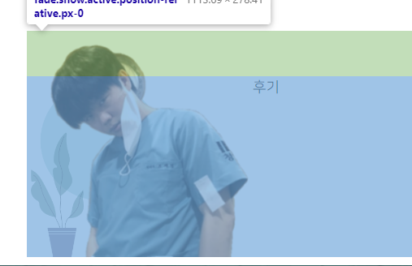

10. 이미지가 위로 넘친 부분보다 약간 더 위로, **25/75의 전체 부모인** `div.card`에 `mt`를 준다.

```html

<div class="card border-0 w-100" style="margin-top: 80px;">
    
    <div class="card-img-overlay d-flex flex-row p-0">
        <div class="w-25 d-none d-lg-block overflow-hidden" style="margin-top: -60px;">
            
        </div>
        <div class="w-75 flex-grow-1 ">후기</div>
    </div>
</div>
```

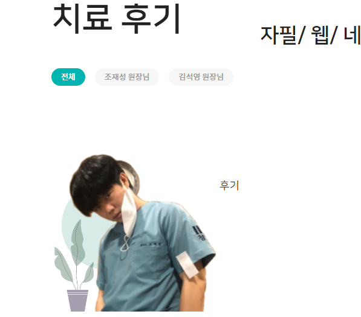

- **하지만 w-25 이미지가 없는 lg전까지 모바일 화면은, card에 mt 80px이 필요없게 되므로 css로 `992이상에서만 mt:80px`지정해줘야한다.**
  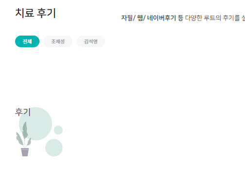

```html

<div class="card border-0 w-100">
```

```css
/* section2-middle2 치료후기 */
@media screen and (min-width: 992px) {
    /* w-25에서 위로 넘치는 img가 나타나는 구간에서 mt 추가 */
    .section2-middle2 .review-box .tab-content .card {
        margin-top: 80px;
    }
}
```

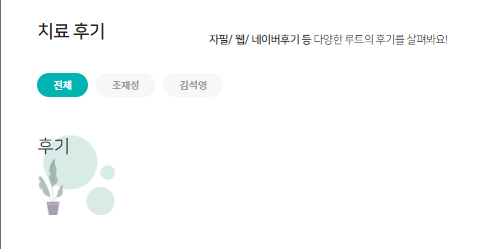
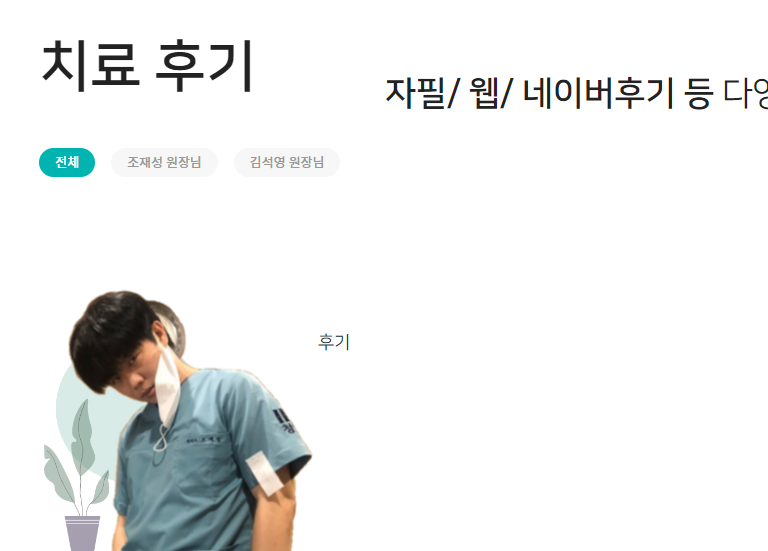

11. div.review-box의 padding을 0으로 만들어서, 밑에 공지사항과 그림을 붙인다(lg에서만 그림 등장 생각)

```html

<div class="review-box p-0">
```

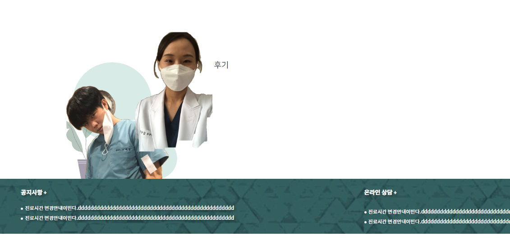

12. 후기란에는 1개의 review를 예전프로젝트 mobile review를 가져온 뒤 swiper를 붙히고, 2개씩 -> 모바일에서 1개씩 나오게 할 것이다.

- 일단 텍스트 그림자 css를 추가한다

```css
/* 글자 그림자 */
/* - 배경 어두울 때 */
.text-shadow {
    text-shadow: 3px 3px 5px rgba(0, 0, 0, 0.5);
}

/* - 하얀바탕일 때 */
.text-shadow-sm {
    text-shadow: .5px .5px 3px rgba(0, 0, 0, 0.3);
}

/* - 배경 밝을 때 */
.text-shadow-lg {
    text-shadow: 1px 1px 1px #000000;
}
```

```css
.text-gray-bolder {
    color: #adadad !important;
    font-weight: bold;
}
```

```html
<!-- 치료후기 -->
<div class="w-75 flex-grow-1 ">
    <!-- 후기1. 좌측정렬 -->
    <div class="d-flex rounded w-100 py-1 ">
        <div class="flex-shrink-0 mx-1">
            
        </div>
        <div class="flex-grow-1 mx-1 text-start text-truncate ">
            <!--클리닉 명-->
            <p class="d-inline-block rounded-pill shadow-sm px-2  bg-submain m-0">
                <a href="#"
                   class="font-gs text-decoration-none fs-13 text-truncate text-white text-shadow-sm ">
                    디스크 클리닉
                </a>
                <span class="fs-13 text-white-50"> | 20대/남성</span>
            </p>

            <!--날짜와 평가점수-->
            <div class="d-flex flex-row justify-content-between fs-13 py-1 px-1">
                <div class="small text-gray-bolder">2023-07-05 | 자필스캔</div>
                <div class="small text-danger ">❤❤❤❤❤</div>
            </div>

            <!--후기 -->
            <p class="w-100 bg-gray rounded small p-2 m-0 text-wrap fs-13 border-1 border-dark">
                친절하시고 좋았습니다^^
                dddddddddddddddddㅋㅋㅋdddddddddddddddddㅋㅋㅋdddddddddddddddddㅋㅋㅋdddddddddddddddddㅋㅋㅋdddddddddddddddddㅋㅋㅋdddddddddddddddddㅋㅋㅋdddddddddddddddddㅋㅋㅋdddddddddddddddddㅋㅋㅋdddddddddddddddddㅋㅋㅋ
                asdfasdfasdfsadf
            </p>
        </div>

    </div>
</div>
```

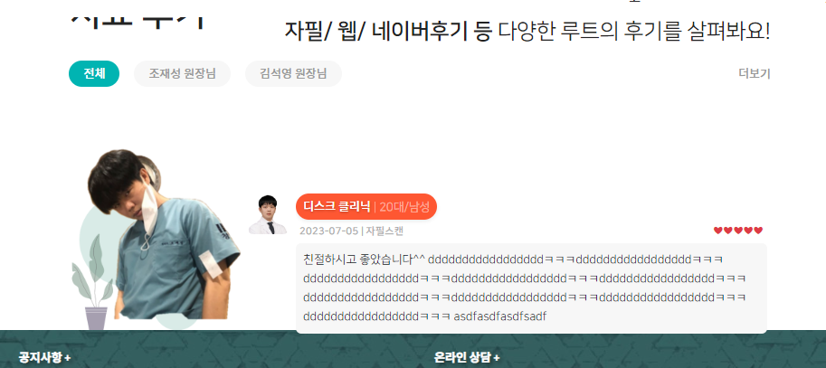

- **문제점**
    1. 글자크기가 모바일에서 작아지도록 -> tab과 엮어서 style.css에 지정해놓고 공용으로 쓰자.
    2. **말풍선을 2줄 제한으로 -> ellipsis-2를 활용하자. 혹은 3줄으로**


13. tab용 전용폰트를 css로 style.css에 정의해놓고 쓴다.

- 기존 스타일

```css
/* 활성화되기 전, tab 글자 */
.section3 .media-box .nav-tabs > li > a,
.section2-middle2 .review-box .nav-tabs > li > a {
    font-size: 13px;
    color: #999;

    border: none;
}

@media screen and (max-width: 991px) {
    .section3 .media-box .nav-tabs > li > a,
    .section2-middle2 .review-box .nav-tabs > li > a {
        font-size: 9px;
    }
}
```

- 새로운 css 정의 후 적용

```css
.fs-tab {
    font-size: 13px;
    letter-spacing: -.05rem;
}

@media screen and (max-width: 991px) {
    .fs-tab {
        font-size: 9px;
        letter-spacing: -.05rem;
    }
}
```

```css
/* 활성화되기 전, tab 글자 */
.section3 .media-box .nav-tabs > li > a,
.section2-middle2 .review-box .nav-tabs > li > a {
    /*font-size: 13px;*/
    color: #999;

    border: none;
}

/*@media screen and (max-width: 991px) {*/
/*    .section3 .media-box .nav-tabs > li > a,*/
/*    .section2-middle2 .review-box .nav-tabs > li > a {*/
/*        font-size: 9px;*/
/*    }*/
/*}*/
```

```html

<div class="media-box">
    <ul class="nav nav-tabs mb-3" id="media-tabs" role="tablist">
        <li class="nav-item" role="presentation">
            <!--<a class="nav-link active"-->
            <a class="nav-link active rounded-pill bg-gray me-2 py-1 px-3 fs-tab"
               id="ex1-tab-1"
               data-bs-toggle="tab"
               href="#tabs-youtube"
               role="tab"
            >
                우아 TV
            </a>
        </li>

        <li class="ms-auto">
            <a class="fs-tab"
               href="#"
            >
                더보기
            </a>
        </li>
```

```html

<div class="review-box p-0">
    <ul class="nav nav-tabs mb-3 gap-2" id="review-tabs" role="tablist">
        <li class="nav-item" role="presentation">
            <!--<a class="nav-link active"-->
            <a class="nav-link active rounded-pill bg-gray me-lg-2 py-1 px-3 fs-tab"
```

```html
    <!--클리닉 명-->
<p class="d-inline-block rounded-pill shadow-sm px-2  bg-submain m-0">
    <a href="#"
       class="font-gs text-decoration-none fs-tab text-truncate text-white text-shadow-sm ">
        디스크 클리닉
    </a>
    <span class="fs-tab text-white-50"> | 20대/남성</span>
</p>

<!--날짜와 평가점수-->
<div class="d-flex flex-row justify-content-between fs-tab py-1 px-1">
    <div class="small text-gray-bolder">2023-07-05 | 자필스캔</div>
    <div class="small text-danger ">❤❤❤❤❤</div>
</div>

<!--후기 -->
<p class="w-100 bg-gray rounded small p-2 m-0 text-wrap fs-13 border-1 border-dark fs-tab">
    친절하시고 좋았습니다^^
    dddddddddddddddddㅋㅋㅋdddddddddddddddddㅋㅋㅋdddddddddddddddddㅋㅋㅋdddddddddddddddddㅋㅋㅋdddddddddddddddddㅋㅋㅋdddddddddddddddddㅋㅋㅋdddddddddddddddddㅋㅋㅋdddddddddddddddddㅋㅋㅋdddddddddddddddddㅋㅋㅋ
    asdfasdfasdfsadf
</p>
```

14. 글자를 줄여도 `.card-img-overlay`는 absolute로서 넘어버린다.
    - review-bg.png를 활용하도록 이미지를 변경해주고
    - **lg에서는 공지사항에 딱 붙는 상태로 두고, 2~3줄로 줄이기 전에 `div.tab-content`에 `모바일시 mb-5`를 줘서 간격을 벌려주자.**

```html

<div class="tab-content mb-5 mb-lg-0" id="review-content">
    <!-- tab 1 전체 -->
    <div class="tab-pane fade show active position-relative px-0"
```

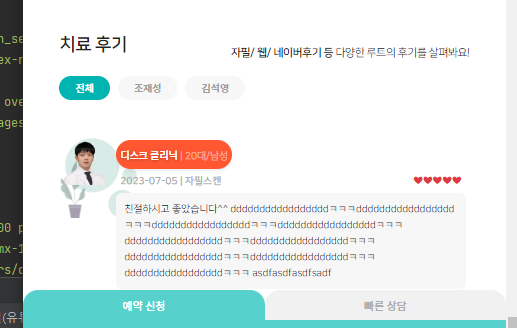

15. 이제 p태그에 3줄 줄임을 적용한다.
    - **일단 `padding을 모바일1, lg2`로 만들어놓는다.**

```html
<p class="w-100 bg-gray rounded small p-1 p-lg-2 m-0 text-wrap fs-13 border-1 border-dark fs-tab ellipsis-3">
```

- 이후 style.css에 `.ellipsis-3`를 반응형으로 맞춰서 정의해준다.

```css
/* 글자간격 */
/* - padding 2 p태그 기준 */
.ellipsis-3 {
    width: 100%;
    display: -webkit-box;
    -webkit-line-clamp: 3;
    -webkit-box-orient: vertical;

    overflow: hidden;
    text-overflow: ellipsis;

    height: 4.52em;
    line-height: 1.25em;
}

/* - padding 1 p태그 기준 */
@media screen and (max-width: 991px) {
    .ellipsis-3 {
        height: 4.65em;
        line-height: 1.35em;
    }
}
```


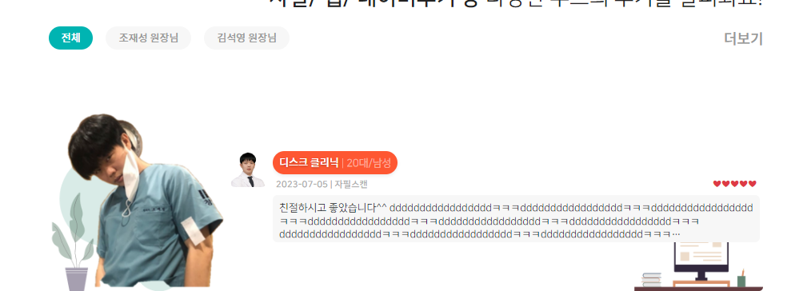

14. 디스크클리닉 부분만 rounded-pill / 20대/남성에 `ms-1`

```html
<!--클리닉 명-->
<!--<p class="d-inline-block rounded-pill shadow-sm px-1 px-lg-2  bg-submain m-0">-->
<p class="d-inline-block m-0">
    <a href="#"
       class="text-decoration-none fs-tab text-truncate text-white text-shadow-sm rounded-pill shadow-sm px-1 px-lg-2 bg-submain">
        디스크 클리닉
    </a>
    <span class="fs-tab ms-1 fw-bold">20대/남성</span>
</p>
```

15. 후기의 `.ellipsis-4`를 적용하기 위해 css + fz까지 포함하여 정의하고, 배경을 좀 더 어둡게 만든다.

```css
.bg-gray-120 {
    background: #eeeeee;
}
```

```css
/* - padding 2 p태그 기준 */
.ellipsis-4 {
    width: 100%;
    display: -webkit-box;
    -webkit-line-clamp: 4;
    -webkit-box-orient: vertical;

    overflow: hidden;
    text-overflow: ellipsis;

    font-size: 13px;
    height: 5.8em;
    line-height: 1.26em;
}

/* - padding 1 p태그 기준 */
@media screen and (max-width: 991px) {
    .ellipsis-4 {
        font-size: 9px;
        height: 5.5em;
        line-height: 1.25em;
    }
}
```

```html
<!--후기 -->
<p class="w-100 bg-gray-120 rounded small p-1 p-lg-2 m-0 text-wrap ellipsis-4 fw-bold">
    친절하시고 좋았습니다^^
    dddddddddddddddddㅋㅋㅋdddddddddddddddddㅋㅋㅋdddddddddddddddddㅋㅋㅋdddddddddddddddddㅋㅋㅋdddddddddddddddddㅋㅋㅋdddddddddddddddddㅋㅋㅋdddddddddddddddddㅋㅋㅋdddddddddddddddddㅋㅋㅋdddddddddddddddddㅋㅋㅋ
    asdfasdfasdfsadf
    asdfasdf
    asdfasdfasdfasdfasdfasdfasdf dadf asdfasdfasdfsadf
    asdfasdf
    asdfasdfasdfasdfasdfasdfasdf dadf asdfasdfasdfsadf
    asdfasdf
    asdfasdfasdfasdfasdfasdfasdf dadf asdfasdfasdfsadf
    asdfasdf
    asdfasdfasdfasdfasdfasdfasdf dadf asdfasdfasdfsadf
    asdfasdf
    asdfasdfasdfasdfasdfasdfasdf dadf asdfasdfasdfsadf
    asdfasdf
    asdfasdfasdfasdfasdfasdfasdf dadf
</p>
```

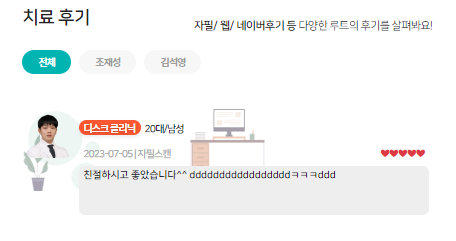

16. **치료후기부분이 항상 4줄을 유지하고 있으니 `height`를 `max-height`로 수정한다.**

```css
/* - padding 2 p태그 기준 */
.ellipsis-4 {
    width: 100%;
    display: -webkit-box;
    -webkit-line-clamp: 4;
    -webkit-box-orient: vertical;

    overflow: hidden;
    text-overflow: ellipsis;

    font-size: 13px;
    max-height: 5.8em;
    line-height: 1.26em;
}

/* - padding 1 p태그 기준 */
@media screen and (max-width: 991px) {
    .ellipsis-4 {
        font-size: 9px;
        max-height: 5.5em;
        line-height: 1.25em;
    }
}
```

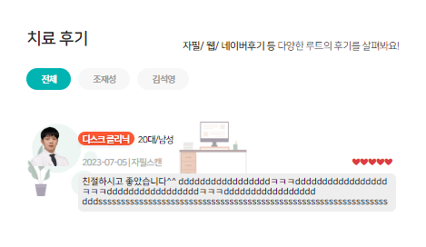

### swiper 적용하기

1. div.tab-content 아래 tab내부에서도 `.card-img-overlay`안에서 lg의료진이미지(.w-25)가 아닌 `.w-75` <-> 후기시작부분 사이에
   swiper-container/wrapper/slide를 넣어준다.

```html

<div class="tab-content mb-5 mb-lg-0" id="review-content">
    <!-- tab 1 전체 -->
    <div class="tab-pane fade show active position-relative px-0"
         id="tabs-review-1"
         role="tabpanel"
    >
        <!-- tab 1 내용 -->
        <div class="row ">
            <div class="col">
                <div class="card border-0 w-100">
                    
                    <div class="card-img-overlay d-flex flex-row p-0">

                        <!-- 치료후기 공간 -->
                        <div class="w-75 flex-grow-1 ">
                            <div class="swiper-container ">
                                <div class="swiper-wrapper">
                                    <div class="swiper-slide">
                                        <!-- 후기1 -->
                                        <div class="d-flex rounded w-100 py-1 ">
```

2. tab안의 container/slide css 설정은 건강채널시 했었다.

```css
/* 건강채널 + 치료후기 tab content swiper */
.tab-content .tab-pane {
    padding: 5% 0 0 3%;
}

.tab-content .tab-pane .swiper-container {
    width: 100%;

    /* 임시 */
    /*background: red;*/
}

.tab-content .tab-pane .swiper-container .swiper-slide {
    position: relative;
}
```

3. tab의 index에 따른 swiper 객체 초기화 로직을 가져온다.

- 특정section > tab에서의 `tabIndex`에 따른 swiper 초기화 함수를 작성하고 **`index 0`값을 넣어 초기화 한다.**
    - **작은화면에서는 1개, 큰화면부터 2개씩 보이게 할 것이다.**

```js
// sec2-mid2 치료후기 swiper
function initReviewSwiper(tabIndex) {

    new Swiper($('.section2-middle2').find('.swiper-container').eq(tabIndex), {
        slidesPerView: 2,
        slidesPerGroup: 2,
        spaceBetween: '3%',
        breakpoints: {
            991: {
                slidesPerView: 1,
                slidesPerGroup: 1,
                spaceBetween: '5%'
            },
        },
    });
}

initReviewSwiper(0);
```

4. 이제 후기들이 swiper를 탈 수 있게 `slide`를 3까지 정도 복사한다.
   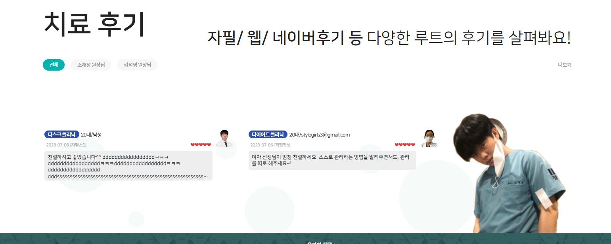
   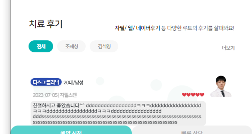

- 4줄 제한으로 늘리고 나니 **mb-5 mb-lg-0**에서 mb-5로는 조금 모자란다.
- **아래의 예약서비스의 pt-4를 pt-5로 늘려서, 스크롤매직과 관계없이 처리되게 한다.(mb-5를 직접 늘려줘도 버그남)**

```html

<div class="booking-service-mobile pt-5 d-lg-none ">
```

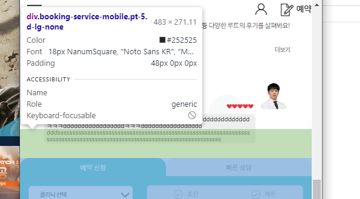

5. 이제 pagination을 설정해준다.
    - container 내부에 wrapper와 형제로 `-pagination`을 추가해준다.

```html
<!-- 치료후기 공간 -->
<div class="w-75 flex-grow-1 ">
    <div class="swiper-container ">
        <!-- 페이지네이션 -->
        <div class="swiper-pagination"></div>
        <!-- 슬라이드 wrapper -->
        <div class="swiper-wrapper">
```

- **pagination의 부모인 `해당섹션의 conatiner`만 relative설정 해준다.**

```css
/* 치료후기 swiper 설정 */
.section2-middle2 .swiper-container {
    position: relative;
}
```

- **js에서 pagination html element설정을 해준다.**

```js
new Swiper($('.section2-middle2').find('.swiper-container').eq(tabIndex), {
    slidesPerView: 2,
    slidesPerGroup: 2,
    spaceBetween: '3%',
    breakpoints: {
        991: {
            slidesPerView: 1,
            slidesPerGroup: 1,
            spaceBetween: '5%'
        },
    },
    pagination: {
        el: '.section2-middle2  .swiper-pagination',
        clickable: true,
    },
});
```

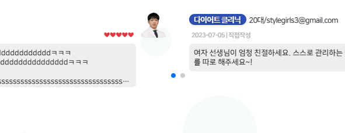

6. pagination이 container 내부에 있을 경우, top으로 위치를 조절하면 잘려서 안보인다.
    - **`container밖으로 pagination을 빼고` + `absolute를 취소`해야 container와 같이 자리를 잡는다.**
```html
<!-- 치료후기 공간 -->
<div class="w-75 flex-grow-1 ">
    <!-- 페이지네이션 -->
    <div class="swiper-pagination"></div>
    <div class="swiper-container ">
```
```css
.section2-middle2 .swiper-pagination{
    position: relative;
}
```


7. css로 `.card에 준 lg-mt공간(60px)`에 `top-`으로 자리를 잡는다.
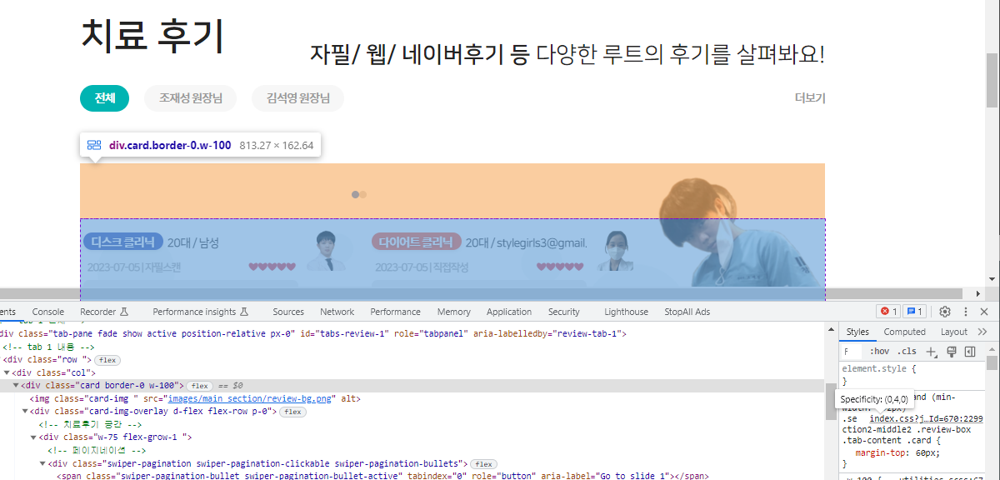
```css
.section2-middle2 .swiper-pagination{
    position: relative; /* container밖으로 뺌 */

    width: 100%;
    top: -60px;
    bottom: auto;

    display: flex;
    align-items: center;
    justify-content: center;
    /*border-radius: 0px;*/
}
```
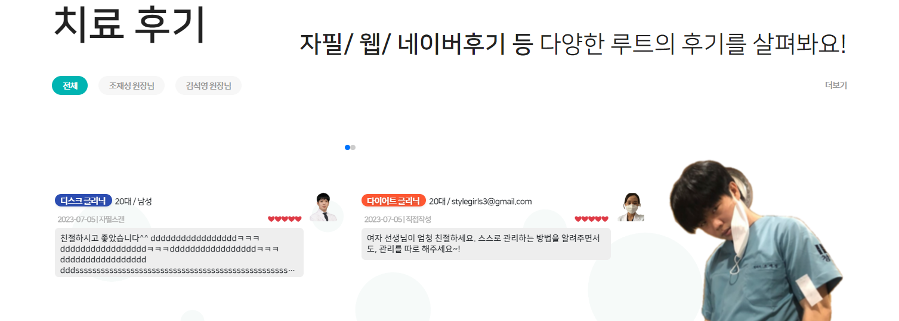
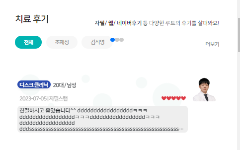
- 모바일에선 적용안되는 mt이므로, top-도 모바일에선 -60을 -10px정도로 줄여준다
```css
@media screen and (max-width: 991px) {
    .section2-middle2 .swiper-pagination {
        top: -10px;
    }
}
```
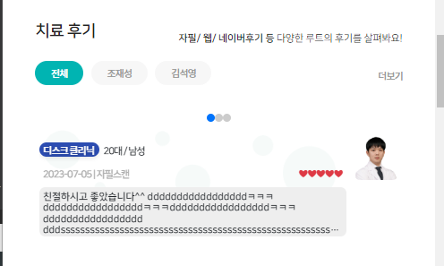


8. 이제 pagniation Bullet을 글자로 render한다.
   - index인자는 0부터 오니 +1로 시작하게 하고
   - tab을 글자크기와 동일하도록 `.fs-tab`을 span태그에 적용해준다.

```js
pagination: {
    el: '.section2-middle2  .swiper-pagination',
    clickable: true,
    renderBullet: function (index, className) {
        return '<span class="' + className + ' fs-tab">' + (index + 1) + '</span>';
    },
},
```
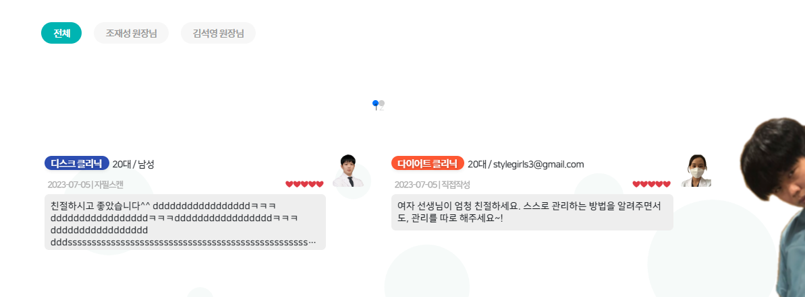

9. **bullet element에 대한 `적용 css`를 현재 .swiper-pagination `하위의 적용된 css이름`를 직접 지정**할 수 있다.
- js로 css클래스명을 지정해놓으면, css에서는 `.swiper-pagination` 하위의 css를 직접 정의해주면 된다.
```js
pagination: {
        el: '.section2-middle2  .swiper-pagination',
        bulletClass: 'review-bullet',// 적용될 bullet css class명 지정하기
        bulletActiveClass: 'review-bullet-active',
        clickable: true,
        renderBullet: function (index, className) {
            return '<span class="' + className + ' fs-tab">' + (index + 1) + '</span>';
        },
    },
```
10. **이제 `bullet css`로 pagination 동그라미를 `bg:none!important`로 제거하고, 글자스타일을 정한다.**
    - container바깥에 존재하는 pagitino경로 및 직접 지정해준 하위 bullet css 경로 설정시 조심한다.
```css
/* 지정 bullet css [active전 글자] */
.section2-middle2 .swiper-pagination .review-bullet {
/*    !*flex: 1;*!*/
    width: auto; /* content크기만큼 차지하도록*/
    height: auto;

    flex-wrap: wrap; /* 글자가 세로로 나열안되도록*/
    text-align: center;

    margin: 0 5px; /* 좌우 간격 */
    
    background: none!important; /* 동그라미 삭제 */

    color: #999!important; /* active전 글자색 */
    font-weight: bold;
    /*text-shadow: 1px 1px 2px #757575;*/
}

```
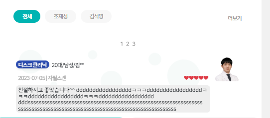


11. active bullet 도 직접 지정해준대로 경로를 설정해서 설정한다.
```css
/* 치료후기 지정 bullet css [active 글자] */
.section2-middle2 .swiper-pagination .review-bullet-active {
    color: var(--color-main)!important; /* active전 글자색 */
    transform: scale(1.3);
}
```
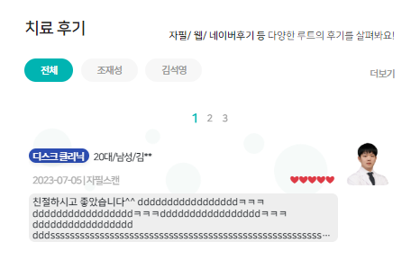


12. pagination을 아래쪽으로 두기
- html을 container아래로 pagination을 이동시키고
```html
<!-- 치료후기 공간 -->
<div class="w-75 flex-grow-1 ">
    <div class="swiper-container ">
    </div>
    <!-- 페이지네이션 -->
    <div class="swiper-pagination"></div>
</div>
```
- relative의 위치를 top이 아닌 bottom에서 -로 준다.
```css
.section2-middle2 .swiper-pagination {
    top:auto;
    bottom: -30px;
}

@media screen and (max-width: 991px) {
    /* 모바일에선 사라지는 mt위족공간 -60px -> top - 도 그만큼 줄임*/
    .section2-middle2 .swiper-pagination {
        /*top: -10px;*/
        bottom: -10px;
    }
}
```
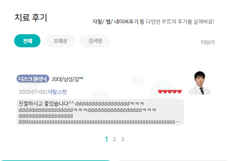


13. tab에서 준 mb-3 등의 여백을 삭제하고, lg부터 밑에 공지사항과 붙기위해 여백이 사라진 경우를 어떻게 처리할지 고민해본다.
- 탭에서 아래로 벌린 mb-3  ->  mb-2로 줄임(삭제하면, 너무 붙음)
```html
<div class="review-box p-0">
    <!--<ul class="nav nav-tabs mb-3 gap-1 column-gap-2" id="review-tabs" role="tablist">-->
    <ul class="nav nav-tabs gap-1 column-gap-2" id="review-tabs" role="tablist">
```
- w-75부분을 lg(992) ~ xxl(1400)까지는 전체적으로 올려버린다?
```css
/* lg ~ xxl까지 공자사항에 붙는 구간에서 pagination이 들어잇는 w-75부분을 약간 올린다. */
@media screen and (min-width: 992px) and (max-width: 1440px) {
    .section2-middle2 .tab-content .w-75 {
        position: relative;
        top: -50px!important;
    }
}
```
14. 위쪽에 pagination을배치할려고 만들어둔 `.tab-pane`들의 `padding`의 top을 5% -> 3%로 수정한다

```css
.tab-content .tab-pane {
    /* pagination 위쪽배치를 위한 패딩 5% -> 이동 후 3% */
    padding: 3% 0 0 0;
}
```
- lg에서는 아래쪽 패딩을 넣으면 공지사항과 떨어져버리니 모바일로 준다.
```css
@media screen and (max-width: 991px){
    .tab-content .tab-pane {
        padding-bottom: 5%;
    }
}
```


15. 치료후기가 담긴 w-75 존에 가로 패딩을 넣어주고, **prev, next 버튼을 넣어보자.**
```css
.section2-middle2 .tab-content .w-75 {
    padding: 0 5%;
}
```
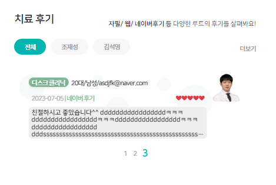


### swiper에 next/prev 넣기
- https://www.swiper.com.cn/api/navigation/355.html
1. container바깥으로 화살표를 내기 위해 `container 외부`에 `div.swiper-button-prev`와 `-next`를 div로 넣으면 기본 화살표가 나온다.
    - 작동은 하지 않는다.
```html
<!-- 치료후기 공간 -->
<div class="w-75 flex-grow-1">
    <div class="swiper-container ">
    </div>
    <!-- relative로 만들어서 밖으로 뺀 페이지네이션 -->
    <div class="swiper-pagination"></div>
    <!-- 탐색 버튼 -->
    <div class="swiper-button-prev"></div>
    <div class="swiper-button-next"></div>
</div>
```

2. 이 때, 부모인 div.w-75를 relateive로 설정해서 `기본 absolute`성질을 유지하게 한다.
```html
<div class="w-75 flex-grow-1 position-relative">
```

3. js에서 navigation 옵션으로 각 버튼의 el들을 직접 지정해준다.
    - 이 때, 버튼이 등장하면서 grab하는 cursor가 사라지는데 옵션으로 넣어주면 같이 된다.
```js
grabCursor: true,
navigation : {
    nextEl: '.section2-middle2 .swiper-button-next',
    prevEl: '.section2-middle2 .swiper-button-prev',
},
```
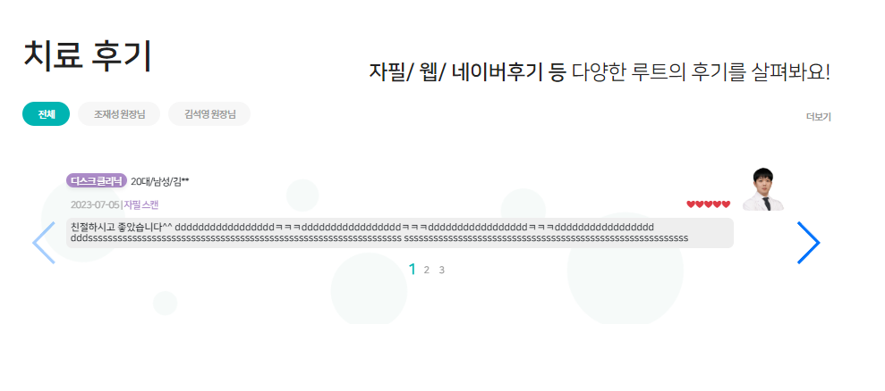

4. `기본화살표의 위치`를 지정해야한다.
    - 위치 참고: https://codepen.io/aaronkahlhamer/pen/oeVQxQ
    - 각 css class를 선택하고, **`top 0`으로 시작한 뒤, `부모의 높이를 100%`로 차지하면, 자동으로 부모의 가운데 놓이게 된다.**
    - **left, right를 -로 바깥으로 점 더 벌린다.**
    - 위치를 조정하기 위해 mt를 좀 더 준다.
    - 화살표의 가로폭을 줄이기 위해 scaleX()를 이용한다.
```css
/* 치료후기 화살표 */
.section2-middle2 .swiper-button-prev {
    top: 0;
    height: 100%;
    
    left: -7%;

    margin-top: 4%;
    transform: scaleX(.7);
}
.section2-middle2 .swiper-button-next {
    top: 0;
    height: 100%;
    
    right: -7%;

    margin-top: 4%;
    transform: scaleX(.7);
}
```

5. 화살표의 모양은, 일단 bg로 정해진 이미지를 사용하는데
    - swiper css의 옵션으로 `white, black`이 주어지며, **black을 투명도 0.05로 사용해서 회색처럼 만들어 사용할 것이다.**
```css
/* 투명도 */
.opacity-5 {
    opacity: 0.05 !important;
}
```
```html
<!-- 탐색 버튼 -->
<div class="swiper-button-prev swiper-button-black opacity-5"></div>
<div class="swiper-button-next swiper-button-black opacity-5"></div>
```
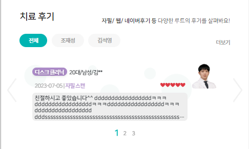

- custom svg로 만드는 법: https://github.com/nolimits4web/Swiper/issues/1280

6. 이제 버튼들은 모바일에서만 보이게 한다.
```css
/* 치료후기 좌우측 화살표 모바일에서만 보이도록*/
@media screen and (min-width: 992px){
    .section2-middle2 .swiper-button-prev,
    .section2-middle2 .swiper-button-next {
        display: none;
    }
}
```

7. 이제 isEnd를 판단해서 처음과 끝에서 가리도록 하자.
- https://www.swiper.com.cn/api/navigation/304.html
    - isEnd는 있어도 isStart는 없으니, activeIndex === 0 으로 판단한다.
    - **init시 처음부터 prev를 가리고 싶지만, init에서 `navigation.$prevEl를 못찾는다`.**
```js
 on: {

    slideChangeTransitionStart: function () {
        // 끝에서 next버튼 가리기
        if (this.isEnd) {
            this.navigation.$nextEl.css('display', 'none');
        } else {
            this.navigation.$nextEl.css('display', 'block');
        }

        // 처음시 prev버튼 가리기
        if (this.activeIndex === 0) {
            this.navigation.$prevEl.css('display', 'none');
        } else {
            this.navigation.$prevEl.css('display', 'block');
        }
    },
}
```
8. init시에 prev 요소를 jquery로 직접 찾아서 hide시킨다.
```js
on: {
    init: function () {
        // activeIndex === 0 (첫번째)일때, 직접 찾아서 prevEl hide
        // - init에서는 this.navigation.$prevEl 등이 안찾아짐.
        if (this.activeIndex === 0) {
            $('.section2-middle2 .swiper-button-prev').hide();
        }
    }
}
```

9. init시에  0 or 1페이지일 경우 버튼을 안보이게 할 건데
    - init에서는 prev/nextEl이 안찾아지므로, **직접 jquery로 요소를 hide시킨다**
```js
on: {
    init: function () {
        // 1page만 존재할 시, 둘다안보이기
        if (this.slides.length < 2) {
            $('.section2-middle2 .swiper-button-next').hide();
            $('.section2-middle2 .swiper-button-prev').hide();
        }
    }
}
```
### 각 tab index마다 Swiper초기화시키기
1. 의료진별로 치료후기를 tab content에 복사해서 옮겨준다
2. 

