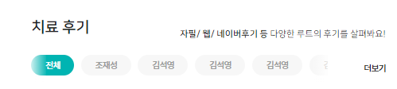
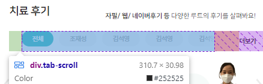

### 디자인 

1. 더보기를 li에서 div로 바꿔서 뺄 준비를 하고, **ul.nav-tabs를 `div.tab-scroll`안에 가둔다. div.tab-scroll + 더보기를 `div.tab-wrapper`로 감싼다.**
```html
<div class="review-box p-0">
    <div class="tab-wrapper d-flex align-items-start">
        <div class="tab-scroll">
            <ul class="nav nav-tabs mb-2 gap-1 column-gap-2" id="review-tabs" role="tablist">
            </ul>
        </div>
        <div class="ms-auto ">
            <a class="fs-tab"
               href="#"
            >
                더보기
            </a>
        </div>
    </div>
```

2. `.tab-scroll`과 `더보기`를 
    - 가로나열하기 위해 `flex`
    - **수직정렬을 위쪽으로 몰아서 더보기도 같이 위쪽에 나타나도록 `start`로 수직정렬**
    - w-100
    - 더보기의 글자가 아래줄로 안내려가도록 `white-space: nowrap;`
```css
/* tab 스크롤을 위한 설정 */
.tab-wrapper {
    display: flex;
    align-items: start;

    width: 100%;
    /*height: 32px;*/

    white-space: nowrap; /* 더보기의 글자가 다음줄 안넘어가게 함.*/
}
```

3. `.tab-scroll`은 w-100해야하는데, 
    - 더보기 왼쪽을 꽉채우기 위해, flex-item으로서 `flex-grow: 1;`로 늘려주고
    - 더보기와의 간격을 위해 `margin-right: 10%`를 주고
    - 2줄 -> 1줄로 넘칠 때, 가려주기 위해 `overflow: hidden;`를 넣어준다.
    - **scroll될 공간자체는 무조건 `display:flex;`로 만들어놔야 드래그가 되게 된다.**
```css
.tab-wrapper > .tab-scroll {
    flex-grow: 1; /* flex-item으로서 w-100% */
    margin-right: 10%;  /* ms-auto로 우측에 몰린 더보기에 대해, 간격을 유지하기 위해 */
    
    overflow: hidden;

   /* scroll 공간은 무조건 display:flex로 만들어놔야한다. */
   display: flex;
}
```
4. `.tab-scroll > ul`의 원래 flex인 .nav-tabs는 flex-item들이 2줄로 넘어가지 않게
    - `flex-wrap:nowrap;`으로 hidden에 갖히는 1줄로 만들어준다
```css
.tab-wrapper > .tab-scroll > ul {
    /* 가로가 넘쳐 부모 height를 넘치는 경우, flex를 다 가로로 넘치게 함 */
    flex-wrap: nowrap;
}
```

```css
.tab-wrapper > .tab-scroll {
    /* 가리개 absolute를 위함 */
    position: relative;
}
```

5. 이제 양쪽에 gradient로 흰색 가리개를 `.tab-scroll`에 before/after로 주기 위해
   - gradient 참고: https://codepen.io/kidd1118/pen/qxQwvE
   - **`.scroll-opacity`를 선택자를 만들고, before/after에 대한 `relative`가 되게 한다.**
```html
<div class="tab-scroll">
    <ul class="nav nav-tabs mb-2 gap-1 column-gap-2 scroll-opacity" id="review-tabs" role="tablist">
```
```css
.scroll-opacity {
    /* 가리개 absolute를 위함 */
    position: relative;
}
```

6. 이제 `.scroll-opacity`의 before/after를 정해준다
   - 공통사항은 묶어주고 다른 것만 분리한다
```css
.scroll-opacity::before,
.scroll-opacity::after {

    content: '';
    position: absolute;

    opacity: .8;
    top: 0;
    height: 100%;
    width:5%;

    /* draggable(1004)보다 더 위에*/
    z-index: 1200;
}

.scroll-opacity::before {
    left: 0;
    background: linear-gradient(to left, rgba(255, 255, 255, 0.08), white);
}

.scroll-opacity::after {
    right: 0;
    background: linear-gradient(to right, rgba(255, 255, 255, 0.08), white);
}
```



7. **왼쪽 가래개가 width 5%를 차지하고 있는데, drag되기 전까지 첫tab이 안묻히도록 공간에 padding-left를 넣어준다.**
```css
.tab-wrapper > .tab-scroll > ul {
   /* 가로가 넘쳐 부모 height를 넘치는 경우, flex를 다 가로로 넘치게 함 */
   flex-wrap: nowrap;

   /* 좌측 absolute 가리개의 width만큼 패딩 주기 */
   padding-left: 5%;
}
```



### draggable 적용

- draggable.js 및 없으면 TweenMax.js 추가
```html
<!-- draggable js for tab -->
<script src="js/Draggable.min.js"></script>

<script src="js/index.js"></script>
```

```js
 // tab draggable
 // - 1) ul의 부모공간(scroll 공간)을 먼저 따로 찾고, 
 var $tabScroll = $(".tab-scroll");
 // - 2) 내부 tab의 ul태그를 찾은 뒤
 var $tabTarget = $tabScroll.find("ul");
 // - 3) Draggable.create 해주되, bounds 옵션에 부모공간 변수를 넣어준다.
 Draggable.create($tabTarget, {
     type: "x",
     bounds: $tabScroll,
     throwProps: true,
     onClick: function (e) {
     },
     onDragEnd: function () {
         // console.log("drag ended");
     }
 });
```


### Tweenmax 적용
- 왼쪽가장자리에 이동시, 버그가 난다. 그냥 중간/우측가장자리일때 이동 공식을 사용한다.
```js
 // - 4) tab에서 클릭되는 a들을 find로 찾은 뒤. click 리스너를 걸어서, 중간/우측가장자리에 있을 때 이동시켜준다.
var scrollInnerWidth = $tabScroll.width();
var targetOuterWidth = $tabTarget.outerWidth();

$tabTarget.find("a").on("click", function (event) {
    var offsetLeft = $(this).offset().left;
    var aOuterWidth = $(this).outerWidth();
    var eventPoint = offsetLeft - aOuterWidth / 2;
    var textEndPoint = offsetLeft + aOuterWidth / 2;


    if ((scrollInnerWidth > targetOuterWidth) || scrollInnerWidth / 2 > textEndPoint) {
        // 왼쪽 가장자리
    } else if ((scrollInnerWidth < targetOuterWidth) && (targetOuterWidth - scrollInnerWidth / 2 < eventPoint)) {
        // 오른쪽 가장자리
        TweenMax.to($tabTarget, .1, {x: -(targetOuterWidth - scrollInnerWidth)});
    } else {
        // 중간 자리
        TweenMax.to($tabTarget, .1, {x: -((offsetLeft - scrollInnerWidth / 2))});
    }
});
```


### 유튜브/블로그 탭도 똑같이 적용해주는데, `.tab-scroll`이 복수로 뽑히는 것을 처리한다.
- 지금까지의 Draggable + TweenMax를 여러개의 `.tab-scroll`요소를 each + function + this를 이용해서 처리되게 한다.
```js
    // 5) .tab-scroll이 여러개인 경우를 대비해서, 아래와 같이 each -> 내부 this로 처리
    $(".tab-scroll").each(function () {
        var $tabScroll = $(this);
        var $tabTarget = $tabScroll.find("ul");
        new Draggable.create($tabTarget, {
            type: "x",
            bounds: $tabScroll,
            throwProps: true,
            onClick: function (e) {
            },
            onDragEnd: function () {
                // console.log("drag ended");
            }
        });


        // - 4) tab에서 클릭되는 a들을 find로 찾은 뒤. click 리스너를 걸어서, 중간/우측가장자리에 있을 때 이동시켜준다.
        var scrollInnerWidth = $tabScroll.width();
        var targetOuterWidth = $tabTarget.outerWidth();

        $tabTarget.find("a").on("click", function (event) {
            var offsetLeft = $(this).offset().left;
            var aOuterWidth = $(this).outerWidth();
            var eventPoint = offsetLeft - aOuterWidth / 2;
            var textEndPoint = offsetLeft + aOuterWidth / 2;


            if ((scrollInnerWidth > targetOuterWidth) || scrollInnerWidth / 2 > textEndPoint) {
                // 왼쪽 가장자리
                console.log('left')
            } else if ((scrollInnerWidth < targetOuterWidth) && (targetOuterWidth - scrollInnerWidth / 2 < eventPoint)) {
                // 오른쪽 가장자리
                TweenMax.to($tabTarget, .1, {x: -(targetOuterWidth - scrollInnerWidth)});
            } else {
                // 중간 자리
                TweenMax.to($tabTarget, .1, {x: -((offsetLeft - scrollInnerWidth / 2))});
            }
        });
    })
```
