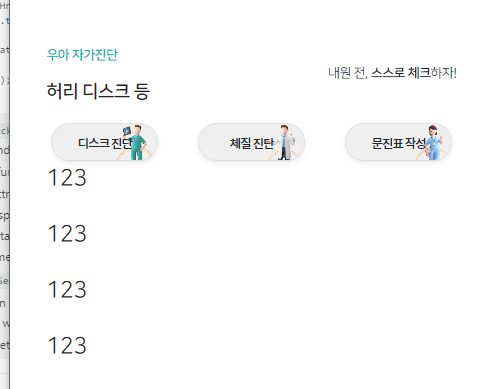
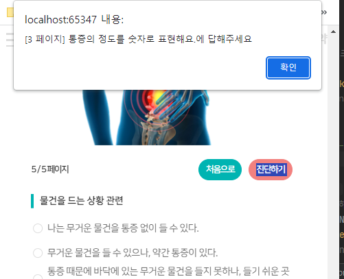
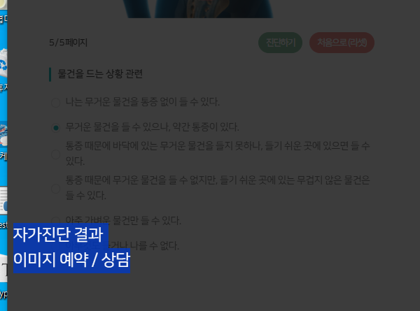
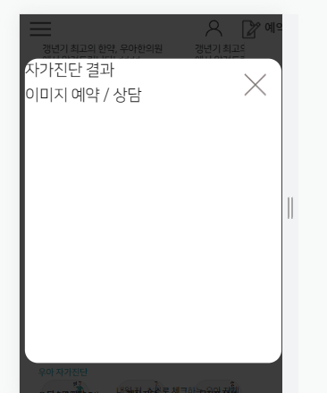
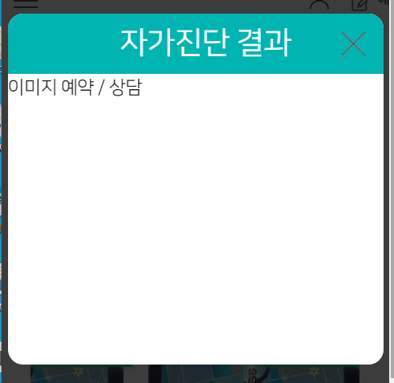

### 섹션 기본 세팅

```html
<!-- 자가진단 -->
<div class="section4">
    <div class="section-title">
        <div>
            <p>우아 자가진단</p>
            <p>허리 디스크 등</p>
        </div>
        <div>
            <strong>스스로 체크</strong>할 수 있는 우아한의원 시스템!
        </div>
    </div>
    <div class="dx-box">
    </div>
</div>
```

```css
.section3, .section4 {
    width: 100%;
    position: relative; /* */
    z-index: 666;
    background: #fff;
}

.section3 > div,
.section4 > div {
    width: 70%;
    margin: 0 auto;
}

@media screen and (max-width: 991px) {
    .section3 > div,
    .section4 > div {
        width: 85%;
    }
}
```

```js
    // section4 건강채널 - title with Velocity
let scene7 = new ScrollMagic.Scene({
    triggerElement: ".section4",
    // triggerHook: "onCenter",
    triggerHook: "onEnter",
    offset: -80,
});
scene7.setVelocity([".section4 > .section-title > div"], {
    top: "0px",
    opacity: "1"
}, {
    duration: "300",
});
controller.addScene(scene7);
```

### 진단 버튼 3개 with div배경 a링크

1. 진단관련 링크 3개를 flex가 아닌 boostrap으로 col-4로 3개를 나열한다.
    - 이 때, div>a의 구성으로서, `div로 배경` + `a로 글자크기 + my`로 배경 + 크기를 구성한다.
    - col-4는 점점 넓어지므로, `px`를 반응형으로 여백을 줘서, div>a의 폭을 줄인다.
    - 진단텍스트용으로, ~991, ~1399, ~ 3가지 반응형 폰트 `fs-dx`를 style.css에 만든다.

```css
.fs-dx-btn {
    font-size: 18px;
}

@media screen and (max-width: 991px) {
    .fs-dx-btn {
        font-size: 9px;
        letter-spacing: -.05rem;
    }
}

@media screen and (min-width: 991px) and (max-width: 1399px) {
    .fs-dx-btn {
        font-size: 13px;
        letter-spacing: -.01rem;
    }
}
```

```html

<div class="dx-box ">
    <!-- 진단 버튼 3개 -->
    <div class="row">
        <div class="col-4 px-3 px-md-4 px-lg-5">
            <div class="text-center rounded rounded-pill border shadow-sm"
                 style="background-image: url('images/dx/001.png');
                            background-repeat: no-repeat;
                            background-position: top center;
                            background-size: cover;
                            background-color: #efefef;">
                <a href="#" class="d-inline-block text-decoration-none text-dark fw-bolder ">
                    <h6 class="fs-dx-btn my-1 my-md-2 my-lg-3">디스크 진단</h6>
                </a>
            </div>
        </div>
        <div class="col-4 px-3 px-md-4 px-lg-5">
            <div class="text-center rounded rounded-pill border shadow-sm"
                 style="background-image: url('images/dx/002.png');
                            background-repeat: no-repeat;
                            background-position: top center;
                            background-size: cover;
                            background-color: #efefef;">
                <a href="#" class="d-inline-block text-decoration-none text-dark fw-bolder ">
                    <h6 class="fs-dx-btn my-1 my-md-2 my-lg-3">체질 진단</h6>
                </a>
            </div>
        </div>
        <div class="col-4 px-3 px-md-4 px-lg-5">
            <div class="text-center rounded rounded-pill border shadow-sm"
                 style="background-image: url('images/dx/003.png');
                            background-repeat: no-repeat;
                            background-position: top center;
                            background-size: cover;
                            background-color: #efefef;">
                <a href="#" class="d-inline-block text-decoration-none text-dark fw-bolder">
                    <h6 class="fs-dx-btn my-1 my-md-2 my-lg-3">문진표 작성</h6>
                </a>
            </div>
        </div>
    </div>
    <div class="row">
        <p>123</p>
        <p>123</p>
        <p>123</p>
        <p>123</p>
    </div>
</div>
```




### 자가진단 페이지 만들기

- form을 만들어서 submit을 하기도 하지만, `page별` `배열 name 1개`  +  `여러개`의 `input` + `label`로 갯수만 체크해서 넘길 수 있다.

1. 질문 만들기

```css
:root {
    /* 자가진단 */
    --dx-question-font-size: 16px; /* 앞에 before의 height도 결정되므로 변수로 정해줌*/
}

@media screen and (max-width: 991px) {
    :root {
        --dx-question-font-size: 11px; /* 앞에 before의 height도 결정되므로 변수로 정해줌*/
    }
}
```

- **빈 form태그 안에 .dx-slide들이 들어갈 것이다.**

```html

<div class="col-12 col-md-7 g-3">
    <form action="">
        <div class="dx-slide">
            <div class="dx-question">
                당신의 성별은 무엇인가요?
            </div>
            <div class="dx-answer">

            </div>
        </div>
    </form>
</div>
```

```css
.dx-question {
    margin: 0;
    width: 100%;
    text-align: left;

    position: relative;
    /* 왼쪽에 before를 넣을 공간 */
    padding: 0 0 0 10px;

    font-size: var(--dx-question-font-size);
    line-height: calc(var(--dx-question-font-size) * 1.5);
    font-weight: bold;
}

.dx-question:before {
    content: '';
    position: absolute;

    left: 0;
    top: 50%;
    transform: translateY(-50%);

    background: var(--color-main);
    width: 3px;
    height: 100%;
}
```


2. 답변들 만들기
    - **radio의 갯수만큼 input + label을 만들어줘야한다.**

```css
.fs-dx-answer {
    font-size: 18px;
}

@media screen and (max-width: 991px) {
    .fs-dx-answer {
        font-size: 11px;
        letter-spacing: -.01rem;
    }
}

@media screen and (min-width: 991px) and (max-width: 1399px) {
    .fs-dx-answer {
        font-size: 13px;
        letter-spacing: -.005rem;
    }
}
``` 

```html

<div class="dx-answer mt-2 ps-2 ps-lg-3">
    <div class="dx-answer-detail">
        <input type="radio" class="blind"
               name="answerSex"
               id="answer-sex"
        >
        <label for="answer-sex" class="fs-dx-answer">
            남자
        </label>
    </div>

</div>
```

#### radio 답변

3. 답변 중에 radio 답변에서 input radio 은 `.blind`로 숨겨진다
    - name은 다 동일하게 `answerSex`의 camel Case로 준다
    - id는 `-`로 연결하여 label과 연결용으로 쓴다.
4. **input radio를 `형제+`로 가진 label**은
    - `before로 커스텀 radio`를 가질 것 예정이라 relative를 준다
    - before로 글자크기만큼의 radio모양을 만들 것이므로 padding-left를 그만큼 준다. 클릭이 되도록 cursor도 준다.

```css

/* 답변 - radio */
.dx-box input[type="radio"] + label {
    font-size: var(--dx-question-font-size);
    color: #666;

    position: relative;
    padding-left: var(--dx-question-font-size);

    cursor: pointer;
    display: inline-block;
}
```

5. before는 left 0 top 50%를 줘서 왼쪽 수직가운데 정렬을 하되
    - **transform으로 그 자리에서 x,y는 -50%로 하여, 어떤 공간안에 정가운데로 만들어 -> checked상태일때의 after와 가운데 점을 맞출 수 있게 한다.**
    - w/h를 폰트크기로 준다.

```css
.dx-box input[type="radio"] + label:before {
    content: '';
    position: absolute;

    left: 0;
    top: 50%;
    transform: translate(-50%, -50%);

    width: var(--dx-question-font-size);
    height: var(--dx-question-font-size);

    border: 1px solid #ddd;
    border-radius: 100%;
}
```

6. after는 left 0 top50% + transform -50%, -50%으로 before와 중심을 일치시킨다.
    - 이 때, w/h는 폰트크기의 50%로 줘서, before의 가운데 들어가도록 한다.
    - **display:none을 주고, `input[type="radio"]:checked + label:after `코드를 활용해서 checked된 input의 형제label의 :after에 동그라미를
      채우게 한다.**

```css
.dx-box input[type="radio"] + label:after {
    display: none;

    content: '';
    position: absolute;
    left: 0;
    top: 50%;
    transform: translate(-50%, -50%);

    width: calc(var(--dx-question-font-size) * .5);
    height: calc(var(--dx-question-font-size) * .5);

    background: var(--color-main);
    border-radius: 100%;
}

.dx-box input[type="radio"]:checked + label:after {
    display: block;
}
```

7. 이제 질문을 복사하되, label연결되는 input의 id만 바꾸고, name은 똑같이 준다.
    - **value도 주는 데, 남자는1, 여자는2로 준다.**

```html

<div class="dx-answer mt-2 ps-2 ps-lg-3">
    <div class="dx-answer-detail">
        <input type="radio" class="blind"
               name="answerSex"
               id="answer-sex-1"
        >
        <label for="answer-sex-1" class="fs-dx-answer">
            남자
        </label>
    </div>
    <div class="dx-answer-detail">
        <input type="radio" class="blind"
               name="answerSex"
               id="answer-sex-2"
        >
        <label for="answer-sex-2" class="fs-dx-answer">
            여자
        </label>
    </div>
</div>
```


#### 1개 check 답변

1. .dx-slide를 복사해서 중복체크 답변을 만든다.
    - input에서 checkbox 및 name만 바꾼다. id는 -1, -2 씩 늘어간다.

```html

<div class="dx-answer mt-2 ps-2 ps-lg-3">
    <div class="dx-answer-detail">
        <input type="checkbox" class="blind"
               name="family"
               id="family-1"
               value="1"
        >
        <label for="family-1" class="fs-dx-answer">
            할아버지
        </label>
    </div>
</div>
```

2. css는 radio에서 달라지는 부분이
    - before의 radius : 100% -> 3px
    - after를 content 체크 + fz 등으로 조절 (w/h로 하지 않음)
    - 배경 투명색

```css
/* 답변 checkbox */
.dx-box input[type="checkbox"] + label {
    position: relative;
    padding-left: var(--dx-question-font-size);

    font-size: var(--dx-question-font-size);
    color: #666;

    cursor: pointer;
    display: inline-block;
}

.dx-box input[type="checkbox"] + label:before {
    content: '';
    position: absolute;

    left: 0;
    top: 50%;
    transform: translate(-50%, -50%);

    width: var(--dx-question-font-size);
    height: var(--dx-question-font-size);

    border: 1px solid #ddd;
    /*border-radius: 100%;*/
    border-radius: 3px;
}


.dx-box input[type="checkbox"] + label:after {
    display: none;

    /*content: '';*/
    content: '✔';
    text-align: center;
    color: var(--color-main);
    font-weight: 800;
    font-size: calc(var(--dx-question-font-size) * 1.3);

    position: absolute;
    left: 0;
    top: 50%;
    transform: translate(-50%, -50%);

    /*width: calc(var(--dx-question-font-size) * .5);*/
    /*height: calc(var(--dx-question-font-size) * .5);*/


    /*background: var(--color-main);*/
    background: transparent;
    border-radius: 100%;
}

.dx-box input[type="checkbox"]:checked + label:after {
    display: block;
}
```

### swiper 적용

1. swiper-container/wrapper/slide를 form태그 안쪽에 배치한다. 각 dx-slide 마다 swiper-slide를 넣어준다.

```html

<div class="col-12 col-md-7 g-3">
    <form action="">
        <div class="swiper-container ">
            <div class="swiper-wrapper">
                <div class="swiper-slide">
                    <!-- (개별) radio 택1 답변 -->
                    <!-- 1) 성별 2) 연령대 -->
                    <div class="dx-slide">
```

2. 해당 구역의 container / slide 기본 css를 적용한다.

```css
/* dx swiper */
.dx-box .swiper-container {
    width: 100%;

    /* 임시 */
    /*background: red;*/
}

.dx-box .swiper-container .swiper-slide {
    position: relative;
}
```

3. tab내부 여러 swiper가 아닌 단독 swiper 초기화인 section2-bottom의 상품 swiper를 참고한다

```js
 let dxSwiper = new Swiper(".dx-box .swiper-container", {});
```

- **다음 slide의 before가 보여서 spacebetween을 준다.**

```js
let dxSwiper = new Swiper(".dx-box .swiper-container", {
    spaceBetween: 5, // 다음 slide의 before가 삐져나와서
});
```

4. 진행도를 위한 pagination / 처음 + 다음 + 진단의 3가지 버튼을 나타내기 위해 prev/next 를 만들어준다.
    - container 바깥에 배치할 것이므로, 치료후기를 참고 한다.
    - **페이지네이션을 container로 뺄 땐, 기본absolute -> relative 변경이 필수다.**

```html
<!-- 대표 검사 form with swiper  -->
<div class="col-12 col-md-7 g-3">
    <form action="">
        <!-- 페이지네이션 -->
        <div class="swiper-pagination"></div>

        <div class="swiper-container ">
```

```css
.dx-box .swiper-pagination {
    position: relative;
}
```

5. pagination 설정시 type을 custom으로 하면, 전체 중 몇번째인지 처리할 수 있다.

- https://www.swiper.com.cn/api/pagination/302.html

```js
 let dxSwiper = new Swiper(".dx-box .swiper-container", {
    pagination: {
        el: '.dx-box .swiper-pagination',
        type: 'custom',
        clickable: true,
        renderCustom: function (swiper, current, total) {
            return '<span class="fs-tab fw-bold">' + current + ' / ' + total + ' 페이지</span>';
        },
    });
```


6. prev/next버튼을 container 추가해야하는데, slide높이가 다르므로, slide보다 위에, pagination과 같이 줄 것이다.

- **pagination <-> 버튼들을 d-flex, between으로 넓혀서 배치한다.**
- form내부이므로 button들은 submit안되도록 type="button"을 명시한다.
- 해당버튼들에는 id들 step-first, next, result로 반영한다
- button은 btn btn-sm에 커스텀 btn테마 btn-green, pink를 생성해서 적용한다.

```html

<form action="">
    <div class="dx-btn-layer mb-2 mb-lg-4 d-flex justify-content-between align-items-center">
        <!-- 페이지네이션 -->
        <div class="swiper-pagination w-auto fs-tab fw-bold btn btn-sm btn-main rounded-pill"></div>
        <!-- custom prev/next/진단 -->
        <div class="swiper-custom-btn-layer">
            <button type="button" id="step-first" class="fs-tab fw-bold btn btn-sm btn-pink rounded-pill">
                첫 페이지
            </button>
            <button type="button" id="step-next" class="fs-tab fw-bold btn btn-sm btn-pink rounded-pill">
                다음 ▶
            </button>
            <button type="button" id="step-result" class="fs-tab fw-bold btn btn-sm btn-danger rounded-pill">
                진단하기
            </button>
        </div>
    </div>
    <!-- slides -->
    <div class="swiper-container ">
    </div>
</form>
```

```css
.btn-green {
    --bs-btn-color: #fff;
    --bs-btn-bg: #80BA96;
    --bs-btn-border-color: #80BA96;

    --bs-btn-hover-color: #fff;
    --bs-btn-hover-bg: #00b5b2;
    --bs-btn-hover-border-color: #00b5b2;
    --bs-btn-focus-shadow-rgb: #00b5b2;
    --bs-btn-active-color: #fff;
    --bs-btn-active-bg: #00b5b2;
    --bs-btn-active-border-color: #00b5b2;
    --bs-btn-active-shadow: inset 0 3px 5px #00b5b2;
    --bs-btn-disabled-color: #fff;
    --bs-btn-disabled-bg: #00b5b2;
    --bs-btn-disabled-border-color: #00b5b2;
}

.btn-pink {
    --bs-btn-color: #fff;
    --bs-btn-bg: #F07F7F;
    --bs-btn-border-color: #F07F7F;

    --bs-btn-hover-color: #fff;
    --bs-btn-hover-bg: #FC5230;
    --bs-btn-hover-border-color: #FC5230;
    --bs-btn-focus-shadow-rgb: #FC5230;

    --bs-btn-active-color: #fff;
    --bs-btn-active-bg: #FC5230;
    --bs-btn-active-border-color: #FC5230;
    --bs-btn-active-shadow: inset 0 3px 5px #FC5230;

    --bs-btn-disabled-color: #fff;
    --bs-btn-disabled-bg: #FC5230;
    --bs-btn-disabled-border-color: #FC5230;
}
```


7. 버튼lay도 d-flex로 잡고, gap으로 간격을 준다.

```html

<div class="swiper-custom-btn-layer d-flex gap-2 gap-lg-3">
```

8. navigation옵션을 따로 swiper에서 주지 않고, 각 button의 id로 jquery로 찾아서 `dxSwiper`객체를 활용하여, slide를 넘긴다.
    - 처음으로 `.slideTo(0)`, 다음 `.slideNext()`

```js
 $('.dx-box #step-first').on('click', function () {
    dxSwiper.slideTo(0);
});

$(".dx-box #step-next").on('click', function (e) {
    dxSwiper.slideNext();
})
```

9. 이제 진단하기 버튼은 swiper on메서드에서 isEnd일 때 나타나게하고, 다음으로는 사라지게 한다. else에서는 반대로 넣는다.

- 진단하기 버튼은 시작은 display none으로 해준다.

```html

<button type="button" id="step-result" class="fs-tab fw-bold btn btn-sm btn-danger rounded-pill"
        style="display: none;"
>
    진단하기
</button>
```

```js
/* dx 진단 swiper */
let $dxFirstBtn = $('.dx-box #step-first');
let $dxNextBtn = $(".dx-box #step-next");
let $dxResultBtn = $(".dx-box #step-result");

let dxSwiper = new Swiper(".dx-box .swiper-container", {
    // ... ,
    on: {
        slideChangeTransitionStart: function () {
            if (this.isEnd) {
                $dxNextBtn.css('display', 'none');
                $dxResultBtn.css('display', 'block');
            } else {
                $dxNextBtn.css('display', 'block');
                $dxResultBtn.css('display', 'none');
            }
        }
    }
});
```


### group check 답변 for count

- slide는 넘어가지만, count를 같이 세야 하는 경우, slide가 넘어가더라도 `같은 name[]`을 사용해야하며, jquery로 length만 check된 것으로 셀 것이기 때문에, value는
  아무값이나 똑같이 준다.
- 같은 질문(같은name)이지만, count는 세분화될 수 있기 때문에, **`name="질환_a[]"`, `질환_b[]`의 count용 그룹을 따로 name으로 뺀다**
- 아래는 같은 질문이면서, 같은 그룹

### 진단하기 버튼에 검증 및 처리

1. 현재는 모든 slide의 질문에 대해서, 1개는 무조건 답하는 택1 radio에 대해서이다.
    - **일단 `document.formName`을 쓰기 위해 form태그에 name을 단다.**

```html
<!-- 대표 검사 form with swiper  -->
<div class="col-12 col-md-7 g-3 position-relative">
    <form action="" name="dx">
```

2. kodi와 별개로 `성별/연령대`에 대한 질문은 따로 검사한다.
    - `kodi1,2,3,`으로 이어지는 것은 따로 반복문으로 한번에 처리할 예정이므로, `sex, age`만 먼저 검사
    - 1개의 name에 대해 여러개의 input을 가지는 상황에서는 `document.dx.inputName`으로 여러요소를 선택할 수 있다.
    - 이것으로 체크되었는지 검사하는 `isFormInputChecked`를 작성한다.
    - 내부에서는 **`$( ).is(":checked")`를 활용하면, 여러 radio input 중 1개라도 체크될 때 true가 된다.**

```js
function isFormInputChecked(checkInput) {
    return $(checkInput).is(":checked");
}
```

3. check가 안됬으면, alert로 띄우고, 해당 slide로 보내는데 `swiper객체` + `checkInput`을 받아서
    - **가장 가까운 `.swiper-slide`를 `.closest()`로 찾은 뒤, 그 index를 추출하여, `swiper.slideTo()`로 보낸다.**

```js
function toClosestSlideOfFormInput(swiperObject, checkInput) {
    var targetEl = null;
    if (checkInput.length > 1) {
        targetEl = checkInput[0]
    } else {
        targetEl = checkInput
    }
    swiperObject.slideTo($(targetEl).closest('.swiper-slide').index())
}
```

4. 만약 성별이나 연령대가 체크 안되어있으면 `alert` -> `slideTo` -> `return false로 종료`시키니다.

```js
 $dxResultBtn.on('click', function (e) {
    // 성별 체크 검증
    if (!isFormInputChecked(document.dx.sex)) {
        alert('성별이 체크 안되어있어요');
        toClosestSlideOfFormInput(dxSwiper, document.dx.sex)
        return false;
    }

    // 연령대 체크 검증
    if (!isFormInputChecked(document.dx.age)) {
        alert('연령대가 체크 안되어있어요');
        // dxSwiper.slideTo($(document.dx.sex[0]).closest('.swiper-slide').index())
        toClosestSlideOfFormInput(dxSwiper, document.dx.age)
        return false;
    }
}
```

5. 이제 `name="kodi1"`부터 시작해서 2,3,4에 대한 검증을 일괄처리하기 위해 **`name이 kodi로 시작하는 input들`을 다 찾고, 그 `name들의 unique한 것의 갯수`를
   찾아, `전체 질문의 갯수`를 파악한다.**
    - kodi라는 name을 받고
    - jquery객체로 해당name으로 시작하는 input들을 모두 찾은 뒤, 순회하면서, set에 add하여 유니크한 갯수를 구한다.

```js
const getUniqueQuestionCountByName = (name) => {
    const inputs = $("input[name^='" + name + "']");
    let count = 0;
    let uniqueNames = new Set();
    for (const input of inputs) {
        uniqueNames.add(input.name);
    }
    return uniqueNames.size;
};
```

6. 이제 질문갯수만큼을 `1부터 n`까지를 순회하면서, document.dx. `kodi` + `n`의 form input을 `eval()` + `$()`로 찾은 뒤
    - `여러개input jquery` + `.is(':checked')`로, 체크가 안된 number를 찾아낸다. 만약, 다 체크됫으면 -1이 반환된다.

```js
// 체크 안된 질문 숫자 반환(올 체크시 -1 반환)
const getUncheckedQuestionNumber = (name) => {
    let questionCount = getUniqueQuestionCountByName(name);
    for (let i = 1; i < questionCount + 1; i++) {
        // if (!nameInputs[i].checked) {
        if (!$(eval('document.dx.' + name + i)).is(':checked')) {
            return i;
        }
    }
    return -1;
};
```

7. 이제 체크안된 숫자 발견시 alert를 띄우는 validate함수를 만든다.
    - a만약 체크안된 number가 -1대신넘어올 경우, `document.formName` + `.name` + 숫자를 더한 string을 eval()로 요소로 만든 뒤
    - **eval()의 결과나오는 여러 input들에 대해, `[0]으로 첫번째 input`을 찝고, .dx-question을 찾은 뒤, text() + $.trim()으로 씌워 질문 text를 띄워준다.**
    - 백틱안에 ${}를 쓰면 변수를 쓸 수 있는데,

```js
// 해당 name으로 시작하는 질문들이 체크안될시 alert 
function validateAllQuestionCheckedByName(name) {
    const uncheckedInputNumber = getUncheckedQuestionNumber(name);

    if (uncheckedInputNumber === -1) {
        alert("모든 답변에 체크했습니다.");
        return true;
    } else {
        let checkInput = eval("document.dx." + name + (uncheckedInputNumber)); // document.dx.kodi1
        // 성별+연령을 질문숫자에 더해서, 페이지를 확정한다.
        alert(`[${uncheckedInputNumber + 2} 페이지] ${$.trim($(checkInput[0]).parent().parent().parent().find('.dx-question').text())}에 답해주세요`)
        // toClosestSlideOfFormInput(dxSwiper, checkInput)
        return false;
    }
}

validateAllQuestionCheckedByName("kodi");
```



8. 이제 `alert`이후, 해당 slide로 넘어가도록 `eval()`된 form input을 `toClosestSlideOf()`에 swiper객체, 해당 input을 넘겨준다.
    - 만약 여러개의 input을 가진 name의 input이라면, [0]으로 첫번째것만 택한 뒤
    - jquery객체로 만들고
    - `.closest()`로 .swiper-slide를 찾아서, 그것의 index를 slideTo에 넣는다.

```js
// 해당 swiper객체에, 해당input의 가장 가까운 .swiper-slide의 .index()를 찾아서 넘겨 slideTo로 이동
function toClosestSlideOf(swiperObject, checkInput) {
    var targetEl = null;
    if (checkInput.length > 1) {
        targetEl = checkInput[0]
    } else {
        targetEl = checkInput
    }
    swiperObject.slideTo($(targetEl).closest('.swiper-slide').index())
}
```

```js
// 해당 name으로 시작하는 질문들이 체크안될시 alert
function validateAllQuestionCheckedByName(name) {
    const uncheckedInputNumber = getUncheckedQuestionNumber(name);

    if (uncheckedInputNumber === -1) {
        alert("모든 답변에 체크했습니다.");
        return true;
    } else {
        let checkInput = eval("document.dx." + name + (uncheckedInputNumber)); // document.dx.kodi1
        // 성별+연령을 질문숫자에 더해서, 페이지를 확정 -> alert
        alert(`[${uncheckedInputNumber + 2} 페이지] ${$.trim($(checkInput[0]).parent().parent().parent().find('.dx-question').text())}에 답해주세요`)
        // 해당 slider로 이동
        toClosestSlideOf(dxSwiper, checkInput)
        return false;
    }
}
```

9. 이제 모든 검증이 통과할 경우, alert를 띄우는 대신 true를 반환하고, 외부에서 결과modal을 띄워야한다.

```js
 function validateAllQuestionCheckedByName(name) {
    const uncheckedInputNumber = getUncheckedQuestionNumber(name);
    if (uncheckedInputNumber === -1) {

        // alert("모든 답변에 체크했습니다.");
        return true;

    } else ...
}
```

```js
// name1,2,3... 질문들 검증 -> 체크 안된 번호 발견시, alert + slide To
if (!validateAllQuestionCheckedByName("kodi")) {
    return false;
}
// -> 여기 이후로 검증 다 통과
alert('모든 검증 통과')
```

10. 그 전에, `처음으로`버튼 클릭시, form도 reset시켜준다. document.formName.reset()을 활용한다

```html

<button type="button" id="step-first"
        class="fs-tab fw-bold btn btn-sm btn-main rounded-pill">
    처음으로(리셋)
</button>
```

```js
 $dxFirstBtn.on('click', function () {
    dxSwiper.slideTo(0);
    document.dx.reset()
});
```

#### 버그해결, slideTo이후 클릭이 안먹힐 때

- slideTo를 처리하는 메서드(`toClosestSlideOf`) 내부에서 `swiper객체.preventClicks = false`를 직접 한번 더 먹여준다.

```js
let dxSwiper = new Swiper(".dx-box .swiper-container", {
    preventClicks: false,
}
```

```js
 function toClosestSlideOf(swiperObject, checkInput) {
    var targetEl = null;
    if (checkInput.length > 1) {
        targetEl = checkInput[0]
    } else {
        targetEl = checkInput
    }
    let targetSlideIndex = $(targetEl).closest('.swiper-slide').index();
    swiperObject.slideTo(targetSlideIndex);
    // slideTo 이후, 해당 slide에 클릭이 바로 안먹히는 현상(preventClicks true가 설정되는 버그)를 해결
    swiperObject.preventClicks = false;
}
```

### magnificPopup 으로 결과 callback받아서 띄우기

1. css/magnific-popup.css 및 js/magnific-popup.min.js 를 추가

```html
<!-- magnific-popup css for 자가진단 결과-->
<link rel="stylesheet" href="css/magnific-popup.css">
```

```html
<!-- magnific-popup js for 자가진단 결과-->
<script src="js/magnific-popup.min.js"></script>
```

2. magnificpop 설정은 .section4 내부에 `div#dx-result.dx-result`로 id를 부여하여 팝업창을 만들고 `.mfp-hide` 클래스를 추가해놓고, title과 content
   div를 만들어놓는다.

```html
 <!-- 진단 결과 popup -->
<div id="dx-result" class="dx-result mfp-hide">
    <div class="dx-result-title">
        자가진단 결과
    </div>
    <div class="dx-result-content">
        이미지

        예약 / 상담
    </div>
</div>
```

3. css에 미리 지정된 bg로 만드는 close버튼을 아래 경로에 넣어준다.

```css
button.mfp-close {
    background: url("../images/dx/mfp-close.png") no-repeat center;
}
```

4. 진단하기 버튼에 `href`를 결과element의 id인 `#dx-result`를 추가한다

```html

<button type="button" id="step-result"
        href="#dx-result"
        class="fs-tab fw-bold btn btn-sm btn-green rounded-pill"
        style="display: none;"
>
    진단하기
```

5. css에서 `진단하기` 결과를 띄울 버튼을 찾아놓고, mainClass로 `.mfp-hide`를 지정한다

```js
 // 자가진단 버튼에 popup 설정 걸기
$(".dx-box #step-result").magnificPopup({
    mainClass: 'mfp-fade',
    showCloseBtn: true,
    preloader: true,
    callbacks: {
        open: function () {
        },
        close: function () {
        }
    }
});
```



6. 이 때, **검증 통과후에만 열려야하는데, 항상 클릭시 결과버튼이 열리므로 `검증통과 후, items에 #dx-result 지정`후 `open`되도록 변경**한다

```js
 $dxResultBtn.on('click', function (e) {
    // ...

    // name1,2,3... 질문들 검증 -> 체크 안된 번호 발견시, alert + slide To
    if (!validateAllQuestionCheckedByName("kodi")) {
        return false;
    }
    // -> 여기 이후로 검증 다 통과
    //alert('모든 검증 통과');

    // 자가진단 버튼에 popup 설정 걸기
    $.magnificPopup.open({
        items: {
            src: "#dx-result", // popup에 보여줄 내용의 id
            type: 'inline' // popup의 타입
        },
        mainClass: 'mfp-fade',
        showCloseBtn: true,
        preloader: true,
        callbacks: {
            open: function () {
            },
            close: function () {
            }
        }
    });
})
```

7. 이제 dx-result, title과 content를 꾸민다.
    - 전체 배경이 검은색이 되니, popup구역은 흰색으로 변경한다.
    - 배경은 max-w를 줘서, 큰화면에 무작정 안늘어나게 한다. w-90%만 줘서, 좌우에 10% 약간의 여백을 만든다.
    - h는 min-h를 줘서, 가운데 쏠린 상태에서 너무 안작게 한다. h-95%를 줘서 아래쪽에 5%만 여백을 만든다.
    - margin을 위아래 30px정도 준다.
    - 내용물이 넘치면 숨긴다.

```css
/* dx 결과 popup */
.dx-result {
    position: relative;

    background: #fff;
    max-width: 600px;
    width: 90%;
    min-height: 350px;
    height: 95%;


    margin: 30px auto;
    border-radius: 15px;

    overflow: hidden;
}
```



8. title은 w100%에 height/lh를 close버튼 크기인 60px로 정해주고, 배경은 밝은색 + 텍스트 가운데정렬에 + fz는 lh의 절반정도로 정한다.

```css
.dx-result .dx-result-title {
    width: 100%;
    height: 60px;
    line-height: 60px !important;

    background: var(--color-main);

    text-align: center;
    color: #fff;

    font-size: 30px;
    font-weight: 500;
    /*text-indent: 20px;*/
}
```



9. content는 padding만 넣어놓고, 내부 div를 만들어서 이미지 + 버튼2개를 만든다.
    - **나중에 내용물을 `.dx-result-content`에서 `.load()`할 것이기 때문에, 내부내용은 백엔드에서 받을 것이라 생각하고, 미리 작성해둔다 생각한다.**

```css
.dx-result .dx-result-content {
    padding: 5% 15%;
}
```

10. 이제 내용물을 채우돼 구성은 아래와 같이 한다.

- p.title / p.sut-title / div.img / div.footer
- 일단 title과 subtitle의 글자크기를 css로 지정해준다.

```css
.fs-dx-result {
    font-size: 25px;
    font-weight: bold;
}

.fs-dx-result-sub {
    font-size: 16px;
    font-weight: bold;
}


@media screen and (min-width: 992px) and (max-width: 1399px) {
    .fs-dx-result {
        font-size: 20px;
        letter-spacing: -.01rem;
    }

    .fs-dx-result-sub {
        font-size: 16px;
        letter-spacing: -.01rem;
    }
}

@media screen and (max-width: 991px) {
    .fs-dx-result {
        font-size: 17px;
        letter-spacing: -.01rem;
    }

    .fs-dx-result-sub {
        font-size: 13px;
        letter-spacing: -.01rem;
    }
}
```

```html

<div id="dx-result" class="dx-result mfp-hide">
    <div class="dx-result-title">
        자가진단 결과
    </div>
    <div class="dx-result-content">
        <p class="dx-result-content-title text-center fs-dx-result">
            경미한 장애(0~20%)입니다.
        </p>
        <!-- 2) 부연 설명 -->
        <p class="dx-result-content-subtitle text-center fs-dx-result-sub">
            들고 앉을 때, 운동시에 조언이 필요해요. 내원하셔서 티칭 및 중증에 대한 예방해보시는 것은 어떨까요?
        </p>
    </div>
</div>
```

- font 색은 css로 지정해준다.

```css
.dx-result .dx-result-content .dx-result-content-title {
    color: var(--color-submain);
    margin-bottom: 5px;
}
```

11. 가운데 이미지는 .img-fluid로 w-100을 준 뒤, css로 max-width를 걸어서, 너무 커지지 않게 한다.

- 이 때, 가운데 정렬되게 하기 위해 한번 더 감싼다

```html

<div class="dx-result-content">
    <!-- .load() 내용들 -->
    <!-- 1) 중요 결과 -->
    <p class="dx-result-content-title text-center fs-dx-result">
        경미한 장애(0~20%)입니다.
    </p>
    <!-- 2) 부연 설명 -->
    <p class="dx-result-content-subtitle text-center fs-dx-result-sub">
        들고 앉을 때, 운동시에 조언이 필요해요. 내원하셔서 티칭 및 중증에 대한 예방해보시는 것은 어떨까요?
    </p>
    <!-- 3) 가운데 이미지 -->
    <div class="dx-result-content-img my-4 my-lg-5">
        
    </div>
</div>
```

```css
.dx-result .dx-result-content .dx-result-content-img {
    text-align: center;
}

.dx-result .dx-result-content .dx-result-content-img > img {
    max-width: 300px;
}
```

12. 이제 footer를 만들고, 문의하기 + 버튼 2개를 세로배치하는데, 가운데 정렬까지 하기 위해 `d-flex, flex-column`을 css로 적용한다

```html

<div class="dx-result-footer mt-3 mt-md-4 mt-lg-5">
    <p class="fs-dx-result-sub">
        <span></span>
        문의하기
        <span></span>
    </p>
    <ul class="list-unstyled w-100 d-flex justify-content-evenly mt-1 ">
        <li class=""><a href="#" class="btn btn-sm btn-main rounded-pill px-3 fs-dx-result-sub">실시간 예약</a></li>
        <li class=""><a href="#" class="btn btn-sm btn-main rounded-pill px-3 fs-dx-result-sub">온라인 상담</a></li>
    </ul>
</div>
```

```css
.dx-result .dx-result-footer {
    width: 100%;
    display: flex;
    flex-direction: column;
    align-items: center;
    justify-content: center;
}
```

13. 문의하기란은 p태그로 작성하되, 글자크기는 result-sub와 동일하게 주고

- **`relative`를 줘서 span을 absolute 양쪽으로 만들고**
- **`w70%`를 줘서, 부모에 대해 최대 70%까지만 차지하게 둔다.**
- 글자를 회색으로 주고, span으로 만든 가로선도 회색으로 준다.

```css
.dx-result .dx-result-footer p {
    width: 70%;
    position: relative;

    text-align: center;
    color: darkgray;
    font-size: 15px;

    margin-bottom: 5px;
}
```

- 가로선 span태그를 `width 25%`로 줘서, 70%만땅에 대한 25%씩을 가져가고, 가운데 50%를 글자가 안넘치게 한다.

```css
.dx-result .dx-result-footer p > span {
    position: absolute;

    display: inline-block;
    width: 25%;
    height: 1px;
    background: #ddd;

    top: 50%;
    transform: translateY(-50%);
}

.dx-result .dx-result-footer p > span:nth-of-type(1) {
    left: 0;
}

.dx-result .dx-result-footer p > span:nth-of-type(2) {
    right: 0;
}
```

- 아래쪽 버튼들은 d-flex, `evenly`로 줘서, 양끝으로 밀착시키돼, 양끝에 약간의 간격을 가지게 만들어준다.

```html

<div class="dx-result-footer mt-3 mt-md-4 mt-lg-5">
    <p class="fs-dx-result-sub">
        <span></span>
        문의하기
        <span></span>
    </p>
    <ul class="list-unstyled w-100 d-flex justify-content-evenly mt-1 ">
        <li class=""><a href="#" class="btn btn-sm btn-main rounded-pill px-3 fs-dx-result-sub">실시간 예약</a></li>
        <li class=""><a href="#" class="btn btn-sm btn-main rounded-pill px-3 fs-dx-result-sub">온라인 상담</a></li>
    </ul>
</div>
```

#### magnificPopup의 open function에서 계산하기

1. 일단 아래 사이트들에서, kodi관련 문항을 다 작성하여 slide로 반영하고, 계산식을 open에서 만들어야한다.
    - 번역 블로그: https://m.blog.naver.com/PostView.naver?isHttpsRedirect=true&blogId=catty&logNo=50399442
    - 번역자 논문: https://pdfs.semanticscholar.org/b396/182f3062ce6628b3c66a35b46679c2e707a5.pdf
    - 결과 요약 블로그: https://m.blog.naver.com/ckscks3521/222778716992

2. 이제 popup의 open 리스너에 form의 value들값을 다 받아서 계산한다.
    - 나중을 위해 payload에 담아놓는 식으로 한다.
    - **`document.dx.name`으로는 여러input중 check된 value는 나오지만, `$(documeny.dx.name)`은 `.attr('name')` 및 `.val()`도 name과
      value를 다 뽑아낼 수 있다.**

```js
// 자가진단 버튼에 popup 설정 걸기
$.magnificPopup.open({
    items: {
        src: "#dx-result", // popup에 보여줄 내용의 id
        type: 'inline' // popup의 타입
    },
    mainClass: 'mfp-fade',
    showCloseBtn: true,
    preloader: true,
    callbacks: {
        open: function () {
            var payload = {};
            // document.dx으로 jquery객체가 아니라면, checked된 value는 .value로 나오지만 name은 못뽑아낸다.
            // but jquery는 .attr('name')하면, 1개의 name이 나오고 / .val()도 나온다.
            var sex = $(document.dx.sex);
            payload[sex.attr('name')] = sex.val();
            var age = $(document.dx.age);
            payload[age.attr('name')] = age.val();
            // console.log(payload) // {sex: '1', age: '1'}

            // 임시 계산
            payload['score'] = 0;
            var numQuestions = 0;  // 문항 수를 세기 위한 변수
            var maxScorePerQuestion = 5;  // 문항당 최대 점수

            var form = $(document.dx);

            form.find("input[name^='" + 'kodi' + "']:checked").each(function () {
                var name = $(this).attr("name");
                var value = parseInt($(this).val());
                payload[name] = value;
                // 임시 계산
                payload['score'] += value;
                // 임시 문항 수 계산
                numQuestions++;
            });

            // console.log(payload) // {sex: '1', age: '1', score: 19, kodi1: 0, kodi2: 3 …}
            // 임시계산  계산score
            var calculatedScore = (payload['score'] / (numQuestions * maxScorePerQuestion)) * 100;
            calculatedScore = Math.round(calculatedScore * 10) / 10;  // 소수점 1번째까지 반올림
        }
```

3. 계산된 score에 따라, 5단계로 나눠서, 각 요소(p1, p2, img) 변수에 각각 할당하여 jquery로 text와 src를 삽입한다.

- text는 `.text()` , img src는 `attr('src', )`로 삽입한다.

```js
$.magnificPopup.open({
    items: {
        src: "#dx-result", // popup에 보여줄 내용의 id
        type: 'inline' // popup의 타입
    },
    mainClass: 'mfp-fade',
    showCloseBtn: true,
    preloader: true,
    callbacks: {
        open: function () {
            var payload = {};
            // document.dx으로 jquery객체가 아니라면, checked된 value는 .value로 나오지만 name은 못뽑아낸다.
            // but jquery는 .attr('name')하면, 1개의 name이 나오고 / .val()도 나온다.
            var sex = $(document.dx.sex);
            payload[sex.attr('name')] = sex.val();
            var age = $(document.dx.age);
            payload[age.attr('name')] = age.val();
            // console.log(payload) // {sex: '1', age: '1'}

            // 임시 계산
            payload['score'] = 0;
            var numQuestions = 0;  // 문항 수를 세기 위한 변수
            var maxScorePerQuestion = 5;  // 문항당 최대 점수

            var form = $(document.dx);

            form.find("input[name^='" + 'kodi' + "']:checked").each(function () {
                var name = $(this).attr("name");
                var value = parseInt($(this).val());
                payload[name] = value;
                // 임시 계산
                payload['score'] += value;
                // 임시 문항 수 계산
                numQuestions++;
            });

            // console.log(payload) // {sex: '1', age: '1', score: 19, kodi1: 0, kodi2: 3 …}
            // 임시계산  계산score
            var calculatedScore = (payload['score'] / (numQuestions * maxScorePerQuestion)) * 100;
            calculatedScore = Math.round(calculatedScore * 10) / 10;  // 소수점 1번째까지 반올림

            // 멘트를 저장할 변수
            var resultTitle = "";
            var resultSubtitle = "";
            var imageSrc = "";

            // calculatedScore의 범위에 따른 멘트 설정
            if (calculatedScore >= 0 && calculatedScore <= 20) {
                resultTitle = "경미한 장애(" + calculatedScore + "%)입니다.";
                resultSubtitle = "들고 앉을 때, 운동시에 조언이 필요해요. 내원하셔서 티칭 및 증상을 예방해보시는 것은 어떨까요?";
                imageSrc = "images/dx/phase1.png";
            } else if (calculatedScore > 20 && calculatedScore <= 40) {
                resultTitle = "중증도 장애(" + calculatedScore + "%)입니다.";
                resultSubtitle = "여행과 사회생활이 불편할 수 있어요. 내원하셔서 티칭 및 중증에 대한 보존치료를 받아보시는 게 어떨까요?";
                imageSrc = "images/dx/phase2.png";
            } else if (calculatedScore > 40 && calculatedScore <= 60) {
                resultTitle = "심각한 장애(" + calculatedScore + "%)입니다.";
                resultSubtitle = "지속적인 통증이 발생할 수 있습니다. 내원하셔서 티칭 및 증상에 대한 자세한 진찰 및 치료를 받아보시는 게 어떨까요?";
                imageSrc = "images/dx/phase3.png";
            } else if (calculatedScore > 60 && calculatedScore <= 80) {
                resultTitle = "위중한 상태(" + calculatedScore + "%)입니다.";
                resultSubtitle = "통증으로 인해 삶의 모든 측면에 영향을 받고있어요. 내원하셔서 티칭 및 증상에 대한 적극적인 치료를 받아보시는 게 어떨까요?";
                imageSrc = "images/dx/phase4.png";
            } else {
                resultTitle = "극도로 위중한 상태(" + calculatedScore + "%)입니다.";
                resultSubtitle = "본인의 증상을 지나치게 과소평가 하고 있어요. 내원하셔서 티칭 및 적극적인 치료을 받을 뿐 아니라 큰 병원에 내원하시기를 권해드려요";
                imageSrc = "images/dx/phase5.png";
            }

            // 결과 멘트를 HTML에 삽입
            $(".dx-result-content-title").text(resultTitle);
            $(".dx-result-content-subtitle").text(resultSubtitle);
            // 이미지를 업데이트
            $(".dx-result-content-img img").attr("src", imageSrc);
        },
        close: function () {
        }
    }
})
```
