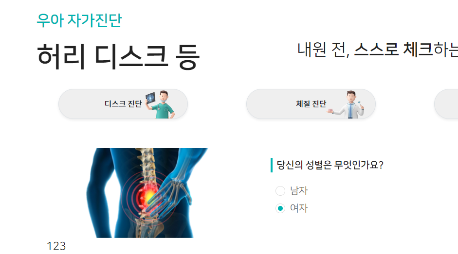

### 섹션 기본 세팅

```html
<!-- 자가진단 -->
<div class="section4">
    <div class="section-title">
        <div>
            <p>우아 자가진단</p>
            <p>허리 디스크 등</p>
        </div>
        <div>
            <strong>스스로 체크</strong>할 수 있는 우아한의원 시스템!
        </div>
    </div>
    <div class="dx-box">
    </div>
</div>
```
```css
.section3, .section4
{
    width: 100%;
    position: relative; /* */
    z-index: 666;
    background: #fff;
}

.section3 > div,
.section4 > div
{
    width: 70%;
    margin: 0 auto;
}

@media screen and (max-width: 991px) {
    .section3 > div,
    .section4 > div
    {
        width: 85%;
    }
}
```
```js
    // section4 건강채널 - title with Velocity
    let scene7 = new ScrollMagic.Scene({
        triggerElement: ".section4",
        // triggerHook: "onCenter",
        triggerHook: "onEnter",
        offset: -80,
    });
    scene7.setVelocity([".section4 > .section-title > div"], {
        top: "0px",
        opacity: "1"
    }, {
        duration: "300",
    });
    controller.addScene(scene7);
```

### 진단 버튼 3개 with div배경 a링크

1. 진단관련 링크 3개를 flex가 아닌 boostrap으로 col-4로 3개를 나열한다.
    - 이 때, div>a의 구성으로서, `div로 배경` + `a로 글자크기 + my`로  배경 + 크기를 구성한다.
    - col-4는 점점 넓어지므로, `px`를 반응형으로 여백을 줘서, div>a의 폭을 줄인다.
    - 진단텍스트용으로, ~991, ~1399, ~ 3가지 반응형 폰트 `fs-dx`를 style.css에 만든다.

```css
.fs-dx-btn {
   font-size: 18px;
}

@media screen and (max-width: 991px) {
   .fs-dx-btn {
      font-size: 9px;
      letter-spacing: -.05rem;
   }
}

@media screen and (min-width: 991px) and (max-width: 1399px) {
   .fs-dx-btn {
      font-size: 13px;
      letter-spacing: -.01rem;
   }
}
```

```html

<div class="dx-box ">
   <!-- 진단 버튼 3개 -->
   <div class="row">
      <div class="col-4 px-3 px-md-4 px-lg-5">
         <div class="text-center rounded rounded-pill border shadow-sm"
              style="background-image: url('images/dx/001.png');
                            background-repeat: no-repeat;
                            background-position: top center;
                            background-size: cover;
                            background-color: #efefef;">
            <a href="#" class="d-inline-block text-decoration-none text-dark fw-bolder ">
               <h6 class="fs-dx-btn my-1 my-md-2 my-lg-3">디스크 진단</h6>
            </a>
         </div>
      </div>
      <div class="col-4 px-3 px-md-4 px-lg-5">
         <div class="text-center rounded rounded-pill border shadow-sm"
              style="background-image: url('images/dx/002.png');
                            background-repeat: no-repeat;
                            background-position: top center;
                            background-size: cover;
                            background-color: #efefef;">
            <a href="#" class="d-inline-block text-decoration-none text-dark fw-bolder ">
               <h6 class="fs-dx-btn my-1 my-md-2 my-lg-3">체질 진단</h6>
            </a>
         </div>
      </div>
      <div class="col-4 px-3 px-md-4 px-lg-5">
         <div class="text-center rounded rounded-pill border shadow-sm"
              style="background-image: url('images/dx/003.png');
                            background-repeat: no-repeat;
                            background-position: top center;
                            background-size: cover;
                            background-color: #efefef;">
            <a href="#" class="d-inline-block text-decoration-none text-dark fw-bolder">
               <h6 class="fs-dx-btn my-1 my-md-2 my-lg-3">문진표 작성</h6>
            </a>
         </div>
      </div>
   </div>
   <div class="row">
      <p>123</p>
      <p>123</p>
      <p>123</p>
      <p>123</p>
   </div>
</div>
```


### 자가진단 페이지 만들기
- form을 만들어서 submit을 하기도 하지만, `page별` `배열 name 1개`  +  `여러개`의 `input` + `label`로 갯수만 체크해서 넘길 수 있다.

1. 질문 만들기
```css
:root {
    /* 자가진단 */
    --dx-question-font-size: 16px; /* 앞에 before의 height도 결정되므로 변수로 정해줌*/
}
@media screen and (max-width: 991px) {
    :root {
        --dx-question-font-size: 11px; /* 앞에 before의 height도 결정되므로 변수로 정해줌*/
    }
}
```
- **빈 form태그 안에 .dx-slide들이 들어갈 것이다.**
```html
<div class="col-12 col-md-7 g-3">
   <form action="">
       <div class="dx-slide">
           <div class="dx-question">
               당신의 성별은 무엇인가요?
           </div>
           <div class="dx-answer">
   
           </div>
       </div>
   </form>
</div>
```
```css
.dx-question {
    margin: 0;
    width: 100%;
    text-align: left;

    position: relative;
    /* 왼쪽에 before를 넣을 공간 */
    padding: 0 0 0 10px;

    font-size: var(--dx-question-font-size);
    line-height: calc(var(--dx-question-font-size)*1.5);
    font-weight: bold;
}

.dx-question:before {
    content: '';
    position: absolute;

    left: 0;
    top: 50%;
    transform: translateY(-50%);

    background: var(--color-main);
    width: 3px;
    height: 100%;
}
```


2. 답변들 만들기
   - **radio의 갯수만큼 input + label을 만들어줘야한다.**
```css
.fs-dx-answer {
    font-size: 18px;
}

@media screen and (max-width: 991px) {
    .fs-dx-answer {
        font-size: 11px;
        letter-spacing: -.01rem;
    }
}

@media screen and (min-width: 991px) and (max-width: 1399px) {
    .fs-dx-answer {
        font-size: 13px;
        letter-spacing: -.005rem;
    }
}
``` 

```html
<div class="dx-answer mt-2 ps-2 ps-lg-3">
   <div class="dx-answer-detail">
      <input type="radio" class="blind"
             name="answerSex"
             id="answer-sex"
      >
      <label for="answer-sex" class="fs-dx-answer">
         남자
      </label>
   </div>

</div>
```
#### radio 답변
3. 답변 중에 radio 답변에서  input radio 은 `.blind`로 숨겨진다
   - name은 다 동일하게 `answerSex`의 camel Case로 준다
   - id는 `-`로 연결하여 label과 연결용으로 쓴다.
4. **input radio를 `형제+`로 가진 label**은 
   - `before로 커스텀 radio`를 가질 것 예정이라 relative를 준다
   - before로 글자크기만큼의 radio모양을 만들 것이므로 padding-left를 그만큼 준다. 클릭이 되도록 cursor도 준다.
```css

/* 답변 - radio */
.dx-box input[type="radio"] + label {
    font-size: var(--dx-question-font-size);
    color: #666;

    position: relative;
    padding-left: var(--dx-question-font-size);

    cursor: pointer;
    display: inline-block;
}
```

5. before는 left 0 top 50%를 줘서 왼쪽 수직가운데 정렬을 하되
   - **transform으로 그 자리에서 x,y는 -50%로 하여, 어떤 공간안에 정가운데로 만들어 -> checked상태일때의 after와 가운데 점을 맞출 수 있게 한다.**
   - w/h를 폰트크기로 준다.
```css
.dx-box input[type="radio"] + label:before {
    content: '';
    position: absolute;

    left: 0;
    top: 50%;
    transform: translate(-50%, -50%);

    width: var(--dx-question-font-size);
    height: var(--dx-question-font-size);

    border: 1px solid #ddd;
    border-radius: 100%;
}
```
6. after는 left 0 top50% + transform -50%, -50%으로 before와 중심을 일치시킨다.
   - 이 때, w/h는 폰트크기의 50%로 줘서, before의 가운데 들어가도록 한다.
   - **display:none을 주고, `input[type="radio"]:checked + label:after `코드를 활용해서 checked된 input의 형제label의 :after에 동그라미를 채우게 한다.**
```css
.dx-box input[type="radio"] + label:after {
    display: none;

    content: '';
    position: absolute;
    left: 0;
    top: 50%;
    transform: translate(-50%, -50%);

    width: calc(var(--dx-question-font-size) * .5);
    height: calc(var(--dx-question-font-size) * .5);

    background: var(--color-main);
    border-radius: 100%;
}

.dx-box input[type="radio"]:checked + label:after {
    display: block;
}
```


7. 이제 질문을 복사하되, label연결되는 input의 id만 바꾸고, name은 똑같이 준다.
   - **value도 주는 데, 남자는1, 여자는2로 준다.**
```html
<div class="dx-answer mt-2 ps-2 ps-lg-3">
    <div class="dx-answer-detail">
        <input type="radio" class="blind"
               name="answerSex"
               id="answer-sex-1"
        >
        <label for="answer-sex-1" class="fs-dx-answer">
            남자
        </label>
    </div>
    <div class="dx-answer-detail">
        <input type="radio" class="blind"
               name="answerSex"
               id="answer-sex-2"
        >
        <label for="answer-sex-2" class="fs-dx-answer">
            여자
        </label>
    </div>
</div>
```




#### 1개 check 답변
1. .dx-slide를 복사해서 중복체크 답변을 만든다.
   - input에서 checkbox 및 name만 바꾼다. id는 -1, -2 씩 늘어간다.
```html
<div class="dx-answer mt-2 ps-2 ps-lg-3">
    <div class="dx-answer-detail">
        <input type="checkbox" class="blind"
               name="family"
               id="family-1"
               value="1"
        >
        <label for="family-1" class="fs-dx-answer">
            할아버지
        </label>
    </div>
</div>
```


2. css는 radio에서 달라지는 부분이
   - before의 radius : 100% -> 3px
   - after를 content 체크 + fz 등으로 조절 (w/h로 하지 않음)
   - 배경 투명색
```css
/* 답변 checkbox */
.dx-box input[type="checkbox"] + label {
    position: relative;
    padding-left: var(--dx-question-font-size);

    font-size: var(--dx-question-font-size);
    color: #666;

    cursor: pointer;
    display: inline-block;
}

.dx-box input[type="checkbox"] + label:before {
    content: '';
    position: absolute;

    left: 0;
    top: 50%;
    transform: translate(-50%, -50%);

    width: var(--dx-question-font-size);
    height: var(--dx-question-font-size);

    border: 1px solid #ddd;
    /*border-radius: 100%;*/
    border-radius: 3px;
}


.dx-box input[type="checkbox"] + label:after {
    display: none;

    /*content: '';*/
    content: '✔';
    text-align: center;
    color: var(--color-main);
    font-weight: 800;
    font-size: calc(var(--dx-question-font-size) * 1.3);

    position: absolute;
    left: 0;
    top: 50%;
    transform: translate(-50%, -50%);

    /*width: calc(var(--dx-question-font-size) * .5);*/
    /*height: calc(var(--dx-question-font-size) * .5);*/


    /*background: var(--color-main);*/
    background: transparent;
    border-radius: 100%;
}

.dx-box input[type="checkbox"]:checked + label:after {
    display: block;
}
```

#### group check 답변 for count
- slide는 넘어가지만, count를 같이 세야 하는 경우, slide가 넘어가더라도 `같은 name[]`을 사용해야하며, jquery로 length만 check된 것으로 셀 것이기 때문에, value는 아무값이나 똑같이 준다.
- 같은 질문(같은name)이지만, count는 세분화될 수 있기 때문에, **`name="질환_a[]"`, `질환_b[]`의 count용 그룹을 따로 name으로 뺀다**
- 아래는 같은 질문이면서, 같은 그룹
