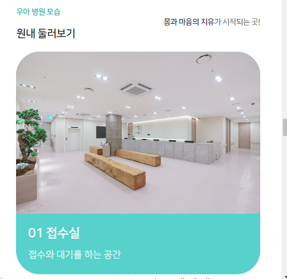
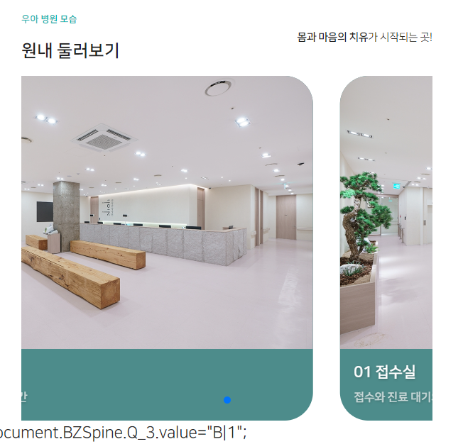
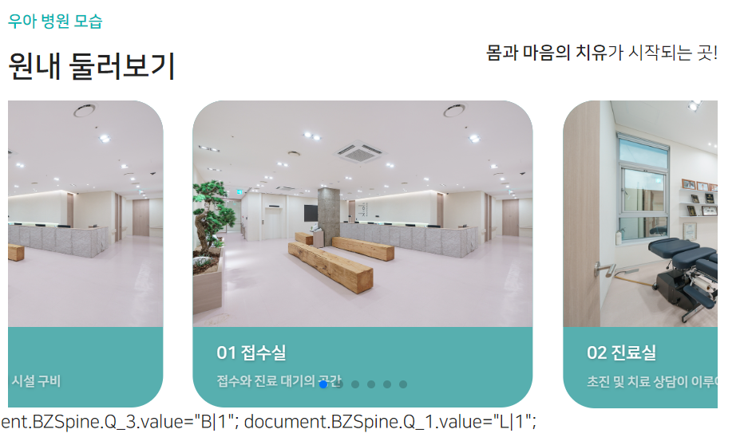
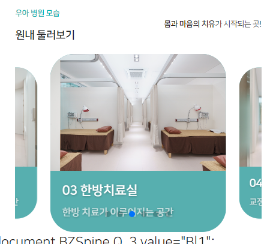
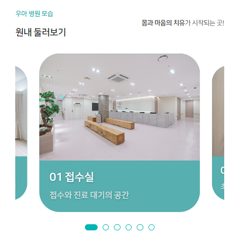

### 섹션 기본 세팅

```html
<!-- 자가진단 -->
<div class="section5">
   <div class="section-title">
      <div>
         <p>우아 자가진단</p>
         <p>허리 디스크 등</p>
      </div>
      <div>
         <strong>스스로 체크</strong>할 수 있는 우아한의원 시스템!
      </div>
   </div>
   <div class="facility-box">
   </div>
</div>
```

```css
.section3, .section5, .section6 {
   width: 100%;
   position: relative; /* */
   z-index: 666;
   background: #fff;
}

.section3 > div,
.section5 > div,
.section6 > div {
   width: 70%;
   margin: 0 auto;
}

@media screen and (max-width: 991px) {
   .section3 > div,
   .section5 > div,
   .section6 > div {
      width: 85%;
   }
}
```

```js
// section5 둘러보기 - title with Velocity
let scene8 = new ScrollMagic.Scene({
    triggerElement: ".section5",
    triggerHook: "onCenter",
    // triggerHook: "onEnter",
    offset: -80,
});
scene8.setVelocity([".section5 > .section-title > div"], {
    top: "0px",
    opacity: "1"
}, {
    duration: "300",
});
controller.addScene(scene8);
```

### 병원 둘러보기 with boostrap card
1. 부트스트랩으로 `.card-img-top`으로 위쪽에 사진배치하는 예시카드를 넣는다.
    - **이 때, .card의 전체 rounded-x 와 .card-img-top의 .rounded-top-x가 동일해야한다.**
```css
/* 글자 투명도 */
.text-white-70 {
    --bs-text-opacity: 1;
    color: rgba(255, 255, 255, 0.7) !important;
}
```

```css
.bg-main-dark {
   background: #4f8c8b;
}
```

```html

<div class="facility-box">
   <div class="row">
      <div class="col">
         <div class="card border-0 bg-main-dark rounded-5">
            
            <div class="card-body text-start ps-3 ps-md-4 ps-lg-5">
               <h5 class="card-title text-white ">접수실</h5>
               <p class="card-text text-truncate text-white-70">접수와 대기를 하는 공간</p>
            </div>
         </div>
      </div>
   </div>
</div>
```
2. font를 정해준다.
```css
.fs-facility-title {
    font-size: 25px;
    font-weight: bold;
}

.fs-facility-text {
    font-size: 16px;
    font-weight: bold;
}


@media screen and (min-width: 992px) and (max-width: 1399px) {
    .fs-facility-title {
        font-size: 20px;
        letter-spacing: -.01rem;
    }
    .fs-facility-text {
        font-size: 16px;
        letter-spacing: -.01rem;
    }
}

@media screen and (max-width: 991px) {
    .fs-facility-title {
        font-size: 17px;
        letter-spacing: -.01rem;
    }
    .fs-facility-text {
        font-size: 13px;
        letter-spacing: -.01rem;
    }
}
```

```html
<div class="card-body text-start ps-3 ps-md-4 ps-lg-5">
    <h5 class="card-title fw-bold text-white fs-facility-title text-shadow">
        01 접수실
    </h5>
    <p class="card-text text-truncate text-white-50 fs-facility-title fs-facility-text">
        접수와 대기를 하는 공간
    </p>
</div>
```




### swiper 적용

1. col <-> .card 사이 container/wrapper/slide 요소를 작성해주고, css로 `container w100%, slide relative` 설정 후, js 초기화한다.
   - container안에 wrapper의 형제로서 pagination까지 추가해준다.

```html

<div class="facility-box">
   <div class="row">
      <div class="col">
         <div class="swiper-container ">
            <div class="swiper-wrapper">
               <!-- slide 1 -->
               <div class="swiper-slide">
                  <div class="card border-0 bg-main-dark rounded-5">
                  </div>
               </div>
            </div>
            <div class="swiper-pagination"></div>
         </div>
      </div>
   </div>
</div>
```
```css
/* 둘러보기 swiper */
.facility-box .swiper-container {
    width: 100%;
}

.facility-box .swiper-container .swiper-slide {
    position: relative;
}
```
```js
    // section5 병원둘러보기
    var facilitySwiper = new Swiper(".facility-box .swiper-container", {
        slidesPerView: 1,
        spaceBetween: 30,
        loop: true,
        pagination: {
            el: ".facility-box .swiper-pagination",
            clickable: true,
        },
    });
```



2. 이제 slide를 여러개 복사해서 만든다.
3. **이제 `slide를 2개씩 보이게하면서, centeredSlides: true`를 주면, 가운데1개, 양끝 2개가 보이게 된다.**
```js
    var facilitySwiper = new Swiper(".facility-box .swiper-container", {
        // slidesPerView: 1,
        slidesPerView: 2,
        centeredSlides: true,
        grapCursor: true,
    });
```



4. 모바일에선, 1개 양쪽으로 조금만 잘려보이도록 `1.4`정도로 `slidesPerView`를 조절, breakpoint를 활용한다.
   - **이 때, spaceBetween은 좀 줄이며, `loopAdditionalSlides`를 추가로 줘서, 렉 안걸리게 만든다.**
```js
 var facilitySwiper = new Swiper(".facility-box .swiper-container", {
     // slidesPerView: 1,
     slidesPerView: 2,
     centeredSlides: true,
     spaceBetween: 30,
     breakpoints: {
         991: {
             slidesPerView: 1.3,
             spaceBetween: 10,
             loopAdditionalSlides: 2, // 없으면 렉걸려서, 1바퀴 밖에 안돈다
         },
     },
```

5. **이제 center를 제외한 양쪽은 .8배로 줄이고, 투명도도 준다?**
   - 참고: https://codepen.io/donmar/pen/OZNEym
   - **`기본으로 0.8`로 주고, `active는 1배`로 지정해준다**
   - **변할 때 transition을 줘야 안어색해진다.**
```css
.facility-box .swiper-container .swiper-slide {
    position: relative;
    /* - 기본 .8 active 1배로 */
    transition:all 200ms linear;
    transform: scale(0.85);
}

.facility-box .swiper-container .swiper-slide.swiper-slide-active {
    transform: scale(1);
}
```
- 좌우가 줄어드는만큼 자동으로 spacebetween이 생기니 줄여준다.
```js
slidesPerView: 2,
centeredSlides: true,
spaceBetween: 15,
breakpoints: {
   991: {
       slidesPerView: 1.3,
       spaceBetween: 0,
       loopAdditionalSlides: 2, // 없으면 렉걸려서, 1바퀴 밖에 안돈다
   },
},
```




6. 이제 페이지네이션을 위한 스타일을 변경해준다.
- container에 pb 3rem을 넣어서, wrapper아래 pagination이 들어갈 위치를 만듦
```css
.facility-box .swiper-container {
    width: 100%;
    /* pagination을 내리기 위한 pb */
    padding-bottom: 3rem;
}
```
- pagination은 bottom 0을 넣음
```css
.facility-box .swiper-pagination {
    bottom: 0;
}
```
7. radius가 걸려있는 bullet에 배경을 투명색으로 주고, border를 색깔을 넣음. opacity가 흐려져있는데 1로 투명도 없앰
```css
.facility-box .swiper-pagination-bullet {
    background: transparent;

    border: 1px solid var(--color-main);
    width: 10px;
    height: 10px;

    opacity: 1;
}
```
- **active bullet에는 width를 늘리고, radius를 10%에서 5px로 줄인다. 배경색을 넣어준다. 이 때, 변화를 자연스럽게 transition을 .5s로 넣어준다.**
```css
.facility-box .swiper-pagination-bullet-active {
    width: 20px;
    border-radius: 5px;
    border: 1px solid transparent;
    
    background-color: var(--color-main);

    transition: width .5s;
}
```


