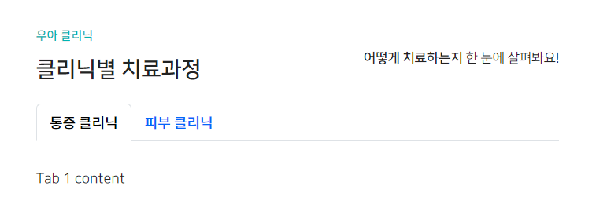
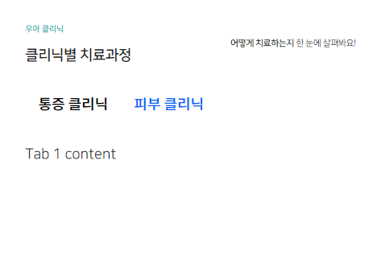
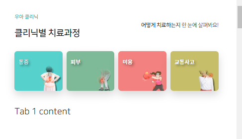
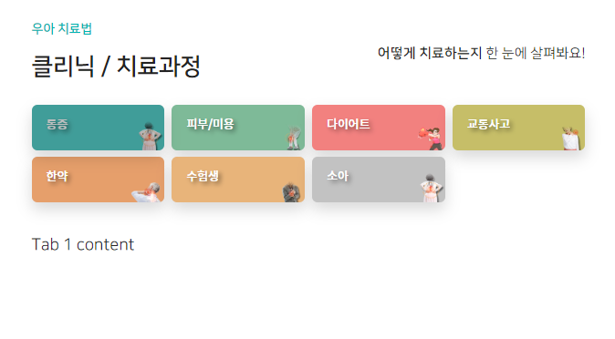
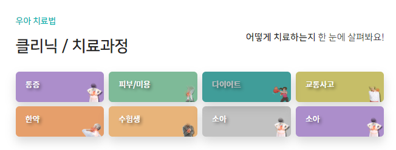

### 섹션 기본 세팅을 .section 으로 통일

1. top/middle/bottom이 없는 section3~5에 대한 설정을 따로 하지말고, .section을 class추가해서, 항상 되도록 수정

```html
<!-- 건강채널 -->
<div class="section section3 mt-5 mt-lg-3"></div>
<!-- 둘러보기 -->
<div class="section section4 mt-5 mt-lg-3"></div>
<!-- 자가진단 -->
<div class="section section5 mt-5 mt-lg-3"></div>
```

```css
/*.section3, .section5, .section4 {*/
.section {
    width: 100%;
    position: relative; /* */
    z-index: 666;
    background: #fff;
}

/*.section3 > div,*/
/*.section5 > div,*/
/*.section4 > div*/
.section > div {
    width: 70%;
    margin: 0 auto;
}

@media screen and (max-width: 991px) {
    /*.section3 > div,*/
    /*.section5 > div,*/
    /*.section4 > div {*/
    .section > div {
        width: 85%;
    }
}
```

### section추가 기본 세팅은 .section .section-x부터 시작

1. html 로 .section .section-x 추가 + 내부에는 .section-title 과 .xxx-box

```html
<!-- 클리닉 -->
<div class="section section6 mt-5 mt-lg-3">
    <div class="section-title">
        <div>
            <p>우아 클리닉</p>
            <p>클리닉별 치료과정</p>
        </div>
        <div>
            <strong>어떻게 치료하는지</strong> 한 눈에 살펴봐요!
        </div>
    </div>
    <div class="clinic-box">
    </div>
</div>
```

2. js로 .section-title에 기본 설정된 opacity를 제거하면서 나타나도록 추가

```js
    // section6 클리닉
let scene9 = new ScrollMagic.Scene({
    triggerElement: ".section6",
    triggerHook: "onCenter",
    // triggerHook: "onEnter",
    offset: -80,
});
scene9.setVelocity([".section6 > .section-title > div"], {
    top: "0px",
    opacity: "1"
}, {
    duration: "300",
});
controller.addScene(scene9);
```

3. boostrap 기본 탭을 가져온다.
    1. tab ul.`nav-tabs`의 id는 `clinic-tab` -> div.tab-content의 id는 `clinic-tab-content`로 tab에서 content로 연결가능성을 열어둔다.
    2. 각 tab의 id는 `youtube-clinic-1,2,3`, 각 content 이자 tab의 href=#의 id는 맞춰서, `contents-clinic-all or 1,2,3,`로 만들어준다.

```html

<div class="clinic-box">
    <ul class="nav nav-tabs mb-3" id="clinic-tab" role="tablist">
        <li class="nav-item" role="presentation">
            <a class="nav-link active"
               id="clinic-tab-1"
               data-bs-toggle="tab"
               href="#contents-clinic-1"
               role="tab"
            >
                통증 클리닉
            </a>
        </li>
        <li class="nav-item" role="presentation">
            <a class="nav-link"
               id="clinic-tab-2"
               data-bs-toggle="tab"
               href="#contents-clinic-2"
               role="tab"
            >
                피부 클리닉
            </a>
        </li>
    </ul>
    <div class="tab-content" id="clinic-tab-content">
        <div class="tab-pane fade show active"
             id="contents-clinic-1"
             role="tabpanel"
        >
            Tab 1 content
        </div>
        <div class="tab-pane fade"
             id="contents-clinic-2"
             role="tabpanel"
        >
            Tab 2 content
        </div>
    </div>
</div>
``` 

4. 일단 tab이 들어가있는 부모 `.clinic-box`에 상하패딩을 준다.

```css
/* 클리닉별 치료과정 (tab) */
.section6 .clinic-box {
    padding: 10px 0;
}
```



5. tab의 border 기본스타일을 제거해준다.

```css
/* - tab 기본 border 2개 제거 */
.section6 .clinic-box .nav-tabs,
.section6 .clinic-box .nav-tabs > li > a {
    border: none !important;
}
```



#### tab안에 row/col로 card넣기

1. a안에 클리닉 row/col/div의 card를 집어넣어야한다.
    - **이 때, `ul.nav`가 `flex`를 설정되어 있지만, `.row`를 직접 줘야 `.g-x`로 col-x를 채우면서 간격을 줄 수 있다.**
    - **`li.nav-item`들이 flex-item 이자 row의 `col-x`들로서 간격을 조절한다.**
    - 카드형태의 `div.w-100.h-100`의 부모는 `a태그`이므로, 배경을 차지하는 div의 부모는 `a.nav-link`가 되므로 a태그에 `height를 동적으로 지정`해준다.

2. ul.nav-tabs에 `.row .g-2 .g-lg-3`  / 각 li.nav-item에 `.col-3 .col-lg-2`로 4개 -> 6개짜리 칼럼 만들기
    - **.g-2의 간격은 .row를 안주면 안먹힌다.**

```html

<div class="clinic-box">
    <ul class="nav nav-tabs mb-3 row g-2 g-lg-3" id="clinic-tab" role="tablist">
        <li class="nav-item col-3 col-lg-2" role="presentation">
```

3. 각 div의 부모 a태그는 height를 지정해주되
    - 80 -> 100 (md) -> 120px (lg)로 동적으로 지정해주기

```css
/* - tab col들의 높이를 담당하는 a가 동적으로 */
.section6 .clinic-box .nav-tabs > li > a {
    height: 100px;
}

@media screen and (max-width: 991px) {
    .section6 .clinic-box .nav-tabs > li > a {
        height: 80px;
    }
}
```

4. 각 영역은 텍스트 좌측정렬 `.text-start`이면서 **lg에서 `.text-lg-center`를 넣어주기 전까진 좌측 여백 / 위쪽여백은 항상 넣어주기**
    - w100, h100으로 영역전체를 차지하면서 배경주기
    - **배경은 `-color`가 더 아래 깔리며, `-image`를 `no-repeat + bottom right + contain`으로 `우측하단에 위치`시키기**
    - 글자는 small태그에 주되, 공백+클리닉 단어는, md부터 보이도록 만들기
    - 글자체는 `.fs-clinic` 구현해서, 11 -> 13-> 15-> 18px로 세세하게 조정해주기

```css
.fs-clinic-tab {
   font-size: 18px;
}

@media screen and (min-width: 992px) and (max-width: 1399px) {
   .fs-clinic-tab {
      font-size: 15px;
      letter-spacing: -.005rem;
   }
}

@media screen and (min-width: 576px) and (max-width: 991px) {
   .fs-clinic-tab {
      font-size: 13px;
      letter-spacing: -.01rem;
   }
}

@media screen and (max-width: 575px) {
   .fs-clinic-tab {
      font-size: 11px;
      letter-spacing: -.01rem;
   }
}
```

```html

<div class="clinic-box">
   <ul class="nav nav-tabs mb-3 row g-2 g-lg-3" id="clinic-tab" role="tablist">
      <li class="nav-item col-3 col-lg-2" role="presentation">
         <a class="nav-link active"
            id="clinic-tab-1"
            data-bs-toggle="tab"
            href="#contents-clinic-1"
            role="tab"
         >
            <div class="text-start ps-2 pt-1 ps-sm-3 text-lg-center ps-lg-0 pt-lg-3  w-100 h-100 rounded text-white shadow"
                 style="background-image: url('images/clinic/001_AB90CD.png');
                            background-repeat: no-repeat;
                            background-position: bottom right;
                            background-size: contain;
                            background-color: #AB90CD;
                            "
            >
               <small class="fs-clinic-tab text-shadow">
                  통증
                  <span class="d-none d-md-inline-block">&nbsp;클리닉</span>
               </small>
            </div>
         </a>
      </li>
```

5. tab active == `a.active`일 시, 자식 div의 배경과 글자색 변환 + 애니메이션 .5s 를 !important로

```css
/* - tab active일시, 자식div의 배경과 글자색 변경하기 */
.section6 .clinic-box .nav-tabs > li > a.active > div {
    background-color: var(--color-main-light) !important;
    color: #ddd !important;
    transition: all .5s !important;
}
```

- 이제 탭4개를 복사해서 색깔을 지정해주기
  


6. **div의 배경 지정 중에, `공통되면서 css`로 되는 부분은 css로 넘기기**

- 기존

```html

<div class="text-start ps-2 pt-1 ps-sm-3 text-lg-center ps-lg-0 pt-lg-3  w-100 h-100 rounded text-white shadow"
     style="background-image: url('images/clinic/001_AB90CD.png');
                            background-repeat: no-repeat;
                            background-position: bottom right;
                            background-size: contain;
                            background-color: #AB90CD;
                            "
>
   <small class="fs-clinic-tab text-shadow">
      통증
      <span class="d-none d-md-inline-block">&nbsp;클리닉</span>
   </small>
</div>
```

- 변경

```css
/* - tab a>div의 공통 성질만 정리 */
.section6 .clinic-box .nav-tabs > li > a > div {
    background-repeat: no-repeat;
    background-position: bottom right;
    background-size: contain;
}
```

```html

<div class="text-start ps-2 pt-1 ps-sm-3 text-lg-center ps-lg-0 pt-lg-3  w-100 h-100 rounded text-white shadow"
     style="background-image: url('images/clinic/001_AB90CD.png');
            background-color: #AB90CD;
            "
>
   <small class="fs-clinic-tab text-shadow">
      통증
      <span class="d-none d-md-inline-block">&nbsp;클리닉</span>
   </small>
</div>
```

7. **색은 변수로 지정해놓고, 한약carousel색을 활용하여 clinic까지 처리되게 하기**
   - carousel이랑 clinic이랑 따로 관리한다.
   - **clinic은 `li의 순서를 기준`으로 div에 색을 부여한다.**

```css
:root {
    /* 한약 carousel 및 clinic 색*/
    --color-carousel-1: #ffdbc6;
    --color-carousel-1-bolder: #ff6b29;

    --color-clinic-1: #AB90CD;

}
```

```css
.section2-bottom .swiper-container .swiper-slide:nth-child(1) {
    background: var(--color-carousel-1);
}

/* - 1번째 bullet */
.section2-bottom .swiper-container .swiper-pagination .my-bullet:nth-child(1) {
    color: var(--color-carousel-1-bolder); /* 글자색(표기안됨) or box-shadow 색 */
    background: var(--color-carousel-1-bolder); /* 배경색 */
}
```

```css
/* - div의 li 순서대로 div 색 배정 */
.section6 .clinic-box .nav-tabs > li:nth-child(1) > a > div {
   background-color: var(--color-clinic-1);
}

.section6 .clinic-box .nav-tabs > li:nth-child(2) > a > div {
   background-color: var(--color-clinic-2);
}
```

```html

<div class="text-start ps-2 pt-1 ps-sm-3 text-lg-center ps-lg-0 pt-lg-3  w-100 h-100 rounded text-white shadow"
     style="background-image: url('images/clinic/001_AB90CD.png');"
>
   <small class="fs-clinic-tab text-shadow">
      통증
      <span class="d-none d-md-inline-block">&nbsp;클리닉</span>
   </small>
</div>
```


#### 색깔 돌려쓰기
1. carousel과 clinic의 총 갯수를 `총갯수n + 현재숫자`로 변경한다. 마지막만 `총갯수n`으로 바꾼다.
```css
/* - slide 1 */
.section2-bottom .swiper-container .swiper-slide:nth-child(4n+1) {
    background: var(--color-carousel-1);
}
/* - slide 2 */
.section2-bottom .swiper-container .swiper-slide:nth-child(4n+2) {
    background: var(--color-carousel-2);
}
/* - slide 3 */
.section2-bottom .swiper-container .swiper-slide:nth-child(4n+3) {
    background: var(--color-carousel-3);
}
/* - slide 4 */
.section2-bottom .swiper-container .swiper-slide:nth-child(4n) {
    background: #dbdbdb;
}
```
```css
/* - div의 li 순서대로 div 색 배정 */
.section6 .clinic-box .nav-tabs > li:nth-child(7n+1) > a > div {
    background-color: var(--color-clinic-1)!important;
}

.section6 .clinic-box .nav-tabs > li:nth-child(7n+2) > a > div {
    background-color: var(--color-clinic-2)!important;
}

.section6 .clinic-box .nav-tabs > li:nth-child(7n+3) > a > div {
    background-color: var(--color-clinic-3)!important;
}

.section6 .clinic-box .nav-tabs > li:nth-child(7n+4) > a > div {
    background-color: var(--color-clinic-4)!important;
}
.section6 .clinic-box .nav-tabs > li:nth-child(7n+5) > a > div {
    background-color: var(--color-clinic-5)!important;
}
.section6 .clinic-box .nav-tabs > li:nth-child(7n+6) > a > div {
    background-color: var(--color-clinic-6)!important;
}
.section6 .clinic-box .nav-tabs > li:nth-child(7n) > a > div {
    background-color: var(--color-clinic-7)!important;
}

```



#### tab content 정의
1. 제목과 content를 나누기 위해 `.d-flex .flex-column` 으로 세로배치하고, 2 row들은 `.w-100`을 맥여준다.
```html

<div class="d-flex flex-column">
    <!-- 상단 제목 -->
    <div class="w-100"></div>
    <!-- 치료과정 content -->
    <div class="w-100"></div>
```

2. 각각의 배경을 img로 css 1번째, 2번째로 매겨준다.
```css
.section6 .clinic-box .tab-content > .tab-pane > div > div:nth-child(1) {
    background: #364444 url(../images/clinic/bg_title.png)  100% 100%!important;
    background-size: cover;
}
.section6 .clinic-box .tab-content > .tab-pane > div > div:nth-child(2) {
    background: #364444 url(../images/clinic/bg_clinic.png)  100% 100%!important;
    background-size: cover;
}
```

3. 상단 제목은 `.d-flex .align-items-center`로 2개의 칼럼을 수직가운데 정렬되게 하고, px, py로 글자간의 여백을 준다.
   - 1칼럼은 `.ps-2`로 여백을 좀 더주고, 2칼럼은 `.ms-auto`로 오른쪽에 배치한다.
   - 제목옆에 부제목은 small태그로 md이후부터 보이게 한다.
   - 오른쪽배치된 더 알아보기 버튼은 `.btn .btn-sm`으로 버튼형식으로 만든 뒤, **style로 .2 흰색 투명도 배경을 준다.**
```html
 <!-- 상단 제목 -->
<div class="w-100 d-flex align-items-center py-2 px-3 text-white">
    <div class="ps-2">
        <h5 class="m-0 fs-clinic-title font-sans fw-light text-white text-shadow">
            통증 클리닉
            <small class="d-none d-lg-inline-block ms-3 font-serif text-white text-shadow-none underline underline-white">
                공간을 확보하고 염증을 잡아 일상 디스크 통증 개선
            </small>
        </h5>
    </div>
    <div class="ms-auto">
        <a class="fs-clinic-title btn btn-sm border-white text-white rounded-0" href="#"
           style="background:rgba(255, 255, 225, 0.2);">
            더 알아보기
        </a>
    </div>
</div>
```

4. 치료과정 content 역시 d-flex를 줘서 칼럼을 치료전후 사진 <-> 치료과정으로 나눈다.
   - 이 때, 나눠지는 칼럼2개는 모바일에선 반반 -> `.col-6`이다가 lg에서는 1:2로서 `.col-4`와 `.col-8`로 준다.
   - **각각의 칼럼 영역에서는 세로로 + 가운데정렬시키기 위해 `.d-flex.flex-column.align-items-center`를 준다.**
   - `치료 전후 사진`은 img태그가 다 안붙게 px-를 주고 / `치료과정`은 각 요소들외에 위아래 간격을 my로 준다.
   - 치료과정은, 여러개의 flex-item들이 세로로 나열되는데, `gap-`을 통해서, 간격을 직접 만든다.
   - 또한 margin을 제외한 부분에서 왼쪽에 border를 `.border-start`로 긋되, `.border-main`으로 색을 만들어서 긋는다.
   - **또한, 치료과정의 각 row별로 화살표가 생길 것인데, 자식들의 공통 부모로서 `.clinic-arrow-parent`를 박아놓고, 마지막것을 제외하고 판단할 수잇게 한다.**
   - 치료과정에 나오는 텍스트들이 모두 가운데 정렬을 기본으로 하도록 `.text-center`도 넣어준다.
```html
   <!-- 치료과정 content -->
<div class="w-100 d-flex">
    <!-- col 1. 치료 전/후 -->
    <div class="col-6 col-lg-4 d-flex flex-column align-items-center justify-content-center px-4">
    </div>
    <!-- col 2. 치료방법 -->
   <div class="col-6 col-lg-8 d-flex flex-column align-items-center my-3 my-lg-5 gap-4 gap-lg-5 border-start border-main font-serif clinic-arrow-parent text-center">

    </div>
</div>
```
```css
/* border */
.border-main {
    border-color: var(--color-main-dark) !important;
}
```

#### 치료 전후사진 칼럼
1. 이제 치료전후사진의 세부내용을 볼 때, before/after가 세로로 가득차도록 만들어줘야한다.
   - **그러기 위해 flex-item마다 `.flex-fill`을 다 넣어줘서, 각각이 최대한 벌리게 만든다.**
   - **또한, 각각을 가운데/수직가운데 정렬해주기 위해  `.d-flex`를 넣어주고, `위쪽 flex만 .border-bottom`을 넣어준다.**
```html
<!-- col 1. 치료 전/후 -->
<div class="col-6 col-lg-4 d-flex flex-column align-items-center justify-content-center px-4">
    <div class="flex-fill d-flex justify-content-center align-items-center border-bottom border-main">
    </div>
    <div class="flex-fill d-flex justify-content-center align-items-center ">
    </div>
</div>
```

6. 치료 전후사진은 figure로 figcaption과 같이 함께 다는데,
   - **`.img-fluid`(max-width:100%)를 `.w-100`과 함께 쓴 뒤, min/max-widht를 style로 직접 지정해줘서, 모바일에선 너무 작아지지 않게 + lg에선 너무 크지지 않게 한다.**

```html
<!-- col 1. 치료 전/후 -->
<div class="col-6 col-lg-4 d-flex flex-column align-items-center justify-content-center px-4">
    <div class="flex-fill d-flex justify-content-center align-items-center border-bottom border-main">
        <figure class="figure">
            
            <figcaption class="figure-caption text-center mt-3">
                <span class="font-sans fs-clinic-therapy">치료 전</span>
            </figcaption>
        </figure>
    </div>
    <div class="flex-fill d-flex justify-content-center align-items-center ">
        <figure class="figure">
            
            <figcaption class="figure-caption text-center mt-3">
                <span class="font-sans fs-clinic-therapy">치료 후</span>
            </figcaption>
        </figure>
    </div>
</div>
```

#### 치료과정 칼럼
1. .flex-column에 의해 생긴 row들은 모두 동일공간을 차지 하기 위해 각각 `.flex-grow-1`을 명시해준다.
   - 각 치료법마다 col로 처리하기 위해 `.row`를 붙혀주고 `사진 vs 글세트`를 gap으로 row에서 조정되게 한다. 각 치료법의 부모로서 `.clinic-arrow`를 달아서 화살표가 달리게 한다.
   - 이 때, 그림/ 치료법 + 치료설명으로 구성되는데, 각 `12` + `12`로 모바일에선 각각 row로 차지하게 하고, `3` + `9`로 lg에서 비율을 가져 가로로 나열되게 한다
   - 이 때, 그림div는 px-2, px-lg-4로 그림이 칼럼이 꽉 안차게 한다. 가운데/수직가운데 정렬을 위해 `.d-flex`를 설정해준다.
   - 치료설명은 md부터 나오게 한다.
   - **치료법에는 `.underline .underline-clinic`으로 밑줄이 끄이게 한다.**
```css
.underline {
    position: relative;
}

.underline:before{
    position: absolute;
    content: '';

    left: 0;
    bottom: 0;
    width: 100%;

    /*height: 4em;*/
    border-bottom: 4px solid #ddd;
    opacity: .2;
}
.underline-clinic:before{
    bottom: 3px;
    border-color: #a0c79c;
    opacity: .2;
}
```
- **`.clinic-arrow`는 부모를 기준으로 마지막을 제외하고 나타나게 한다. 이 때, lg부터는 left를 38%정도로 놔서, 치료법 아래 찍히게  잡았다. 그리고 transform으로 크기를 늘린다.**
```css
/* 각 치료법row마다 아래방향 화살표(마지막은 제외) */
/* - 공통부모 중 젤 빠른 것에 .clinic-with-arrow를 삽입 */
/* - 화살표를 받을 각 row들에 .clinic-arrow 삽입 */
.clinic-arrow-parent div .clinic-arrow {
    position: relative;
}

.clinic-arrow-parent div:not(:last-of-type) .clinic-arrow::after {
    position: absolute;
    content: '';

    left:50%;
    bottom:0;
    width: 30px;
    height: 20px;

    background: url("../images/clinic/arrow-down2.png") no-repeat 50% 50%;
    background-size: contain;
    transform: translate(-50%, 100%) ;

    z-index: 2;
}


@media screen and (min-width: 992px){
    .clinic-arrow-parent div:not(:last-of-type) .clinic-arrow::after {
        left:38%; /* lg시 치료명의 중점과 일치하는 곳에 화살표 두기 */
        bottom:0;
        transform: translate(-38%, 100%) scale(1.8);
    }
}
```
```html
<!-- 치료법 1: 부/뜸 -->
<div class="flex-grow-1 row m-0 p-0">
    <div class="clinic-arrow row m-0 p-0 gap-1 gap-lg-0">
        <div class="col-12 px-4 col-lg-3 px-lg-2 d-flex justify-content-center align-items-center">
            
        </div>
        <div class="col-12 col-lg-9 d-flex justify-content-center align-items-center m-0">
            <div class="row m-0 p-0 g-1 w-100">
                <div class="col-12 col-lg-4 d-flex justify-content-center align-items-center">
                    <a class="text-decoration-none"
                       href="#">
                            <span class="font-serif fw-bold underline underline-clinic text-main-dark fs-clinic-therapy">
                                부항/뜸/전기치료
                            </span>
                    </a>
                </div>
                <div class="d-none d-md-block col-12 col-lg-8 d-flex justify-content-center align-items-center">
                    <p class="m-0 fs-clinic-therapy-desc text-clinic-desc px-5 py-1 py-lg-0 text-">
                        경결된 조직을 이완시키고 혈액순환 도모. 환부에 약한 전기자극으로 면역물질 활성화.
                    </p>
                </div>
            </div>
        </div>
    </div>
</div>
```

2. 필요한 갯수만큼 복사한다.


### 제목 없애기
1. 상단제목 html 주석
```html
 <!-- 상단 제목 -->
<!--                    <div class="w-100 d-flex align-items-center py-2 px-3 text-white">-->
<!--                        <div class="ps-2 ">-->
<!--                            <h5 class="m-0 fs-clinic-title font-sans fw-light text-white text-shadow">-->
<!--                                통증 클리닉-->
<!--                                <small class="d-none d-lg-inline-block ms-3 font-serif text-white text-shadow-none underline underline-white">-->
<!--                                    공간을 확보하고 염증을 잡아 일상 디스크 통증 개선-->
<!--                                </small>-->
<!--                            </h5>-->
<!--                        </div>-->
<!--                        <div class="ms-auto">-->
<!--                            <a class="fs-clinic-tab btn btn-sm border-white text-white rounded-0" href="#"-->
<!--                               style="background:rgba(255, 255, 225, 0.2);">-->
<!--                                더 알아보기-->
<!--                            </a>-->
<!--                        </div>-->
<!--                    </div>-->
```
2. css에서 배경주는 것 주석 처리
```css
/* - tab conntent의 tab-pane 순서대로 div 색 배정 */
/*.section6 .clinic-box .tab-content > .tab-pane > div > div:nth-child(1) {*/
/*    !*background-color: var(--color-main-light) !important;*!*/
/*    !*background-color: var(--color-clinic-1)!important;*!*/
/*    background: #364444 url(../images/clinic/bg_title.png) 100% 100% !important;*/
/*    background-size: cover;*/
/*}*/

/*.section6 .clinic-box .tab-content > .tab-pane:nth-child(7n+1) > div > div:nth-child(2) {*/

/*.section6 .clinic-box .tab-content > .tab-pane > div > div:nth-child(2) {*/
/*    background: #364444 url(../images/clinic/bg_clinic.png) 100% 100% !important;*/
/*    background-size: cover;*/
/*}*/
```
3. 치료법 사진을 키우기 위해 px- 5 -> 4로 낮추기
```html
<!--<div class="col-12 px-5 col-lg-3 px-lg-2 d-flex justify-content-center align-items-center">-->
<div class="col-12 px-4 col-lg-3 px-lg-2 d-flex justify-content-center align-items-center">
```

4. col-gap을 낮추고, 화살표 크기 줄이기 + bottom 조절
```css
.clinic-arrow-parent div:not(:last-of-type) .clinic-arrow::after {
    /*bottom: 0;*/
    bottom: 4px;
    /*width: 30px;*/
    width: 20px;
}
```
