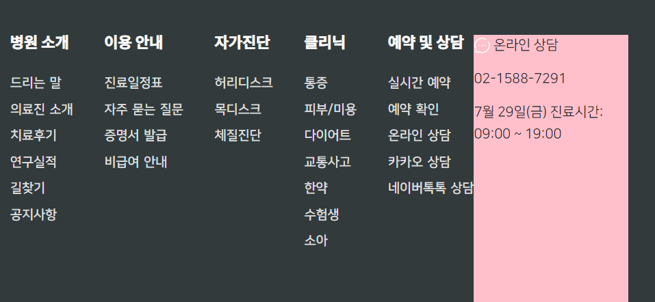

1. .footer > .footer-in 으로 틀 잡고, 내부에 footer-top, -bottom 2부분으로 나눈다.

```html
<!-- footer -->
<div class="footer">
    <div class="footer-in">
        <div class="footer-top"></div>
        <div class="footer-bottom"></div>
    </div>
</div>
```

2. .footer 자체에는 w100%, bg, padding-top을 준다.

```css
/* footer */
.footer {
    width: 100%;
    padding-top: 60px;
    background: var(--color-main);
}
```

3. .footer-in 은 container개념으로 width를 section과 같은 비율( `lg 70% -> 모바일 85%` )만들어준다.
    - h는 임의로 1000px을 주고, `margin: 0 auto;`로 top, bottom을 가운데 정렬을 만든다.
    - 배경은 임의로 red로 준다.

```css
.footer > .footer-in {
    width: 70%;
    margin: 0 auto;

    height: 1000px;
    background: red;
}

@media screen and (max-width: 991px) {
    .footer > .footer-in {
        width: 85%;
    }
}
``` 


4. top에는 left와 right를 75/25%로 갈라준다.
    - **flex를 안쓰고 가르려면, `부모.clearfix` + `왼쪽.float-start` + `오른쪽.float-end`를 준다.**

```html

<div class="footer-top clearfix">
    <div class="footer-top-left w-75 float-start"></div>
    <div class="footer-top-right w-25 float-end"></div>
</div>
```

- 확인을 위해 배경만 css로 넣어주고, height는 전체의 절반인 500px로 준다.


5. 이제 배치할 메뉴들을 .footer-top-left에 dl > dt + dd들 로 배치한다.

```html

<div class="footer-top-left w-75 float-start">
    <dl>
        <dt>병원 소개</dt>
        <dd>드리는 말</dd>
        <dd>의료진 소개</dd>
        <dd>치료후기</dd>
        <dd>연구실적</dd>
        <dd>길찾기</dd>
        <dd>공지사항</dd>
    </dl>
    <dl>
        <dt>이용 안내</dt>
        <dd>진료일정표</dd>
        <dd>자주 묻는 질문</dd>
        <dd>증명서 발급</dd>
        <dd>비급여 안내</dd>
    </dl>
    <dl>
        <dt>자가진단</dt>
        <dd>허리디스크</dd>
        <dd>목디스크</dd>
        <dd>체질진단</dd>
    </dl>
    <dl>
        <dt>클리닉</dt>
        <dd>통증</dd>
        <dd>피부/미용</dd>
        <dd>다이어트</dd>
        <dd>교통사고</dd>
        <dd>한약</dd>
        <dd>수험생</dd>
        <dd>소아</dd>
    </dl>
    <dl>
        <dt>예약 및 상담</dt>
        <dd>실시간 예약</dd>
        <dd>예약 확인</dd>
        <dd>온라인 상담</dd>
        <dd>카카오 상담</dd>
    </dl>
</div>
```

6. 각 dl들을 가로배치하기 위해서, `.d-flex` + `between`으로 배치해준다.

```html

<div class="footer-top-left w-75 float-start d-flex justify-content-between">
```


7. 이제 dl들의 dt스타일과 dd스타일을 css로 정의해준다.

- dt에서는 style을 정해주고, mb를 줘서, dd들과의 거리를 벌린다.

```css
/* top-left dt + dd */
.footer-top > .footer-top-left dt {
    font-size: 20px;
    line-height: 17px;
    color: #fff;
    font-family: var(--primary-font-family);
    /*font-weight: bold;*/

    margin-bottom: 10px;
}
```


- dd들은 스타일을 정하고, 역시 mb로 서로 간격을 벌린다.

```css
.footer-top > .footer-top-left dd {
    font-size: 17px;
    line-height: 17px;
    color: #ddd;
    font-family: var(--third-font-family);
    font-weight: bold;

    margin-bottom: 18px;
}
```


8. top-right는 p태그로 3줄을 만들고
    - 첫줄에는 a > svg를 얻어와서 상담

```html

<div class="footer-top-right w-25 float-end">
    <p>
        <a href="#">
            <svg width="22px" height="22px" viewBox="0 0 24 24" fill="none">
                <path d="M17 3.33782C15.5291 2.48697 13.8214 2 12 2C6.47715 2 2 6.47715 2 12C2 13.5997 2.37562 15.1116 3.04346 16.4525C3.22094 16.8088 3.28001 17.2161 3.17712 17.6006L2.58151 19.8267C2.32295 20.793 3.20701 21.677 4.17335 21.4185L6.39939 20.8229C6.78393 20.72 7.19121 20.7791 7.54753 20.9565C8.88837 21.6244 10.4003 22 12 22C17.5228 22 22 17.5228 22 12C22 10.1786 21.513 8.47087 20.6622 7"
                      stroke="#fff" stroke-width="1.5" stroke-linecap="round"/>
                <path d="M8 12H8.009M11.991 12H12M15.991 12H16" stroke="#fff" stroke-width="2"
                      stroke-linecap="round" stroke-linejoin="round"/>
            </svg>
            온라인 상담
        </a>
    </p>
    <p>02-1588-7291</p>
    <p>7월 29일(금) 진료시간: 09:00 ~ 19:00</p>
</div>
``` 



9. 이제 right의 css에 text-align:center로 내부요소들을 가운데 정렬시킨다.

```html

<div class="footer-top-right w-25 float-end text-center">
```

10. css에서 p:nth-child(x) 를 이용하여 각각을 꾸민다.

```css
.footer-top > .footer-top-right > p:nth-child(1) a {
    font-size: 18px;
    color: #fff;
}

.footer-top > .footer-top-right > p:nth-child(2) {
    margin-top: 40px;
    margin-bottom: 0;
    font-size: 20px;
    font-weight: bold;
    letter-spacing: -.05rem;
    color: var(--color-main-light);
}

.footer-top > .footer-top-right > p:nth-child(3) {
    font-size: 12px;
    color: #ddd;
}
```


11. 이제 footer-top 자체에 pb을 줘서, 아래와의 간격을 padding으로 벌려서 border를 그려놓는다.

```css
.footer-in > .footer-top {
    padding-bottom: 76px;
    border-bottom: 1px #ddd solid;
}
```


#### footer-bottom

1. top처럼 left, right를 만들고 `w-x 없이 내용만큼만 차지`하게 둔 뒤, float를 각각 주고, bottom에 clearfix를 준다.

```html

<div class="footer-bottom clearfix">
    <div class="footer-bottom-left float-start"></div>
    <div class="footer-bottom-right float-end"></div>
</div>
```

2. copyright 이후 a태그 사이에 `|`를 심어둔다.

```html

<div class="footer-bottom clearfix">
    <div class="footer-bottom-left float-start">
        Copyrightⓒ 2023 우아한의원 ALL RIGHTS RESERVED
        <a href="#" class="">이용약관</a>
        |
        <a href="#" class="">개인정보처리방침</a>
        |
        <a href="#" class="">이메일무단수집거부</a>
    </div>
    <div class="footer-bottom-right float-end">
        <span>대표 및 개인정보관리책임자: 조재성</span>
        <span>사업자등록번호: 000-00-00000</span>
    </div>
</div>
```

3. bottom은 1줄 컨셉이라 padding을 위아래 10만 주고, fz를 정해준다.

```css
/* bottom */
.footer-in > .footer-bottom {
    padding: 10px 0;
    font-size: 12px;
    color: #ddd;
}
```

4. a태그의 글자체는 따로 직접 지정해줘야한다.

```css
.footer-in > .footer-bottom a {
    font-size: 12px;
    color: #fff;
}
```

5. right의 span태그 2개 중 마지막은 margin으로 왼쪽과 띄운다.

```html

<div class="footer-bottom-right float-end">
    <span>대표 및 개인정보관리책임자: 조재성</span>
    <span class="ms-3">사업자등록번호: 000-00-00000</span>
</div>
```


### 반응형으로 만들기

1. footer-in을 container개념의 85%로 줬는데, 모바일에선 100%로 만들고 padding을 좌우로 주기

```css
@media screen and (max-width: 991px) {
    .footer > .footer-in {
        /*width: 85%;*/
        width: 100%;
        padding: 0 20px;
    }
}
```

2. **mobile에선 top-left, right의 메뉴를 `float를 제거하고 w100%으로 채워, 각row로 차지`하게 한다.**
    - 이 때 boostrap으로 `.float-x, .w-x`가 걸려있으니 `!important`로 준다.

```css
/* - 모바일에선 top-left float 제거 */
@media screen and (max-width: 991px){
   .footer-in > .footer-top > .footer-top-left {
      float: none!important;
      width: 100%!important;
   }
}

/* - 모바일에선 top-right float 제거 */
@media screen and (max-width: 991px){
   .footer-in > .footer-top > .footer-top-right
   {
      float: none!important;
      width: 100%!important;
   }
}
```


3. `모바일css`에서 **`하위메뉴인 dd들을 display:none`으로 접는다.**
```css
/* 모바일에선 하위메뉴dd를 일단 안보이게 접기 */
@media screen and (max-width: 991px){
    .footer-top > .footer-top-left dd {
        display: none;
    }
}
```
4. 이제 메뉴들의 부모인 top-left를 flex + `between` -> `flex-wrap:wrap`으로 변경해주고 해주고, 상위메뉴인 `dl`들을 각각 `w-100`으로 벌려준다.
```css
@media screen and (max-width: 991px){
    /* - 모바일에선 top-left( float 제거 + wrap) */
    .footer-in > .footer-top > .footer-top-left {
        float: none!important;
        width: 100%!important;

        flex-wrap: wrap!important;
    }
    /* 상위메뉴 dl을 w-100으로 벌리기 */
    .footer-in > .footer-top > .footer-top-left dl {
        width: 100%;
    }
}
```
5. **left, right 각각 h500px을 줬던 것을 삭제하고, .footer-in에 h-auto를 준다.**
```css
.footer > .footer-in {
    width: 70%;
    margin: 0 auto;

    /*height: 1000px;*/
    height: auto;
}
```
6. lg에서 dt마다 줬던 mb를 40 -> 0으로 제거후, `height + lh`를 직접 글자2.5배로 지정하여 글자는 가운데 정렬되게 한다.
```css
@media screen and (max-width: 991px){
   .footer-top > .footer-top-left dt {
      margin: 0; /* lg mb 40px -> mobile 0*/

      line-height: 50px;
      height: 50px;
   }
}
```
7. **각 dt(상위메뉴)의 after에 absolute가 아닌 `float:right`로 +버튼을 배정해준다.**
```css
@media screen and (max-width: 991px){
   .footer-top > .footer-top-left dt {
      margin: 0; /* lg mb 40px -> mobile 0*/

      line-height: 50px;
      height: 50px;
   }

   .footer-top > .footer-top-left dt::after {
      content: '+';

      float: right;
      font-size: 20px;
      font-weight: normal;
   }
}
```


8. **dl자체의 margin을 `.m-0`으로 제거해준다. (원래 없어야함)**
```html
<dl class="m-0">
    <dt>예약 및 상담</dt>
    <dd>실시간 예약</dd>
    <dd>예약 확인</dd>
    <dd>온라인 상담</dd>
    <dd>카카오 상담</dd>
    <dd>네이버톡톡 상담</dd>
</dl>
```


9. 이제 right의 p태그들을 정리한다.
- 오히려 float안된 놈들을 **1번째 p만 float:left 처리한다.**
- 나머지 p들은 text-align을 right로 정렬하여 우측정렬해서 밀어버린다.
- 3번째 p태그의 글자는 작앗던 것을 모바일에서 조금 키운다.

```css
@media screen and (max-width: 991px){
    /* - 모바일에선 1번째 p는 float left */
    .footer-top > .footer-top-right > p:nth-child(1)  {
        float: left!important;
    }
    /* 나머지 p태그들의 글자를 우측 정렬 */
    .footer-top > .footer-top-right > p {
        text-align: right;
    }
   /* 3번째 p태그는 글씨가 작았던 것을 키움 */
   .footer-top > .footer-top-right > p:nth-child(3) {
      font-size: 15px;
   }
}
```

10. lg에서 있던 footer-top 전체의 pb:76px을 모바일에선 줄인다.
```css
.footer-in > .footer-top {
    padding-bottom: 76px;
    border-bottom: 1px #ddd solid;
}

@media screen and (max-width: 991px){
    .footer-in > .footer-top {
        padding-bottom: 10px;
    }
}
```


11. footer-bottom에 있던 left/right 를 모바일에선 `float:none으로 제거`하여, `div-block`으로서 자동으로 다음 줄로 내려가게 한다
   - **부트스트랩으로 해결해보자.**

```html
<div class="footer-bottom clearfix">
    <div class="footer-bottom-left float-none float-lg-start">
        Copyrightⓒ 2023 우아한의원 ALL RIGHTS RESERVED
        <a href="#" class="">이용약관</a>
        |
        <a href="#" class="">개인정보처리방침</a>
        |
        <a href="#" class="">이메일무단수집거부</a>
    </div>
    <div class="footer-bottom-right float-none float-lg-end">
        <span>대표 및 개인정보관리책임자: 조재성</span>
        <span class="ms-3">사업자등록번호: 000-00-00000</span>
    </div>
</div>
```
12. 추가로 저작권에 p태그를 씌워, 기본 block이지만, lg부터는 inline-block으로서 이용약관들과 같이 붙게 만들자.


### right 온라인 상담 -> qrcode로 변경

```html

<div class="footer-top-right w-25 float-end text-center">
    <figure class="figure mt-3">
        
        <figcaption class="figure-caption text-center text-light"> 예약하기</figcaption>
    </figure>
    <p>02-1588-7291</p>
    <p>7월 29일(금) 09:00~19:00</p>
</div>
```

2. 모바일에서 figure를 float:left시키며, right는 위쪽에 위치하게 되는데, 2번재 p태그에서 pt로 간격을 줌
   - 3번째 p태그의 글자커지는 것을 방지함.
```css
@media screen and (max-width: 991px) {
    /* - 모바일에선 1번째 p는 float left */
    /*.footer-top > .footer-top-right > p:nth-child(1) {*/
    .footer-top > .footer-top-right > figure {
        float: left !important;
    }

    /* 나머지 p태그들의 글자를 우측 정렬 */
    .footer-top > .footer-top-right > p {
        text-align: right;
    }

    .footer-top > .footer-top-right > p:nth-child(2) {
        padding-top: 45px;
    }
    /* 3번째 p태그는 글씨가 작았던 것을 키움 */
    .footer-top > .footer-top-right > p:nth-child(3) {
        /*font-size: 15px;*/
    }
}
```


### footer top left의 글자체 및 style 변경
1. footer 자체의 pt를 60 -> 모바일 30으로 줄인다
```css
@media screen and (max-width: 991px) {
    .footer {
        padding-top: 30px;
    }
}
```

2. 모바일에서 보이는 dt를 lh==height로 주고, 글자크기는 16px로 줄인다.
```css
@media screen and (max-width: 991px) {
    .footer-top > .footer-top-left dt {
        margin: 0; /* lg mb 40px -> mobile 0*/

        font-size: 16px;
        line-height: 35px;
        height: 35px;
    }
}
```

3. **2-3차메뉴 or 3차가 없는 경우 1차-img메뉴**로 구성된 메뉴들에 대해서, dt와 dd에 모두 a태그로 감싸고, css를 dt dd 대신 dt a , dd a로 줘야한다.
```html

<dt><a href="#">병원 소개</a></dt>
<dd><a href="#">드리는 말</a></dd>
<dd><a href="#">의료진 소개</a></dd>
<dd><a href="#">치료후기</a></dd>
<dd><a href="#">연구실적</a></dd>
<dd><a href="#">길찾기</a></dd>
<dd><a href="#">공지사항</a></dd>
```
```css
.footer-top > .footer-top-left dt a {
}

@media screen and (max-width: 991px) {
    .footer-top > .footer-top-left dt a {
    }

    .footer-top > .footer-top-left dt a::after {
    }
}

.footer-top > .footer-top-left dd a {
}

@media screen and (max-width: 991px) {
    .footer-top > .footer-top-left dd a {
    }
}
```
- 일부 a태그에 안먹히는 태그들은 상위 dt, dd로 빼줘야한다.
```css
.footer-top > .footer-top-left dt {
    margin-bottom: 30px;
}

@media screen and (max-width: 991px) {
    .footer-top > .footer-top-left dt {
        margin: 0; /* lg mb 30px -> mobile 0*/
    }
}
```
```css
.footer-top > .footer-top-left dd {
    margin-bottom: 18px;
}

@media screen and (max-width: 991px) {
   .footer-top > .footer-top-left dd {
      display: none;
   }
}
```
#### footer top left 상위메뉴 스타일 변경
1. top left의 **`between`이지만, `작아서 넘치면 넘어가도록 자연스럽게  flex-wrap`을 추가한다**
```html
<!-- <div class="footer-top-left w-75 float-start d-flex justify-content-between h-auto">-->
<div class="footer-top-left w-75 float-start d-flex justify-content-between flex-wrap h-auto">
```

2. dl에 각각의 메뉴의 간격을, class="m-0"을 삭제하고,  `mr 30px`로 벌려, `between이지만 좁혀지더라도 간격을 유지`할 수 있게 한다. **모바일에선 m-0을 직접 준다.**
```html
 <!--<dl class="m-0">-->
<dl class="">
```
```css
.footer-in > .footer-top > .footer-top-left dl {
    margin-right: 30px;
}

@media screen and (max-width: 991px) {
   /* 상위메뉴 dl을 w-100으로 벌리기 */
   .footer-in > .footer-top > .footer-top-left dl {
      width: 100%;
      margin: 0;
   }
}
```


3. 기존의 dt의 mb를 border로 잡기 위한, pb로 바꾸고, 일정부분은 mb로 남긴다
   - dt의 mb 15px -> pb 5 + border-bottom 5px + mb 10 으로 바꿔준다.
   - **이 때, 제목인 dt의 bottom에 매기지만, 아래쪽 dd와 묶여있는 flex-item으로서, 가장 긴것이 길이가 된다.**
   - lg에만 적용되도록 바꿔준다.
```css
.footer-top > .footer-top-left dt {
    /*margin-bottom: 15px;*/
}

@media screen and (min-width: 992px) {
    .footer-top > .footer-top-left dt {
        padding-bottom: 5px;
        border-bottom: 1px solid rgba(228, 228, 228, 0.5);;
        margin-bottom: 10px;
    }
}
```


4. 사업자등록번호 span이 mobile에선 아래줄로 내려가게 
   - d-block 시작, lg시 ms-3 + inline으로 변경하게 해준다.
   - 또한 이용약관 라인과 아래 2줄이 모바일에서만 생기도록 mt-2, mt-lg-0으로 만들어준다.
```html
<div class="footer-bottom-right float-none float-lg-end mt-2 mt-lg-0">
                <span>대표 및 개인정보관리책임자: 조재성</span>
                <span class="d-block ms-lg-3 d-lg-inline">사업자등록번호: 000-00-00000</span>
            </div>
```
