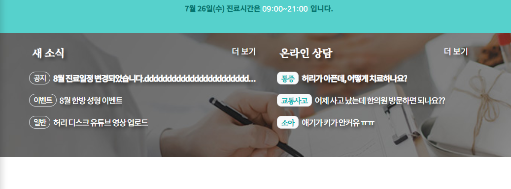
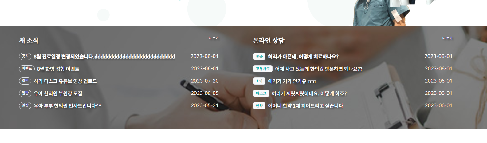

### footer 위에 카톡 배너 만들기
1. `d-blcok`으로 w-100를 채우는 만든 `a태그의 content없이 상하패딩` + `a태그의 상파배딩보다 약간 작은 size의 배경그림`으로 채울 것이다.
    - 그림은 카톡이미지 + 투명배경의 글자로 채운 이미지를 준비한다.
      

2. 일단 카카오 배경색과 동일한 배경색을 변수로 지정하고, `.bg-kakao`를 만들어 놓는다.
```css
:root {
    --color-kakao-yellow: #fee500;
}

.bg-kakao {
   background: var(--color-kakao-yellow);
}
```
```css
.banner  {
    width: 100%;
    margin: 0;
    padding: 0;
}
```
```html
<div class="banner bg-kakao">
</div>
```

3. 이제 a태그를 한줄 전체를 차지하도록 `d-block`으로 만들고, content없이 상하패딩만으로 공간이 나오게 한다.
```css
/* banner */
.banner a.banner-kakao {
    /* a태그를 block으로 한줄 처리 + padding 상하25 = 50px의 높이로 만들고 컨텐트없음 */
    display: block;
    padding: 25px 0;
    font-size: 0;
}
```
```html
<div class="banner bg-kakao">
    <a class="banner-kakao" href="https://pf.kakao.com/_upxfKxd" ></a>
</div>
```


4. **이제 상하패딩50px로 만든 a태그의 배경이미지를, 50px보다는 약간 작게 background-size의 높이로 줘서, 투명색 글자 배너그림을 채우게 한다.**
    - 이미지 자체는 no-repeat + 50/50으로 시작하게 하고
    - background-size의 height를 50px보다 작은 35px로 지정한 뒤, 가로는 auto로 준다.
```css
.banner a.banner-kakao {
    /* a태그를 block으로 한줄 처리 + padding 상하25 = 50px의 높이로 만들고 컨텐트없음 */
    display: block;
    padding: 25px 0;
    font-size: 0;

    background: url("../images/main_section/kakao_channel.png") no-repeat 50% 50%;
    background-size: auto 35px;
}
```


5. 모바일에서는 **상하패딩 줄이고 -> background-size의 높이도 그것보다 약간 더 작게 줄인다.**
```css
@media screen and (max-width: 991px) {
   .banner a.banner-kakao {
      padding: 20px 0;
      background-size: auto 30px;
   }
}
```


### 공지사항
1. section 양식을 따르지 않는 .section2에서 .notice를 만들고 배경그림을 cover로 집어넣는다.
```html
<div class="section2 mt-5">
    <!-- 공지사항 -->
    <div class="notice">
```
```css
/* 공지사항 notice */
/* - 배경 */
.section2 .notice {
    background: url('../images/main_section/bg_notice.jpg') no-repeat 50% 50%;
    background-size: cover;
}
```

2. 이제 `새소식` + `온라인상담`을 `ul태그 + flex evenly`로 배치해준다.
   - 이 때, m-0에 py, px를 줘서, 기본 간격을 잡아준다.
   - li의 2개 공간은 w-50, m-0에 py로 간격을 잡는다.
```html
<!-- 공지사항 -->
<div class="notice">
    <ul class="d-flex align-items-center justify-content-evenly list-unstyled m-0 py-3 px-2 px-lg-0">
        <!-- 새 소식-->
        <li class="w-50 m-0 py-0 py-lg-3 text-white me-4 mx-lg-5"></li>
        <!-- 온라인 상담 -->
        <li class="w-50 m-0 py-0 py-lg-3 text-white me-4 mx-lg-5"></li>
    </ul>
</div>
```

3. 각 li영역안에서는 `제목div` + `5개의 글들이 dd로 담길 담길 dl`를 생성한다.
   - 제목은 div안에 px로 여백을 주고, w-100상태에서, p태그로 만들어준다.
   - 더보기는 a태그를 inline-block + float-end로 띄워준다.
```html
<!-- 새 소식-->
<li class="w-50 m-0 py-0 py-lg-3 text-white me-4 mx-lg-5">
    <!-- 제목 -->
    <div class="px-1 px-lg-2 w-100">
        <p class="m-0 font-serif text-shadow fs-notice-title">
            새 소식
            <a href="#" class="d-inline-block text-white float-end fs-11">
                더 보기
            </a>
        </p>
    </div>
</li>
```
- title의 글자크기를 css로 정의한다.
```css
.fs-notice-title {
    font-size: 20px;
    font-weight: bold;
}
@media screen and (min-width: 992px) and (max-width: 1399px) {
    .fs-notice-title {
        font-size: 16px;
    }
}
@media screen and (max-width: 991px) {
    .fs-notice-title {
        font-size: 14px;
    }
}
```


4. dl안에 각 dd태그로 개별글들을 작성하는데, 
   - **dd의 높이는 lh로 지정하는데, 기본 1.6로 지정되어있어서 `fz를 바꿀때마다 직접 lh도 지정`해줘야한다.**
```css
.fs-notice-text {
    font-size: 16px;
    line-height: 40px; /* fz 16*/

}

@media screen and (min-width: 992px) and (max-width: 1399px) {
    .fs-notice-text {
        font-size: 13px;
        line-height: 35px;
        letter-spacing: -.01rem;

    }
}

@media screen and (max-width: 991px) {
    .fs-notice-text {
        font-size: 11px;
        line-height: 30px;
        letter-spacing: -.05rem;
    }
}
```

- dd안에서는 `a태그로 일단 감싸`놓고, `분류 / 글 / 날짜`를 수직정렬하기 위해 `div.d-flex.align-items-center`를 씌우고 난 뒤
   - 분류는 span.badge  / 글은 p태그 / 날짜는 md이상부터 보이도록하고, span.d-md-inline-block으로 만들어서 처리했다.
   - **이 때, 글은 잘리도록 `p.text-truncate`를 넣어주는 반면, 날자는 안짤리도록 `span.text-nowrap`을 씌워줬따.**
```html
<!-- 글 -->
<dl class="bg-transparent p-lg-2 mt-2 ">
    <!-- 개별 글 시작 -->
    <dd class="m-0 p-0 text-shadow ">
        <a href="#" class="fs-notice-text text-white" style="">
            <div class="d-flex align-items-center">
                 <span class="badge me-1 me-lg-2 bg-transparent border rounded-pill text-shadow-none font-nanum">
                     공지
                 </span>
                <p class="m-0 me-md-3 text-truncate">
                    8월 진료일정 변경되었습니다.dddddddddddddddddddddddddd
                </p>
                <span class="d-none d-md-inline-block ms-auto text-white text-shadow-none text-nowrap font-nanum">
                     2023-06-01
                 </span>
            </div>
        </a>
    </dd>
</dl>
```


5. 다음으로, 모바일에선, 5개 중 3개만 보이도록 `4번째부터는 display:none되는 (n+4)`를 적용해주고, `첫번째 글dd의 자식들 모두는 진하게` 나오도록 했다.
```css
/* - 첫번째 글dd만 진하게 */
.section2 .notice dl dd:nth-of-type(1) > * {
    font-weight: bold!important;
}

/* - 모바일에서 4번째 dd(글) 부터는 안보이게 */
@media (max-width: 991px) {
    .section2 .notice dl dd:nth-of-type(n+4) {
        display: none; /* 4번째부터 나머지 dd 요소를 숨김 */
    }
}
```


6. 온라인상담은 badge의 모양을 조금 바꿨다.
```html
<span class="badge me-1 me-lg-2 bg-light border text-shadow-none font-serif text-main">
   통증
</span>
```

