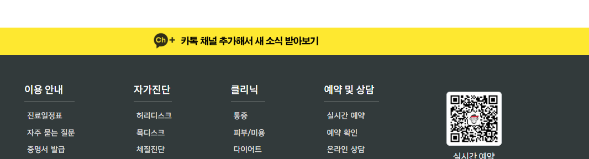
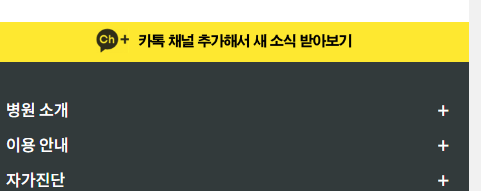

### footer 위에 카톡 배너 만들기
1. `d-blcok`으로 w-100를 채우는 만든 `a태그의 content없이 상하패딩` + `a태그의 상파배딩보다 약간 작은 size의 배경그림`으로 채울 것이다.
    - 그림은 카톡이미지 + 투명배경의 글자로 채운 이미지를 준비한다.
      

2. 일단 카카오 배경색과 동일한 배경색을 변수로 지정하고, `.bg-kakao`를 만들어 놓는다.
```css
:root {
    --color-kakao-yellow: #fee500;
}

.bg-kakao {
   background: var(--color-kakao-yellow);
}
```
```css
.banner  {
    width: 100%;
    margin: 0;
    padding: 0;
}
```
```html
<div class="banner bg-kakao">
</div>
```

3. 이제 a태그를 한줄 전체를 차지하도록 `d-block`으로 만들고, content없이 상하패딩만으로 공간이 나오게 한다.
```css
/* banner */
.banner a.banner-kakao {
    /* a태그를 block으로 한줄 처리 + padding 상하25 = 50px의 높이로 만들고 컨텐트없음 */
    display: block;
    padding: 25px 0;
    font-size: 0;
}
```
```html
<div class="banner bg-kakao">
    <a class="banner-kakao" href="https://pf.kakao.com/_upxfKxd" ></a>
</div>
```


4. **이제 상하패딩50px로 만든 a태그의 배경이미지를, 50px보다는 약간 작게 background-size의 높이로 줘서, 투명색 글자 배너그림을 채우게 한다.**
    - 이미지 자체는 no-repeat + 50/50으로 시작하게 하고
    - background-size의 height를 50px보다 작은 35px로 지정한 뒤, 가로는 auto로 준다.
```css
.banner a.banner-kakao {
    /* a태그를 block으로 한줄 처리 + padding 상하25 = 50px의 높이로 만들고 컨텐트없음 */
    display: block;
    padding: 25px 0;
    font-size: 0;

    background: url("../images/main_section/kakao_channel.png") no-repeat 50% 50%;
    background-size: auto 35px;
}
```



5. 모바일에서는 **상하패딩 줄이고 -> background-size의 높이도 그것보다 약간 더 작게 줄인다.**
```css
@media screen and (max-width: 991px) {
   .banner a.banner-kakao {
      padding: 20px 0;
      background-size: auto 30px;
   }
}
```

