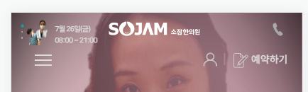
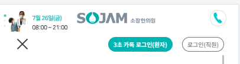

1. 현재 구성은 `.header-middle` 안에 `.header-bottom`으로 들어가있는 미스매칭 구조이나, 그대로 사용함
2. .header-bottom에는 lg에서 보이는 3개의 버튼들이 잇는데, li>a태그로 모바일용으로 만들어서 추가한다.
   - **이 때, a태그들의 lh를 그대로 사용하기 위해 fake text도 추가해준다.**
```html
   <!-- 우측 버튼들 -->
   <ul class="list-unstyled d-flex mb-0">
       <li><a href="#" class="d-none d-lg-inline-block text-gray">3초 로그인</a></li>
       <li><a href="#" class="d-none d-lg-inline-block text-gray">치료후기</a></li>
       <li><a href="#" class="d-none d-lg-inline-block text-gray">의료진소개</a></li>
       <!-- 모바일용 전화 버튼 -->
       <li><a href="tel:02-1588-4444" class="mobile-call d-inline-block d-lg-none text-gray">
          모바일전화(lh맞추기용)
       </a></li>
   </ul>
```

3. css로 배경을 통한 전화아이콘을 추가해준다.
   - **w/h/lh를 logo크기와 비슷한 28px로 추고**
   - background를 15px로 맞춘 뒤,**`text-index: -`를 큰 마이너스 숫자로 줘서, 안보이게 만든다.**
```css
/* - 모바일 전화 버튼 */
.header .header-middle .header-bottom .mobile-call {
    width: 28px;
    height: 28px;
    line-height: 28px;

    background: url(../images/main_section/mobile-call.png) no-repeat 50% 50%;
    background-size: 15px;
   
    text-indent: -9999px;
}
```

4. 이제 헤더가 on되는 순간인 `.header-middle.on`에서는 w/h에 border를 회색으로 주고, icon 배경그림을 바꿔준다.
```css
.header .header-middle.on .header-bottom .mobile-call {
    border: 1px solid #ddd;
    border-radius: 100%;

    background: url(../images/main_section/mobile-call-on.png) no-repeat 50% 50%;
    background-size: 15px;
}
```


