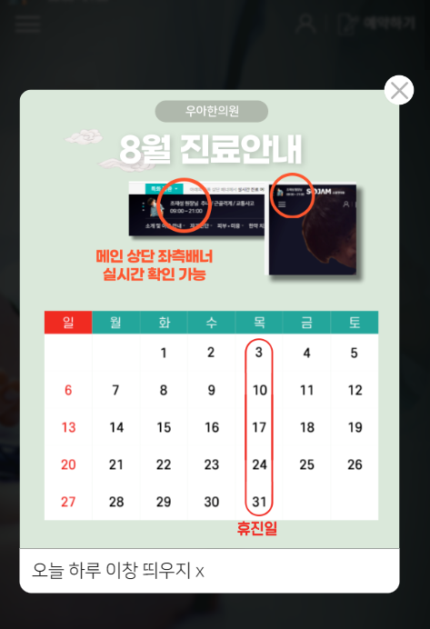

1. popup은 main에서만 사용되기 때문에, 나중에 파일로 뺄 것을 대비하여 inline style/script태그에 작성한다.

2. html의 구조는 아래와 같이, `div.main-popup-wrapper` > `div.main-popup-box` > `a`태그로 설정한다.

```html
<div class="main-popup">
    <div class="main-popup-box">
        <a href="#" onclick="hideBox();"></a>
    </div>
</div>
```

3. box에서 fixed + 100%로 box를 작성하기 때문에, 최상위태그의 css는 일단 생략하고, box만 작성해준다.
```html
<!-- popup -->
<style>
    .main-popup {
    }

    .main-popup-box {
        position: fixed;
        z-index: 9999;

        width: 100%;
        height: 100vh;

        left: 0;
        top: 0;
        background: rgba(0, 0, 0, 0.77);
        backdrop-filter: blur(1.5px);
    }
</style>
```


4. box를 클릭하면, 쿠키와 상관없이 hide()로 닫희도록, jquery로 클릭 리스너를 달아준다.
```js
<!-- main popup -->
<script>
    $(document).ready(function(){
        $('.main-popup-box').click(function(e){
            e.preventDefault();
            $('.main-popup-box').hide();
        });
    });
</script>
```
```js
// 1. 배경 클릭시, box자체가 단순 닫힘.
let mainPopupBox = $('.main-popup-box');

$(document).ready(function () {
    mainPopupBox.click(function (e) {
        e.preventDefault();
        mainPopupBox.hide();
    });
});
```
5. 이제 a태그를 `d-inline-block`으로 만들고 `w100,h100`으로 작성한 뒤 
   - **href는 #으로 채워놓고 여러 js함수를 적용(쿠키처리 + hideBox) 예정이므로 `onclick`에 함수호출후 return false;까지 입력한다**
```js
 function hideBox() {
     console.log("hideBox");
     mainPopupBox.hide();
 }
```
```html

<div class="main-popup">
   <div class="main-popup-box">
      <a class="d-inline-block w-100 h-100"
         href="#" onclick="hideBox(); return false;"
      ></a>
   </div>
</div>

```
   - 기존 box에 걸었던 클릭 리스너는 주석처리해놓는다.
```js
    let mainPopupBox = $('.main-popup-box');

// $(document).ready(function(){
//     mainPopupBox.click(function(e){
//         e.preventDefault();
//         mainPopupBox.hide();
//     });

// });
```

6. 이제 popup-box의 `형제 + fixed`로서 fixed carousel이 들어갈 공간인 `.main-popup-content`를 만들고, css로 top 50vh +transform으로 중앙에 위치하게 만든다.
   - **이 때, left 50% + translate(-50%, )는 `좌우 정가운데`로 주지만**
   - **top:50vh로 (`퍼센트 대신 높이는 vh`)로 주고, `transform에서는 -50vh가 아니라, -35vh로서, 중간에서 -35% 더 올라간 곳에서 시작`시킨다.**
   - z-index는 popup-box의 10000보다 1 크게 준다.

```html

<div class="main-popup">
   <!-- fixed 배경 -->
   <div class="main-popup-box">
   </div>

   <!-- fixed 캐러셀 -->
   <div class="main-popup-content">
      캐러셀
   </div>
</div>
```

```css
    .main-popup-content {
   z-index: 10001;
   position: fixed;

   left: 50%;
   top: 50vh;
   transform: translate(-50%, -35vh);
}
```


7. box만 닫던 것을, 전체 div인 `.main-popup`을 닫도록 변경한다.
```html
<div class="main-popup">
   <!-- fixed 배경 -->
   <div class="main-popup-box">
      <a class="d-inline-block w-100 h-100"
         href="#" onclick="hidePopup(); return false;"
      ></a>
   </div>
```
```js
let mainPopup = $('.main-popup');

function hidePopup() {
    mainPopup.hide();
}
```
8. **content를 `.w-100`으로 만들어야, `화면의 90%`와 같이 그림을 배치할 수 있기 떄문에, width를 일정크기로 주지 않고, `w-100 공간을 만든다.`**
```css
 .main-popup-content {
     z-index: 10001;
     position: fixed;

     left: 50%;
     top: 50vh;
     transform: translate(-50%, -35vh);

     width: 100%;
 }
```
9. 이렇게 되면, w-100 중에 팝업 그림이 90%로 들어가고 `남은 양쪽의 10%공간`이 클릭이 안되게 되므로, `jquery로 배경클릭시 hidePopup()`하는 주석을 다시 풀어주고 다시 걸어준다.
- 그 전에 content의 cursor도 적용해준다.
```css
.main-popup-content {
     /* ... */
     width: 100%;
     cursor: pointer;
 }
```
```js
 // 1. 배경 클릭시, box자체가 단순 닫힘.
 let mainPopup = $('.main-popup');
 // (1) hideBox
 function hidePopup() {
     mainPopup.hide();
 }
 /* 2. 배경 클릭시, 팝업 닫히도록 */
 $('.main-popup-content').click(function(e){
     e.preventDefault();
     mainPopup.hide();
 });
```
- 기존에 a태그에 직접 onclick으로 걸어줬던 것도 그냥 삭제해주고, jquery로 걸리게 한다.
```html
<div class="main-popup">
    <!-- fixed 배경 -->
    <div class="main-popup-box">
<!--           onclick="hidePopup(); return false;"-->
        <a class="d-inline-block w-100 h-100" href="#"
        ></a>
    </div>
```
```js
/* 2. 배경 클릭시, 팝업 닫히도록 */
 $('.main-popup-box > a, .main-popup-content').click(function(e){
     e.preventDefault();
     mainPopup.hide();
 });
```

10. w-100 내부에 `.popup-body`를 만들고, `lg에서는 480px 고정` + `lg이하에서는 88% + max-width: 380px`로 잡아준다.
```html
<!-- fixed 내용 -->
<div class="main-popup-content">
   <!-- 내용 -->
   <div class="popup-body">
   </div>
</div>
```
```css
.main-popup-content .popup-body {
    width: 480px;
}

@media screen and (max-width: 991px) {
    .main-popup-content .popup-body {
        width: 88%;
        max-width: 380px;
    }
}
```

11. **닫기 버튼을 .popup-body 기준으로 만들기 위해 `relative` + 내용물(div)들을 가운데 놓기 위해 `margin: 0 auto;`로 만들어준다.**
```css
.main-popup-content .popup-body {
    width: 480px;

    position: relative;
    margin: 0 auto;
}
```

12. 이제 body의 맨 위, 첫번째 내용으로 absolute로, top-17, right -17px로 약간 우상단에서 17px내려온 닫기버튼을
   - 35px로, background 이미지를 contain해서 만든다.
   - a태그의 글자는 span.blind에 담아서 숨기고, `onclick=""`에 hidePopup() + return false;를 같이 호출한다.
```html
<!-- fixed 내용 -->
<div class="main-popup-content">
    <!-- 모바일 88% + lg 480px 내용 공간 -->
    <div class="popup-body">
        <!-- abs top 닫기 버튼 -->
        <a class="popup-top-close-btn" href="#" onclick="hidePopup(); return false;">
            <span class="blind">닫기</span>
        </a>
    </div>
</div>
```
```css
.main-popup-content .popup-body .popup-top-close-btn {
    z-index: 10001;
    position: absolute;
    right: -17px;
    top: -17px;

    width: 35px;
    height: 35px;
    background: url(../images/main_section/main_popup_close.png) center no-repeat;
    background-size: contain;
}
```


13. swiper가 돌아갈 `a.d-block.w-100 > img.img-fluid`를 만들고, css로 위쪽 radius를 긋고 **`overflow:hidden을 통해, radius안의 img가 못넘치게 한다.`**
   - **이 때, bottom에는 양쪽으로 체크input + 닫기버튼을 만들기 위해 flex + between으로 설정해놓는다.**
```html
<!-- 모바일 88% + lg 480px 내용 공간 -->
<div class="popup-body">
    <!-- abs top 닫기 버튼 -->
    <a class="popup-top-close-btn" href="#" onclick="hidePopup(); return false;">
        <span class="blind">닫기</span>
    </a>
    <!-- 이미지 a>img ( top border radius ) -->
    <a class="d-block w-100" href="#" target="_self">
        
    </a>
    <!-- bottom 닫기 ( bottom border radius ) -->
    <div class="popup-bottom">
        오늘 하루 이창 띄우지 x
    </div>
</div>
```
```css
    /* 팝업 a>img */
.main-popup-content .popup-body a {
   border-radius: 12px 12px 0 0;
   overflow: hidden;
}

/* 팝업 bottom */
.main-popup-content .popup-body .popup-bottom {
   border-radius: 0px 0px 12px 12px;
   background: #fff;

   padding: 8px 12px;

   display: flex;
   justify-content: space-between;
   align-items: center;
}
```
- popup 이미지는 530x640기준으로 만들어준다.


### bottom에 check + 닫기 만들기
