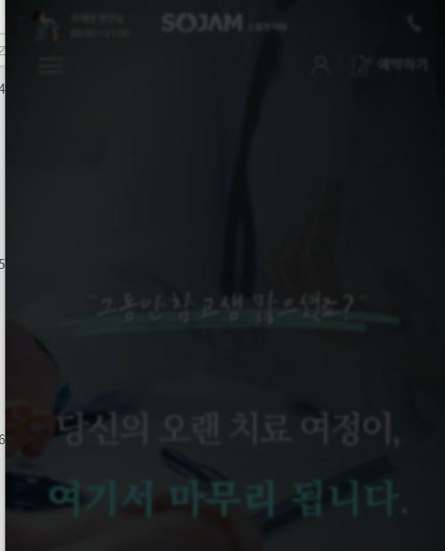
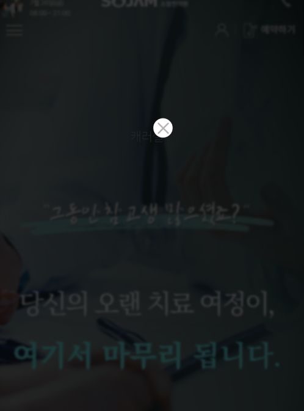
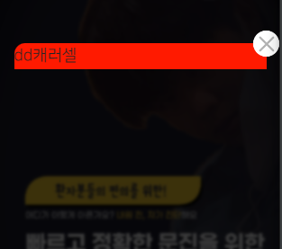
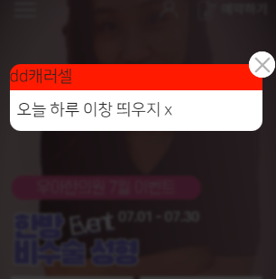

1. popup은 main에서만 사용되기 때문에, 나중에 파일로 뺄 것을 대비하여 inline style/script태그에 작성한다.

2. html의 구조는 아래와 같이, `div.main-popup-wrapper` > `div.main-popup-box` > `a`태그로 설정한다.

```html
<div class="main-popup">
    <div class="main-popup-box">
        <a href="#" onclick="hideBox();"></a>
    </div>
</div>
```

3. box에서 fixed + 100%로 box를 작성하기 때문에, 최상위태그의 css는 일단 생략하고, box만 작성해준다.
```html
<!-- popup -->
<style>
    .main-popup {
    }

    .main-popup-box {
        position: fixed;
        z-index: 9999;

        width: 100%;
        height: 100vh;

        left: 0;
        top: 0;
        background: rgba(0, 0, 0, 0.77);
        backdrop-filter: blur(1.5px);
    }
</style>
```


4. box를 클릭하면, 쿠키와 상관없이 hide()로 닫희도록, jquery로 클릭 리스너를 달아준다.
```js
<!-- main popup -->
<script>
    $(document).ready(function(){
        $('.main-popup-box').click(function(e){
            e.preventDefault();
            $('.main-popup-box').hide();
        });
    });
</script>
```
```js
// 1. 배경 클릭시, box자체가 단순 닫힘.
let mainPopupBox = $('.main-popup-box');

$(document).ready(function () {
    mainPopupBox.click(function (e) {
        e.preventDefault();
        mainPopupBox.hide();
    });
});
```
5. 이제 a태그를 `d-inline-block`으로 만들고 `w100,h100`으로 작성한 뒤 
   - **href는 #으로 채워놓고 여러 js함수를 적용(쿠키처리 + hideBox) 예정이므로 `onclick`에 함수호출후 return false;까지 입력한다**
```js
 function hideBox() {
     console.log("hideBox");
     mainPopupBox.hide();
 }
```
```html

<div class="main-popup">
   <div class="main-popup-box">
      <a class="d-inline-block w-100 h-100"
         href="#" onclick="hideBox(); return false;"
      ></a>
   </div>
</div>

```
   - 기존 box에 걸었던 클릭 리스너는 주석처리해놓는다.
```js
    let mainPopupBox = $('.main-popup-box');

// $(document).ready(function(){
//     mainPopupBox.click(function(e){
//         e.preventDefault();
//         mainPopupBox.hide();
//     });

// });
```

6. 이제 popup-box의 `형제 + fixed`로서 fixed carousel이 들어갈 공간인 `.main-popup-content`를 만들고, css로 top 50vh +transform으로 중앙에 위치하게 만든다.
   - **이 때, left 50% + translate(-50%, )는 `좌우 정가운데`로 주지만**
   - **top:50vh로 (`퍼센트 대신 높이는 vh`)로 주고, `transform에서는 -50vh가 아니라, -35vh로서, 중간에서 -35% 더 올라간 곳에서 시작`시킨다.**
   - z-index는 popup-box의 10000보다 1 크게 준다.

```html

<div class="main-popup">
   <!-- fixed 배경 -->
   <div class="main-popup-box">
   </div>

   <!-- fixed 캐러셀 -->
   <div class="main-popup-content">
      캐러셀
   </div>
</div>
```

```css
    .main-popup-content {
   z-index: 10001;
   position: fixed;

   left: 50%;
   top: 50vh;
   transform: translate(-50%, -35vh);
}
```


7. box만 닫던 것을, 전체 div인 `.main-popup`을 닫도록 변경한다.
```html
<a class="d-inline-block w-100 h-100"
   href="#" onclick="hidePopup(); return false;"
></a>
```
```js
let mainPopup = $('.main-popup');

function hidePopup() {
    mainPopup.hide();
}
```


8. 이제 content을 첫번째 내용으로 absolute로, top-17, right -17px로 내용물은 아직 안찼지만, 약간 우상단에서 17px내려온 닫기버튼을
   - 35px로, background 이미지를 contain해서 만든다.
   - a태그의 글자는 span.blind에 담아서 숨기고, 클릭시 hideBox()를 호출한다.
```html
<!-- fixed 캐러셀 -->
<div class="main-popup-content">
    <!-- 닫기 버튼 -->
    <a class="popup-top-close-btn" href="#" onclick="hidePopup(); return false;">
        <span class="blind">닫기</span>
    </a>
    <!-- 내용 -->
    캐러셀
</div>
```
```css
.main-popup-content .popup-top-close-btn {
    z-index: 10001;
    position: absolute;
    right: -17px;
    top: -17px;

    width: 35px;
    height: 35px;
    background: url(../images/main_section/main_popup_close.png) center no-repeat;
    background-size: contain;
}
```



### popup-body / bottom 만들기
1. `.popup-body`를 위족 닫기버튼아래에 만들고, `width`를 직접 지정, height는 auto로 채워지게 할 것이다.
   - **lg 480, 이하 280px로 고정한다.**
   - 또한, 위쪽만 radius를 준다.
```html
    <!-- fixed 캐러셀 -->
<div class="main-popup-content">
    <!-- 닫기 버튼 -->
    <a class="popup-top-close-btn" href="#" onclick="hidePopup(); return false;">
        <span class="blind">닫기</span>
    </a>
    <!-- 내용 -->
    <div class="popup-body">

        dd캐러셀

    </div>
</div>
```
```css
    .main-popup-content .popup-body {
        width: 480px;
        /*height: 520px;*/
        border-radius: 12px 12px 0 0;

        background: red;
    }

    @media screen and (max-width: 991px) {
        .main-popup-content .popup-body {
            width: 280px;
        }
    }
```


2. `.popup-bottom`을 만들어, radius를 아래쪽만 주되, padding만 lg에서 좌우여백을 좀 더 준다.
   - **flex - between으로 만들어서, 체크 <-> 닫기 버튼을 갈라줄 준비를 한다.**
```html
 <!-- fixed 캐러셀 -->
    <div class="main-popup-content">
        <!-- 닫기 버튼 -->
        <a class="popup-top-close-btn" href="#" onclick="hidePopup(); return false;">
            <span class="blind">닫기</span>
        </a>
        <!-- 내용 -->
        <div class="popup-body">
            dd캐러셀
        </div>
        <!-- 하단 닫기 버튼 -->
        <div class="popup-bottom">
            오늘 하루 이창 띄우지 x
        </div>
    </div>
```
```css
.main-popup-content .popup-bottom {
  background: #fff;
  border-radius: 0px 0px 12px 12px;
  padding: 8px 12px;

  display: flex;
  justify-content: space-between;
  align-items: center;
}

@media screen and (max-width: 991px) {
  .main-popup-content .popup-bottom {
      padding: 8px;
  }
}
```



### body에 a > img 입력 후 swiper로 감싸기
1. width가 정해진 body에 a[target="_self"].w100 > img.img-fluid를 넣는다.

2. 
