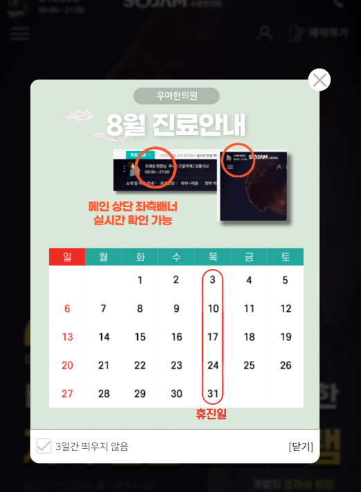

1. popup은 main에서만 사용되기 때문에, 나중에 파일로 뺄 것을 대비하여 inline style/script태그에 작성한다.

2. html의 구조는 아래와 같이, `div.main-popup-wrapper` > `div.main-popup-box` > `a`태그로 설정한다.

```html
<div class="main-popup">
    <div class="main-popup-box">
        <a href="#" onclick="hideBox();"></a>
    </div>
</div>
```

3. box에서 fixed + 100%로 box를 작성하기 때문에, 최상위태그의 css는 일단 생략하고, box만 작성해준다.
```html
<!-- popup -->
<style>
    .main-popup {
    }

    .main-popup-box {
        position: fixed;
        z-index: 9999;

        width: 100%;
        height: 100vh;

        left: 0;
        top: 0;
        background: rgba(0, 0, 0, 0.77);
        backdrop-filter: blur(1.5px);
    }
</style>
```


4. box를 클릭하면, 쿠키와 상관없이 hide()로 닫희도록, jquery로 클릭 리스너를 달아준다.
```js
<!-- main popup -->
<script>
    $(document).ready(function(){
        $('.main-popup-box').click(function(e){
            e.preventDefault();
            $('.main-popup-box').hide();
        });
    });
</script>
```
```js
// 1. 배경 클릭시, box자체가 단순 닫힘.
let mainPopupBox = $('.main-popup-box');

$(document).ready(function () {
    mainPopupBox.click(function (e) {
        e.preventDefault();
        mainPopupBox.hide();
    });
});
```
5. 이제 a태그를 `d-inline-block`으로 만들고 `w100,h100`으로 작성한 뒤 
   - **href는 #으로 채워놓고 여러 js함수를 적용(쿠키처리 + hideBox) 예정이므로 `onclick`에 함수호출후 return false;까지 입력한다**
```js
 function hideBox() {
     console.log("hideBox");
     mainPopupBox.hide();
 }
```
```html

<div class="main-popup">
   <div class="main-popup-box">
      <a class="d-inline-block w-100 h-100"
         href="#" onclick="hideBox(); return false;"
      ></a>
   </div>
</div>

```
   - 기존 box에 걸었던 클릭 리스너는 주석처리해놓는다.
```js
    let mainPopupBox = $('.main-popup-box');

// $(document).ready(function(){
//     mainPopupBox.click(function(e){
//         e.preventDefault();
//         mainPopupBox.hide();
//     });

// });
```

6. 이제 popup-box의 `형제 + fixed`로서 fixed carousel이 들어갈 공간인 `.main-popup-content`를 만들고, css로 top 50vh +transform으로 중앙에 위치하게 만든다.
   - **이 때, left 50% + translate(-50%, )는 `좌우 정가운데`로 주지만**
   - **top:50vh로 (`퍼센트 대신 높이는 vh`)로 주고, `transform에서는 -50vh가 아니라, -35vh로서, 중간에서 -35% 더 올라간 곳에서 시작`시킨다.**
   - z-index는 popup-box의 10000보다 1 크게 준다.

```html

<div class="main-popup">
   <!-- fixed 배경 -->
   <div class="main-popup-box">
   </div>

   <!-- fixed 캐러셀 -->
   <div class="main-popup-content">
      캐러셀
   </div>
</div>
```

```css
    .main-popup-content {
   z-index: 10001;
   position: fixed;

   left: 50%;
   top: 50vh;
   transform: translate(-50%, -35vh);
}
```


7. box만 닫던 것을, 전체 div인 `.main-popup`을 닫도록 변경한다.
```html
<div class="main-popup">
   <!-- fixed 배경 -->
   <div class="main-popup-box">
      <a class="d-inline-block w-100 h-100"
         href="#" onclick="hidePopup(); return false;"
      ></a>
   </div>
```
```js
let mainPopup = $('.main-popup');

function hidePopup() {
    mainPopup.hide();
}
```
8. **content를 `.w-100`으로 만들어야, `화면의 90%`와 같이 그림을 배치할 수 있기 떄문에, width를 일정크기로 주지 않고, `w-100 공간을 만든다.`**
```css
 .main-popup-content {
     z-index: 10001;
     position: fixed;

     left: 50%;
     top: 50vh;
     transform: translate(-50%, -35vh);

     width: 100%;
 }
```
9. 이렇게 되면, w-100 중에 팝업 그림이 90%로 들어가고 `남은 양쪽의 10%공간`이 클릭이 안되게 되므로, `a태그를 absolute + d-inline-block +  w-100 + h-100 차지하도록 만들어` `jquery로 배경클릭시 hidePopup()`하는 주석을 다시 풀어주고 다시 걸어준다.
- 그 전에 content의 cursor도 적용해준다.
```css
.main-popup-content {
     /* ... */
     width: 100%;
     cursor: pointer;
 }
```
```js
 // 1. 배경 클릭시, box자체가 단순 닫힘.
 let mainPopup = $('.main-popup');
 // (1) hideBox
 function hidePopup() {
     mainPopup.hide();
 }
 /* 2. 배경 클릭시, 팝업 닫히도록 */
 $('.main-popup-content').click(function(e){
     e.preventDefault();
     mainPopup.hide();
 });
```
- 기존에 a태그에 직접 onclick으로 걸어줬던 것도 그냥 삭제해주고, jquery로 걸리게 한다.
```html
<!-- fixed 내용 -->
<div class="main-popup-content">
   <!-- 양쪽에 남은 여백 10%에서 클릭되게 할 abs 배경 -->
   <a class="position-absolute d-inline-block w-100 h-100"
      href="#"></a>
   <!-- 모바일 90% + lg 480px 내용 공간 -->
   <div class="popup-body">
```
```js
/* 2. 배경 클릭시, 팝업 닫히도록 */
$('.main-popup-box > a:nth-of-type(1), .main-popup-content > a:nth-of-type(1)').click(function (e) {
   e.preventDefault();
   mainPopup.hide();
});
```

10. w-100 내부에 `.popup-body`를 만들고, `lg에서는 480px 고정` + `lg이하에서는 80% + max-width: 380px`로 잡아준다.
```html
<!-- fixed 내용 -->
<div class="main-popup-content">
   <!-- 내용 -->
   <div class="popup-body">
   </div>
</div>
```
```css
.main-popup-content .popup-body {
    width: 480px;
}

@media screen and (max-width: 991px) {
    .main-popup-content .popup-body {
        width: 80%;
        max-width: 380px;
    }
}
```

11. **닫기 버튼을 .popup-body 기준으로 만들기 위해 `relative` + 내용물(div)들을 가운데 놓기 위해 `margin: 0 auto;`로 만들어준다.**
```css
.main-popup-content .popup-body {
    width: 480px;

    position: relative;
    margin: 0 auto;
}
```

12. 이제 body의 맨 위, 첫번째 내용으로 absolute로, top-17, right -17px로 약간 우상단에서 17px내려온 닫기버튼을
   - 35px로, background 이미지를 contain해서 만든다.
   - a태그의 글자는 span.blind에 담아서 숨기고, `onclick=""`에 hidePopup() + return false;를 같이 호출한다.
```html
<!-- fixed 내용 -->
<div class="main-popup-content">
    <!-- 모바일 88% + lg 480px 내용 공간 -->
    <div class="popup-body">
        <!-- abs top 닫기 버튼 -->
        <a class="popup-top-close-btn" href="#" onclick="hidePopup(); return false;">
            <span class="blind">닫기</span>
        </a>
    </div>
</div>
```
```css
.main-popup-content .popup-body .popup-top-close-btn {
    z-index: 10001;
    position: absolute;
    right: -17px;
    top: -17px;

    width: 35px;
    height: 35px;
    background: url(../images/main_section/main_popup_close.png) center no-repeat;
    background-size: contain;
}
```


13. swiper가 돌아갈 `a.d-block.w-100 > img.img-fluid`를 만들고, css로 위쪽 radius를 긋고 **`overflow:hidden을 통해, radius안의 img가 못넘치게 한다.`**
   - **이 때, bottom에는 양쪽으로 체크input + 닫기버튼을 만들기 위해 flex + between으로 설정해놓는다.**
```html
<!-- 모바일 88% + lg 480px 내용 공간 -->
<div class="popup-body">
    <!-- abs top 닫기 버튼 -->
    <a class="popup-top-close-btn" href="#" onclick="hidePopup(); return false;">
        <span class="blind">닫기</span>
    </a>
    <!-- 이미지 a>img ( top border radius ) -->
    <a class="d-block w-100" href="#" target="_self">
        
    </a>
    <!-- bottom 닫기 ( bottom border radius ) -->
    <div class="popup-bottom">
        오늘 하루 이창 띄우지 x
    </div>
</div>
```
```css
    /* 팝업 a>img */
.main-popup-content .popup-body a {
   border-radius: 12px 12px 0 0;
   overflow: hidden;
}

/* 팝업 bottom */
.main-popup-content .popup-body .popup-bottom {
   border-radius: 0px 0px 12px 12px;
   background: #fff;

   padding: 8px 12px;

   display: flex;
   justify-content: space-between;
   align-items: center;
}
```
- popup 이미지는 530x640기준으로 만들어준다.


### bottom에 checkbox + 닫기 만들기
1. div를 하나씌우고, input+label을 만든다. **이 때, input은 `d-none`을 클래스로 주고, name, id는 mainPopupCheck로 간다**
   - 우측은 a태그로 만들며 onclick에 hidePopup(); return false;를 준다.
```html
<!-- bottom 닫기 ( bottom border radius ) -->
<div class="popup-bottom">
    <!-- 좌) 3일간 표시x -->
    <div>
        <input type="checkbox" name="mainPopupCheck" id="mainPopupCheck"
               class="d-none"
        >
        <label for="mainPopupCheck">3일간 띄우지 않음</label>
    </div>
    <!-- 우) -->
    <a href="#" onclick="hidePopup(); return false;">
        [닫기]
    </a>
</div>
```

2. **label의 글자에 `::after로 체크그림을 채우기 위한 용도`로 만들기 위해**
   1. label text를 span으로 씌우고
   2. label 자체를 relative + 클릭용 cursor:pointer + vertical-align:middle + nowrap로 만든다.
   3. label 자체를 inline block으로 만들고, span.text가 이어지게 한다.
   4. label에 w/h를 24px <-> 20px(11px span글자 대비)로 만들고, 그 안에 check그림이 채워지기 전으로서, border만 만들어놓는다.
```html
<label for="mainPopupCheck">
    <span> 3일간 띄우지 않음 </span>
</label>
```
```css
/* 팝업 bottom checkbox + label */
.main-popup-content .popup-body .popup-bottom input[type="checkbox"] + label {
    vertical-align: middle;
    cursor: pointer;
    white-space: nowrap;
    position: relative;

    display: inline-block;
    width: 24px;
    height: 24px;
    border: 1px solid #CFCFCF;
    border-radius: 4px;
}

@media screen and (max-width: 991px) {
   .main-popup-content .popup-body .popup-bottom input[type="checkbox"] + label {
      width: 20px;
      height: 20px;
   }
}
```
3. 이제 span태그에, label::after의 그림이 들어갈 자리`24px(lg) 16px(그이하)`에 4px씩 더 해서 padding-left를 준다.
   - **이 때 , span태그를 block으로서, 앞에 붙을 abs label을 무시하고 1줄을 다 차지하게 한다.**
   - **추가로, label의 공간 24, 20px을 lh로 잡아서 가운데 정렬되게 한다.**
   - **span의 폰트는 24, 20px에 대해 16, 13px로 잡아준다.**
```css
.main-popup-content .popup-body .popup-bottom input[type="checkbox"] + label span {
   display:block;

   padding-left: 28px; /* label:after의 공간이 24px */

   line-height: 24px; /* label:after의 공간이 24px */
   font-size: 16px;
}

@media screen and (max-width: 991px) {
   .main-popup-content .popup-body .popup-bottom input[type="checkbox"] + label span {
      padding-left: 24px; /* label:after의 공간이 20px */

      line-height: 20px; /* label:after의 공간이 20px */
      font-size: 13px;
   }
}
```

4. 우측의 닫기버튼도 글자크기 16 -> 13px로 적용해준다.
- `.popup-bottom-close-btn`의 클래스를 달아주고, 글자크기를 적용한다. margin-right도 8,4px을 적용해준다.
```html

<div class="popup-bottom">
    <!-- 좌) 3일간 표시x -->
    <div>
        <input type="checkbox" name="mainPopupCheck" id="mainPopupCheck"
               class="d-none"
        >
        <label for="mainPopupCheck">
            <span> 3일간 띄우지 않음 </span>
        </label>
    </div>
    <!-- 우) -->
    <a class="popup-bottom-close-btn" href="#" onclick="hidePopup(); return false;">
        [닫기]
    </a>
</div>
```
```css
    /* 우측 닫기 버튼 */
.main-popup-content .popup-body .popup-bottom .popup-bottom-close-btn {
   font-size: 16px;
   margin-right: 8px;
}

@media screen and (max-width: 991px) {
   .main-popup-content .popup-body .popup-bottom .popup-bottom-close-btn {
      font-size: 13px;
      margin-right: 4px;
   }
}
```



5. 이제 input이 :checked 상태일때(`input[type="checkbox"]:checked + label:after`)의 아이콘 배경그림을 변경해준다.
```css
.main-popup-content .popup-body .popup-bottom input[type="checkbox"]:checked + label:after {
    background: url(images/popup/btn_main_check.png) center no-repeat;
    background-size: contain;
}
```


6. 이제 닫기a태그에는 checkbox를 확인해서 쿠키를 설정하는 메서드 `closePopup()`을 만들고, 내부에서 `hidePopup();`를 활용하게 한다.
```js
/* (2) check 확인해서 cookie 심기 + (1) 숨기기 활용 */
function setCookie(name, value, expiredays) {
   var todayDate = new Date();
   todayDate.setDate(todayDate.getDate() + expiredays);
   document.cookie = name + "=" + escape(value) + "; path=/; expires=" + todayDate.toGMTString() + ";"
}

function closePopup(expiredays) {
   // 체크 확인
   var checkBox = document.getElementById('mainPopupCheck');
   if (checkBox.checked) {
      setCookie("main_popup", "done", expiredays); // 3일간 안보임
   } else {
      // 체크 안되어있다면, 1일간 보지 않기
      setCookie("main_popup", "done", 1); // 1일간 안보임
   }
   // 팝업 닫기
   hidePopup();
}
```
```html
 <!-- bottom 닫기 ( bottom border radius ) -->
<div class="popup-bottom">
    <!-- 좌) 3일간 표시x -->
    <div>
    </div>
    <!-- 우) -->
    <a class="popup-bottom-close-btn" href="#" onclick="closePopup(3); return false;">
        [닫기]
    </a>
</div>
```
- **application > cookie 를 확인하면, expire day가 체크여부에 따라 다르게 입력된다.**


7. 이제 getCookie를 정의해서, **expire만큼 남아있는 상태 == `"done"`을 value로 가지고 있지 않는 상태에서만 `.show();`하고, default로는 `display:none`이어야한다.**
```js
function getCookie(name) {
    var value = document.cookie.match("(^|;) ?" + name + "=([^;]*)(;|$)");
    return value ? value[2] : null;
}
```
```html
<!-- 메인 팝업 -->
<div class="main-popup" style="display: none;">
```
```js
// 쿠키가 남아있찌 않을 때만 show
if (getCookie('main_popup') != "done") {
    mainPopup.show();
}
```

8. loadPopup의 메서드로 만들어서 호출해주자.
```js
function loadPopup() {
    // 쿠키가 남아있찌 않을 때만 show
    if (getCookie('main_popup') != "done") {
        mainPopup.show();
    }
}

loadPopup();
```

9. 기존 `배경클릭 a태그`시 hidePopup();했던 것들을 -> closePopup(3)으로 체크확인 + 쿠키설정하고 닫는 것으로 변경해준다.
- 일단 jquery로 click리스너 만들었던 것들을 주석처리
```js
 /* 2. 배경 클릭시, 팝업 닫히도록 */
 /* - 전체배경 + 그림부분(popup-body)의 양쪽 여백을 채울 배경 */
 $('.main-popup-box > a:nth-of-type(1), .main-popup-content > a:nth-of-type(1)').click(function (e) {
 // $('.main-popup-box > a').click(function (e) {
     e.preventDefault();
     mainPopup.hide();
 });
```
- **배경a태그들의 onclick 메서드를 closePopup(3);으로 지정하여, 체크안되어있어도 1일은 안보이게 한다.**
```html
<!-- 메인 팝업 -->
<div class="main-popup" style="display: none;">
   <!-- fixed 배경 -->
   <div class="main-popup-box">
      <a class="d-inline-block w-100 h-100" href="#"
         onclick="closePopup(3); return false;"
      ></a>
   </div>

   <!-- fixed 내용 -->
   <div class="main-popup-content">
      <!-- 양쪽에 남은 여백 10%에서 클릭되게 할 abs 배경 -->
      <a class="position-absolute d-inline-block w-100 h-100"
         onclick="closePopup(3); return false;"
         href="#"></a>
```


### swiper 적용
1. a>img 태그의 부모로서 swiper-container/wrapper/slide를 씌워준다.
```html
<!-- swiper > a > img -->
<div class="swiper-container">
    <div class="swiper-wrapper">
        <!-- slide 1 -->
        <div class="swiper-slide">
            <!-- 이미지 a>img ( top border radius ) -->
            <a class="d-block w-100" href="#" target="_self">
                
            </a>
        </div>
    </div>
</div>
```

2. a태그에 걸어줬던 `border-radius + overflow:hidden`을 swiper-container로 옮겨주고, + swiper-slide를 relative로 만든다.
```css
 /* 팝업 a>img */
/*.main-popup-content .popup-body > a {*/
.main-popup-content .popup-body .swiper-container {
    border-radius: 12px 12px 0 0;
    overflow: hidden;
}

.main-popup-content .popup-body .swiper-container .swiper-slide {
    position: relative;
}
```


3. swiper 초기화를 loadPopup();보다 위쪽에서 호출해주자.
