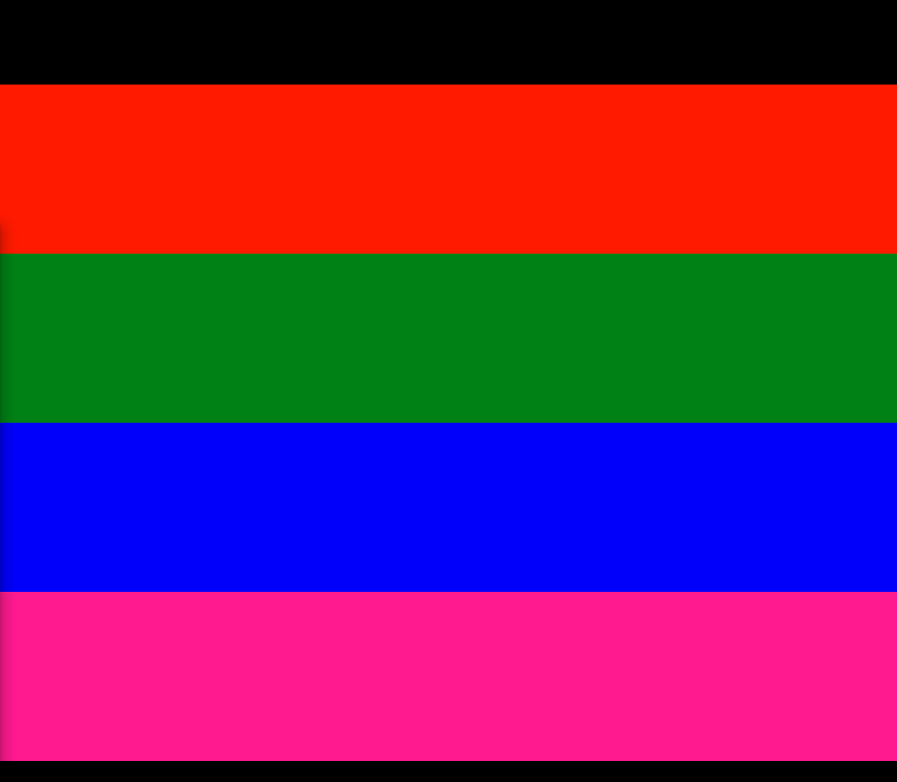

1. 가져온다
- 공식홈피: https://github.com/janpaepke/scrollmagic
  - scrollmagic.io 
- 다운: https://github.com/AzrDream/JS-new-features-popular-frameworks/tree/f10e43155d7d227ab0869c9d8aa68c6c6bd76ac5/05-%E6%B5%81%E8%A1%8C%E6%A1%86%E6%9E%B6%E9%9B%86/05-Bootstrap/huawei/js

2. 세팅
```html
<script src="js/jquery.js"></script>
<script src="js/velocity.js"></script>
<script src="js/ScrollMagic.js"></script>
```
3. **script에 Controller + Scene 객체를 만들고, scene객체를 controller에 add해준다.**
   - add가 아니라 addScene으로 해야함.
```js
/* 1. Controller + Scene객체 생성 후 addScene*/
let controller = new ScrollMagic.Controller();
let scene = new ScrollMagic.Scene();
controller.add(scene);
```

4. **이제 scrollmagic을 위한 전용 style 세팅을 해준다.**
  - 모든요소를 margin, padding을 0으로 만들어놓고
  - header는 width 100%, height 고정100px을 미리 박아둔다
  - footer도 w100% h2000px로 만들어준다
  - div들도 모두 width 100%, height 고정 200px를 미리 설정해둔다
  - .section1234 종류별로 배경색을 위한 css를 만들어둔다.
```html

<style>
    * {
        margin: 0;
        padding: 0;
    }

    div {
        width: 100%;
        height: 200px;
    }

    header {
        width: 100%;
        height: 100px;
        background: #000;
    }
    
    footer {
        width: 100%;
        height: 2000px;
        background: #000;
    }

    .section1 {
        background: red;
    }

    .section2 {
        background: green;
    }

    .section3 {
        background: blue;
    }

    .section4 {
        background: deeppink;
    }


</style>
```
```html
<header></header>
<div class="section1"></div>
<div class="section2"></div>
<div class="section3"></div>
<div class="section4"></div>
<footer></footer>
```


5. Scene() 생성시 옵션으로 offset과 duration을 주고, 특정 section에 `scene.setPin(".section1")`시키면, section아래로 `duration만큼 공간이 추가`로 생긴다.
    - **offset은 `해당div.section을 fixed-top시킬 height %`인 것 같다. 100으로 주니 duration이 끝날때까지, section이 떠있게 된다.**
        - 줄이면, 줄인만큼 위쪽에 공간이 생기고, 늘리면, 늘인만큼 div.section을 아래 잡아먹고난 뒤, fixed-top된다.
    - ****
```html
<script>
    /* 1. Controller + Scene객체 생성 후 add*/
    let controller = new ScrollMagic.Controller();

    let scene = new ScrollMagic.Scene({
        offset: 100, /* 100%면, 해당 div를 fixed-top시키고 duration을 내려간다.*/
        duration: 200,
    });

    /* 1) section1에 설정 */
    scene.setPin(".section1");

    controller.addScene(scene);
</script>
```


6. setPin시 옵션으로 pushFollowers를 기본true인데 false를 주면, **offset, duration을 무시하고, 다음secton까지 현재section이 따라간다**
```js
scene.setPin(".section1", {pushFollowers: false});
```


7. offset을 0으로 주고 `{pushFollowers: false}`를 주면, duration만큼 위쪽에 그대로 남게 된다.
   - 즉, 현재섹션이 다음섹션으로 겹쳐서 내려가지만, offset0으로서, duration과 붙은 정도가 0으로서 fixted-top없이 내려가버려, duration이 남는다.
```js
let scene = new ScrollMagic.Scene({
    offset: 0, /* 100%면, 해당 div를 fixed-top시키고 duration을 내려간다.*/
    duration: 200,
});

/* 1) section1에 설정 */
scene.setPin(".section1", {pushFollowers: false});
```


8. offset 0인 상태에서, **`triggerElement` 옵션으로 태그or선택자를 넣어주고, `triggerHook`으로 onEnter/onCenter(default)/onLeaver 3개 중에 1개를 옵션으로 준다.**
   - footer 태그를 onEnter 만났을 때, offset 0(fixed)없이 바로 벗겨져 내려간다

```js
    let scene = new ScrollMagic.Scene({
        offset: 0, /* 100%면, 해당 div를 fixed-top시키고 duration을 내려간다.*/

        triggerElement: "footer",
        triggerHook: "onEnter",

        duration: 200,
    });

    scene.setPin(".section1", {pushFollowers: false});
```


- 이 때, pushFollowers를 삭제하여 default true로 만들면, **footer를 만난직후부터 offset0(fixed X)을 내려간다**
   - 그 전까지는 안벗겨진다.

```js
    let scene = new ScrollMagic.Scene({
        offset: 0, /* 100%면, 해당 div를 fixed-top시키고 duration을 내려간다.*/

        triggerElement: "footer",
        triggerHook: "onEnter",

        duration: 200,
    });
    scene.setPin(".section1");
```


- offset 50으로 올리면, 약간 fixed되고, offset 100으로 올리면, 완전히 fixed되서, duration이 위쪽에 남아있고, footer를 만나는 직후부터 section1이 통째로 따라온다
- 참고로 offset 0이면, footer를 만나는 순간의 남아있는 section만 fixed된다.


9. triggerElement를 가까운 section3으로 잡고, `onCenter`를 주면, section3가 화면의 center에 올때부터 시작된다.
    - onCenter는 .section3의 중간이 아니라, .section3가 화면의 중앙에 올때부터다.
```js
let scene = new ScrollMagic.Scene({
    offset: 0, /* 100%면, 해당 div를 fixed-top시키고 duration을 내려간다.*/

    triggerElement: ".section3",
    triggerHook: "onCenter",
    duration: 200,
});
```


10. 그렇다면 궁극적으로는 **header가 `onLeave`로 `화면에 가려지기 시작`했을 때부터, `.section1`을 `offset 0으로서 처음부터 duration을 벗겨내려온다`**
    - onLeave는 화면에 완전히 사라지는게 아니라, `화면에 사라지기 시작하는 순간`부터다.
```js
    let scene = new ScrollMagic.Scene({
        offset: 0,
        // 3) 더 위의 header가 화면에 안보일때부터, offset0으로서 바로 section이 duration을 덮어쓴다.
        triggerElement: "header",
        triggerHook: "onLeave",

        duration: 200,
    });
```


- **이 때, `reverse:false`(default true)를 옵션에 추가하면, 스크롤을 다시 올렸을 때, duration위로 해당 section이 복구안하고 밑에 내려온 상태로 있게 된다.**

```js
triggerElement: "header",
triggerHook: "onLeave",
reverse: false,
```

