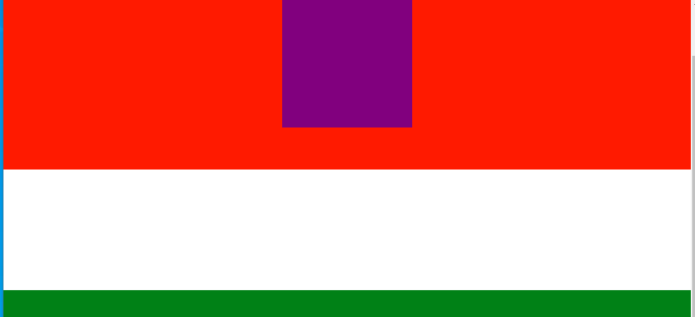

1. animation.gsap.js 세팅
    - **scrollmagic plugin github에서 제공되는 `animation.gsap.js`를 다운받아 js폴더에 넣는다.**
    - https://github.com/AzrDream/JS-new-features-popular-frameworks/tree/f10e43155d7d227ab0869c9d8aa68c6c6bd76ac5/05-%E6%B5%81%E8%A1%8C%E6%A1%86%E6%9E%B6%E9%9B%86/05-Bootstrap/huawei/js
      
    - **header의 ScrollMagic.js보다 아래에서 추가해줄 것이다.**
2. html 세팅

- 기존 scroll magic style세팅에서 `p태그` css를 추가한다
- p태그는 mx는 auto로 줘서, 가운데 정렬되게 한다.

```html

<style>
    * {
        margin: 0;
        padding: 0;
    }

    div {
        width: 100%;
        height: 200px;
    }

    header {
        width: 100%;
        height: 100px;
        background: #000;
    }

    footer {
        width: 100%;
        height: 2000px;
        background: #000;
    }

    p {
        width: 100px;
        height: 100px;
        background: purple;

        margin: 0 auto;
    }

    .section1 {
        background: red;
    }

    .section2 {
        background: green;
    }

    .section3 {
        background: blue;
    }

    .section4 {
        background: deeppink;
    }

</style>
```

```html

<script src="js/jquery.js"></script>
<script src="js/velocity.js"></script>
<script src="js/ScrollMagic.js"></script>
```

```html

<header></header>
<div class="section1"></div>
<div class="section2"></div>
<div class="section3"></div>
<div class="section4"></div>
<footer></footer>
```

```html

<script>
    /* 1. Controller + Scene객체 생성 후 add*/
    let controller = new ScrollMagic.Controller();

    let scene = new ScrollMagic.Scene({
        // triggerElement: "header",
        // triggerHook: "onLeave",
        // reverse: false,
       
        offset: 0,
        duration: 200,
    });

    /* 1) section1에 설정 */
    scene.setPin(".section1");

    controller.addScene(scene);
</script>
```

3. `animation.gsap.js`를 scrollmagic.js아래에 추가하고, `TweenMax`는 **plugin인 animation.gsap.js보다 위에** 추가한다.

```html
<script src="js/TweenMax.js"></script>
<script src="js/ScrollMagic.js"></script>
<script src="js/animation.gsap.js"></script>
```

4. **.section1에 `p.anim`을 추가한 뒤, 화면을 확인한다.**


5. 이제 scrollmagic scene에 setPin한 `.section1` 속의 `p`태그를 **setPin이후 <-> controll.addScene) 사이에 `TweenMax` 설정을 해준다.**
   -  p태그의 height를 .section1 의 높이만큼 늘려준다.
```js
 let scene = new ScrollMagic.Scene({
     // triggerElement: "header",
     // triggerHook: "onLeave",
     // reverse: false,
     offset: 0,
     duration: 200,
 });

 /* 1) section1에 설정 */
 scene.setPin(".section1");
 /* 2) .section1 속 요소 p태그 tweenmax 설정 */
 new TweenMax.to(".anim", 3, {
     width: 200,
     height: 200,
 })
```
- **이렇게하면, scroll하기전에 이미 애니메이션이 작동해버린다.**


6. tweenmax 설정을 객체변수로 받아, **scene객체에 `.setTween()`시키면, `바로 실행안되고, scene객체 작동시 같이 작동`된다.**
```js
 /* 2) .section1의 scene객체에 내부 요소(p태그) tweenmax 설정 */
 let tm = new TweenMax.to(".anim", 3, {
     width: 200,
     height: 200,
 });
 scene.setTween(tm)
```


7. plugin(animation.gsap.js)에 의해, `tm객체를 미리 생성하지 않고, setTween시 바로 TweenMax설정`을 바로 할 수 있다.
   - offset을 100으로 줘서, 바로 스크롤시 fixed된 상태로 내려오게 한다.
```js
let scene = new ScrollMagic.Scene({
   offset: 100,
   duration: 200,
});
scene.setPin(".section1");

 /* 2) .section1의 scene객체에 내부 요소(p태그) tweenmax 설정 */
 // let tm = new TweenMax.to(".anim", 3, {
 //     width: 200,
 //     height: 200,
 // });
 // scene.setTween(tm)
 scene.setTween(".anim", 3, {
     width: 200,
     height: 200,
 });
```



