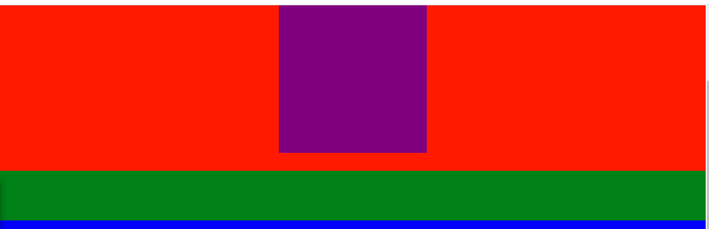

1. 08세팅에서 velocity, scrollMagic보다 아래에 `animation.velocity.js` 플러그인을 추가한다
    - 다운로드: https://github.com/AzrDream/JS-new-features-popular-frameworks/tree/f10e43155d7d227ab0869c9d8aa68c6c6bd76ac5/05-%E6%B5%81%E8%A1%8C%E6%A1%86%E6%9E%B6%E9%9B%86/05-Bootstrap/huawei/js

```html
<script src="js/jquery.js"></script>
<script src="js/ScrollMagic.js"></script>

<script src="js/TweenMax.js"></script>
<script src="js/animation.gsap.js"></script>

<script src="js/velocity.js"></script>
<script src="js/animation.velocity.js"></script>
```

2. tweemax의 setTween()처럼, **`scene.setVelocity( , {})`로 바로 velocity설정을 해준다.**
- 이 때 작동안하면서 에러가 난다. **scene의 duration을 삭제하라는 뜻이다.**
```js
17:31:25:475 (ScrollMagic.Scene) -> (animation.velocity) -> ERROR: The Velocity animation plugin does not support scrollbound animations (scenes with duration) yet.
```
- **그렇다면, duration(여백)없이 사용해야한다**
- velocity는 작동하는데, section1은 fixed-top된 상태로 존재하게 된다.
```js
 let scene = new ScrollMagic.Scene({
     offset: 100,
     // setVelocity() 사용시 duration 주석처리해야함.
     // duration: 200,
 });
```

- 스크롤이 내려갈 땐, velcoity가 작동해서 서서히 넓어지고

- 스크롤이 올라가면 제자리로 돌아가면서 서서히 복구된다.

